# 特斯拉在荷兰的迅速普及

> 原文：<https://towardsdatascience.com/the-exponential-adoption-of-tesla-in-the-netherlands-9bda9c0b56d8?source=collection_archive---------35----------------------->

## 利用 BigQuery、云存储和 Data Studio 探索 RDW 车牌数据集

去年，在荷兰的高速公路上，我注意到路上的特斯拉数量一直在迅速增加。

这有几个很好的理由。荷兰政府通过税收优惠积极支持全电动(租赁)汽车的采用。此外，最新的 Model 3 是第一款价格相对友好的特斯拉，约为 6 万欧元，而不是 10 万欧元以上。

为了验证我的观察，我将通过 RDW 探索一个开放的数据集。RDW(荷兰车辆管理局)负责车辆的许可，他们提供荷兰所有许可车辆的每日更新数据集。

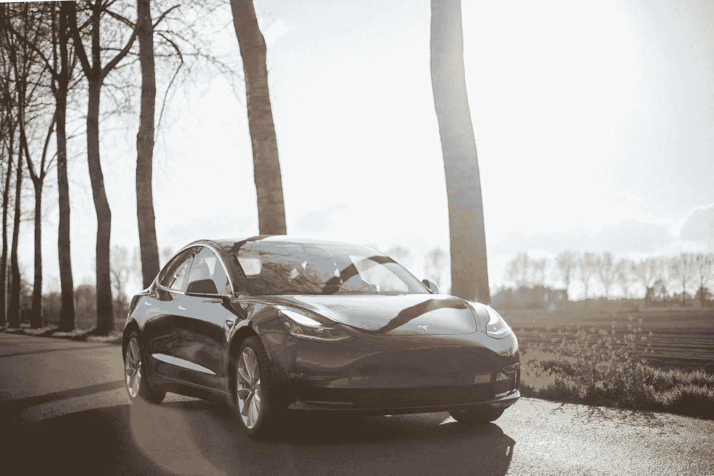

照片由 [Bram Van Oost](https://unsplash.com/@ort?utm_source=medium&utm_medium=referral) 在 [Unsplash](https://unsplash.com?utm_source=medium&utm_medium=referral) 上拍摄

# 正在准备数据…

首先，让我们[下载](https://opendata.rdw.nl/en/Voertuigen/Open-Data-RDW-Gekentekende_voertuigen/m9d7-ebf2)数据集(更新日期:2020 年 1 月 10 日)。

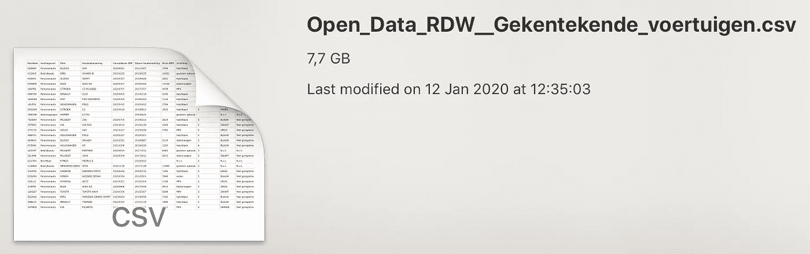

所有荷兰车辆在一个大的 CSV，好吃！

CSV(约 7.7GB)太大，无法导入电子表格，因此我们将使用谷歌的 Pb 级数据工具 [BigQuery](https://cloud.google.com/bigquery/) 来处理这些数据。

因为 BigQuery 将手动 CSV 上传限制为 10MB，所以我们需要首先将我们的文件上传到[云存储](https://cloud.google.com/storage/)中的存储桶:

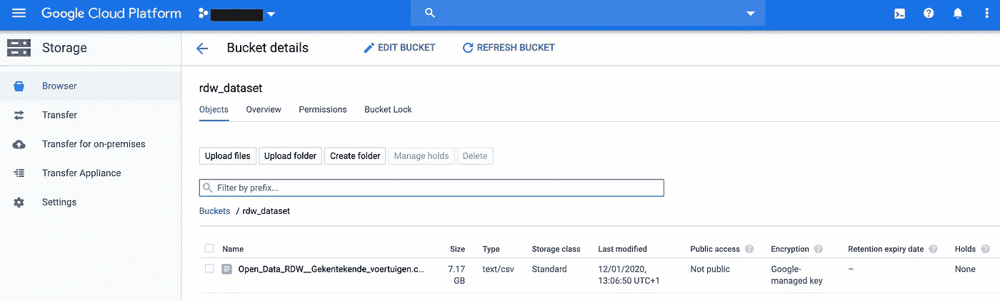

云存储桶

接下来，我们通过选择云存储中的文件在 BigQuery 中创建新表，设置表名`kentekens_2020`、模式设置`auto-detect`、字段分隔符`comma`和要跳过的标题行`1`。

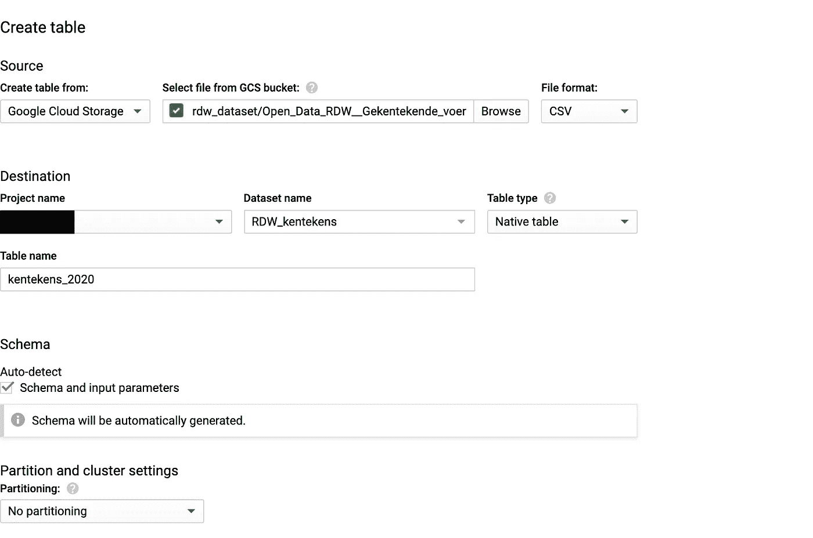

在 BigQuery 中创建我们的表

几秒钟后，表就创建好了，我们的数据集就可以开始研究了。当我们查看详细信息时，有 1440 万行等待查询。根据该模式，有 64 列。这意味着我们的表包含了近十亿个字段。).每行代表一辆注册了牌照的汽车。

# 我们来查询一下！

因为我们只对乘用车数据感兴趣，所以我们通过对`Voertuigsoort`(车辆类别)应用过滤器来排除所有其他类别。让我们把所有的车按品牌分组，然后数数。

```
SELECT
  merk AS brand,
  COUNT(*) AS cars
FROM
  `<project>.RDW_kentekens.kentekens_2020`
WHERE
  Voertuigsoort = 'Personenauto'
GROUP BY
  brand
ORDER BY
  cars DESC
```

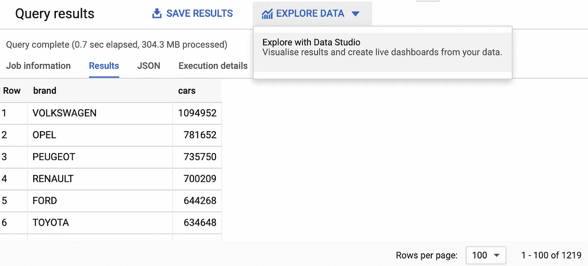

获胜者是…大众！要查看 Tesla 的排名，我们可以向下滚动，但我们也可以在 Data Studio 中显示我们的结果。

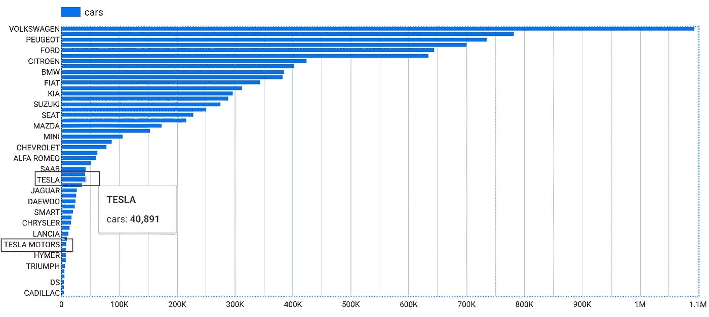

水平条形图 FTW！

我们到了。我们发现泰斯拉排名 29。如果你仔细看，你还会发现“特斯拉汽车公司”。这意味着我们无法在品牌过滤器中进行精确匹配。我们希望所有品牌包含(小写或大写)`tesla`。

现在我们统计特斯拉汽车占所有乘用车的百分比。

```
SELECT
  all_cars,
  tesla_cars,
  ROUND(tesla_cars/all_cars*100,2) AS percentage_tesla_cars
FROM (
  SELECT
    COUNT(*) AS all_cars,
    (
    SELECT
      COUNT(*)
    FROM
      `<project>.RDW_kentekens.kentekens_2020`
    WHERE
      LOWER(merk) LIKE '%tesla%') AS tesla_cars,
  FROM
    `<project>.RDW_kentekens.kentekens_2020`
  WHERE
    Voertuigsoort = 'Personenauto')
```

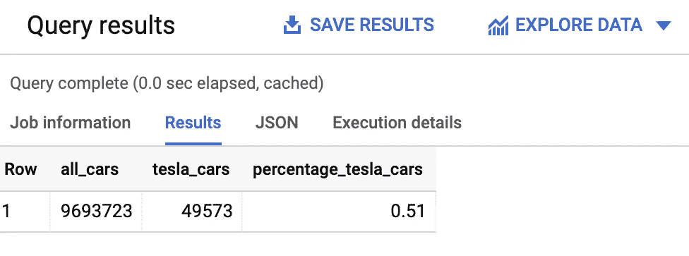

2020 年初，将近 50000 辆特斯拉正在荷兰的街道上漫游。这大约是荷兰所有乘用车的 0.5%。这些数字还没有打动我。

为了回答我们最初的问题(荷兰道路上的特斯拉数量是否呈指数增长？)我们需要在一个时间框架内绘制这些数字。因此，我们使用列`Datum_eerste_afgifte_Nederland`，它给出了特定汽车在荷兰首次注册的日期。

从我们的数据中排除许多老前辈(第一辆汽车甚至在大战前就获得了许可，数据质量警报！)我们只看 2008 年及以后的数据。根据维基百科的说法，第一辆特斯拉是在那一年交付给埃隆·马斯克个人的。

```
SELECT
  Datum_eerste_afgifte_Nederland AS date,
  CASE
    WHEN merk LIKE '%TESLA%' THEN 'TESLA'
  ELSE
  merk
END
  AS brand,
  COUNT(*) AS cars
FROM
  `<project>.RDW_kentekens.kentekens_2020`
WHERE
  Voertuigsoort = 'Personenauto'
  AND Datum_eerste_afgifte_Nederland >= 20080101
GROUP BY
  date,
  brand
ORDER BY
  date
```

如果我们在 Data Studio 中研究这个查询的结果，我们会得到一个折线图，其中显示了排名前 20 位的品牌。

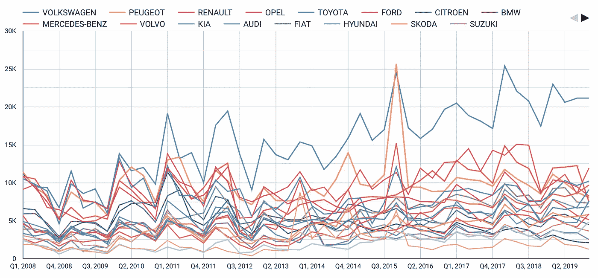

有人看到我的特斯拉吗？

由于特斯拉在前 20 名中无处可寻，我们不得不对品牌`TESLA`设置一个包含过滤器，以便看到我们期望看到的趋势。

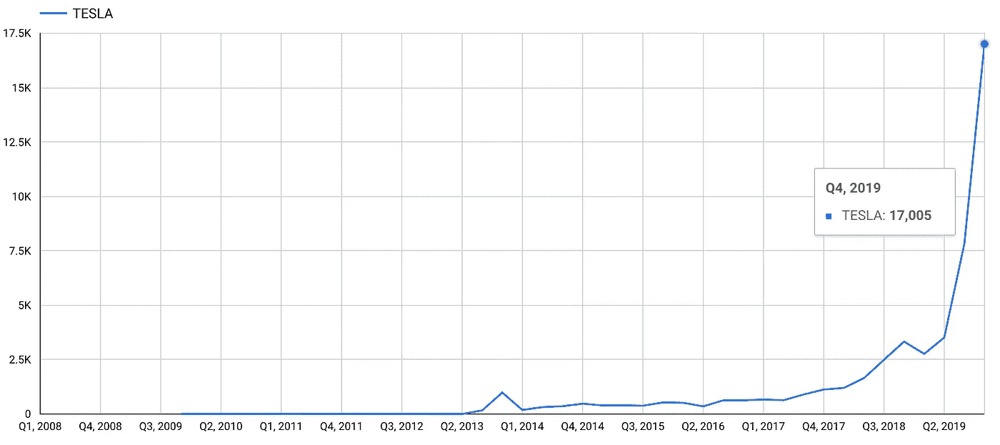

嘣！

那里！我观察到荷兰道路上的特斯拉数量迅速增加，这似乎得到了数据的证实。

# 深入挖掘

下一步是调查荷兰在全球特斯拉生产供应中的份额。我在[维基百科](https://en.wikipedia.org/wiki/Tesla,_Inc.#Sales)上找到了一些数字，做了一些数据清理，产生了这个小 CSV，我直接把它作为表格上传到 BigQuery:

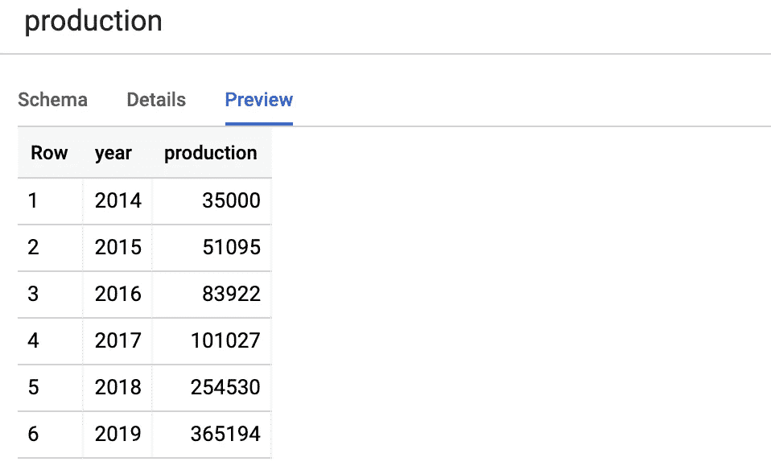

现在我们可以把这些数字和我们自己的数据联系起来。

```
WITH
  p AS (
  SELECT
    CAST(year AS string) AS year,
    production
  FROM
    `<project>.RDW_kentekens.production` ),
  k AS (
  SELECT
    CASE
      WHEN CAST(Datum_eerste_afgifte_Nederland AS string) LIKE '2014%' THEN '2014'
      WHEN CAST(Datum_eerste_afgifte_Nederland AS string) LIKE '2015%' THEN '2015'
      WHEN CAST(Datum_eerste_afgifte_Nederland AS string) LIKE '2016%' THEN '2016'
      WHEN CAST(Datum_eerste_afgifte_Nederland AS string) LIKE '2017%' THEN '2017'
      WHEN CAST(Datum_eerste_afgifte_Nederland AS string) LIKE '2018%' THEN '2018'
      WHEN CAST(Datum_eerste_afgifte_Nederland AS string) LIKE '2019%' THEN '2019'
    ELSE
    NULL
  END
    AS date,
    CASE
      WHEN merk LIKE '%TESLA%' THEN 'TESLA'
    ELSE
    merk
  END
    AS brand,
    COUNT(*) AS cars
  FROM
    `<project>.RDW_kentekens.kentekens_2020`
  WHERE
    Voertuigsoort = 'Personenauto'
    AND Datum_eerste_afgifte_Nederland BETWEEN 20140101
    AND 20191231
  GROUP BY
    date,
    brand
  HAVING
    brand = 'TESLA')
SELECT
  date,
  brand,
  cars,
  production,
  ROUND(cars/production*100,1) AS percentage_dutch_teslas
FROM
  k
LEFT JOIN
  p
ON
  k.date = p.year
ORDER BY
  date DESC
```

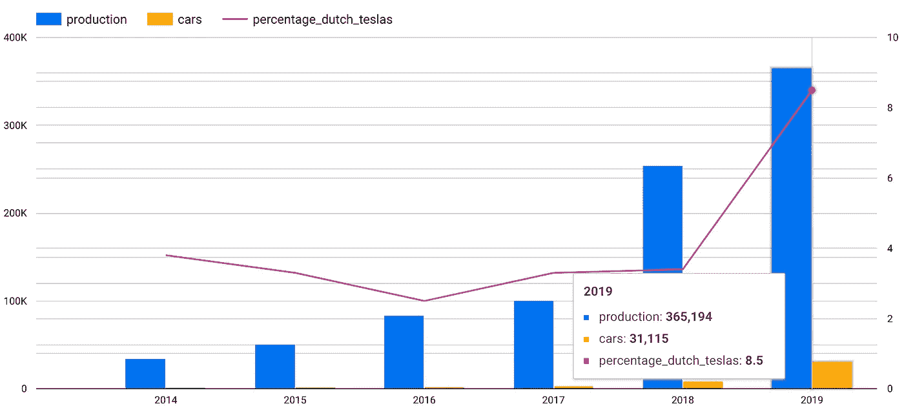

注意粉红线。这是荷兰特斯拉占全球年产量的百分比。2019 年生产的所有特斯拉汽车中，有 8.5%是同年在荷兰获得许可的。对于这样一个小国来说，这是相当大的份额！

好的。接下来让我们关注最畅销的型号，并在 Data Studio 中显示前 10 名。

```
SELECT
  Datum_eerste_afgifte_Nederland AS date,
  CASE
    WHEN merk LIKE '%TESLA%' THEN 'TESLA'
  ELSE
  merk
END
  AS brand,
  Handelsbenaming AS model,
  COUNT(*) AS cars
FROM
  `<project>.RDW_kentekens.kentekens_2020`
WHERE
  Voertuigsoort = 'Personenauto'
  AND Datum_eerste_afgifte_Nederland >= 20080101
GROUP BY
  date,
  brand,
  model
ORDER BY
  date
```

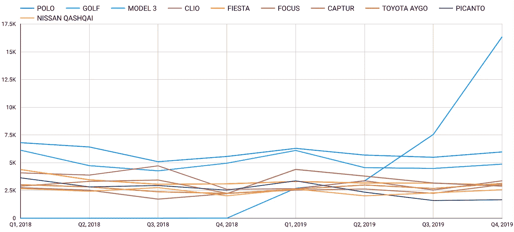

你好模型 3！

似乎 Model 3 是荷兰最畅销的产品。其他特斯拉车型呢？有没有 2008 年的特斯拉跑车？

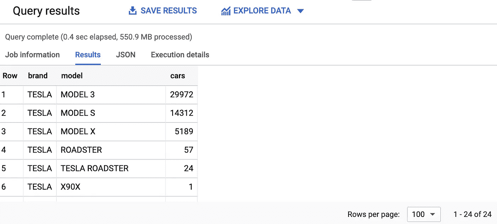

有了 24 排，我们有一些清洁工作要做，因为特斯拉没有 24 种不同的型号。我们还可以按日期查询车型，以便搜索我们的 2008 款跑车。

```
SELECT
  Datum_eerste_afgifte_Nederland AS date,
  CASE
    WHEN merk LIKE '%TESLA%' THEN 'TESLA'
  ELSE
  merk
END
  AS brand,
  CASE
    WHEN Handelsbenaming LIKE '%MODEL 3%' THEN 'MODEL 3'
    WHEN Handelsbenaming LIKE '%MODEL S%' THEN 'MODEL S'
    WHEN Handelsbenaming LIKE '%MODEL X%' THEN 'MODEL X'
    WHEN Handelsbenaming LIKE '%R__DSTER%' THEN 'ROADSTER'
  ELSE
  NULL
END
  AS model,
  COUNT(*) AS cars
FROM
  `<project>.RDW_kentekens.kentekens_2020`
WHERE
  Voertuigsoort = 'Personenauto'
  AND merk LIKE 'TESLA%'
  AND Datum_eerste_afgifte_Nederland >= 20080101
GROUP BY
  date,
  brand,
  model
HAVING
  model IS NOT NULL
ORDER BY
  cars DESC
```


特斯拉玩具十年

首批跑车于 2009 年第四季度抵达荷兰。这些司机是一些真正的早期采用者。让我们看看该季度的前四位车主是否仍然驾驶同一辆车！

```
SELECT
  Datum_eerste_afgifte_Nederland AS date,
  Datum_tenaamstelling AS ownership_date,
  CASE
    WHEN merk LIKE '%TESLA%' THEN 'TESLA'
  ELSE
  merk
END
  AS brand,
  CASE
    WHEN Handelsbenaming LIKE '%MODEL 3%' THEN 'MODEL 3'
    WHEN Handelsbenaming LIKE '%MODEL S%' THEN 'MODEL S'
    WHEN Handelsbenaming LIKE '%MODEL X%' THEN 'MODEL X'
    WHEN Handelsbenaming LIKE '%R__DSTER%' THEN 'ROADSTER'
  ELSE
  NULL
END
  AS model,
  kenteken AS license_plate,
  CASE
    WHEN Datum_eerste_afgifte_Nederland = Datum_tenaamstelling THEN 'TRUE'
  ELSE
  'FALSE'
END
  AS first_owner
FROM
  `<project>.RDW_kentekens.kentekens_2020`
WHERE
  Voertuigsoort = 'Personenauto'
  AND merk LIKE 'TESLA%'
  AND Datum_eerste_afgifte_Nederland > 20080101
GROUP BY
  date,
  ownership_date,
  brand,
  model,
  license_plate
HAVING
  model IS NOT NULL
  AND model = 'ROADSTER'
  AND date < 20100101
ORDER BY
  date
```

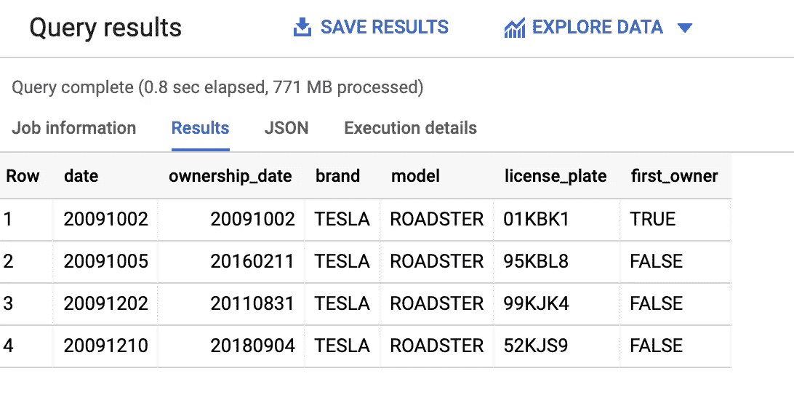

我们有赢家了！这个坏男孩(或女孩)仍然像 2009 年一样开车。


另一辆特斯拉呢？他们还被第一个主人许可吗？我们会找到答案的。

```
SELECT
  brand,
  model,
  ROUND(COUNT(CASE
        WHEN first_owner = 'TRUE' THEN 1
      ELSE
      NULL
    END
      )/ COUNT(first_owner)*100,1) AS percentage_first_owners
FROM (
  SELECT
    Datum_eerste_afgifte_Nederland AS date,
    Datum_tenaamstelling AS ownership_date,
    CASE
      WHEN merk LIKE '%TESLA%' THEN 'TESLA'
    ELSE
    merk
  END
    AS brand,
    CASE
      WHEN Handelsbenaming LIKE '%MODEL 3%' THEN 'MODEL 3'
      WHEN Handelsbenaming LIKE '%MODEL S%' THEN 'MODEL S'
      WHEN Handelsbenaming LIKE '%MODEL X%' THEN 'MODEL X'
      WHEN Handelsbenaming LIKE '%R__DSTER%' THEN 'ROADSTER'
    ELSE
    NULL
  END
    AS model,
    kenteken AS license_plate,
    CASE
      WHEN Datum_eerste_afgifte_Nederland = Datum_tenaamstelling THEN 'TRUE'
    ELSE
    'FALSE'
  END
    AS first_owner
  FROM
    `<project>.RDW_kentekens.kentekens_2020`
  WHERE
    Voertuigsoort = 'Personenauto'
    AND merk LIKE 'TESLA%'
    AND Datum_eerste_afgifte_Nederland > 20080101
  GROUP BY
    date,
    ownership_date,
    brand,
    model,
    license_plate
  HAVING
    model IS NOT NULL
  ORDER BY
    date)
GROUP BY
  brand,
  model
ORDER BY
  percentage_first_owners DESC
```

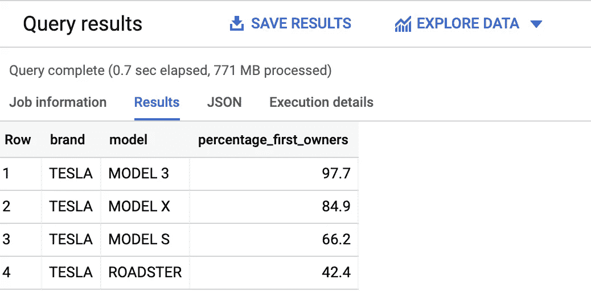

原来特斯拉车主都挺喜欢自己的车的。

好了，现在结束。仍然有很多数据可以利用，但我会把荷兰特斯拉目录价格的发展留给你(根据 RDW)。

```
SELECT
  Datum_eerste_afgifte_Nederland AS date,
  CASE
    WHEN merk LIKE '%TESLA%' THEN 'TESLA'
  ELSE
  merk
END
  AS brand,
  CASE
    WHEN Handelsbenaming LIKE '%MODEL 3%' THEN 'MODEL 3'
    WHEN Handelsbenaming LIKE '%MODEL S%' THEN 'MODEL S'
    WHEN Handelsbenaming LIKE '%MODEL X%' THEN 'MODEL X'
    WHEN Handelsbenaming LIKE '%R__DSTER%' THEN 'ROADSTER'
  ELSE
  NULL
END
  AS model,
  ROUND(AVG(catalogusprijs)) AS price
FROM
  `<project>.RDW_kentekens.kentekens_2020`
WHERE
  Voertuigsoort = 'Personenauto'
  AND merk LIKE 'TESLA%'
  AND Datum_eerste_afgifte_Nederland > 20080101
GROUP BY
  date,
  brand,
  model
HAVING
  model IS NOT NULL
ORDER BY
  date DESC
```

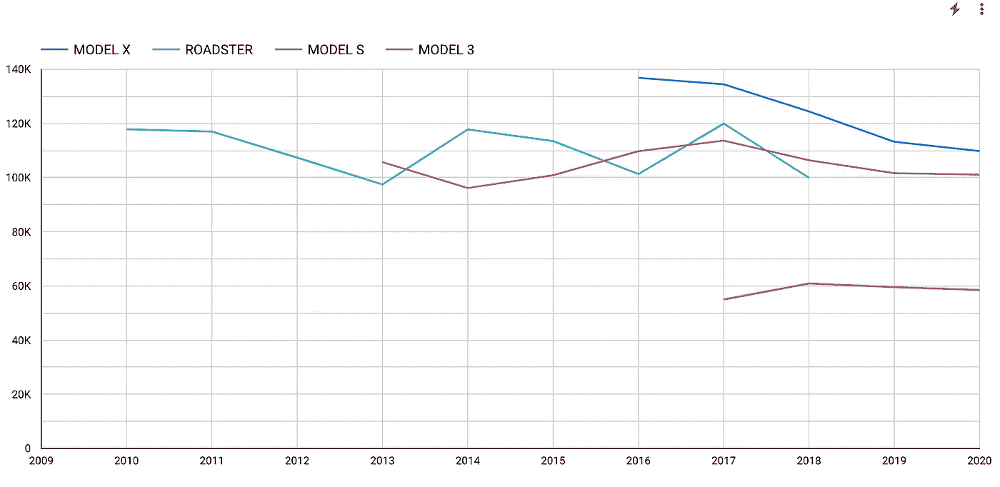

荷兰每年每辆特斯拉车型的平均价格(欧元)

*注:我每天都在学习，欢迎在评论区添加您的意见和建议，或者通过* [*LinkedIn*](https://www.linkedin.com/in/johanvdwerken/) *联系我。*