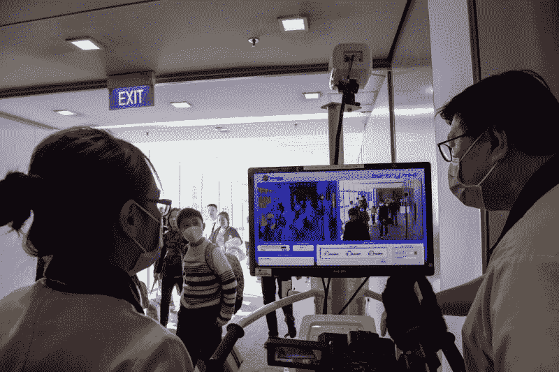
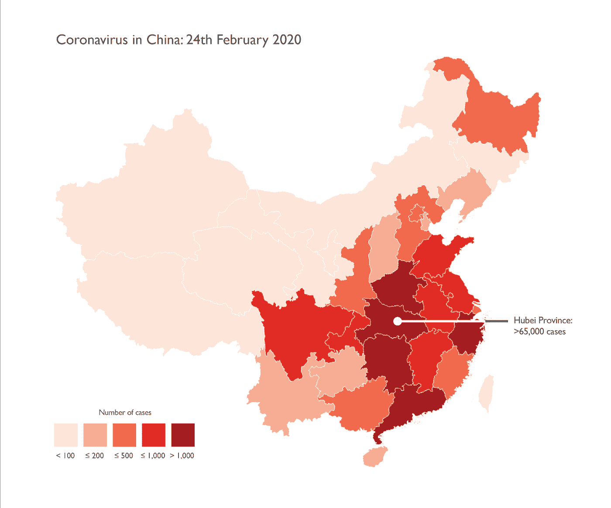
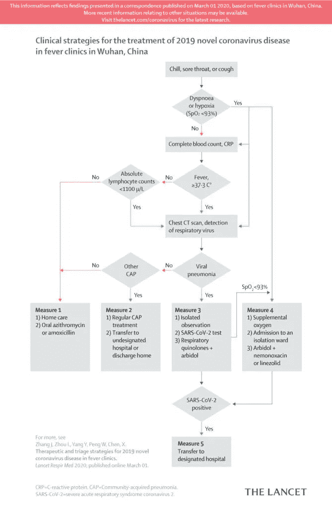

# 风暴之眼

> 原文：<https://towardsdatascience.com/the-eye-of-the-storm-262607c7ac62?source=collection_archive---------43----------------------->

## 我们正处于新冠肺炎风暴的中心，让我们用手头的数据来绘制我们希望在未来航行的航线。

# 从焦虑到行动

我坐在法国阿尔卑斯山的书桌后面，透过窗户看着正在生长的绿草、明黄色的连翘和发芽的樱桃树，它们标志着春天的第一个前提。尽管我们大多数亲密的朋友和同事都或多或少地感染了新冠肺炎病毒，但我发现我的情绪每天都被社交媒体上铺天盖地的坏消息所挫伤。

> 如果我们真的在风暴的中心，让我们利用手头的数据，绘制出我们希望在天气变得更加晴朗时航行的路线。

鉴于互联网对**无支持意见**、**自私贡献**和**集体焦虑**的不断放大，关注数据驱动决策的需求从未如此迫切。

我们客户的数据科学项目处于待命状态，我们的营销漏斗正在冒烟，我不得不思考，阳光照射在窗台上是否预示着更黑暗的时代即将到来。数据在说什么，我们如何从展现在我们眼前的数据中框定我们能学到什么，不能学到什么？

2020 年 1 月 22 日，新加坡樟宜国际机场，卫生官员用热扫描仪对来自中国的旅客进行筛查。图片来源:罗斯兰·拉赫曼/盖蒂图片社。

# Covid19 催生了有趣的数据科学项目

对文献的快速回顾揭示了组织如何利用数据科学来解决当前危机的几个故事:

*   短短三个月前，蓝点人工智能平台在中国武汉发现了一群“不寻常的肺炎”病例。

 [## 人工智能是我们抗击冠状病毒最有效的工具之一

### 如果不是最严重的，新型冠状病毒(新冠肺炎)是袭击我们绿色…

bdtechtalks.com](https://bdtechtalks.com/2020/03/09/artificial-intelligence-covid-19-coronavirus/) 

人工智能如何加速药物研究

*   **百度**开发了一种基于人工智能的检测系统，该系统结合了计算机视觉和红外传感器，每分钟可筛查多达 200 人的潜在感染病例。

百度的人工智能辅助红外传感器每分钟筛查多达 200 人的潜在感染病例。图片来源:南华早报。

 [## 百度如何将人工智能用于对抗冠状病毒

### 不可预测和快速传播，新冠肺炎冠状病毒已经从早期在中国的集中传播到…

www.technologyreview.com](https://www.technologyreview.com/s/615342/how-baidu-is-bringing-ai-to-the-fight-against-coronavirus/) 

*   **阿里巴巴**推出了一个人工智能系统，它可以识别胸部 CT 扫描中的病毒，速度比人眼快 45 倍

 [## 阿里巴巴的新人工智能系统可以在几秒钟内检测到冠状病毒，准确率达到 96%

### 中国科技巨头阿里巴巴最近开发了一种用于诊断新冠肺炎(冠状病毒)的人工智能系统。阿里巴巴的…

thenextweb.com](https://thenextweb.com/neural/2020/03/02/alibabas-new-ai-system-can-detect-coronavirus-in-seconds-with-96-accuracy/) 

*   谷歌的 DeepMind 人工智能研究实验室正在利用深度学习来寻找与新冠肺炎相关的蛋白质折叠的新信息。

 [## 与新冠肺炎相关的蛋白质结构的计算预测

### 科学界已经为应对最近的新冠肺炎疫情而振奋起来，建立在几十年的基本…

deepmind.com](https://deepmind.com/research/open-source/computational-predictions-of-protein-structures-associated-with-COVID-19) 

*   **Kaggle** 与几个领先的人工智能机构合作，发布了新冠肺炎开放研究数据集挑战，以解决由**NASEM/世卫组织**针对当前危机开发的十个基线问题

 [## COVID19 全球预测(第 1 周)

### 预测世界各地每日新冠肺炎传播

www.kaggle.com](https://www.kaggle.com/c/covid19-global-forecasting-week-1) 

# 解释 Covid19 数据缺少什么

尽管这些例子很有希望，但分析方法的四个基本步骤可以帮助我们更好地理解数据在说什么，以及这些数字除了沉默之外提供了什么。

*   背景如何帮助我们理解问题的根源？
*   我们怎样才能保证手头数据的质量？
*   解决问题的**合适方法**是什么？
*   我们如何将数据转化为集体行动？

数据科学不是处理数字，而是理解感知、预测和评估如何用于从数据中创造可操作的见解。

# #1 挖掘当前背景，揭示我们试图解决的问题的根源

这种新型冠状病毒爆发造成的问题基本上是医疗、经济还是社会福祉问题？

在我们的数据管道之外，这些问题是相互关联的，每一个都导致了其他问题的严重性。我们需要探索为什么某些人群比其他人面临更大的风险，为什么缺乏检测和医疗设施，为什么我们的经济和社会系统难以适应这一挑战。

一旦我们确定了所研究问题的性质，我们就可以寻找数据集来规划个人或集体行动的过程。我们可以选择遵守或忽略公共政策和建议，或者我们使用这些数据来试图推动我们的家庭和社区为共同利益而行动。在这两种情况下，决策环境都是随机的，而不是确定的，在我们处理的标记数据中找不到“答案”。我们能做的最好的事情就是利用数据科学来提供概率框架，从而降低决策过程中的风险、模糊性和不确定性。

# #2 限定，而不是量化手头的数据

世卫组织、各国政府和地方当局提供的关于新冠肺炎全球传播的大量统计数据有多大相关性？关于感染、住院和发病率的数据是否是使用允许我们从一个国家到另一个国家得出有意义的结论的标准收集的？鉴于各大洲在遏制、检测和治疗策略上的差异，我们在态度、行为和对危机的认知方面缺少哪些需要考虑的数据？

正如 Kenneth Fields 和 Amanda Makulec 所指出的，数据呈现的形式也是一个基本问题。通过交流变量、数据集和图表，我们影响了公众对问题的看法。

 [## 负责任地绘制冠状病毒图谱

### 就制图学而言，我们生活在一个惊人的时代。技术允许并积极支持快速…

www.esri.com](https://www.esri.com/arcgis-blog/products/product/mapping/mapping-coronavirus-responsibly/)  [## 在你创建另一个关于新冠肺炎的图表之前，要考虑十点

### 总结一下——# viz responsible；这可能意味着根本不在公共领域发布你的可视化。

medium.com](https://medium.com/nightingale/ten-considerations-before-you-create-another-chart-about-covid-19-27d3bd691be8) 

这些问题切中了数据可视化的核心:数据的每种表示都受到其上下文、表示技术、元数据的使用和隐式叙述的制约。因为数据集从来都不是客观的，我们需要了解这些数字在多大程度上阐明了我们试图解决的问题，这些数据如何反映问题的演变，以及我们是否有足够的信息来预测或影响我们的行动/不行动的结果。

如果人口的地理分布差异很大，那么按地区绘制病例数最多会产生误导。图片来源:肯尼斯·菲尔兹

如果人口的地理分布差异很大，那么按地区绘制病例数最多会产生误导。图片来源:肯尼斯·菲尔兹

# #3 选择适当解决问题的方法

在这里，数据驱动决策的优势不可低估，尽管一些世界领导人倾向于希望这场危机消失。在数据科学中，我们了解到选择适当的方法取决于决策环境的性质、手头数据的类型、可用参数的数量、资源限制以及所需的准确度、精确度和召回率。然而，在解决新冠肺炎疫情问题时，贸易知识的核算至关重要，因为我们不能忽视对症状、病理、反应时间和协议的诊断和治疗关注。

这种对实践智慧的需求表明了数据科学的局限性，人类智慧的广度不能被简化为简单的算法，就像人类决策者不能被描述为冷血的计算机器一样。应对危机需要对社会可接受的行动方案进行伦理选择:谁最终负责选择适当的行动方案:个人、医疗行业还是政府？安装一个监控国家可以在多大程度上牺牲个人自由？在拯救国家经济的过程中，我们应该牺牲大多数人来保护少数特权者吗？无论是在国家还是社区层面，孤立是否比全球应对疫情更好？应对危机的适当方法必须权衡对金融价值的暂时考虑和对人类价值的长期需求。

我们不能忽视对症状、病理、反应时间和方案的诊断和治疗关注。图片来源:《柳叶刀》

# #4 将数据转化为集体行动

如果数据和行动之间没有直接的联系，我们必须探索启发法如何形成感知、预测和评估，从而引导决策者或根据数据采取行动。在个人层面上，为什么人们对每天发布的大量数据反应如此不同？如果互联网有助于信息的即时和全球流通，为什么我们各国对危机严重性的看法会有如此多的差异？为什么新加坡和中国采取了系统检测的行动，而英国和法国只愿意承认那些明显患病的人？

当荷兰选择反其道而行之，而美国正在考虑让人们重返工作岗位时，怎么会有这么多国家选择实施国家隔离？为什么政客们要为他们“处于战争状态”的决定辩护，恳求社会团结起来对抗“人类共同的敌人”？我们如何利用认知偏见和行为科学来鼓励组织和个人采取社会可接受的行为？今天比以往任何时候，我们贡献的价值不在于分析屏幕上的数据，而在于提供能够引发变化的有意义的故事。

许多人以前写过关于*决定性时刻*的本质——复杂的社会和经济系统可以明显向更好或更坏的方向演变的短暂时刻。我们正生活在这样一个时刻，我们的医疗、经济和社会体系确实有可能发生变化。正如尤瓦尔·诺亚·哈拉里评论的那样，我们无法避免在暴风雨中航行，但我们可以选择如何度过难关，以及一旦天气变得更加晴朗，我们将选择哪条航线航行。

 [## 尤瓦尔·诺亚·哈拉里:冠状病毒后的世界

### 人类现在正面临一场全球性危机。也许是我们这一代人最大的危机。决策人和…

www.ft.com](https://www.ft.com/content/19d90308-6858-11ea-a3c9-1fe6fedcca75) 

坐在风暴中心的一个优势是我们对自由时间的错觉——如果用来看数据，可以帮助我们更明智地导航到未来。

Lee Schlenker 是 BAI 的负责人，也是商业分析和社区管理的教授。

*   [领英](http://www.linkedin.com/in/leeschlenker.)
*   [推特](https://twitter.com/DSign4Analytics)

## 了解冠状病毒的最新情况(新冠肺炎)

> [关注中型冠状病毒博客](https://coronavirus.medium.com/?source=embedded_post---------------------------)或[注册时事通讯](https://medium.com/coronavirus-medium/newsletters/your-coronavirus-update?source=embedded_post---------------------------)阅读来自中型和跨网络的专家支持的冠状病毒故事，例如:
> 
> 没有人知道有多少人有新冠肺炎。
> 
> [会不会得两次冠状病毒？](https://coronavirus.medium.com/can-you-get-coronavirus-twice-3b14250b5ff2?source=embedded_post---------------------------)
> 
> 从斯蒂芬·库里对安东尼·福奇博士的采访中获得了 4 点有用的信息。