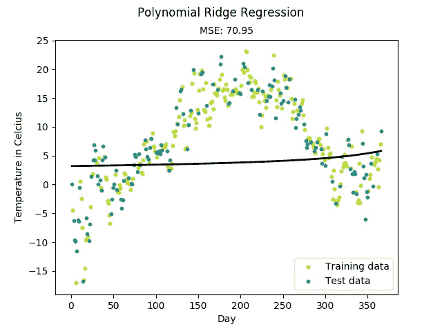
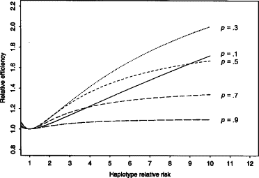
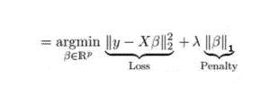
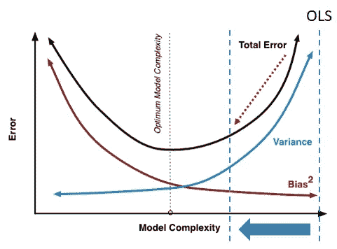
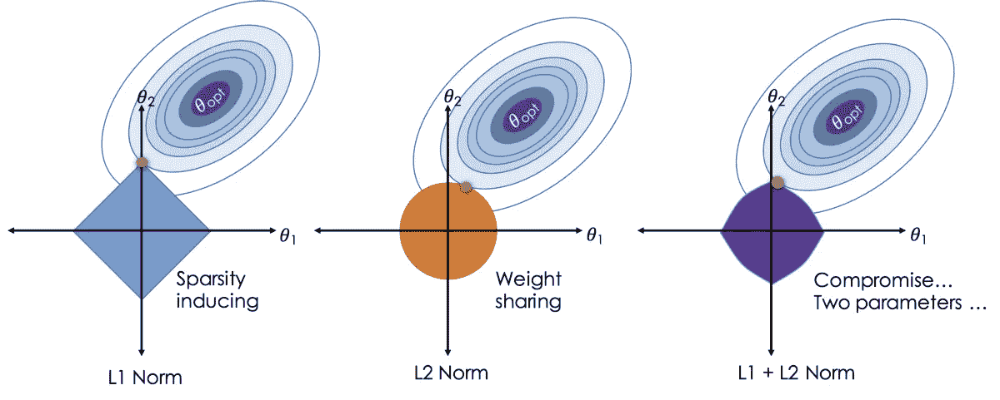

# 陌生回归算法家族

> 原文：<https://towardsdatascience.com/the-family-of-unfamiliar-regression-algorithms-ae7eff9e9463?source=collection_archive---------59----------------------->

图片由[皮克斯拜](https://pixabay.com/?utm_source=link-attribution&utm_medium=referral&utm_campaign=image&utm_content=3502290)的[米尔科·格里森迪](https://pixabay.com/users/Hurca-8968775/?utm_source=link-attribution&utm_medium=referral&utm_campaign=image&utm_content=3502290)拍摄

## 介绍一些隐藏的回归方法

简单的线性回归和逻辑回归通常是人们在机器学习旅程中学习的第一个算法。由于它们的流行，许多初学者甚至认为它们是唯一的回归形式。然而，有无数的回归算法可以用来建立 ML 模型。

在本文中，我们将讨论一些常用的回归算法，即多项式回归，逐步回归，套索回归，岭回归和弹性网回归。

# 多项式回归算法

如果自变量的幂大于 1，则回归方程是多项式回归方程。当线性回归线不能恰当地拟合数据时，即模型欠拟合或过拟合数据时，使用多项式回归。

图片来自 [Adafruit 博客](https://blog.adafruit.com/2019/12/30/machine-learning-from-scratch/)

为了避免这种情况，我们需要增加模型的复杂性。为了生成高阶方程，我们可以添加原始特征的幂作为新特征。多项式回归算法的形式为:

在这种回归技术中，最佳拟合线不是直线。而是一条符合数据点的曲线。这条曲线是二次曲线，比直线更适合数据。

# 逐步回归算法

逐步回归是一种拟合回归模型的方法，其中预测变量的选择是通过自动程序进行的。在每一步中，基于一些预先指定的标准，考虑将一个变量添加到解释变量集或从解释变量集中减去，并查看哪一个具有最低的 p 值。

图片来自[科学指导](https://www.sciencedirect.com/science/article/pii/S0002929707612889)

这里，p 值或概率值是在假设零假设正确的情况下，获得至少与测试期间实际观察到的结果一样极端的测试结果的概率。

这种建模技术的目的是用最少数量的预测变量最大化预测能力。

# Lasso 回归算法

Lasso(最小绝对收缩和选择运算符)是一种回归分析方法，它执行变量选择和正则化，以提高其生成的统计模型的预测精度和可解释性。

图片由 [Saptashwa Bhattacharyya](https://towardsdatascience.com/@saptashwa?source=post_page-----e20e34bcbf0b----------------------) 从[走向数据科学](/ridge-and-lasso-regression-a-complete-guide-with-python-scikit-learn-e20e34bcbf0b)

与岭回归不同，套索回归将系数缩小为零(正好为零)，这无疑有助于特征选择。该算法在数学上表示为:

这也是一种正则化方法，使用 l1 正则化。套索回归的假设与最小二乘回归相同，只是不假设正态性。

# 岭回归算法

数据分析师在建立回归模型时面临的最大问题之一是数据存在多重共线性。多重共线性是独立变量高度相关时出现的情况。当我们对数据应用岭回归时，就是这种情况。

图片由[kyo sik Kim](https://towardsdatascience.com/@qshickkim?source=post_page-----2f19b3a202db----------------------)在[走向数据科学](/ridge-regression-for-better-usage-2f19b3a202db)

岭回归算法背后的主要思想是找到一条也不符合训练数据的新直线。换句话说，我们引入了一个小偏差，使新的线与数据相适应。这是一种缩小系数值并使用 l2 正则化的正则化方法。

其中，β是系数，λ是收缩参数。岭回归通过收缩参数λ解决了多重共线性问题。该算法的等式如下所示:

# ElasticNet 回归算法

ElasticNe 回归是一种正则化的回归方法，它线性地结合了套索法和岭法的 L1 和 L2 罚函数。当有多个相关的特征时，弹性网是有用的。

图片来自[I2 教程](https://www.i2tutorials.com/machine-learning-tutorial/elasticnet-regression/)

在变量高度相关的情况下，ElasticNet 回归鼓励群体效应。除了设置和选择λ值，弹性网还允许我们调整 alpha 参数，其中𝞪 = 0 对应于山脊，𝞪 = 1 对应于套索。这些回归技术的应用应该考虑到数据的条件。

就这样，我们来到了本文的结尾。我希望这能帮助你对不同的回归算法有一个直觉。我们将在后面的文章中研究这些算法。如果你有任何问题，或者如果你认为我有任何错误，请联系我！您可以通过[邮箱](http://rajashwin812@gmail.com/)或 [LinkedIn](http://linkedin.com/in/rajashwin/) 与我联系。