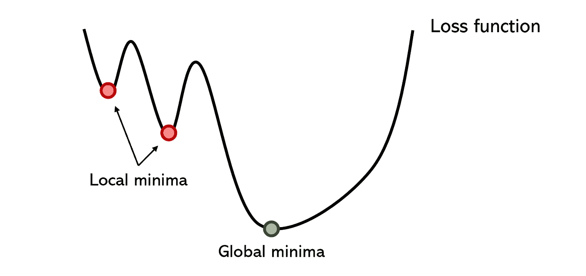
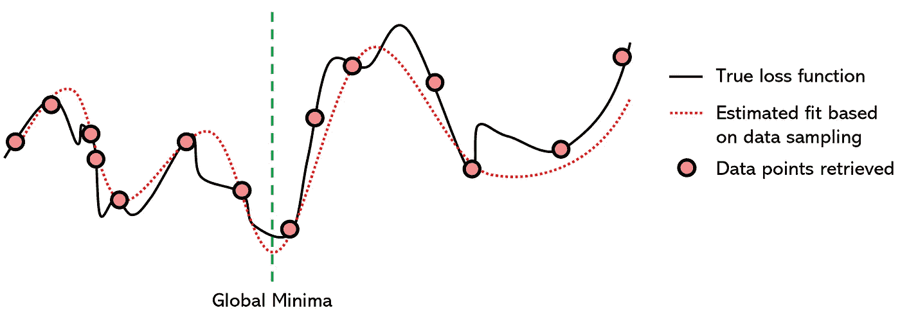
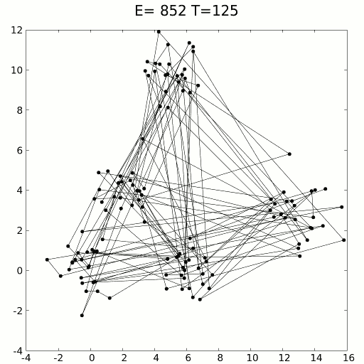

# 神经网络优化的迷人的无梯度方法

> 原文：<https://towardsdatascience.com/the-fascinating-no-gradient-approach-to-neural-net-optimization-abb287f88c97?source=collection_archive---------4----------------------->

由作者创建。

## 忘记亚当，阿达格勒，SGD

梯度下降是机器学习中最重要的思想之一:给定一些要最小化的成本函数，算法迭代地采取最大向下斜率的步骤，理论上在足够次数的迭代后到达最小值。梯度下降法由柯西在 1847 年首次发现，但在 1944 年 Haskell Curry 对非线性优化问题进行了扩展，它已被用于各种算法，从线性回归到深度神经网络。

虽然梯度下降及其以反向传播形式的再利用是机器学习中最大的突破之一，但神经网络的优化仍然是一个未解决的问题。互联网上的许多人甚至愿意宣称“梯度下降很糟糕”，虽然这可能有点远，但梯度下降确实有很多问题。

*   优化者会陷入足够深的局部极小值。不可否认，有时有聪明的解决方案可以避开这些问题，比如动量，它可以把优化者带到大山丘上；随机梯度下降；或者批量标准化，平滑误差空间。然而，局部最小值仍然是神经网络中许多分支问题的根源。

由作者创建

*   因为优化器如此受局部极小值的诱惑，即使它设法摆脱它，也需要非常非常长的时间。梯度下降法通常是一种冗长的方法，因为它的收敛速度很慢，即使是对大数据集进行调整，如批量梯度下降法。
*   梯度下降对优化器的初始化特别敏感。例如，如果优化器在第二个局部最小值附近而不是第一个局部最小值附近初始化，性能可能会好得多，但这都是随机确定的。
*   学习率决定了优化器的信心和风险；设置太高的学习率可能会导致它忽略全局最小值，而太低的学习率会导致运行时崩溃。为了解决这个问题，学习率随着衰减而发展，但是在决定学习率的许多其他变量中，选择衰减率是困难的。
*   梯度下降需要梯度，这意味着除了不能处理不可微函数之外，它还容易出现基于梯度的问题，如消失或爆炸梯度问题。

当然，梯度下降已经得到了广泛的研究，并且有许多提议的解决方案——一些是 GD 变体，另一些是基于网络架构的——在某些情况下有效。仅仅因为梯度下降被高估了，并不意味着它不是目前最好的解决方案。使用批处理规范化来平滑错误空间或选择 Adam 或 Adagrad 这样复杂的优化器等常见知识不是本文的重点，即使它们通常性能更好。

相反，本文的目的是揭示一些更模糊和确定有趣的优化方法，这些方法不符合基于梯度的标准，就像任何其他用于提高神经网络性能的技术一样，在某些情况下工作得非常好，而在其他情况下则不太好。然而，不管它们在特定任务中表现如何，它们都是迷人的、有创造力的，并且是机器学习未来的一个有前途的研究领域。

**粒子群优化**是一种基于群体的方法，定义了一组探索搜索空间的“粒子”，试图找到一个最小值。粒子群优化算法迭代地改进了某一质量指标的候选解。它通过拥有一群潜在的解决方案(“粒子”)并根据简单的数学规则(如粒子的位置和速度)移动它们来解决问题。每个粒子的运动受其认为最佳的局部位置的影响，但也会被搜索位置中的最佳已知位置(由其他粒子发现)所吸引。从理论上讲，群体会经过几次迭代来寻找最佳解决方案。

来源:维基媒体。图片免费分享。

粒子群算法是一个迷人的想法——它对初始化的敏感度远低于神经网络，粒子之间在某些发现上的交流可能被证明是一种非常有效的搜索稀疏和大面积区域的方法。

因为粒子群优化不是基于梯度的(喘气！)，它不要求优化问题是可微的；因此，使用 PSO 来优化神经网络或任何其他算法将允许在选择激活函数或其他算法中的等效角色时具有更大的自由度和更小的敏感性。此外，它对要优化的问题几乎不做任何假设，并且可以搜索非常大的空间。

可以想象，基于群体的方法在计算上比基于梯度的优化器要昂贵得多，但不一定如此。因为这种算法是如此的开放和非刚性——就像基于进化的算法一样，人们可以控制粒子的数量、它们移动的速度、全球共享的信息量等等；就像在神经网络中调整学习速率一样。

**代理优化**是一种优化方法，试图用另一个成熟的函数来模拟损失函数，以找到最小值。该技术从损失函数中采样“数据点”，这意味着它尝试不同的参数值( *x* )并存储损失函数的值( *y* )。在收集了足够数量的数据点之后，对收集的数据拟合一个替代函数(在这种情况下是一个 7 次多项式)。

由作者创建。

因为寻找多项式的最小值是一个非常好研究的课题，并且存在大量非常有效的使用导数来寻找多项式的全局最小值的方法，所以我们可以假设替代函数的全局最小值对于损失函数是相同的。

代理优化在技术上是非迭代方法，尽管代理函数的训练通常是迭代的；此外，从技术上讲，它是一种无梯度方法，尽管寻找模型函数全局最小值的有效数学方法通常是基于导数的。然而，因为迭代和基于梯度的属性都是代理优化的“次要”属性，所以它可以处理大数据和不可微的优化问题。

使用代理函数进行优化在几个方面非常聪明:

*   它本质上是平滑真实损失函数的表面，这减少了导致神经网络中如此多的额外训练时间的锯齿状局部最小值。
*   它将一个困难的问题投射到一个容易得多的问题上:无论是多项式、RBF、GP、MARS 还是另一个代理模型，寻找全局最小值的任务都得到了数学知识的支持。
*   过度拟合代理模型并不是一个真正的问题，因为即使有相当多的过度拟合，代理函数仍然比真正的损失函数更平滑，锯齿更少。随着许多其他标准的考虑，在建立数学上更倾向于简化的模型时，训练代理模型因此更容易。
*   代理优化不受当前位置视图的限制，因为它看到了“整个函数”，与梯度下降相反，梯度下降必须不断做出冒险的选择，即它是否认为在下一个山坡上会有更深的最小值。

代理优化几乎总是比梯度下降法更快，但往往是以精度为代价的。使用代理优化可能只能精确定位全局最小值的粗略位置，但这仍然非常有益。

另一种选择是混合模式；使用代理优化将神经网络参数带到粗略位置，从该位置可以使用梯度下降来找到精确的全局最小值。另一种方法是使用代理模型来指导优化器的决策，因为代理函数可以 a)“预见未来”, b)对损失函数的特定起伏不太敏感。

**模拟退火**是一个基于冶金学中退火的概念，可以将材料加热到再结晶温度以上，以降低其硬度，改变其他物理和偶尔的化学性质，然后让材料逐渐冷却并再次变得坚硬。

使用缓慢冷却的概念，模拟退火随着解空间的探索而缓慢降低接受更差解的概率。因为接受更差的解决方案允许对全局最小值进行更广泛的搜索(想一想——越过小山到达更深的山谷),所以模拟退火假设在第一次迭代中正确地表示和探索了各种可能性。随着时间的推移，算法从探索走向开发。

以下是模拟退火算法如何工作的粗略概述:

1.  温度设定在某个初始正值，并逐渐接近零。
2.  在每个时间步，算法随机选择一个接近当前解的解，测量其质量，并根据当前温度(接受更好或更差解的概率)移动到当前解。
3.  理想情况下，当温度达到零度时，算法已经收敛到全局最小解。

可以用动力学方程或随机取样方法进行模拟。模拟退火被用于解决旅行推销员问题，该问题试图找到由数据点表示的数百个位置之间的最短距离。显然，组合是无穷无尽的，但是模拟退火——带着强化学习的回忆——表现得非常好。

旅行商问题的模拟退火解法。来源:维基媒体。图片免费分享。

模拟退火在短时间内需要近似解的情况下表现特别好，优于缓慢的梯度下降。像代理优化一样，它可以用于混合梯度下降，以获得两者的好处:模拟退火的速度和梯度下降的精度。

这是无梯度方法的一个小样本；还有许多其他算法，如模式搜索和多目标优化有待探索。像粒子群优化这样的基于遗传和种群的算法对于创造真正“智能”的智能体来说是非常有前途的，因为我们人类就是它成功的证据。

最优化的非梯度方法是迷人的，因为它们中的许多利用了创造性，而不受梯度的数学链的限制。没有人指望无梯度方法会成为主流，因为即使考虑到它的许多问题，基于梯度的优化也表现得如此之好。然而，利用混合优化器来利用无梯度和基于梯度的方法的能力展示了极高的潜力，尤其是在我们即将达到计算极限的时代。

 [## 有人称之为天才，有人称之为愚蠢:有史以来最有争议的神经网络

### 极限学习机

towardsdatascience.com](/some-call-it-genius-others-call-it-stupid-the-most-controversial-neural-network-ever-created-2224ed22795a)  [## 你没有正确测量新冠肺炎

### 度量问题

towardsdatascience.com](/youre-not-measuring-covid-19-correctly-80398c251a1)