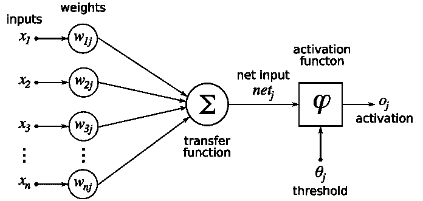
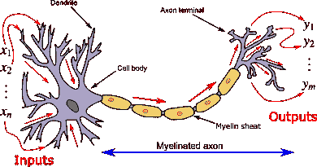

# 人工智能和神经科学之间的迷人关系

> 原文：<https://towardsdatascience.com/the-fascinating-relationship-between-ai-and-neuroscience-89189218bb05?source=collection_archive---------5----------------------->

## 他们如何相互激励、共同进步、相互受益

[自由股票](https://unsplash.com/@freestocks?utm_source=medium&utm_medium=referral)在 [Unsplash](https://unsplash.com?utm_source=medium&utm_medium=referral) 上的照片

> 有了这么多的利害关系，神经科学和人工智能领域走到一起的需求现在比以往任何时候都更加迫切。— [DeepMind](https://deepmind.com/blog/article/ai-and-neuroscience-virtuous-circle)

在本文中，我们将从两个方面探讨这个话题。神经科学如何启发 AI，AI 如何推进神经科学。

# 神经科学如何启发人工智能

神经科学在人工智能的历史中发挥了关键作用。它一直是构建类人人工智能的灵感来源。神经科学启发我们设计人工智能系统有两种方式。一是模仿人类智能，二是建立模仿大脑结构的神经网络。

## 模拟人类智能的人工智能系统。

最近的人工智能进步通过表演令人印象深刻的壮举席卷了媒体，例如:

*   可靠的[物体识别](https://www.vox.com/future-perfect/2020/2/14/21063487/self-driving-cars-autonomous-vehicles-waymo-cruise-uber)比如特斯拉的[自动驾驶汽车](http://news.mit.edu/2019/human-reasoning-ai-driverless-car-navigation-0523)
*   [玩电子游戏](https://www.theverge.com/2019/1/24/18196135/google-deepmind-ai-starcraft-2-victory)到[胜过最好的星际争霸玩家](https://www.nature.com/articles/d41586-019-03298-6)
*   [检测乳腺癌](https://www.theverge.com/2020/1/1/21045635/google-ai-detect-breast-cancer-mammograms-healthcare) [比医生更快更好](https://www.nature.com/articles/s41586-019-1799-6)

这些机器可以比我们更好地执行任务和解决问题，实现媲美甚至超过人类能力的性能。无论这些看起来多么令人印象深刻，它们只是被设计来超越它们的预期功能。我们距离建立人工智能还有几十年的时间。

尽管这些人工智能系统具有生物学灵感和性能成就，但它们在关键方面不同于人类智能。对于像人一样学习或思考的[机器来说](https://arxiv.org/pdf/1604.00289.pdf)，它需要能够:

*   解释和理解问题
*   为获取知识而学习
*   概括新任务和新情况的知识

在 KAIST 的[研究中，研究人员为人类元强化学习开发了一种计算和神经机制。作为人类，当我们做决定时，我们可以适应复杂性和不确定性。](https://www.sciencedaily.com/releases/2020/01/200130104921.htm)

研究人员的目标是建立能够像我们一样做决定的模型，并以与人类相同的方式解决问题。他们的发现揭示了一种可能性，即技术进步可能会导致制造更像人类的机器。

由[在](https://unsplash.com/@heftiba?utm_source=medium&utm_medium=referral) [Unsplash](https://unsplash.com?utm_source=medium&utm_medium=referral) 上拍摄的

建造具有真正像人类一样的学习能力和认知能力的机器是一个持续的追求，这些机器可以像我们一样学习和思考。例如，即使我们蒙住眼睛，我们仍然可能弹得很好。但是对于一个人工智能系统来说，在一个新的环境中弹吉他(即“眼睛”被遮住)，它可能做得不好。

## 构建模仿大脑结构的神经网络。

我们借鉴了人类大脑结构的灵感来设计我们今天所知道的神经网络。神经网络中神经元的想法与大脑中的生物神经元具有相似的特征。

人类大脑包含大约 860 亿个神经元，每个神经元都与其他神经元相互连接。生物神经元是细胞:当一个细胞被激活时，它会产生一个尖峰信号，并向其他神经元发送信号。

与人脑一样，机器学习神经网络也由相互连接的神经元组成。当一个神经元接收到输入时，它被激活并向其他神经元发送信息。

人工神经元是一种数学函数，被认为是生物神经元的模型

我们大脑的可塑性允许我们学习和提高技能。每次我们学习新的东西，我们都在创造和加强神经元之间的联系。这就是为什么当我们练习一项任务时，我们会做得更好。

类似地，当我们向神经网络输入大量数据时，它就会学习。神经网络上的每个连接都与一个权重相关联，该权重决定了神经元之间的重要性。在训练过程中，相应地调整权重，以加强或削弱神经元之间的连接。

例如，当我们看到一只猫的图片时，我们知道它是一只猫，因为我们在生活中已经看到了足够多的猫。同样，如果我们为我们的神经网络提供足够多的猫图像，它将开始识别猫。

娜塔莉·朱莉在 [Unsplash](https://unsplash.com?utm_source=medium&utm_medium=referral) 上的照片

在了解了神经科学如何启发 AI 模仿人类智能并构建模仿大脑结构的神经网络之后；我们将探索人工智能如何反过来推进神经科学。

# 人工智能如何推进神经科学

人工智能正迅速成为神经科学中一个无价的工具。它有助于我们理解人脑是如何工作的，并加速神经科学的发展。

## 人工智能帮助我们理解我们的大脑是如何工作的。

神经科学家正在研究人类大脑如何处理思想，以及它如何移动我们的身体。通过更多地了解大脑，我们能够更好地[诊断精神疾病](https://www.healtheuropa.eu/ai-in-psychiatry-detecting-mental-illness-with-artificial-intelligence/95028/)和[使残疾人提高运动能力](/decoding-brain-signals-with-machine-learning-and-neuroscience-bee288c1d585?source=friends_link&sk=ef44e89d2c47306292a46b486b858196)。

人工智能系统的进步可以帮助推动神经科学向前发展，并解开大脑的秘密。它允许神经科学家和研究人员建立更好的模型来模拟人脑。

神经网络就像“虚拟大脑”一样，捕捉我们大脑的表现。这些虚拟大脑可以产生类似于大脑记录模式的神经活动模式。这些模式允许神经科学家在投入更多资源对动物和人类进行实际测试之前，测试假设并观察模拟结果。

然而，人工智能系统的工作方式与我们的大脑有很大不同。神经网络只是大脑工作方式的粗略模拟，它将神经元建模为高维矩阵中的数字。但事实上，我们的大脑是一个复杂的生物机器，使用化学和电活动。这使我们不同于机器。

米兰·波波维奇在 [Unsplash](https://unsplash.com?utm_source=medium&utm_medium=referral) 上的照片

## 人工智能加速神经科学的发展和发现。

机器学习的主要优势在于能够识别复杂数据中的模式。在分析人类思维时，复杂性尤其如此。大脑发出的信号非常复杂。随着机器学习的进步，神经科学家正在破解数十亿大脑神经元如何协同工作的秘密。

功能磁共振成像通过检测血流的变化来测量我们大脑的活动。它每秒钟都会生成大脑活动的高维快照。使用机器学习来分析数据有助于揭示大脑活动的模式，从而加快研究工作。

机器学习还帮助我们开发以前认为不可能的应用程序。[高丽大学](/decoding-brain-signals-with-machine-learning-and-neuroscience-bee288c1d585?source=friends_link&sk=ef44e89d2c47306292a46b486b858196)设计了一个控制下肢外骨骼的实验环境。用户可以通过盯着闪烁的灯光来集中注意力，从而控制外骨骼。

由[Farsai chaikungamdee](https://unsplash.com/@clearsky?utm_source=medium&utm_medium=referral)在 [Unsplash](https://unsplash.com?utm_source=medium&utm_medium=referral) 上拍摄的照片

# 神经科学和人工智能

人脑是构建类人人工智能的最重要灵感。人工智能研究人员使用神经科学的想法来建立新的算法。

另一方面，人工智能加速了神经科学的研究。神经科学家从人工智能体的行为中学习来解释我们的大脑。

自然地，这两个学科结合在一起，并将继续基于彼此的见解。

我对神经科学和人工智能之间的这种合作关系的未来持乐观态度。

> 我们敦促神经科学和人工智能领域的研究人员找到一种共同语言，允许知识自由流动，从而在这两个领域取得持续进展。— [DeepMind](https://deepmind.com/blog/article/ai-and-neuroscience-virtuous-circle)

[马赫凯奥](https://unsplash.com/@mahkeo?utm_source=medium&utm_medium=referral)在 [Unsplash](https://unsplash.com?utm_source=medium&utm_medium=referral) 上的照片

 [## 脑-机接口中的深度学习

### 推动该领域发展的现状和挑战

towardsdatascience.com](/deep-learning-in-brain-computer-interface-f650d00268d0)  [## 用机器学习和神经科学解码大脑信号

### 成为 X 教授，解开我们心灵的秘密

towardsdatascience.com](/decoding-brain-signals-with-machine-learning-and-neuroscience-bee288c1d585) 