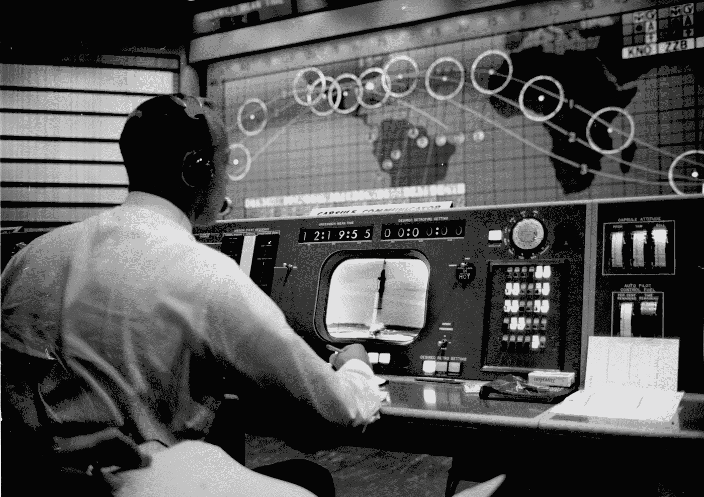
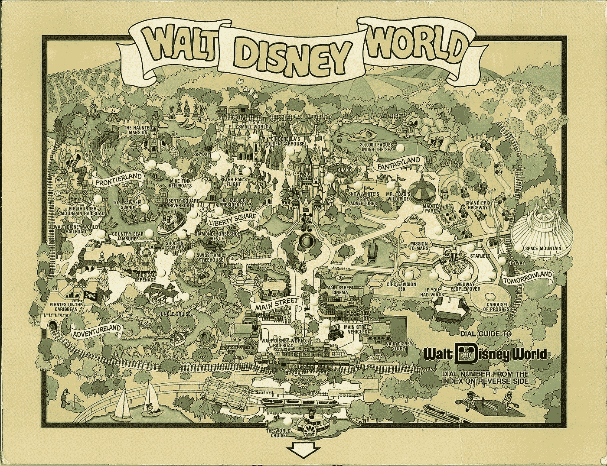
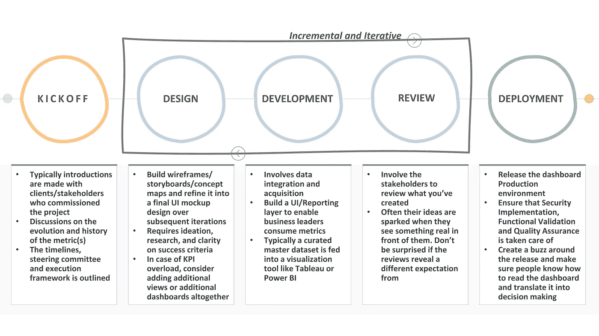
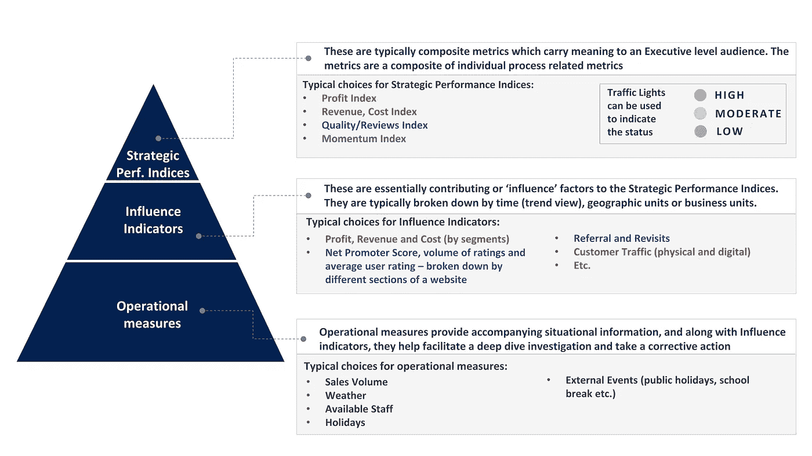
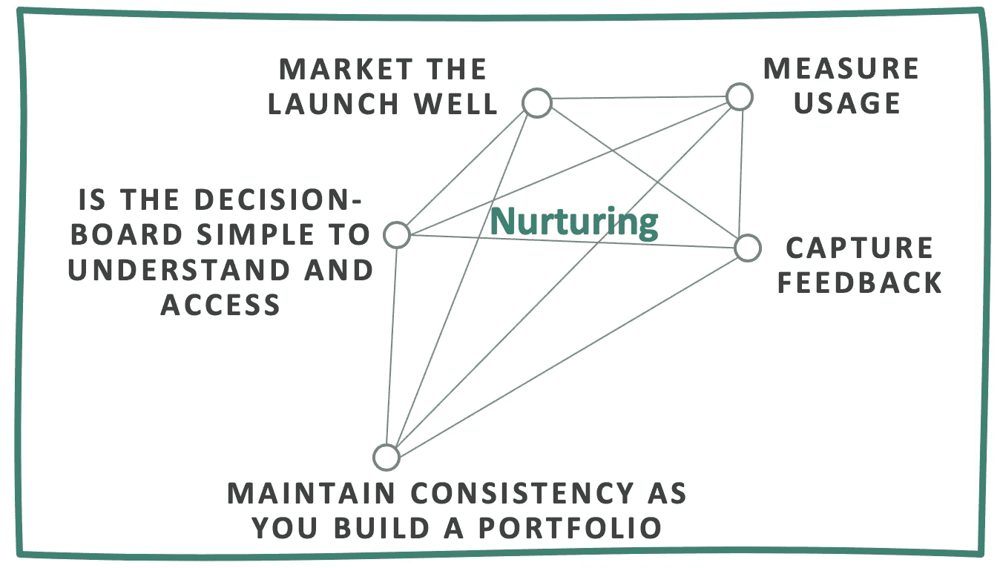

# 决策委员会的迷人科学和艺术

> 原文：<https://towardsdatascience.com/the-fascinating-science-and-art-of-decision-boards-6b1d5a461132?source=collection_archive---------38----------------------->

## 增强业务情景意识的关键

宇航员艾伦·b·谢泼德在他的控制台上监控航天飞机的发射

# 内容

1.  [序幕](#99d8)
2.  [从一开始:决策层的理念和目的](#5466)
3.  [工艺:设计和开发流程](#2dae)
4.  [培育:保持长期相关性](#77bd)
5.  [结语:大规模生产决策板的流水线](#b646)

# 1.序言

这篇文章包含了我从为几家美国财富 50 强公司设计决策板(又名仪表板)的经历中提炼出来的见解。有效的决策委员会是建立对手头业务的控制和加强决策过程的基础。这件作品融合了心灵和实践智慧，旨在让你着迷于仪表板的世界，如果你碰巧在工作中设计了它，它会给你带来成功。

# 2.从一开始:决策委员会的哲学和目的

企业的存在是为了盈利。他们通过销售产品、服务或经验来实现。决策板通过直观地显示最重要的指标来评估企业或其某个方面的健康状况，从而帮助监控企业的绩效。并帮助所有者更快地做出明智的决定。

> 可以把决策板想象成现实的缩影，KPI 量化了业务的某个方面或目标。这些 KPI 被排列成一个简洁的压缩视图，以便企业所有者可以快速浏览它，并了解企业的运营情况。

## **它在商界是如何发展的**

企业民间传说，2001 年安然(Enron)丑闻使仪表板成为首席执行官安抚股东的一种方式，也是将责任分配给层级的一种方式。自 1960 年以来，决策委员会在商业中一直占有一席之地。随着技术的民主化，下一个颠覆性的想法总是潜伏在角落里，保持竞争力和相关性的需求已经达到顶峰。今天的业务和产品所有者必须拥有设计良好且强大的测量系统，以了解他们的实际情况并观察历史业务决策的效果。

这个术语是从物理世界改编而来的。汽车中的“仪表板”是显示重要车辆信息的仪表和仪器，这使得驾驶汽车更加方便( [Image source](https://www.tokkoro.com/3073383-black-and-white_car_dashboard_speedometer_steering-wheel.html) )

## **复杂的光谱**

决策委员会中度量标准的复杂性取决于组织的分析成熟度。让我们以迪士尼主题公园的业务为例，来理解度量复杂性的变化。

1980 年的迪士尼世界地图([来源](https://www.flickr.com/photos/124651729@N04/36005271343/in/photostream/))

一个设计良好的决策板最大限度地简化了监控过程，并且清晰地显示出**描述性指标**(“发生了什么”)。*例如，对于迪士尼主题公园，这可能是上个月产生的总利润。*

在分析成熟的环境中，它们还提供附加价值，这也需要更高的资源和时间投入:

*   **诊断指标(“为什么会发生某些事情”):**这可以通过影响超指标的子指标的可用性来实现，有时也可以通过决策板上直观的指标排列来实现，这样可以方便地进行导航和根本原因分析。*例如，如果上个月收入急剧下降，应该有一个直观的流程来调查收入下降的原因。也许可以通过一层指标来显示不同细分市场产生的收入，如门票、食品和饮料以及商品支出。*
*   **预测指标(“未来可能发生的事情”):**管理层喜欢预测和预报，因为它们允许对人员配备和预算等资源进行早期规划。*例如，主题公园在接下来的两个月中预计会产生多少收入。*
*   **规范性指标(“应该采取什么业务行动？”):**这是最复杂的。它建议采取最佳行动，以最大化战略相关指标(如利润或运营效率)或最小化风险(财务)。它包括构建一个优化层，这个优化层有一些用户控制的杠杆，可以根据需求调整推荐。这就是我们看到人工智能产生巨大影响的地方。例如，如何优化商场各个部门的人员配置，以最大限度地提高利润或减少等待时间？

# 3.工艺:设计和开发过程

在创建决策板时，有两个重要的考虑因素会影响度量标准的选择和布局:**为其设计决策板的目标人物角色**，以及**在决策板内建立度量标准的流程**。

## **3A。通过反复测试和学习的心态，探索对目标受众有意义的解决方案**

每个决策板最终都是针对目标受众的。因此，将这些目标人物角色和他们的商业目标放在设计过程的中心是很重要的。重要的是要弄清楚:

1.  **现有报告框架** *目标用户现在是否已经有了一些指标和报告*
2.  **决策委员会的业务准备情况** *如果需要，目标用户是否参与并愿意改变他们的流程？*
3.  **仪表板体验** *要求的主要愿景，与领导层如何设置和衡量职能层级保持一致。仪表板应该反映他们决策过程的心智模型*
4.  **观众的审美感受力，以及组织设计基准** *你希望你的最终产品是使用它的人的自然延伸*
5.  **组织数据系统及其如何建模和捕获业务实体和交易** *例如，他们可能将 SAP 用于 ERP，将其他软件用于 HR，将另一个软件包用于制造运营等。你的专业知识和建议应该与现有的技术相融合*

虽然与目标受众保持一致将允许更快的迭代，但是我们也需要一些构造来形式化和循环迭代。 [**设计思维**](https://designthinking.ideo.com/) 是一种流行的使能方法。它所基于的原则源于工程、架构和软件设计中的最佳实践。我们可以借鉴设计思维原则，建立决策板创作的执行框架。 ***设计-开发-评审*** 的阶段可以持续几周或几个月(取决于所创建的仪表板套件)，以获得成功的结果。

设计思维讲解| ~4 分钟|[https://www.youtube.com/watch?v=_r0VX-aU_T8](https://www.youtube.com/watch?v=_r0VX-aU_T8)

执行框架

## 3B。在决策委员会内建立一个度量流程

这种指标的金字塔分类可以直接转化为决策板的模型或 UI 设计

# 4.培育:保持长期相关性

> 竞争优势不再在于分析的创造，而在于分析的消费——迪拉杰·拉贾拉姆(穆·适马创始人)

一个持久的设计永远不会完美。任何持久的解决方案都需要有人足够关心它，让它与时俱进。以下是一些有帮助的想法:

保持最终决策委员会的相关性是几个因素的平衡

## **4A。营销发布井**

*   这有助于在发布期间制造轰动效应。最好是在月度全体会议上宣布，或者以高级领导的电子邮件形式宣布。
*   决策板的价值应该清晰地表达出来，以及它与以前的解决方案相比有多好。

## 4B。决策板是否易于理解和使用？

*   开发团队应制作用户手册、培训视频或演示决策板——强调其功能、使用方法、如何适应现有的决策板产品组合，以及从中获得的见解如何转化为业务行动。
*   为了发挥作用，决策板还需要透明地集成到用户的日常流程和操作中。如果一个人必须去找到它或采取额外的步骤/行动来访问它，它将被视为额外的工作，很可能不会被使用。检查决策板在智能手机和平板电脑等设备上是否也能正常显示。
*   让业务用户将决策板作为日常决策的一部分可能需要额外的努力。最初，他们可能需要在综合决策委员会的见解后得到现成的建议，以使他们看到其价值和影响。

## 4C。衡量使用情况

*   在创作结束后，了解决策层的消费模式也同样重要。开发团队应该跟踪每周/每月的决策板总浏览量、独立用户的数量以及访问决策板的新用户的数量。
*   如果消费下降，人们可能需要更深入地了解为什么它没有找到牵引力——通常是通过与企业用户交谈或做一个简单的在线调查。

## 4D。捕捉反馈

*   业务战略会随着时间的推移而变化，决策层需要适应以保持相关性。应该有某种机制让业务用户分享他们希望在决策板上看到的改进、新特性或变化。如果可能的话，在决策板上放一个大的“分享反馈”按钮。
*   建议的特性目录通常被标记为产品或变更待定项，并根据优先级和紧急程度定期进行评估以纳入决策层。

## 4E。建立投资组合时保持一致性

*   对于商业受众来说，视觉一致性是关键。他们实际上使用决策板的组合来运行他们的业务和视觉布局的相似性
*   为单个仪表板设置一套设计模板也将使跨决策层的认知移动变得容易。*例如，顶部窗格显示战略绩效指标，随后是显示该指标或子指标随时间变化的趋势视图，最后是底部的表格级详细信息)*

# 5.结语:大规模生产决策板的流水线

为了保持简洁，因为读者已经习惯了媒体，这将在后续文章中解决。目的是提供一个结构和设计元素的概述和例子，可以帮助你设计大规模的决策板。并在期望(运营与战略目标受众)、敏捷团队中的并行设计和开发，以及设置保持一致性的指导方针方面取得成功。再见