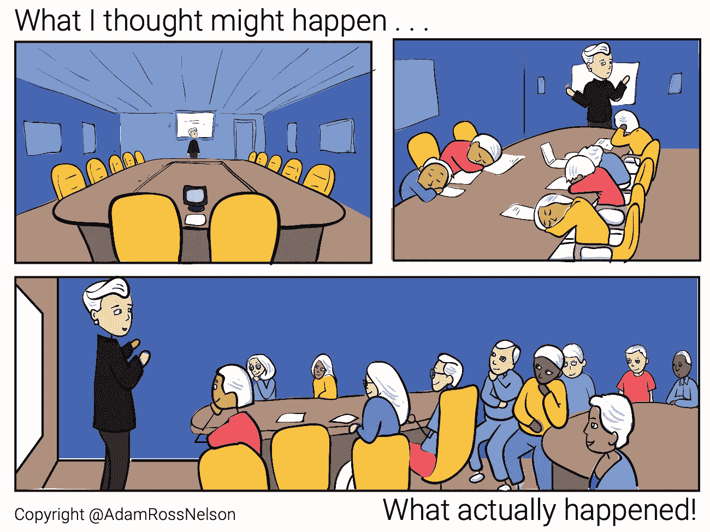

# 作为数据科学家，我工作中最喜欢的部分

> 原文：<https://towardsdatascience.com/the-favorite-part-of-my-job-as-a-data-scientist-c024333f3e22?source=collection_archive---------50----------------------->

## 作为一名数据科学家，我最喜欢的工作是

TLDR:这篇文章的目的不是提供技术知识或见解。下面我讲一个关于选择分层样本、计算样本权重以及在研讨会上与同事分享这些信息的故事。这是一个关于数据科学家如何利用他们的非技术知识帮助他们的公司建立强大的数据文化的故事。

# 介绍

我对数据科学家报告花费 80%的时间来寻找、清理和组织数据的统计数据毫无理由地着迷，这些数据是由哈佛商业评论分析的一个公认的适度样本得出的。这是一件好事，我不介意寻找，清理和组织数据。对我来说，寻找、清理和组织数据是刺激的一部分。

但是，作为一名数据科学家，我最喜欢的部分比作为一名数据科学家的许多方面更能让我充实。我工作中最喜欢的部分是帮助他人以新的方式联系。我有幸担任一个角色，这个角色往往会得到许多担任其他角色的人的关注。

面对现实吧，作为一名数据科学家会得到别人的关注。我最喜欢的日子是我能够利用这种关注来帮助那些在不同岗位上工作的人们建立联系的日子。这篇文章讲述了其中一天的故事。

## 有一天

一位同事问我是否愿意和她的团队分享选择和分析样本的步骤。我说当然，然后我们计划了一个自带午餐计划。事实证明，有机会分享和解释我的工作也是我喜欢的角色的一部分。

图片鸣谢:作者插画。当我计划一个与选择样品相关的棕色袋子展示时，我想到了会发生什么。

这也是一件好事，因为分享和解释你作为数据科学家的工作应该是一种常规体验。科学家称分享和解释他们的工作为传播。

因为选择和分析样本是一项相对平凡的任务，所以我对这个特定主题的棕色袋子的要求感到惊讶。参加展示的人会有披萨，所以我们用报名表来确保我们点了足够的披萨。当登记表上写满了整个公司所有运营部门的人员时，我越来越惊讶。技术和非技术同事都对这个话题感兴趣。

这是一个意想不到的机会，可以把除了在全公司会议上通常不会互动的业务领域的同事带来。通过促成这种联系，我既高兴又谦卑。

在这种情况下，选择样本(即加权样本)的步骤并不复杂。从我在数据科学中犯下的一个最糟糕、但相对无害的错误[中吸取了教训，我同意讨论这个话题，尽管我认为这个话题别人可能不感兴趣。不管是好是坏，每个人都将听到从人群中选择和分析样本的相关步骤。](/my-biggest-career-mistake-in-data-science-b95ad9fd0ff7)

## 设置

当时，我为一个生产广泛使用的软件解决方案的组织工作。它的用户群只有几百万。从许多软件标准来看，这是适度的。

尽管用户基数不大，但从这些用户中选择一个样本进行分析是很重要的。为了选择这个样本，我将我们的用户群划分为与重要的人口统计特征相关联的子群。然后，为了确保我们可以从人口稀少的细分市场中得出关于用户的结论，我对一些细分市场进行了过采样，而对其他细分市场进行了欠采样。后来在分析过程中，我对结果进行了加权，这样我们就可以将这些发现推广到我们的整个用户群。整个公司的员工和同事都要求详细了解这些方法和分析技术。

## 的日子

技术人员和非技术人员都将出席。有些人已经进入职场好几年了，有些人还在上大学。

重要的是，要向具有广泛背景和不同观点的受众提供有趣且有意义的内容。

作为一名数据科学家，我最喜欢扮演的角色之一就是在这些正式和非正式的场合将观众聚集在一起。尽管我对这个机会充满热情，尽管其他人也对这个机会表现出热情，但我还是有一些挥之不去的疑虑。我很担心。

图片鸣谢:作者插画。我想(或担心)会发生的事情是，我计划了一个与实际发生的事情相比，与选择样本相关的棕色袋子演示。

我想象这个演示会和看米色油漆变干一样有趣。那天会议室里只有站着的地方。

## 一个轶事，当其他人联系

在演示过程中，我演示了一个计算样品重量的代码块。该代码块类似于:

可用于使用 Python 和 Pandas 数据框计算样本权重的代码示例。

这段代码完成了工作。此外，这段代码已经过优化，便于人们阅读。我需要房间里的每个人都明白，至少在概念层面上，这段代码完成了什么。此外，事实证明，这段代码与我进行分析时使用的代码没有太大的不同。

> 那天会议室里只有站着的地方。

因为我将代码优化为人类可读，所以我牺牲了它完成类似任务的能力，而无需对其他项目进行大量修改，这些修改可能也涉及到选择样本。这种牺牲是适当的，因为我希望在结果发布很久以后，我自己或者其他人能够很容易地解释我的代码。选择以易于阅读的方式编写代码支持了验证或复制工作的能力。

我在演讲中大声说，我不打算接受“边缘案例”。我没有计划“边缘情况”的原因是因为我为单个用户编写了这段代码。我解释说我不关心边缘案例，因为*我就是边缘案例*。这个评论引起了一些笑声。我不是想开玩笑。但它引发了多重幽默。

一位与会者问，“什么是边缘案例？”我看了房间。我有一种感觉，房间里还有其他人，他们知道什么是边缘情况，谁想说出来。所以我闭上嘴，让最后三分之一的棕色袋子成为与会者之间的对话。

 [## 加入我的介绍链接媒体-亚当罗斯纳尔逊

### 作为一个媒体会员，你的会员费的一部分会给你阅读的作家，你可以完全接触到每一个故事…

adamrossnelson.medium.com](https://adamrossnelson.medium.com/membership) 

# 结论

享受作为数据科学家的工作有很多原因。如果你是一名数据科学家，你必须喜欢寻找、准备和清理数据。你还必须享受 T2 筛选各种方法的快感。花时间比较结果和解释输出也是作为数据科学家工作的一个令人满意的方面。

但对我来说，作为一名数据科学家，我最喜欢的角色是帮助他人建立新的联系。我喜欢帮助他人与其他专业人士建立新的联系。我也将我的工作视为一个机会，帮助其他人联系到他们过去和现在的工作，但以新的和令人兴奋的方式。我利用数据科学的普及，无论数据科学是否值得普及，作为帮助他人建立这些新联系的一种手段。

这是一个关于我如何使用与选择分层样本和计算样本权重相关的方法和技术的故事，作为一个共同的兴趣点，以新的、意想不到的和令人惊讶的方式将我的一些同事聚集在一起。

本文的目的不是提供一个技术概述。如果你对我用来选择样本、计算样本权重、然后进行分析的代码样本的概述感兴趣，请给我发一封关于 Twitter.com/adamrossnelson[的邮件。也许会有合作的机会！](https://twitter.com/AdamRossNelson)

# 感谢阅读

感谢阅读。把你的想法和主意发给我。你可以写信只是为了说声嗨。如果你真的需要告诉我是怎么错的，我期待着尽快和你聊天。推特:[@ adamrossnelson](https://twitter.com/adamrossnelson)LinkedIn:[亚当罗斯尼尔森](https://www.linkedin.com/in/arnelson/)。