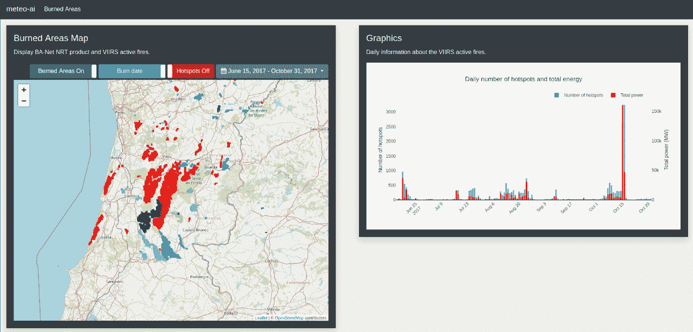
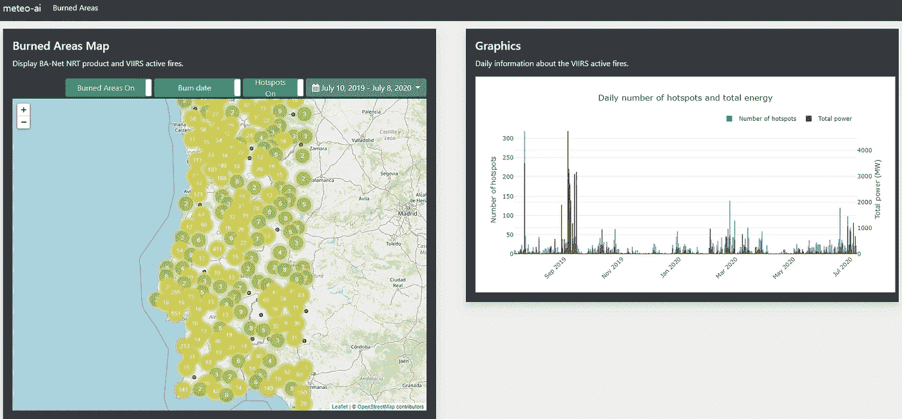

# 最后的倒计时:部署我的深度学习项目

> 原文：<https://towardsdatascience.com/the-final-countdown-deploying-my-deep-learning-project-29bf970e320b?source=collection_archive---------50----------------------->

## 在过去的两周里，我将我的深度学习项目转移到生产中，使用 Google can 平台和 Django 建立了一个网站，你现在可以自己看到

布鲁斯·马斯在 [Unsplash](https://unsplash.com/s/photos/success?utm_source=unsplash&utm_medium=referral&utm_content=creditCopyText) 上拍摄的照片。

**你怎么称呼一个从未与世界分享的令人敬畏的项目？—你不知道。除非这个项目是你的，否则你永远不会知道它的存在。研究不仅仅是有想法和写科学文章。研究是关于分享这些想法，是关于解决日常问题，并致力于建设一个更美好的世界和一个鼓舞人心的未来。**

在过去的两周里，我接受了将深度学习项目投入生产并与世界分享的使命。**该项目是一个利用卫星图像绘制每日受野火影响地区地图的模型。**投产能有多难？嗯，有一些注意事项要记住。

## 目录

*   项目的一些背景
*   下载数据
*   预处理数据并生成模型输出
*   用 Django 创建和部署网站

# 项目的一些背景

正如我上面提到的，这个项目包括一个使用卫星图像作为输入来生成被野火烧毁的区域的每日地图的模型。**这项研究导致了一篇** [**科学论文的发表**](https://www.sciencedirect.com/science/article/pii/S0924271619303089?casa_token=c5FZE9u_BJkAAAAA:34uSI3GWUEUAuV5fUGt1qCIzn9MdrOg6ifZz6ZEA_lqPK5bJw_80vnuuy6kNac3ivFmT819HBw) **我在下面的两个故事中描述了这篇论文，如果你有兴趣找到关于这个主题的更多细节。**

 [## 用人工智能从太空测绘燃烧区域

### 森林火灾是一种自然灾害，通常会对生态系统和人类产生巨大影响。绘制火灾图…

medium.com](https://medium.com/@mnpinto/mapping-burned-areas-from-space-with-artificial-intelligence-3657bdb97a9d)  [## 绘制 2019-20 澳大利亚森林火灾

### 一个案例研究显示了如何使用深度学习从卫星图像中监控火灾的日常进展…

towardsdatascience.com](/mapping-2019-20-australian-bushfires-4e6d9a0eed63) 

# **下载数据**

任何模型都需要一些输入数据来生成输出。在我的例子中，输入数据——每日卫星图像——需要从网络服务器下载。这包括使用 API 发出请求，等待请求被处理，最后下载图像。当一切顺利时，这很容易，但经常会有意想不到的问题。

*   对服务器的请求可能需要一些时间来处理，并且每个请求有一个文件限制；
*   连接可能会失败，结果导致下载中断，从而导致文件损坏；
*   由于某些不可预知的原因，数据可能会延迟或丢失。

**为了让请求/下载过程健壮地工作，我必须编写一个** [**Python 包**](https://github.com/mnpinto/geoget) **来管理下载过程，其特性包括:**

*   在文件数量对于单个请求来说太大的情况下，将请求拆分到 API
*   记下哪些文件已经被下载；
*   检查下载文件的哈希以确保它们没有损坏；
*   能够在连接丢失的情况下重新启动进程，而不必发出新的请求。

测试和调试所有这些代码非常耗时，但在进入生产阶段时却是必要的。**流程需要尽可能可靠，并且需要最少的人工干预。**

# 预处理数据并生成模型输出

幸运的是，这一步更简单，因为可以使用研究过程中使用的预处理函数来准备数据。**但是，经常需要一些修改:**

*   代码应该是快速的和内存高效的，以减少计算成本和处理时间；
*   代码应该对诸如丢失数据之类的问题具有鲁棒性；
*   代码应该能够在 CPU 或 GPU 上运行，这取决于机器的规格——幸运的是， [Pytorch](https://pytorch.org/) 使这变得非常容易。

对数据进行预处理后，就该加载模型、生成预测并保存结果了。**然而，结果需要以对网站友好的格式保存**。在我的案例中，这导致了一些额外的步骤:

*   将图像数据转换成矢量格式并分离各个烧伤区域。
*   还保存与每个单独事件相对应的 GeoTiff 图像。

然后可以将数据添加到数据库中。我选择使用能够处理地理数据类型的 [PostGIS](https://postgis.net/) ，比如多边形和栅格。

实际上，我在 Google 云平台虚拟机上运行下载和预处理步骤。为了降低成本，该实例每天只打开一次来计算输出，并将它们发送到网站所在的服务器。

# 用 Django 创建和部署网站

Django 是一个使用 Python 快速开发的 web 框架。**问题是，两周前我还不知道怎么用它。我以前读过，但我从未找到合适的机会使用它。我觉得这可能是一个有益的挑战。**毕竟，学习是有趣的！或者至少在你最终明白事情是如何运作的之后，这是很有趣的。**学习过程是这样的:**

*   前两天是从看 YouTube 上的一些教程开始的；
*   当我学会了基础知识，我开始创建我的网站项目；
*   接下来的几天，随着我开始理解这个框架是如何工作的，我逐渐添加了更多的特性。

这个过程的特点是大量的谷歌搜索，浏览器中不合理数量的打开标签，以及大量的耐心。

好的一面是，我学得越多，就越意识到姜戈带来的潜力。随着时间的推移，进度开始加快— **攀登学习曲线！**

有了一个工作示例后，我决定是时候部署它了。我发现这个过程比预期的更具挑战性。通常，YouTube 上的教程只涉及开发部分，缺乏对部署过程的解释。我花了大约三天时间才完成这一步。我必须弄清楚什么是 [Nginx 和 Gunicorn，以及如何让一切工作起来](https://www.digitalocean.com/community/tutorials/how-to-set-up-django-with-postgres-nginx-and-gunicorn-on-ubuntu-16-04)。但是，就像任何事情一样，当任务更具挑战性时，我们学到的东西也最多。

**说够了！我给你看一下网页(**[【meteo-ai.com】T21](https://meteo-ai.com/burnedareas/)**)并描述一下主要功能。**

图一。显示 2017 年影响葡萄牙的极端火灾的[网站](https://meteo-ai.com/burnedareas/)的打印屏幕。

图二。显示过去一年概况的[网站](https://meteo-ai.com/burnedareas/)的打印屏幕。

**该网站的特色:**

*   燃烧区域数据和活跃火灾数据存储在一个与 [GeoDjango](https://docs.djangoproject.com/en/3.0/ref/contrib/gis/) 配合良好的 [PostGIS](https://postgis.net/) 数据库中；
*   用户可以选择将导致数据库查询的可视化的时间范围；
*   网站上的结果显示在[传单](https://leafletjs.com/)地图上，利用了 nice [标记集群扩展](https://github.com/Leaflet/Leaflet.markercluster)，允许以一种干净有效的方式聚集相近的标记(参见图 2 中的地图)。
*   通过将每个像素渲染为多边形，使用燃烧日期或模型的置信水平对区域进行着色，来显示燃烧区域地图。**这允许我有一个跨越用户选择范围的颜色图**(参见图 1 中的图)；
*   所选时间段或火灾事件的统计数据显示为使用 [Plotly.js](https://plotly.com/javascript/) 制作的动态图(参见图 1 和图 2 中的柱状图)。

能够以可视和动态的形式聚集所有这些信息对于监控和研究火灾非常有用。

有网页显示类似类型的信息，然而，这种深度学习模型产生的烧伤区域是这种类型产品的最先进水平。通过使用 3D 卷积和 LSTM 层分析输入图像序列中的时空相关性，**经过训练的模型非常擅长识别燃烧区域并确定像素燃烧的日期** —特别强调后者。

# 结局？

一点也不。网站目前的状态有很多方面需要改进。此外,**在燃烧区领域还有更多研究路径需要进一步探索。一个热门话题是使用公开的卫星图像绘制更高分辨率(3000 万像素或更小)的火烧区地图。**高空间分辨率与频率较低的图像相权衡。这是我正在解决的问题。处理如此大量的数据本身就是一个挑战！我会确保在将来写下结果。****

也许这只是一个开始。

## 关于我

 [## 我的 3 年历程:从零 Python 到深度学习竞赛高手

### 自从 2017 年开始学习 Python 以来，我一直遵循的道路是成为一名独自参加 Kaggle 比赛的大师…

towardsdatascience.com](/my-3-year-journey-from-zero-python-to-deep-learning-competition-master-6605c188eec7) 

*感谢阅读！祝您愉快！*