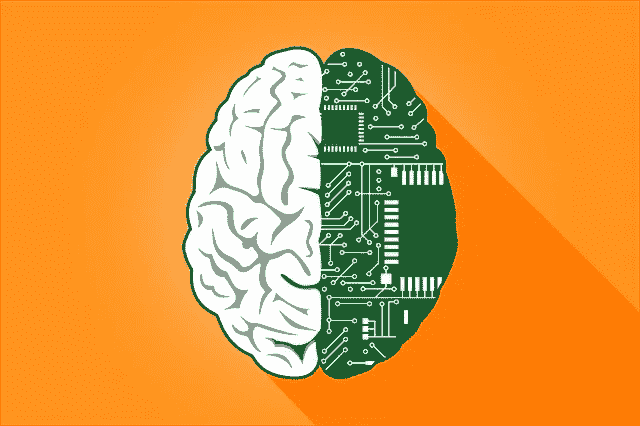
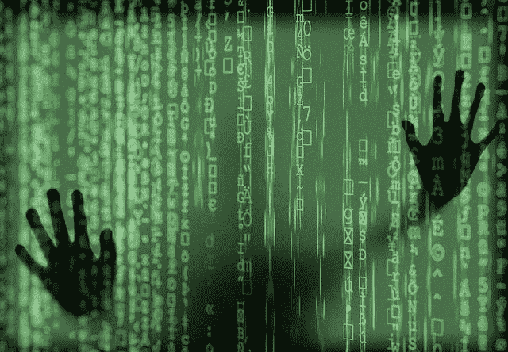
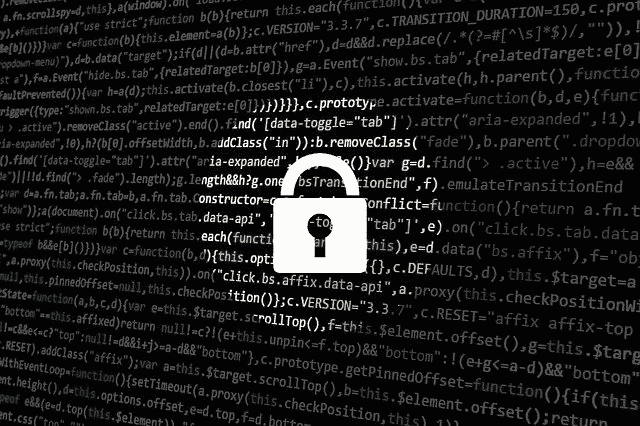

# 最后的前沿:大脑数据

> 原文：<https://towardsdatascience.com/the-final-frontier-brain-data-490c899be125?source=collection_archive---------71----------------------->

> 心灵感应即将到来——脑机接口将极大地改变我们交流和感知现实的方式。

图片来自 [pixabay](https://pixabay.com/)

在日益技术化和数据驱动的社会的帮助下，人类和机器之间的交流艺术已经达到了优化的顶峰。虽然我们曾经通过身体互动和口语进行交流，但未来的交流可能取决于一种更具心灵感应的形式:大脑与机器的交流。

一个[脑机接口](https://en.wikipedia.org/wiki/Brain%E2%80%93computer_interface)是一个将[神经元](https://www.brainfacts.org/brain-anatomy-and-function/anatomy/2012/the-neuron)信息转换成外部计算机或机器可以用来执行我们的行动和决定的形式的装置。

尽管这种设备可能允许人类直接与机器交流思想和行动，但该技术需要大量数据来提供一致、准确和理想的结果。这一核心要求揭示了一项技术的许多伦理含义，这项技术与我们人类数据的最终前沿:大脑数据密切相关。

尽管这项技术确实有巨大的潜力，但为了将风险和伤害降至最低，也必须解决令人生畏的道德后果。

**隐私**

图像通过 [pixabay](https://pixabay.com/)

随着与大脑交流的新方式的出现，并考虑到脑机接口收集的数据的显著私密性，有可能出现新的侵犯人类隐私的行为。

虽然许多脑机接口应用程序可能是出于提高人类生活质量的善意目的而创建的，但允许访问人脑数据可能会严重损害用户的隐私。

由第三方实体收集的私人信息，如大脑数据，可能被用来以恶意方式针对脑机接口用户。拥有这些私人数据的实体可以以许多有害的方式操纵脑机接口用户，包括:

*   发送不必要的刺激对身体造成物理伤害
*   向用户发送视觉或听觉刺激，并分析无意识大脑的反应，以收集或窃取私人信息(银行信息、密码、位置、秘密)
*   从检查大规模原始大脑数据库中得出群体推断，目的是产生目标用户的记忆、情感倾向、偏好和其他属性的简档。

鉴于这些数据的高度敏感性，毫无疑问，它具有很高的潜在价值。人们可以推断，控制数据的人不会阻止提取这些数据或将这些数据出售给第三方供应商——公司会有动力获取和处理这些私人数据，因为这使他们能够更有效地运营、进行内部研究和商业化。

例如，[苹果心电图](https://www.apple.com/watch/?afid=p238%7CstRYjywST-dc_mtid_1870765e38482_pcrid_434085140878_pgrid_99322577744_&cid=aos-us-kwgo-watch--slid---product-)手表影响了保险公司根据手表收集的敏感数据(我们身体的电脉冲)的结果修改价格；基础营销和战略告诉我们，在销售产品之前了解用户和消费者的概况是一个重要的竞争优势。虽然 APPLE ECG 收集电脉冲，但无法想象大脑数据的收集和使用会给我们的日常生活带来什么样的改变。

最终，这些动机的结合对脑机接口用户的隐私构成了直接威胁，我们必须努力起草法规，以减轻这项技术激发的权力和金钱动机。例子是修改 [GDPR](https://gdpr-info.eu/) 以确保国际适用性或严格控制大脑数据的销售和转移。

**自治**

图片通过 [pixabay](https://pixabay.com/)

随着技术优化我们的偏好和决定，脑机接口有可能损害我们人类的自主意识；随着这项技术的兴起，我们不受外界影响的自我决定和独立决策的能力正面临风险。

对于伦理学家来说，自主指的是个人自我决定的能力。根据大多数脑机接口研究人员的说法，脑机接口旨在[提高重度残疾人的身体自主性和生活质量](https://www.ncbi.nlm.nih.gov/pmc/articles/PMC5680604/)。这项技术中的自主概念在伦理学家和脑机接口研究人员之间是不同的；脑机接口研究人员将自主性的讨论限制在残疾患者身上，他们在未来的脑机接口开发中很可能是少数用户。

脑机接口算法不断适应和学习用户的想法和倾向，并可以建议或预测用户想要采取的未来行动。因此，用户可能会建立对脑机接口建议的依赖，并失去确保有意决策得到控制和实现的能力。

由于现在能够依靠脑机接口来执行思想和知识，用户可能会失去独立思考和个人发展的意识。一个经典的例子是将你的一系列动作和想法限制在你知道设备会准确可靠地执行的范围内(少探索，多利用)。如果当前的脑机接口研究像前面提到的那样定义自主性，那么用户的人类自主感可能会受到威胁。

为了避免这种情况，脑机接口研究人员必须引入多个领域的专家来有效地定义人类自主的伦理含义，并相应地修改他们的技术和实践。

**安全**

图片通过 [pixabay](https://pixabay.com/)

安全性是工程师在计算机技术中努力确保的一项常见任务。最敏感的人体数据的收集、存储和传输将需要新的保护和预防措施，并结合检测和事件响应，以避免和防范安全事故。

与所有利用人类数据的新技术一样，黑客和希望造成伤害的恶意人员是一个共同的威胁。如果黑客可以访问你的大脑数据或脑机接口，他们可能会以不可想象的方式造成伤害，如上文隐私部分所述。

安全性不应该是一个特别的标准:脑机接口的用户在使用过程中根本不必担心安全性。最轻微的安全漏洞都可能对用户产生巨大影响，可能导致永久性脑损伤或死亡。

**责任**

图片通过 [pixabay](https://pixabay.com/)

脑机接口的潜在广泛使用带来了一个与道德和法律责任相关的重要问题:脑机接口的使用是否让用户对机器的所有决定负责？

这种技术的一个麻烦后果是由[道德崩溃区](https://estsjournal.org/index.php/ests/article/view/260)的概念来例证的，它描述了将有缺陷的算法和[数据化](https://www.techopedia.com/definition/30203/datafication)系统的错误归咎于人类主体的趋势。许多人经历过思考一些事情，但是放弃了交流或执行这个想法。如果脑机接口看到用户的想法并意外地执行了一个有害的动作，那么应该归咎于谁，这已经引起了广泛的讨论。虽然用户可能不会自己以某种方式行动，但他们会受到脑机接口决策的影响，并最终影响他们的想法。当前的研究和对道德和法律责任的理解不足以决定脑机接口的使用。因此，我们必须仔细指定我们将故障归咎于脑机接口的场景，并批判性地审查我们对脑机接口内责任的理解，辅以目前用于解决其他技术中这种[伦理问题](https://plato.stanford.edu/entries/computing-responsibility/)的方法。

**为什么这很重要，我们能做些什么？**

毫无疑问，计算技术在我们社会的日常生活中变得越来越有价值。随着大数据在人类和机器中的广泛使用，我们发现自己正处于一个必须仔细思考技术的设计、影响和伦理的时代。尽管脑机接口可以让我们显著改善日常生活，但我们必须优先考虑人类的安全和福祉。我们必须首先召集许多领域的专家——伦理学家、法律专家、神经科学家和工程师——他们支持旨在解决这些问题的公开讨论。对于普通大众，我们可以挑战传统的监管框架，批评当前的研究实践，并检查技术的人文背景和伦理。最终，我们必须鼓励讨论，并通过挑战侵犯我们基本人权的技术来增强我们自己的能力。

*如果你还没有读过我的下一篇关于脑机接口令人兴奋的潜力的文章，* [*在这里读一下*](/brain-machine-interfaces-the-sorcerer-era-b19c2d5b6200) 。