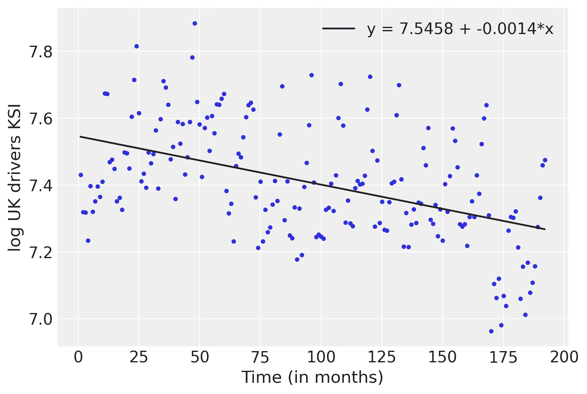
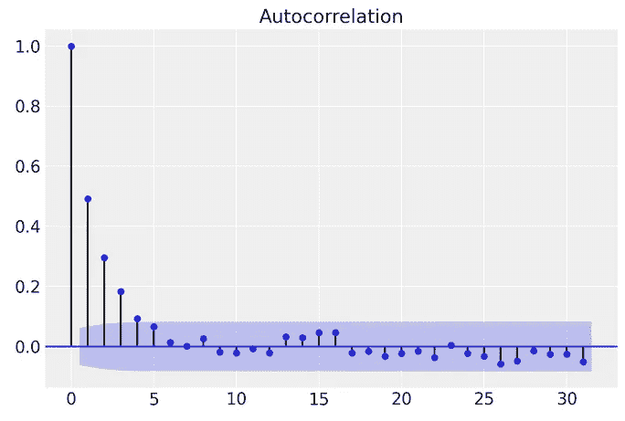

# 贝叶斯时间序列的第一步——线性回归

> 原文：<https://towardsdatascience.com/the-first-step-in-bayesian-time-series-linear-regression-89a64b826a7e?source=collection_archive---------6----------------------->

## 基于 PyMC3 的贝叶斯时间序列分析中的状态空间模型

# 介绍

今天，时间序列预测无处不在，公司的决策过程在很大程度上取决于他们预测未来的能力。通过一系列简短的文章，我将向您介绍一种解决这类问题的可能方法，将状态空间模型与贝叶斯统计结合起来。

在最初的文章中，我将从 Jacques J.F. Commandeur 和 Siem Jan Koopman [1]的《状态空间时间序列分析简介》一书中选取一些例子。它包括对应用于时间序列领域的状态空间建模的主题的众所周知的介绍。

我的贡献将是:

*   一个非常谦卑的尝试，以缩小这两个领域在介绍性和中间材料方面的差距。
*   概念的呈现:一方面，一个简洁的(并非不存在的)数学基础来支持我们的理论理解，另一方面，一个从零开始的算法实现(尽可能避免“黑盒”库)。在我看来，这是确保我们能够抓住一个想法的最好方法。
*   使用 PyMC3 正确实现所提出的模型，并对其进行解释和讨论

# 1.线性回归

在经典回归分析中，假设因变量 *y* 和预测变量 *x* 之间存在线性关系。y 的 n 个观测值(对于 *i* = 1，…，n 用 *y_i* 表示)和 *x* (对于 *i* = 1，…，n 用 *x_i* 表示)的标准回归模型可以写成


其中，ϵ_i NID(0，σ _ϵ)假设残差(或误差)ϵ正态独立分布，均值等于零，方差等于σ_ϵ.

## 1.1 数据

该数据集包括 1969 年 1 月至 1984 年 12 月期间英国每月死亡或严重受伤的司机人数(KSI)，您可以在此处找到。

我们将使用死亡人数的记录。对数变换可用于将高度倾斜的分布转换为不太倾斜的分布。这对于使数据中的模式更容易解释和帮助满足推断统计的假设都是有价值的。我们稍后会看到这意味着什么。

```
from scipy import stats
import numpy as np
import matplotlib.pyplot as plt
%matplotlib inline
import pymc3 as pm
import arviz as azy = np.log(ukdrivers)
t = np.arange(1,len(y)+1)
```

在我们目前的情况下，独立变量只是时间。

## 1.2 经典方法

回归模型有两个未知参数，可以用最小二乘法估计。它返回α和β的值，这些值在观察到的 *y* 和预测的 ŷ.之间产生最低的平均二次误差


目标是找到使误差最小的α (hat)和β (hat)值。为此，我们对每个参数取偏导数，并使其等于零，如下所示，


计算完上面的等式后，我们得到以下结果


```
print('Least Squares\n')
β_hat = np.sum((t - t.mean())*((y - y.mean()))) / np.sum((t - t.mean())**2)
α_hat = y.mean() - β_hat*t.mean()
print("\u0302α: " + str(α_hat))
print("\u0302β: " + str(β_hat))Least Squareŝα: 7.545842731731763
̂β: -0.0014480324206279402
```

我们可以用它们来绘制我们的最佳拟合线。

```
plt.plot(t, y, 'C0.')plt.plot(t, α_hat + β_hat *t, c='k',
        label=f'y = {α_hat:.4f} + {β_hat:.4f}*x')plt.ylabel('log UK drivers KSI')
plt.xlabel('Time (in months)', rotation=0)plt.legend();
```



英国驾驶员 KSI 数量和时间的对数的最小二乘法回归线。

使用最小二乘估计的误差方差可以通过下式计算


```
np.sum((y - α_hat - β_hat * t)**2/(len(y)-2))0.022998056021100423
```

## 2.贝叶斯方法

没有上下文的贝叶斯定理就像捕鼠器一样。尽管这个等式相对简单且广为人知，但它背后有很多直觉。我曾经读到过，它可以被看作是一个感知世界的镜头。我要说，它展示了一个不同的视角。有一些有用的资源可以获得这种直觉；所以，我就不太关注了。我们的工作范围是在它的实际方面，使它为我们所用。首先，我们简单定义一下它的组成部分。


我们从基础开始:之前的*是在我们包括数据的概率之前某事发生的概率(*可能性*)，之后的*是包含数据之后的概率。**

*贝叶斯定理[【2】](https://en.wikipedia.org/wiki/Bayes'_theorem)写成*

**

*上式中， *P(B)* 为*证据*， *P(A)* 为*先验*， *P(B | A)* 为*似然*， *P(A | B)* 为*后验*。 *P(A | B)* 是 A 发生的概率*如果* B 已经发生。我们可以将概率和概率分布代入方程(这对我们目前的工作更重要)。*

## *2.1 模型定义*

*现在，是时候将我们的简单线性回归定义为概率模型了。我们假设数据遵循高斯分布，平均值为α + β *x* ，标准差为ϵ，如下所示*

**

*我们本质上是在选择我们的可能性，也就是说，我们给我们观察到的变量(数据)分配了一个分布函数。下一步，我们需要定义我们的前科。对于每个参数(我们的未观察变量)，我们需要定义一个先验分布。把它想成一个先验信念，或者，如果你有参数的先验估计，这些先验估计就成为先验。因为我们不太了解参数，所以让我们定义一些通用分布*

**

*因为这是我们的第一款车型，所以我们会对我们的选择含糊其辞。用贝叶斯术语来说，这意味着我们将使用平坦先验。根据我们对模型的基本理解，我们知道ϵ不可能是负数，我们的斜率相对较小。稍后我们将改进我们选择先验的方式。当应用这些思想时，我们将只使用高斯和半高斯分布*

**

*让我们绘制这些分布图，以便更好地理解我们所说的平坦分布。*

```
*_, ax = plt.subplots(1,1)x = np.linspace(-15,15,1000)
ax.plot(x,stats.norm.pdf(x,0,10), label='α')
ax.plot(x,stats.norm.pdf(x,0,1), label='β');
ax.plot(x,stats.halfnorm.pdf(x,0,5), label='ϵ')
ax.legend();*
```

**

*我们模型中每个参数的先验分布*

*我们可以从上面看到，我们没有告知我们的贝叶斯模型我们的参数值可能是什么。这意味着数据将对我们的后验分布产生重大影响。我们将在未来学习如何在看不到数据的情况下，在我们的可观察变量中反映我们先前的选择。我们称这个建模步骤为*先验预测检查，*，它有助于诊断糟糕的建模选择。*

## *2.2 模型检查*

*我们总是喜欢从生成我们自己的数据开始，并确保模型被很好地指定。它为更复杂的模型带来了显著的价值，但是我们将在所有的例子中使用这种方法作为一个好的实践。*

```
*n = 200
true_α = 3
true_β = 0.2
true_ϵ = 0.2
ϵ = np.random.normal(0, 0.2, n)x = np.random.normal(10, 1, n)
true_Y = true_α + true_β * x
Y = true_Y + ϵ_, ax = plt.subplots(1,2,figsize=(8,4))
ax[0].plot(x, Y, 'o')
ax[0].set_xlabel('x')
ax[0].set_ylabel('y', rotation=0)
ax[0].plot(x, true_Y, 'k')
az.plot_kde(y, ax=ax[1])
ax[1].set_xlabel('y')
plt.tight_layout()*
```

**

*综合生成模拟数据的图，以进行模型检验。*

*我们可以在上面看到我们生成的数据和我们期望从中恢复的拟合线，也就是说，我们希望从数据中恢复我们的真实参数。*

*PyMC3 让我们以一种非常简洁的方式来翻译我们上面定义的模型。首先，我们定义参数的先验分布，然后是可能性。我们准备好取样了！*

```
*with pm.Model() as model_l:

    # priors
    α = pm.Normal('α', mu=0, sigma=10)
    β = pm.Normal('β', mu=0, sigma=1)
    ϵ = pm.HalfNormal('ϵ', 5)

    # likelihood
    y_pred = pm.Normal('y_pred', mu=α + β*x, sd=ϵ, observed=Y)
    trace_l = pm.sample(
        2000,
        tune=3000
    )
    idata = az.from_pymc3(trace_l)az.plot_trace(
    idata,
    var_names=['α', 'β', 'ϵ'],
    lines=[
        ("α",{}, true_α),
        ("β",{}, true_β),
        ("ϵ",{}, true_ϵ),
    ],
);*
```

**

*左边是每个参数的后验分布及其真实值(黑线)，右边是采样期间每个时间步长的单个采样值。*

*我们稍后会更详细地理解这些情节，但我只想告诉你，我们正在很好地恢复我们的真实价值。现在，关注参数的分布(左边的图)。这些是我们正在估计的参数的后验分布，垂直线代表真实值。我们可以看到，我们非常接近这些真实值。请记住，我们使用了平坦先验，并且我们生成了相对较小的数据集(200 个点)。*

## *2.3 模型实施*

*现在，是时候将经过验证的模型应用到我们的数据中了。*

```
*with pm.Model() as model_l:

    # priors
    α = pm.Normal('α', mu=0, sigma=10)
    β = pm.Normal('β', mu=0, sigma=1)
    ϵ = pm.HalfNormal('ϵ', 5)

    # likelihood
    y_pred = pm.Normal('y_pred', mu=α + β*t, sd=ϵ, observed=y)
    trace_l = pm.sample(
        2000,
        tune=3000
    )
    idata = az.from_pymc3(trace_l)*
```

## *2.4 模型可视化*

*另一种可视化我们的模型并确保我们已经正确地完成了数学表述的转换的方法是使用 Kruschke 图。*

```
*pm.model_to_graphviz(model_l)*
```

**

*我们实施的模型的 Kruschke 图，显示了每个参数和各自的概率分布，以及具有相应可能性的观察变量*

*有了上图，我们更容易把握对模型的理解。在每个节点内，我们都可以找到变量和分布，例如，检查包含ϵ的圆，你可以找到前面定义的半正态分布。观察到的变量由阴影节点表示。圆角框表示重复，即我们的数据集中有 192 个数据点，我们将计算所有这些数据点的可能性。箭头显示依赖关系；在我们的例子中，我们的可能性取决于参数α、β和ϵ.*

*既然我们确信已经正确地设置了模型，那么是时候分析我们的结果了。为此，让我们用与前面经典方法相似的方式绘制结果。*

```
*plt.plot(t, y, 'C0.')alpha_m = trace_l['α'].mean()
beta_m = trace_l['β'].mean()draws = range(0, len(trace_l['α']), 10)
plt.plot(t, trace_l['α'][draws] + trace_l['β'][draws] * t[:, np.newaxis], c='gray', alpha=0.5)plt.plot(t, alpha_m + beta_m *t, c='k',
        label=f'y = {alpha_m:.4f} + {beta_m:.4f}*x')plt.ylabel('log UK drivers KSI')
plt.xlabel('Time (in months)', rotation=0)plt.legend();*
```

**

*英国驾驶员 KSI 数量和时间的对数的贝叶斯模型的回归线(黑线)和不确定性估计(灰线)。*

*首先要注意的是，这条黑线与我们从经典线性回归中得到的非常相似。正如我们已经提到的，我们得到的不仅仅是点估计，而是一个分布——我们的后验分布。灰线代表我们对估计的不确定性。我添加它们是为了让它更有趣，并让您初步了解我们将在下一篇文章中分析的内容。*

## *2.5 贝叶斯方法与经典方法*

*现在，让我们比较两个模型的点估计。*

```
*print("Bayesian model\n")
alpha_m = trace_l['α'].mean()
print("\u0302α: " + str(alpha_m))
beta_m = trace_l['β'].mean()
print("\u0302β: " + str(beta_m))
print('\n---\n')
print('Least Squares\n')
b_hat = np.sum((t - t.mean())*y) / np.sum((t - t.mean())**2)
a_hat = y.mean() - b_hat*t.mean()
print("\u0302α: " + str(a_hat))
print("\u0302β: " + str(b_hat))Bayesian model̂α: 7.545267492352623
̂β: -0.0014456381236993064---Least Squareŝα: 7.545842731731764
̂β: -0.0014480324206279495*
```

*让我们也检查一下残差的标准差。*

```
*σ_error = trace_l['ϵ'].mean()
σ_error**20.023403824629370424*
```

*我们真的很亲密！它们产生类似结果的原因是，通过最小二乘法获得的点估计实际上与来自使用平坦先验的贝叶斯线性回归的*最大后验概率(MAP)* (后验模型)是一回事(正如我们在这里所做的)。稍后，我们将深入探讨这一切。*

## *3.讨论*

*我们的方法的一个问题是，我们违反了经典回归分析的一个基本假设。假设观测值 *y* 相互独立。我们的例子不是这样，因为它们在时间上是相互关联的。为了说明这种情况，让我们考虑:*

*   *为 *t* 和 *y，*绘制相同的图形，这次用一条线连接所有点；*
*   *绘制残差图。*

```
*plt.plot(t, y)
plt.ylabel('log UK drivers KSI')
plt.xlabel('Time (in months)', rotation=0);*
```

**

*英国司机数量的日志 KSI 绘制成时间序列。*

```
*residuals = y - (a_hat + b_hat*t)
plt.plot(t, residuals)
plt.plot(t, np.zeros(len(y)), '--', c='k', alpha=0.4)
plt.ylabel('Residuals')
plt.xlabel('Time (in months)', rotation=0);*
```

**

*经典线性回归模型的残差。*

*一方面，我们可以在我们的数据上看到一个清晰的模式，并且我们的残差远远不是随机分布的。*

*让我们看看其他方便的工具来诊断一组观察值的随机性。我说的是*相关图*，它包含了一个观察到的序列和同一个序列移动 *k* 时间点到未来的相关性。对于最小二乘法，请记住，它的计算公式为*

**

*注意，我们使用 *t* 来简化我们的理解，即自变量只不过是时间。*

*通过绘制残差与具有滞后(时间差)的残差，我们绘制了同一个变量与其自身的关系——因此，名为*自相关*。我们需要很好地理解这个观点，所以在这个问题上多花一点时间是有意义的。*

## *3.1.相互关系*

*首先，我们要引入*协方差*的概念。它描述了两个变量一起变化的程度。我们可以说，方差是一个群体之间如何变化的度量，而协方差是两个变量彼此变化多少的度量。*

**X* 和 *Y* 之间的*协方差*的公式为*

**

*我用 *X* 和 *Y* 来简化下标，但是你知道对于我们来说， *X* 是 *Y_t* 而 *Y* 是 *Y_{t-1}* 。批注𝔼[ *Y* 无非是 *Y* 的*期望值*。假设每个数据点的可能性相等，则每个数据点的概率为 1/n，给出*

**

*对于离散情况，我们将考虑。当然，你已经发现这只是我们的时间序列的平均值(也用ȳ).表示*

*现在我们了解了协方差，我们可以将这个想法扩展到*相关性*(也称为皮尔逊相关系数)，它只是由我们随机变量的方差的平方根归一化的协方差。*

**

## *3.2 自相关*

*对于我们的问题(至少目前)，我们对两个随机变量的相关性并不特别感兴趣，而是对一个随机变量本身感兴趣。让我们创建我们的系列，以便能够更好地将其可视化。我们必须确保它在时间上不是独立的(创建我们想要检查的相关性)。*

```
*y = [0]for i in range(1000):
    y.append(np.random.randn() + y[-1]*0.5)

y = np.asarray(y)
plt.plot(np.cumsum(y))plt.ylabel('$y_t$')
plt.xlabel('t', rotation=0);*
```

**

*从有一个滞后的自回归过程产生的合成数据。*

*我们可以看到，我们使我们的 *Y* 明确依赖于它以前的值。我们使用一个系数来定义当前值与前一个值的相关程度——可以随意使用其他值进行测试。我们以后会更好地理解这些系数的用处。让我们画出 *Y_t* 对 *Y_{t-1}* 的图，看看我们会得到什么。*

```
*plt.plot(y[:-1], y[1:], 'o');
plt.xlabel('$y_{t-1}$')
plt.ylabel('$y_t$', rotation=0);*
```

**

*散点图显示时间序列的前一点和当前点之间的相关模式。*

*从上面的图中，我们可以立即看到两个变量正相关。关于我们的模型，这告诉了我们什么？让我们找出答案。*

## *3.3 自相关函数*

*现在我们要推广自相关函数或 ACF(更多见此处[【3】](https://www.real-statistics.com/time-series-analysis/stochastic-processes/autocorrelation-function/))。平稳随机过程滞后 *k* 时的 ACF 定义为*

**

*对于任意的 *i* 除以随机过程的方差。*

*使用上面的等式，我们可以说，对于 *k* ≥ 0，滞后 *k* 处的自相关函数定义为*

**

*让我们建立自己的 ACF。*

```
*def correlation(x, y):
    return np.mean((x - x.mean()) * (y - y.mean())) / (x.std() * y.std())def acf_calc(y, lag=40):
    return np.array([1] + [correlation(y[:-i], y[i:]) for i in range(1, lag)])def acf_plot(y, alpha=0.05, lag=40):
    acf_val = acf_calc(y, lag)
    plt.vlines(np.arange(lag), 0, acf_val)
    plt.scatter(np.arange(lag), acf_val, marker='o')
    plt.xlabel('lag')
    plt.ylabel('autocorrelation')acf_plot(y);*
```

**

*合成生成数据的相关图。*

*我们可以看到自相关，对于某些滞后，它们似乎很高，但是有多高呢？我们需要一个下界和一个上界来回答这个问题。如果我们假设时间序列是高斯的，并且如果自相关分别高于或低于这些上限或下限，则零假设被拒绝。它指出，在α的显著性水平上，在给定的滞后处和之后没有自相关(这里我们进行假设检验，并抛出可接受的但有些随机的显著性值——不像贝叶斯那样)。我们的上限和下限可以用以下公式计算*

**

*这里我们将使用α = 5%。SE 是标准误差， *r_k* 是滞后 *k* 时的估计自相关。SE 可以使用 Barlett 公式计算*

**

```
*def standard_error(acf_values, n):
    se = np.zeros(len(acf_values) - 1)
    se[0] = 1 / np.sqrt(n)
    se[1:] = np.sqrt((1 + 2 * np.cumsum(acf_values[1:-1]**2)) / n )
    return sedef acf_plot(y, alpha=0.05, lag=40):
    acf_values = acf_calc(y, lag)
    plt.vlines(np.arange(lag), 0, acf_values)
    plt.scatter(np.arange(lag), acf_values, marker='o')
    ci = stats.norm.ppf(1 - alpha / 2.) * standard_error(acf_values, len(y))
    plt.fill_between(np.arange(1, ci.shape[0] + 1), -ci, ci, color='blue', alpha=0.2)
    plt.xlabel('lag')
    plt.ylabel('autocorrelation')acf_plot(y, lag=25);*
```

**

**具有置信区间的合成生成数据的相关图*。*

*现在我们知道了如何计算 ACF 和上下界，我们可以使用一个库来完成它。*

```
*from statsmodels.graphics.tsaplots import acf, plot_acf
acf_stats = acf(y)
plot_acf(y);*
```

**

**合成生成数据的相关图*，使用 statsmodels 库创建置信区间。*

## *3.4 残差相关图*

*我们终于准备好为英国车手数据的残差做*相关图*，最重要的是，分析它。*

*主要思想是，如果残差是随机分布的(我们希望它们是这样)，那么它们是相互独立的。它显示在*相关图*中所有未超过我们置信界限的小节中。我们将运用到目前为止所学的知识。*

```
*plot_acf(residuals);*
```

**

**相关图*适用于英国驾驶员 KSI 数量记录的经典线性回归模型的残差。*

*看起来没那么好看；有相当多的酒吧超出了蓝色阴影区。我们可以看到， *k* =1， *k* =2， *k* =11， *k* =12， *k* =13 超出了这些限制( *k* =0 始终为 1，正如我们在上面手动计算 ACF 时所示，因为它是每个点与其自身的相关性)。我们说这些点与零显著不同，这表明当我们使用经典的线性回归时，我们违反了误差是随机分布的假设。*

## *4.结论*

*我们建立了两个不同的模型，从根本上做同样的事情:他们使用时间作为解释变量，并线性建模其与英国司机 KSI 的对数的关系。第一种方法是使用标准最小二乘法拟合的经典线性回归模型。第二个是我们的第一个贝叶斯模型，将点估计的思想扩展到后验(和先验)分布。然而，结果并不令人满意。我们的残差远远不是随机分布的，这是我们的观察结果彼此不独立的结果。我们需要新的工具来解决这个问题。从本质上讲，有一个潜在的动态演变是无法观察到的，我们也无法对其建模。这就是状态空间模型的用武之地。*状态*精确描述了一段时间内无法观察到的动态过程。在下一篇文章中，我们将建立我们的第一个状态空间模型！*

*保持联系: [LinkedIn](https://www.linkedin.com/in/luisbrasroque/)*

# *参考*

*[1] J. Commandeur，S. Koopman，《状态空间时间序列分析导论》(2007)，牛津大学出版社*

*[2]https://en.wikipedia.org/wiki/Bayes%27_theorem*

*[3][https://www . real-statistics . com/time-series-analysis/random-processes/自相关函数/](https://www.real-statistics.com/time-series-analysis/stochastic-processes/autocorrelation-function/)*