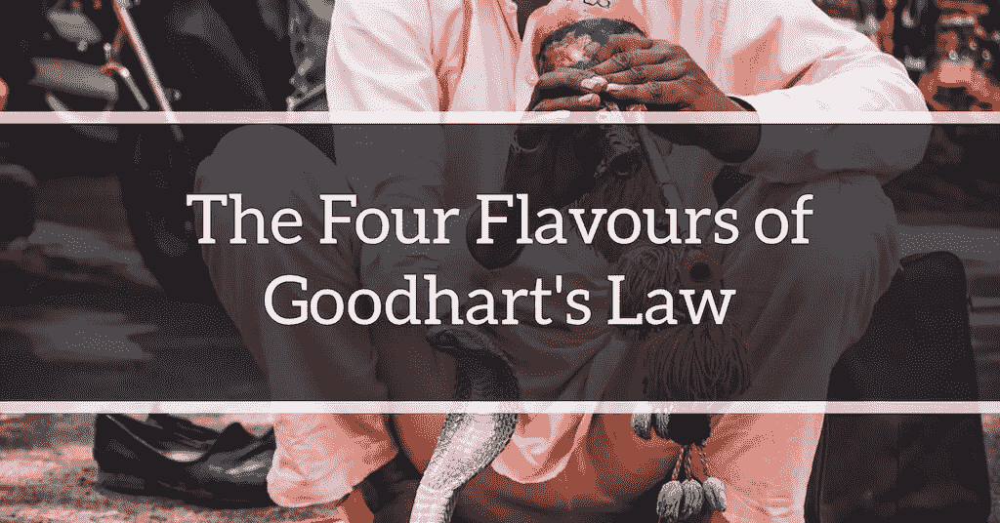

# 古德哈特定律的四种味道

> 原文：<https://towardsdatascience.com/the-four-flavors-of-goodharts-law-ab1e52d9d53f?source=collection_archive---------41----------------------->

作者图片

古德哈特定律是以英国经济学家查尔斯·古德哈特命名的一句名言，通常是这样说的:“当一项措施成为目标时，它就不再是一个好的措施。”

商人、经理和数据分析师都对这个想法感兴趣，这是有充分理由的:公司通常使用指标来运营，没有什么比善意的指标变坏更糟糕的了。

一个著名的例子就是现在所谓的“T2 眼镜蛇效应”。故事是这样的:在英国统治下的印度，殖民政府担心德里有毒眼镜蛇的数量。政府认为招募当地民众来努力减少蛇的数量是一个好主意，并开始为每一条送到政府门口的死眼镜蛇提供奖金。

最初，这是一个成功的策略:人们带着大量被宰杀的蛇进来。但是随着时间的推移，有事业心的人开始饲养眼镜蛇，打算以后杀死它们，以获得额外的收入。

当英国政府发现这一点时，他们取消了奖金，眼镜蛇饲养者将眼镜蛇放归野外，德里经历了带头巾蛇的繁荣。

因此，Raj 的眼镜蛇问题并不比它开始时更好。

# 古德哈特定律的四种形式

今天，我们知道古德哈特定律有四种类型。大卫·曼海姆和斯科特·加拉布兰特在他们的论文 [*中列出了这些味道，对古德哈特定律的变体进行了分类*](https://arxiv.org/abs/1803.04585)；曼海姆后来写了另一篇名为 [*构建更少缺陷的指标*](https://mpra.ub.uni-muenchen.de/90649/1/MPRA_paper_90649.pdf) 的论文，他通过慕尼黑个人 RePEc 档案馆分发了这篇论文。(我应该指出，这些论文都没有经过同行评议，但我不认为这有损它们的价值。)

在他们的论文中，Manheim 和 Garrabrant 以一种极其一般化的方式展示了他们对这四个类别的看法——一旦你想到古德哈特定律的应用，这是有意义的。例如，Manheim 和 Garrabrant 对这一想法对人工智能研究的影响很感兴趣(想象一下，如果你告诉一个超级智能人工智能优化回形针的制造，它决定液化人类以便生产更多的回形针……)，但对古德哈特定律的更好理解广泛适用于公共政策、公司管理和激励系统设计。

本帖是外行人对四味的总结；这并不意味着本文中所有子案例的详尽叙述。但我认为，对这四个阶段的广泛理解应该对普通商人有用。让我们开始吧。

# 回归古德哈特

古德哈特定律的第一种味道是唯一无法避免的。

让我们想象一下，你必须为一份工作雇用候选人。你*真正*想衡量的是他们未来的工作表现——但你不能在面试中直接衡量。然后，你[了解到](https://80000hours.org/2013/05/intelligence-matters-more-than-you-think-for-career-success/)智商和工作表现的相关系数约为 0.6。你决定进行智商测试。什么会出错？

起初，测试是成功的——你的公司成功地雇佣了比通过旧流程雇佣的人更优秀的人。受此鼓舞，你慢慢开始优化你的招聘，只考虑智商:例如，你宣传你的公司非常有选择性，非常适合工作，充满了聪明人，等等。但是过了一段时间，你会意识到智商最高的人往往比一些高于平均水平的候选人表现更差。这些高智商人群中的一些人很难共事！恭喜你:你刚刚经历了倒退的古德哈特。

回归古德哈特的出现是因为你用来代表你的目标的衡量标准*与那个目标*不完全相关。在我们上面的例子中，智商与工作表现的相关性为 0.6，按照社会科学的标准，这是一个很好的相关性，但这也意味着还有其他*个*因素对工作表现有影响。仅仅通过优化智商，你可能会得到次优的结果，因为你忽略了其他因素。

为了理解为什么这可能是真的，让我们假设认真的心理特质也是未来工作表现的预测因素([是](https://www.pnas.org/content/116/46/23004)，以防你想知道)。如果你已经为超高智商的人做了优化，你实际上是从一小群人中挑选，因为在任何人群中，超高智商的人都很少。你从那个小圈子里挑选出一个*和*都有高度责任心的人的几率真的很低；因此，我们应该看到这样一个结果:工作表现最好的人智商高于平均水平，但智商最高的人并没有最好的工作表现(因为他们不太可能也有高度的责任心，而责任心有助于工作表现)。这种效应有时被称为“[尾巴分开](https://www.lesswrong.com/posts/dC7mP5nSwvpL65Qu5/why-the-tails-come-apart)”。

在实践中，回归古德哈特是不可能避免的，因为几乎每一个你能想到的测量都是你想要测量的真实事物的不完美反映。如果这个标准变成了一个目标，那么你很可能会偏离你真正的目标。

你会怎么做？一个解决方案可能是[将对立的指标](https://www.holistics.io/blog/beware-what-you-measure-the-principle-of-pairing-indicators/)配对，就像传奇的英特尔 CEO 安迪·格罗夫曾经建议的那样。但是另一种方法，曼海姆建议的方法，是寻找对你真正目标的更精确的测量——说起来容易，做起来难！

# 埃斯特拉尔·古德哈特

在正常情况下，当你选择一个与你的目标相关的度量时，就会出现极端的古德哈特。但是采用这种方法会让你优化这种方法，在这种方法的极端情况下，与你目标的关系会破裂。

Garrabrant 举了一个我们与糖的关系的例子:人类进化到喜欢糖，因为在我们祖先的环境中，糖与卡路里相关。这在我们猎狮的时候非常有效；然而，今天，同样的优化导致我们喝可乐，吃多力多滋，滑向肥胖。

在机器学习中，这有时是由于“欠适应”而发生的。例如，两个变量之间的关系被假设为低次多项式，因为高阶多项式项在观察空间中很小。然后，基于这种度量的选择会向高阶项更重要的区域移动，因此使用机器学习系统会产生古德哈特效应。

# 因果古德哈特

你是一所高中的校长。你了解到高中成绩好的学生在大学考试中表现更好。你得出结论，帮助你的孩子在高中考试中取得好成绩会带来好事情，所以你推出了一个项目来教他们考试技巧。你也给你的班主任施加压力，引导学生学习更简单的科目，因为这样可以提高他们的平均考试成绩。

它不起作用。你刚刚经历了因果古德哈特。

另一个更琐碎的例子:你是一个孩子。你读到篮球运动员更有可能长得高。你想变高。所以你打篮球。

古德哈特定律的这种特殊风格很容易理解。这个想法是，当两者实际上是相关的(并且可能是由第三个因素引起的)时，你认为一个度量产生一个结果。自然地，如果你优化了其中一个，你通常不会影响你想要的结果。在我们上面的考试例子中，很明显，高中考试预测大学考试只是因为它们反映了学生的智力、知识和努力程度(以及其他因素)。试图通过榨取高中应试能力来取得更好的大学成绩，充其量用处有限。

当人们说“相关性并不意味着因果关系”时，这就是他们的意思

# 对抗性古德哈特

对抗性古德哈特是英国统治下的眼镜蛇的故事。

维基百科关于眼镜蛇效应的[文章](https://en.wikipedia.org/wiki/Cobra_effect)有很多其他有趣的例子，包括这个:

> *1902 年，河内的法国殖民政府创立了一项赏金计划，每杀死一只老鼠就奖励一笔钱。为了获得奖金，人们需要提供一只老鼠的断尾。*
> 
> *然而，殖民地官员开始注意到河内没有尾巴的老鼠。越南捕鼠人会捕捉老鼠，切断它们的尾巴，然后将它们放回下水道，这样它们就可以繁殖并产生更多的老鼠，从而增加捕鼠人的收入。*

对抗性古德哈特的一个相关例子是坎贝尔定律:

> 社会决策中使用的量化社会指标越多，它就越容易受到腐败压力的影响，也就越容易扭曲和腐蚀它所要监控的社会进程

你可以想象这样一种情况，一个政府说它的所有政策必须基于“证据”，因此这导致了巨大的压力(和大量的激励！)让系统中的各种参与者操纵、润色和篡改“证据”，以证明政府政策的合理性。

这里的一般思想是，代理可能以破坏指标目标的方式优化指标(眼镜蛇效应)，或者代理可能选择以降低指标预测效应的方式优化指标。

解决办法？曼海姆建议进行“预验尸”，比如，“好吧，我们将要选择的政策在未来出了问题，发生了什么？”他指出，在一个群体中，不需要有那么多人，就会有人想出一个似乎很可怕的场景。

现在你知道了:古德哈特定律的四种口味。如果这篇文章没有让你想起什么，那么请记住这一点:如果你想让你的后院少一些蛇，就不要花钱买死蛇。

*原载于 2020 年 10 月 14 日* [*我们的博客*](https://www.holistics.io/blog/four-types-goodharts-law/) *。*