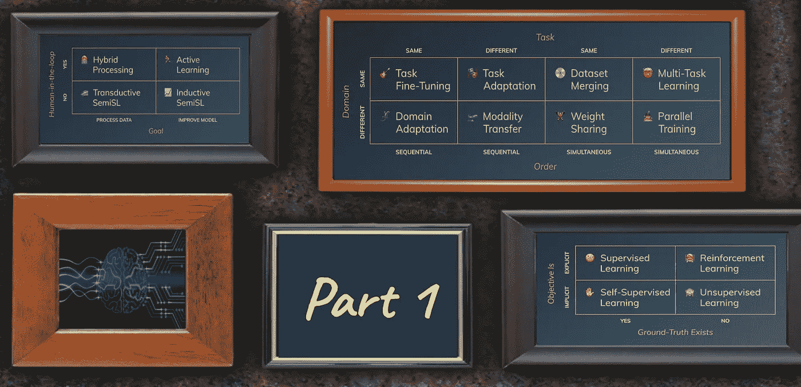
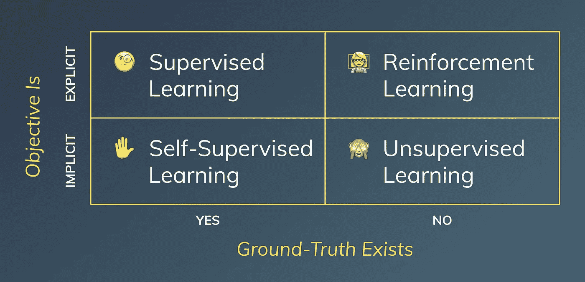

# 机器学习中的四种“纯”学习风格

> 原文：<https://towardsdatascience.com/the-four-pure-learning-styles-in-machine-learning-a6a1006b9396?source=collection_archive---------43----------------------->

## [构建机器学习概念](https://towardsdatascience.com/tagged/structuring-ml-concepts)

## 映射监督、自我监督、非监督和强化学习

> 在专栏“[构建机器学习概念](https://towardsdatascience.com/tagged/structuring-ml-concepts)”中，我试图从机器学习(ML)空间中提取概念，并将它们投射到新的、可能不寻常的框架中，以提供新的视角。该内容面向数据科学社区的人们，以及对 ML 领域感兴趣的精通技术的个人。

由作者创建。包括由 [Vectra AI](https://assets-global.website-files.com/5bc662b786ecfc12c8d29e0b/5d018a9ba972742ad9698ed9_deep%20learning.jpg) 和 [taviphoto](https://www.istockphoto.com/de/portfolio/taviphoto) 通过 [iStock](https://www.istockphoto.com/de/foto/grunge-wand-mit-alten-bilderrahmen-gm466850191-33802914) 制作的图形。

# 介绍

Back 2015 年，当我开始在斯坦福大学学习 ML 的时候，围绕它的概念和定义是相当结构化的，并且很容易描绘出来。随着近年来深度学习的快速发展，所使用的术语和概念的种类也大大增加了。这可能会让希望更多了解该领域的新手感到沮丧和困惑。

撰写这一期“[构建机器学习概念](https://towardsdatascience.com/tagged/structuring-ml-concepts)”的导火索是最近自然语言处理[、](https://en.wikipedia.org/wiki/Natural_language_processing) (NLP)和[计算机视觉](https://en.wikipedia.org/wiki/Computer_vision)的突破带来的概念混乱。人们开始意识到，一些以前被认为是无监督学习的技术应该被更恰当地命名为自监督学习。让我们详述一下。

# 监督、自我监督、非监督和强化学习

当人们谈论机器学习的不同形式时，他们通常将[监督学习](https://en.wikipedia.org/wiki/Supervised_learning) (SL)、[非监督学习](https://en.wikipedia.org/wiki/Unsupervised_learning) (UnSL)和[强化学习](https://en.wikipedia.org/wiki/Reinforcement_learning) (RL)称为三种学习风格。有时，我们会添加[半监督学习](https://en.wikipedia.org/wiki/Semi-supervised_learning) (SemiSL)到组合中，结合 SL 和 UnSL 的元素。2018 年，一种新的 NLP 算法开始流行，导致著名研究员 [Yann LeCun](https://www.facebook.com/722677142/posts/10155934004262143/) 在 2019 年提出了自我监督学习(SelfSL)的概念。

## 轻量级定义——最初的四种学习风格

*   **SL:** 我们使用数据集，在给定其他特征(例如，表格)或原始输入(例如，图像)的情况下，我们希望预测特定目标。这可以采取分类的形式，(预测一个分类值——“这是一只猫还是一只狗？”)或者回归(预测一个数值——“这个图像有多像猫？”)
*   **UnSL:** 现在假设我们只有原始输入(例如，表格中只有一些没有目标的用户数据，或者大量没有相关信息的图像)。我们的目标是寻找以前未被发现的模式，例如，聚类或结构，它们提供了新的见解，可以指导我们的决策。
*   **RL:** 通常从群体中脱颖而出，因为它不是在预先收集的数据集上工作，而是试图通过采取行动和观察回报来掌握环境中的任务。除非我们明确地声明一个奖励函数来激励代理人做出相应的行为，否则它不知道在给定的环境中该做什么。视频游戏是一个完美的例子:玩家(代理人)试图通过与视频游戏(环境)互动来最大化她的分数(奖励)。
*   SemiSL: 通常作为第四种学习风格加入，它适用于一个有特定目标的数据集和另一个通常更大的没有目标的数据集。目标是在来自已标记数据点的知识的帮助下推断未标记数据点的标记，从而建立最佳可能模型以将输入映射到目标。假设您可以访问一台制造机器的数据点，这些数据点可以分为两个集群。从带标签的数据集中，您知道所有与故障相关的未知数据点都属于“A”类，所有正常状态都属于“B”类；因此，假设“A”上的所有点都是关键点，而“B”上的点不是关键点。

## 为 SelfSL 放弃半 SL

关于这四种学习风格，有两点值得一提:

正如已经暗示的，最近在计算机视觉和 NLP 中完成的大多数 UnSL 被更好地描述为 SelfSL。这种新的学习方式不是使用给定的基本事实，而是使用包含在训练数据本身中的信息来监督的。然而，UnSL 算法的“旧家族”仍然有一部分是真正无监督的，它们使用数据点之间的一些接近度或接近度来决定什么是良好的拟合(并指导我们的损失函数)。

此外，如果你仔细想想，SemiSL 不应该是这些“纯”学习风格的一部分。第一，它是两种“纯”学习方式的混合；第二，它的基本设置包括两个不同的数据集，一个有标签，一个无标签。因此，我们为[结构化机器学习概念](https://towardsdatascience.com/tagged/structuring-ml-concepts)系列的[第二部分](/processing-unlabeled-data-in-machine-learning-2552e3fdf7c1)保存了 SemiSL，在那里我们将更详细地讨论处理未标记数据。

## 轻量级定义—一种新的划分

*   **SelfSL:** 我们只有原始输入(例如，图像或大量文本)，我们希望捕捉其中包含的隐含信息。我们通过使用(部分)原始输入作为目标来做到这一点。在[自动编码器](https://en.wikipedia.org/wiki/Autoencoder)中，我们使用“重建损失”，即将解码图像与原始输入进行比较。在大规模语言模型中，我们“隐藏”句子的一部分，然后仅使用周围的词(例如，嫁给 ____ 她的丈夫→[爱])将它用作预测目标。
*   **UnSL(重新访问):**与 SelfSL 相反，我们不是基于一些“隐藏的”地面事实来测量我们的模型的“适合度”，而是基于“转换的输入”的隐含接近度，即特征空间中数据点的距离。我们可以影响如何定义这种适合度，例如，如果我们希望群集是密集的或连续链接的，但邻近目标保持不变。例如，通过特定平台上的行为对用户进行聚类，并使用分配的聚类来指导您的营销策略。

# 2x2 矩阵

用于 SL、RL、SelfSL 和 UnSL 的 2x2 矩阵。由作者创建。

我提出一个简单的 2x2 矩阵，将 SL、UnSL、SelfSL、& RL 映射到两个轴上，回答以下问题:

## **地面真相存在吗？**

**是的** 对于 SL 和 SelfSL，我们使用一个基本事实来构建我们的损失函数和指标。无论是 SL 的图像上的“猫”标签，驱动“分类的[交叉熵](https://en.wikipedia.org/wiki/Cross_entropy)损失”和“准确性”，还是 SelfSL 的句子中的“隐藏的”单词(嫁[爱]她的丈夫)，其中我们使用“负的[对数似然](https://en.wikipedia.org/wiki/Likelihood_function#Log-likelihood)”作为损失和度量[困惑](https://en.wikipedia.org/wiki/Perplexity)。

**没有**
对于 UnSL 和 RL 来说，没有这样的地面真相。我们有描述“适合度”或“期望行为”的标准，但没有类似于“准确性”的标准。例如，在 UnSL 的“ [k 均值聚类](https://en.wikipedia.org/wiki/K-means_clustering)”中，我们可以测量“到聚类均值的平均距离”，在 RL 中，我们试图最大化我们从环境中获得的“累积回报”。

## 目标是明确给出的还是隐含给出的？

**外显** 在 SL 和 RL 中，我们有一个明确的选择，我们想从数据或我们的代理中得到什么。对于 SL 来说，我们的选择是通过重新分配标签，将“猫狗品种分类”问题转化为简单的“猫狗分类”问题。当使用 RL 来掌握多人电脑游戏时，我们可以选择通过奖励为集体利益而采取的行动来激励我们的代理充当团队成员，或者通过单独奖励个人行动来激励我们的代理充当利己主义者。

然而，我们不能外在地支配一个自我形象或语言的本质。我们当然可以改变一些细节，但“重建损失”总是会比较两个图像，对于语言模型，我们总是会通过查看句子本身来完成学习任务。使用经典的 UnSL，我们隐含地陷入寻找彼此接近的数据点，例如，两个用户在社交媒体平台上留下相似的行为数据。

# 关闭

在这篇文章中，我们将 UnSL 和 SelfSL 分开，将 SemiSL 排除在外，重新定义了 ML 中的“纯”学习风格。这就给我们带来了 SL、UnSL、SelfSL、RL 这四个概念，我们可以把它们安排在一个简单的框架里(充分披露:我确实做过一段时间的咨询工作)。2x2 矩阵根据是否存在基本事实以及目标是明确还是隐含给出来构建它们。

如果你有任何其他非传统的映射，对此事的想法，或者对我们在 [Luminovo](https://luminovo.ai/) 的工作感兴趣，我很乐意收到你的来信。可以留言或者在 [Linkedin](https://www.linkedin.com/in/sebastian-schaal/) 联系我。

[构建机器学习概念](https://towardsdatascience.com/tagged/structuring-ml-concepts)的第二部分是关于[在机器学习](/processing-unlabeled-data-in-machine-learning-2552e3fdf7c1)中处理未标记的数据。请随意查看。