# 强化学习的基础

> 原文：<https://towardsdatascience.com/the-fundamentals-of-reinforcement-learning-177dd8626042?source=collection_archive---------41----------------------->

## 马尔可夫决策过程、策略、价值函数、贝尔曼方程和动态规划实现

列宁·艾斯特拉达在 [Unsplash](https://unsplash.com/s/photos/robots?utm_source=unsplash&utm_medium=referral&utm_content=creditCopyText) 上的照片

强化学习可能是最相关的科学方法之一，类似于人类学习事物的方式。每天，我们，学习者，通过与我们的环境互动来学习，以知道在某些情况下该做什么，知道我们的行为的后果，等等。

当我们还是婴儿的时候，我们不知道摸热水壶会伤手。然而，当我们知道环境是如何对我们的行为做出反应的时候，也就是说，触摸热水壶会伤到我们的手，于是我们学会了不要触摸热水壶。这说明了强化学习的基本理论。

强化学习是学习做什么来最大化数字奖励。这意味着学习者应该通过尝试来发现哪些行为从长远来看能产生最高的回报。

在这篇文章中，我想讨论强化学习背后的基础知识，包括:马尔可夫决策过程，政策，价值函数，贝尔曼方程，当然，还有动态规划。

# 马尔可夫决策过程

马尔可夫决策过程是我们在强化学习中试图解决的基本问题。但是，马尔可夫决策过程的定义是什么？

> 马尔可夫决策过程或 MDP 是*主体*和 e *环境*之间顺序交互的公式化。

在这里，学习者和决策者被称为*代理*，它与之交互的东西被称为*环境*。在 MDP，*代理人*做出某些决定或行动，然后*环境*通过给代理人一个新的情况或状态以及立即的奖励来做出响应。

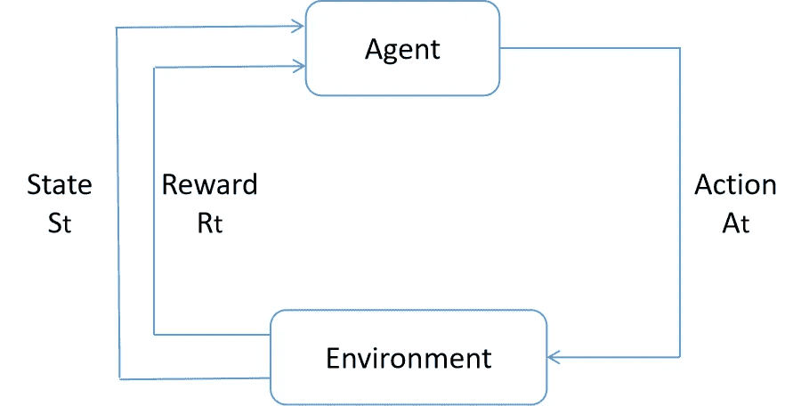

马尔可夫决策过程中主体与环境的相互作用

在强化学习中，主体的主要目标是做出一个决策或行动，使其从环境中获得的长期回报总量最大化。

比方说，我们想训练一个机器人下棋。每当机器人赢得比赛，奖励将是+1，如果它输了比赛，奖励将是-1。在另一个例子中，如果我们想训练机器人从迷宫中逃脱，那么在逃脱之前，随着时间的流逝，奖励会减少-1。

> 强化学习的回报是你如何向代理传达你希望它实现什么，而不是你希望它如何实现。

现在的问题是，我们如何计算代理人在一系列行动后所获得的累计奖励金额？累积奖励的数学公式定义如下。

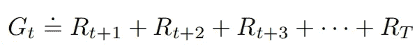

上图中， ***R*** 是代理人在每个动作序列中的报酬， ***G*** 是*的累计报酬*或*的预期收益*。代理人在强化学习中的目标是最大化这个期望收益 ***G*** 。

## 贴现预期收益

然而，上面的等式只适用于当我们有一个插曲 MDP 问题，这意味着代理人-环境相互作用的序列是插曲或有限的。如果我们有一个情况，代理-环境之间的相互作用是连续的和无限的？

假设我们有一个问题，代理像空调一样工作，它的任务是在给定的情况或状态下调节温度。在这个问题中:

*   *状态:*当前温度，房间中的人数，一天中的时间。
*   *动作:*提高或降低室温。
*   *奖励:* -如果房间里有一个人需要手动调节温度为 1，否则为 0。

为了避免负回报，代理人需要不断地学习并与环境互动，这意味着 MDP 序列没有尽头。为了解决这个来自代理人的连续任务，我们可以使用贴现的预期收益。

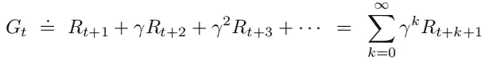

在上式中，γ是贴现率，其值应在 0 ≤ γ ≤1 的范围内。

这个折扣率背后的直觉是，代理人在较早的序列中得到的回报将比它在几个序列后得到的回报更有价值。这个假设在现实生活中也有道理。由于通货膨胀，今天生活中的 1 欧元在几年后会比 1 欧元更值钱。

如果γ= 0，这意味着代理人是*短视的*，意味着它在下一个序列中对一个动作的即时奖励采取了更多的权重。

如果γ更接近于 1，这意味着代理人是*有远见的*，意味着它对未来的回报投入越来越多的权重。

有了贴现回报，只要报酬非零且γ < 1, the output of expected return would no longer be infinite.

# Policy, Value Function, and Bellman Equation

Now we know that the goal of an agent in reinforcement learning is to maximize the cumulative reward. In order to maximize the reward, the agent needs to choose which action it needs to take in a given state such that it gets a high cumulative reward. The probability of an agent choosing a certain action in a given state is called *政策*。

> 策略是代理在给定状态 s 下选择动作 A 的概率。

在强化学习中，一个策略通常用 **π** 来表示。这意味着 ***π(A|S)*** 是代理人选择动作 ***A*** 的概率，假设它处于状态 ***S*** 。

现在，如果一个代理处于状态 ***S*** 并且它遵循策略 **π** ，那么它的期望收益将被称为策略 ***π*** 的*状态值函数。因此，状态值函数通常表示为 ***Vπ*** 。*

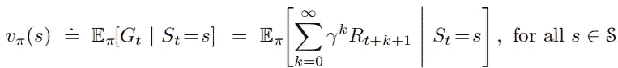

类似于状态值函数，如果一个代理处于状态 ***S*** 并且它基于策略π确定它的下一个动作，那么它的期望收益将被称为策略π 的*动作值函数。因此，动作值函数通常表示为 ***qπ*** 。*

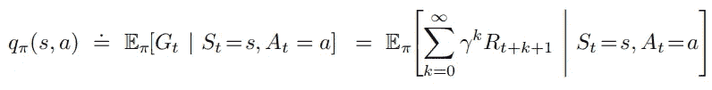

在某种意义上，价值函数和报酬有一些相似之处。然而，奖励指的是眼前的好处，而价值函数指的是长远的好处。因此，一个州可能具有较低的即时奖励，但具有较高的价值函数，因为它经常被具有较高奖励的其他州跟随。

为了计算价值函数，通常应用贝尔曼方程。

> 在强化学习中，贝尔曼方程通过将当前状态的值函数与未来状态的值相关联来工作。

数学上，贝尔曼方程可以写成如下形式。

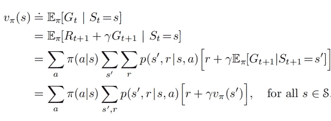

从上面的数学方程可以看出，贝尔曼方程表达的是，它对所有可能的状态和任何给定状态下的未来回报进行平均，这取决于动态环境 ***p.***

为了让我们更容易直观地理解贝尔曼方程实际上是如何工作的，让我们把它与我们的日常生活联系起来。

> 假设两个月前，你第一次学会了骑自行车。有一天当你骑自行车时，当你在满是沙子的路面上拉刹车时，自行车失去了平衡，使你滑倒并受伤。这意味着你从这次经历中得到了负回报。
> 
> 一周后，你又骑上了自行车。当你在满是沙子的路面上骑它时，你会减慢速度。这是因为你知道当自行车失去平衡时，不好的事情会发生，即使这次你没有真正经历过。

# 最优策略和最优价值函数

每当我们试图解决强化学习任务时，我们都希望代理选择一个使累积回报最大化的行动。为了实现这一点，这意味着代理应该遵循一个策略，使我们刚刚讨论的价值函数最大化。在所有状态下使价值函数最大化的策略称为最优策略，通常定义为π*。

为了更好地理解最优策略，让我们看一下下图。

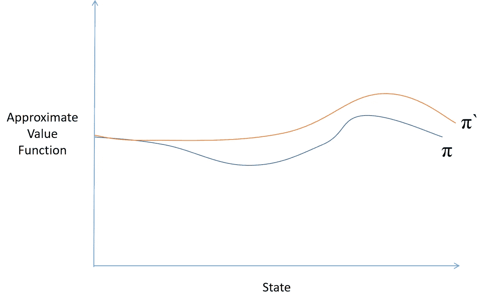

最佳策略定义

如上图所示，我们可以说，与π相比，π`是最优策略，因为遵循策略π`的任何给定状态下的价值函数与策略π一样好，甚至更好。

如果我们有一个最优策略，那么我们实际上可以把贝尔曼方程改写成如下:

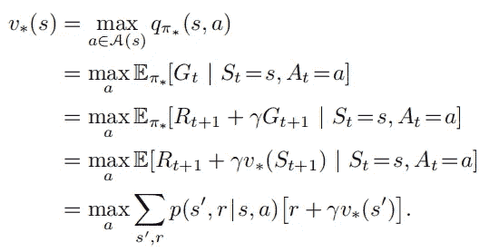

上面的最后一个方程叫做贝尔曼最优方程。注意，在上述等式的最终形式中，没有关于特定策略π的特定参考。贝尔曼最优方程基本上告诉我们，在最优政策下，一个状态的价值函数应该等于该状态下最佳行动的预期回报。

根据上面的等式，一旦我们知道了最优策略，就很容易找到最优状态值函数。然而，在现实生活中，我们往往不知道最优策略是什么。

为了找到最佳策略，通常应用动态规划算法。利用动态规划，每个状态的状态值函数将被迭代地评估，直到我们找到最优策略。

# 动态规划寻找最优策略

现在让我们深入研究动态规划背后的理论，寻找最优策略。在其核心，动态规划算法使用贝尔曼方程迭代做两件事:

*   政策评价
*   政策改进

政策评估是评估给定政策有多好的一个步骤。在该步骤中，计算任意策略 ***π*** 的状态值函数 ***Vπ*** 。我们已经看到，贝尔曼方程实际上帮助我们用如下的线性方程系统计算状态值函数:

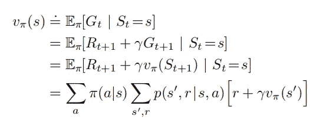

利用动态规划，将基于贝尔曼方程迭代地逼近状态-值函数，直到值函数收敛于每个状态。价值函数的收敛近似可以称为给定策略的价值函数 ***Vπ*** 。

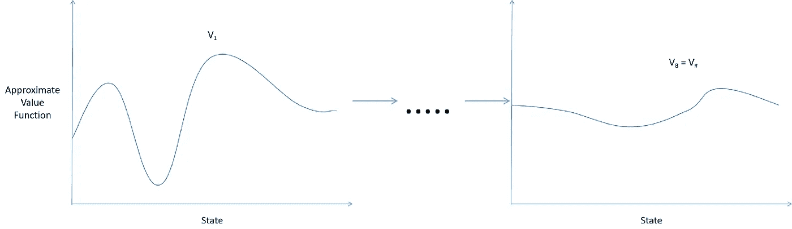

迭代策略评估

在我们找到给定策略的价值函数 ***Vπ*** 之后，我们需要改进策略。回想一下，我们可以定义一个最优策略，当且仅当在任何给定的状态下，一个策略的价值函数等于或大于其他策略。随着策略的改进，在任何给定的状态下都可以产生新的、严格更好的策略。

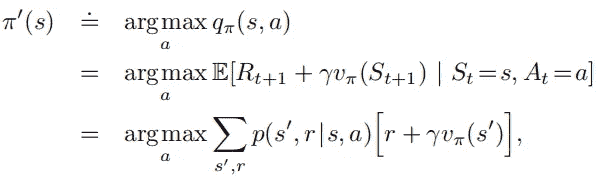

注意，在上面的等式中，我们使用在策略评估步骤中计算的 ***Vπ*** 来改进策略。如果我们应用上面的等式后策略没有改善，这意味着我们找到了最优策略。

总的来说，这两个步骤，策略评估和策略改进是使用动态编程迭代完成的。首先，在任何给定的策略下，计算相应的价值函数。然后，完善政策。利用改进的策略，计算下一个值函数，等等。如果一个策略与之前的迭代相比没有任何改进，这意味着我们已经为我们的问题找到了最优策略。

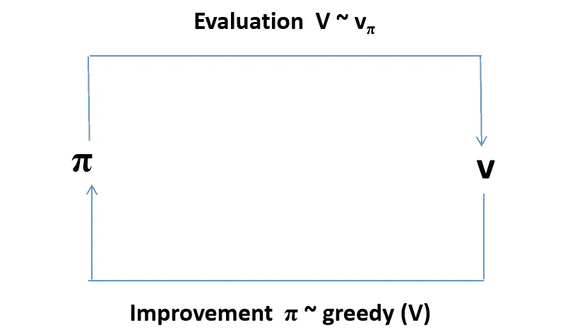

动态规划中的迭代策略评估和策略改进

# 实现动态规划以寻找最优策略

现在我们已经知道了所有关于动态编程和最优策略的理论，让我们用一个简单用例的代码来实现它。

假设我们想控制城市停车空间使用的增长需求。要做到这一点，我们需要做的是根据城市的偏好来控制停车系统的价格。总的来说，市议会有一个观点，即使用的停车位越多，社会福利越高。然而，市议会也倾向于至少留出一个位置供紧急情况下使用。

我们可以将上面的用例定义为马尔可夫决策过程(MDP ),其中:

*   *状态:*车位占用数量。
*   *动作:*停车费。
*   *奖励:*城市对形势的偏爱。

对于这个例子，让我们假设有十个停车位和四个不同的价格范围。这意味着我们有十一个状态(10 加 1，因为可以有没有停车位被占用的情况)和四个动作。

为了找到给定用例的最优策略，我们可以使用带有贝尔曼最优方程的动态规划。首先，我们评估政策，然后我们改进政策。我们反复执行这两个步骤，直到结果收敛。

首先，让我们定义一个函数来计算贝尔曼最优方程，如下所示。

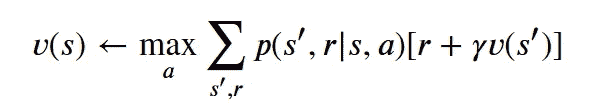

上面的贝尔曼最优性方程评估任何给定状态下的价值函数。

接下来，让我们定义一个函数来改进策略。我们可以通过修改政策来改进政策。这意味着我们转换策略，使得该策略选择在给定状态下最大化价值函数的行为的概率为 1。

最后，我们可以将策略评估和策略改进打包到一个功能中。

现在，如果我们运行上面的函数，我们将得到以下结果:

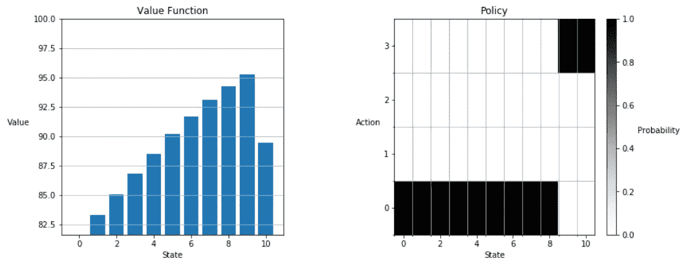

从上面的结果中，我们可以看到价值函数随着被占用的停车位数量的增加而增加，除非所有的停车位都被占用。这是完全可以预料的，正如我们在用例中从市议会的偏好中可以看到的。

市议会的观点是，停车位用得越多，社会福利越高，他们更希望至少有一个停车位闲置。因此，停车位被占用得越多，价值函数与最后状态的距离就越高。

还要注意，当停车占用率高时(状态 9 和 10)，动作从 0(最低价格值)变为 4(最高价格值)以避免完全占用率。

# 参考

本文中的材料受到了理查德·萨顿和安德鲁·巴尔托的《强化学习:入门书》以及阿尔伯塔大学 Coursera 上的《强化学习基础》课程的启发。

请务必阅读这本书或参加课程，深入了解强化学习的细节。

如果你想试试上面例子中的代码，你可以在我的 [GitHub 页面](https://github.com/marcellusruben/Dynamic-Programming-Reinforcement-Learning)找到它。