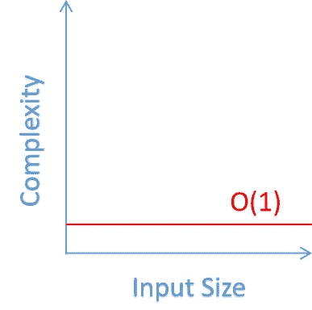
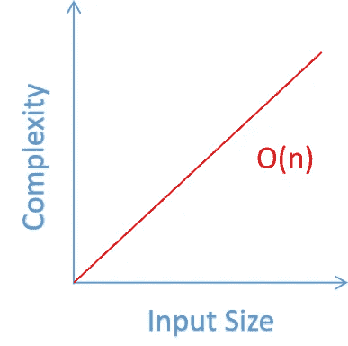
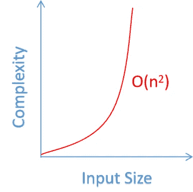
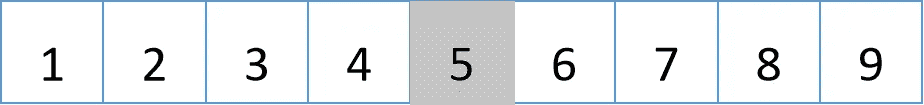
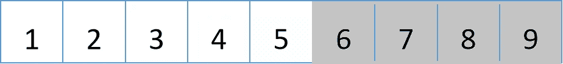
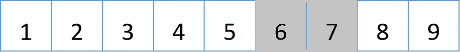
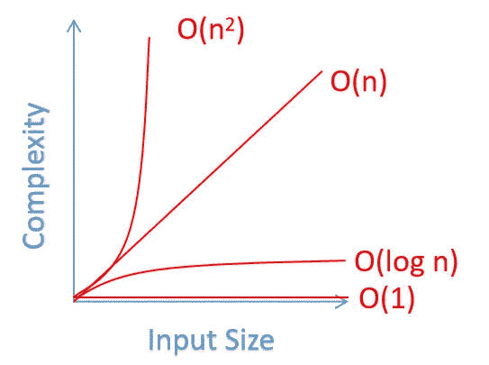
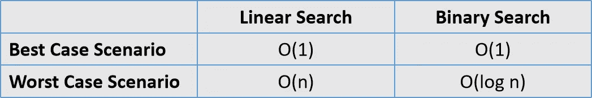

# 大 O 符号的基础

> 原文：<https://towardsdatascience.com/the-fundamentals-of-the-big-o-notation-7fe14210b675?source=collection_archive---------15----------------------->

## 如何利用 Big-O 符号来衡量算法的性能和可伸缩性


纳丁·沙巴纳在 [Unsplash](https://unsplash.com/s/photos/light?utm_source=unsplash&utm_medium=referral&utm_content=creditCopyText) 上拍摄的照片

在这个数据变得越来越大的时代，创建一个“有效”的算法来解决问题已经不够了。无论您的职业是什么，无论是软件开发人员、数据科学家还是机器学习工程师，创建高效且可扩展的算法的能力都是非常需要的技能。

为了创建一个高效的算法，大多数时候我们需要跳出框框思考，想出一个如何优化代码性能的主意。当我们试图优化代码时，有时我们不知道如何衡量我们算法的效率——不管它是否得到了改进。

在这篇文章中，我们将讨论如何利用 Big-O 符号来测量算法性能。

# 衡量算法性能的正确方法

首先，让我们思考一下:我们如何知道我们的算法是好的或高效的？我们如何衡量算法的性能？或许，测量算法性能的最简单方法是测量它计算解决方案所需的持续时间。

但是，测量持续时间并不是评估算法性能的好方法，因为:

*   我们使用的计算机将对算法的运行速度产生巨大影响。如果你使用的是旧的硬件，你会期望代码运行得比使用新的硬件慢。
*   如果您在运行该算法的同时，您的计算机中还打开了其他活动程序，则与您的计算机仅投入其所有资源来运行该算法相比，您的算法求解解决方案所需的时间将会更慢。
*   我们在算法中使用的编译器和库也会影响它的运行时间。

因此，应该有更好的方法来衡量算法的性能。

我们需要更多地关注算法的可伸缩性或运行时复杂性，而不是关注运行算法的持续时间:当输入变大时，算法的性能如何变化？

要测量我们算法的运行时复杂性，请输入 Big-O 符号背后的概念。

# 大 O 符号

Big-O 符号是计算机科学中谈论算法效率时经常听到的术语。但是，大 O 符号是什么意思呢？

> 简而言之，Big-O 符号描述了随着输入数据变大，算法的性能有多好。

使用 Big-O 符号，我们能够测量我们算法的可伸缩性:当输入变大时，我们的算法还会表现得很好吗？

在这篇文章中，我们将讨论四种最常见的大 O 符号: **O(1)** 、 **O(n)** 、 **O(n )** 和 **O(log n)** 。

这些 ***Os*** 代表 的 ***顺序，所以 **O(n)** 表示 n*** 的 ***顺序，其中 ***n*** 是输入数据的大小。让我们一个一个地检查这些符号。***

## O(1) —恒定的运行时复杂性

O(1) 符号意味着你的算法具有恒定的运行时复杂度，因为不管输入数据的大小，它都需要相同数量的运算。

为了更直观，我们来看看下面的代码片段。

上面的代码片段是一个简单的算法示例，符号为 **O(1)** 。该函数接受一个数组，并显示该数组的第一个元素。不管数组中有多少个元素，这个函数总是在一个常量运行时运行，因为它的工作只是显示数组的第一个元素。

让我们看看另一个算法，它有 **O(1)** 的时间复杂度。

在上面的代码片段中，该函数接受一个数组，它的工作是将数组的第三个元素赋给一个名为`third_index`的变量。同样，不管输入数组的大小有多大，该函数将总是在恒定的运行时运行，因为它唯一的工作是将数组的第三个元素值赋给一个变量。

现在，如果我们用输入数据的大小用 **O(1)** 符号来绘制算法的时间复杂度，我们得到下面的图。



如您所见，随着输入数据变得越来越大，算法运行时复杂性保持不变。

## O(n) —线性运行时间复杂度

**O(n)** 符号意味着算法的运行时复杂度与输入数据的大小成线性关系。如果输入数据的大小增加 2，那么算法的运行时复杂度也会增加 2。

让我们看看下面的代码片段，让它更直观。

让一个循环遍历一个数组的元素并打印每个元素的值是一个算法的完美例子，这个算法有 **O(n)** 符号。

在上面的代码片段中，我们算法的开销随着输入数组的大小而变化。如果输入数组只有 2 个元素，我们的算法只需要 2 次运算就可以运行。如果数组有 100 个元素，算法也需要运行 100 次运算。换句话说，我们算法的成本随着输入数组的大小线性增加。

现在，如果我们用输入数据的大小来绘制运行时复杂性，我们会得到下面的图。



如您所见，我们在运行时复杂性和输入数据大小之间有一个线性关系。输入数组中的元素越多，算法运行所需的操作就越多。

## O(n ) —二次运行时间复杂度

**O(n )** 符号意味着算法的运行时复杂度与输入大小的平方成正比。假设你数组的输入大小是 3，那么你算法的运行时复杂度会增加 9。

让我们看看下面的代码片段，作为具有 **O(n )** 复杂度的算法的例子。

嵌套循环是使用 **O(n )** 符号的算法的完美例子。这是因为循环对数组的每个元素迭代了两次。内循环有 **O(n)** 的复杂度，外循环也有 **O(n)** 的复杂度。现在如果把内循环和外循环之间的复杂度结合起来，就得到了 **O(n )** 的复杂度。

假设我们的输入数组的大小是 3。对于外部循环，总共需要 3 次运算来迭代数组的每个元素。对于这 3 个操作中的每一个，也需要 3 个操作来进行内部循环以迭代每个元素。这总共带来了 9 个操作。

如果我们绘制这个图，你会得到下面这个算法的可视化结果，复杂度为 **O(n )** 。



正如我们所看到的，随着输入数据量的增加，我们算法的成本会越来越高。

## O(log n) —对数运行时间复杂度

我们应该知道的下一个运行时复杂度是 **O(log n)** 。这种表示法意味着，当输入数据的大小加倍时，算法的运行时复杂度将增加一倍。

让我们看看下面的代码片段作为例子。

上面的代码片段是二分搜索法的算法，其运行时复杂度为 **O(log n)** 。二分搜索法不会使用 *for* 循环遍历数组的每个元素，而是总是递归地将输入数据的大小分成两半，以找到所需的值。

如上面的代码所示，我们有一个输入大小为 9 的数组。假设数据是完美排序的，我们的目标是找出这个数组中是否存在值 7。二分搜索法首先将输入数组一分为二，并检查数组中间的值。



因为数组中间的值是 5，所以这个值将与我们正在寻找的值进行核对，在本例中是 7。由于 5 小于 7，因此算法将使用数组右侧的值，即 6 到 9。



现在我们数组的输入大小是 4 而不是 10。然后，新数组将再次被一分为二，留给我们的是一个值为 6 和 7 的数组以及一个值为 8 和 9 的数组。

由于值 7 在由 6 和 7 组成的数组中，因此算法将使用数组的这一部分，并忽略值为 8 和 9 的数组。



直到最后我们找到我们想要的值，也就是 7。

如果我们用运行时复杂度 **O(log n)** 画出算法的图，我们得到如下可视化。


如您所见，随着输入大小变得越来越大，具有 **O(log n)** 符号的算法比 **O(n)** 和 **O(n )** 更具可伸缩性。

在我们上面的例子中，如果我们使用 *for* 循环，它有一个线性的 **O(n)** 符号，我们的算法在得出一个解之前将需要 7 次运算(因为我们正在寻找值 7)。与此同时，使用具有 **O(log n)** 符号的二分搜索法算法，只需要 4 次运算就可以解决问题。

## 不同 Big-O 符号之间的复杂度比较

让我们回顾一下目前为止我们学到的不同的 Big-O 符号的可伸缩性。下面是这些 Big-O 符号的情节。



如您所见，随着输入大小变得越来越大，采用 **O(1)** 符号的算法具有最好的可伸缩性，而采用 **O(n )** 符号的算法具有最差的可伸缩性。

综上所述，下面是从最好到最差开始的 Big-O 符号的可伸缩性顺序:

```
 **O(1) < O(log n) < O(n) < O(n^2)** 
```

# 确定代码的 Big-O 符号

现在我们知道了不同种类的 Big-O 符号，让我们试着找出代码的运行时复杂性。当我们试图分析代码的运行时复杂性时，我们总是不得不面对两种不同的场景:最好的场景和最坏的场景。

## 最好的情况和最坏的情况

为了让我们更容易理解最佳情况和最差情况之间的区别，让我们看一下下面的代码片段:

在上面的代码片段中，我们有一个算法用于线性搜索(用*迭代每个数组的元素用于*循环)和一个算法用于二分搜索法(递归分割数组)。假设我们有一个完美排序的数组，有 9 个元素，如上图所示。

*   线性搜索的最佳情况是我们要搜索值 1，这是数组的第一个元素。在这种情况下，我们有 **O(1)** 复杂度。
*   线性搜索的最坏情况是，如果我们想要搜索数组的最后一个元素 9 的值，或者如果我们想要搜索数组中不包含的值。这是因为算法需要遍历数组的每个元素。在这种情况下，我们有 **O(n)** 复杂度。
*   对于二分搜索法来说，最好的情况是我们要搜索值 5，这是数组中间元素的值。在这种情况下，我们有 **O(1)** 复杂度。
*   对于二分搜索法来说，最糟糕的情况是，如果我们想要搜索 1 或 10 的值，它们是数组的第一个和最后一个元素，或者是不包含在数组中的值。这是因为使用二分搜索法时，算法需要递归地将数据分成两半，直到到达第一个和最后一个元素。在这种情况下，我们有 **O(log n)** 的复杂度。



## 估计代码的 Big-O 符号

当涉及到确定代码的 Big-O 符号时，我们需要总是着眼于最坏的情况。现在记住这个概念，让我们试着估计一个代码的 Big-O 符号。

让我们看看下面的代码片段，并检查它的复杂性。

当评估一个代码的 Big-O 符号时，我们总是需要首先从最里面的循环中的操作开始。下面是我们应该如何调查上述代码的 Big-O 复杂性的分步说明:

1.  从最内层循环的操作开始，即`value += array[i] + array[j] + array[k]`。该操作具有恒定的 **O(1)** 复杂度。
2.  接下来，我们看最里面的循环，也就是`for k in range (len(array)/2)`。这个循环将总是迭代我们数组的一半大小，因此它有 **O(n/2)** 的复杂度。
3.  接下来，我们向上移动一级，这就是循环`for j in range (len(array)-10)`。虽然这是一个 *for* 循环，但它有一个恒定的运行时复杂度。这是因为不管输入数组有多大，这个循环总是只迭代最后 10 个元素。因此，它具有恒定的复杂度。
4.  接下来，我们向上移动到外循环，即`for i in range (len(array))`。这个 *for* 循环将总是迭代输入数组的大小。因此，这个循环具有 **O(n)** 复杂度。
5.  最后，我们转到循环外的操作，它们是`value = 0`和`return value`。这两个操作将总是在一个恒定的运行时间中运行，因此它们都具有 **O(1)** 的复杂度。

既然我们已经分析了每个循环和操作的 Big-O 符号，接下来让我们分析整个代码的 Big-O 符号。要做到这一点，我们也总是需要从最内部的循环开始。

1.  最内部的循环具有 **O(n/2)** 复杂度，并且该循环中的操作具有 **O(1)** 复杂度。这意味着这个最里面的循环有`(n/2)*(1) = **O(n/2)**`的复杂度。
2.  接下来，第二个内部循环具有 **O(10)** 复杂度。这个循环的内循环，正如我们在 1 号点计算的，有 **O(n/2)** 。这意味着第二个内部循环具有`10*(n/2) = **O(5n)**`复杂性。
3.  最后，外环具有 **O(n)** 复杂度。正如我们在第二点中所计算的，这个外循环的内循环总共有 **O(5n)** 复杂度。因此，它们总共有`n*5n = **O(5n^2)**`复杂度。
4.  如果我们把循环的复杂性和循环外的两个操作结合起来，我们得到`1+1+5n^2 = **O(2+5n^2)**`。可以看到，上面的代码总共有 **O(2+5n )** 的复杂度。

当我们估算一个代码的 Big-O 符号时，我们可以通过去掉所有的常数来简化它。因此，代替 **O(2+5n )** ，我们可以去掉所有的常数，剩下 **O(n )** 。因此，上面的代码具有 **O(n )** 的复杂性。

暂时就这样吧！

希望现在你知道如何通过查看算法的 Big-O 符号来测量和评估算法的性能。随着输入数据每天变得越来越大，设计可伸缩的算法对于优化代码非常有益。