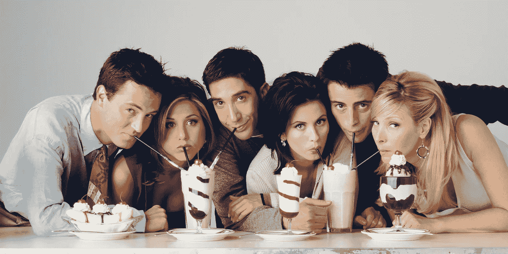
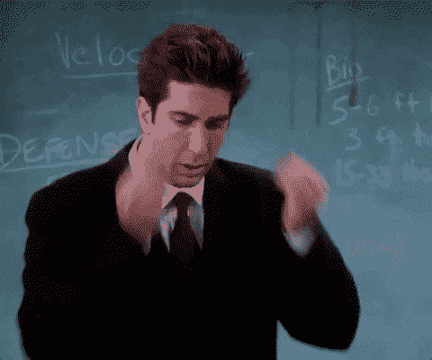
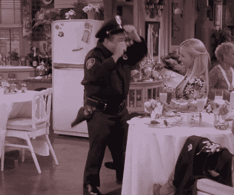
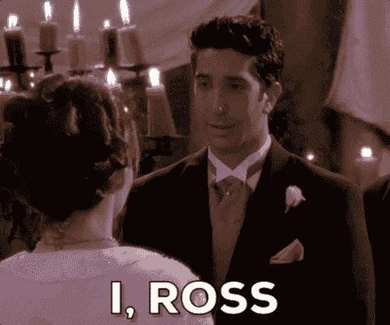
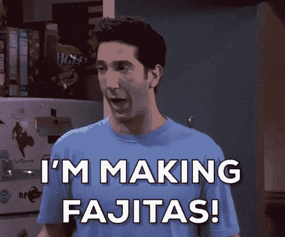
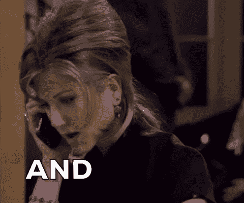
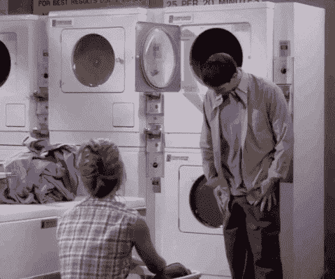

# 《老友记》中最搞笑的朋友[已解决]

> 原文：<https://towardsdatascience.com/the-funniest-friend-in-friends-solved-f1e3862400c5?source=collection_archive---------40----------------------->

## 用 AI 确定最搞笑的朋友，一劳永逸。

是的，这些朋友。([来源](https://wall.alphacoders.com/tags.php?tid=38393&lang=Portuguese))

我们生活在不确定的时代。

我们不知道什么时候回学校或办公室。我们不知道什么时候能坐在餐厅里。我们甚至不知道什么时候我们还能在科恩的演唱会上尽情狂欢。但在过去的几周里，我发现有一种不确定性比其他所有的都更难以忍受:

我们不知道 90 年代热播的情景喜剧《老友记》中最搞笑的朋友是谁。

一旦你意识到你的生活中你的知识基础有如此大的漏洞，你就再也回不去了。

这就是为什么我决定把驾驭人工智能的尖端力量作为我的使命，并找出菲比古怪的非推理是否比罗斯的恐龙笑话更有趣。

**警告:准备好大吃一惊吧！**

[来源](https://giphy.com/)

如果你想知道人工智能如何可能找出谁说了一些有趣的话，[这里是我对该项目的技术方面的解释。](https://medium.com/swlh/using-ml-to-find-the-funniest-friend-in-friends-49d34b5fb36)

如果你希望保持清醒，这里有一个快速演示视频，展示了它的样子:

对于这种方法，我在文章的最后解释了两个注意事项。

在我们吃主菜之前，先来几道开胃菜:

# 持续时间最长的笑声

这个奖属于乔伊。在《乔伊说法语的那个》(第十季第十三集)中，乔伊和菲比一起演练他的假简历技巧时，让观众笑了整整 30 秒。他在简历中写道，他可以在 10 秒钟内喝完一加仑牛奶。菲比叫他出来。他立即走向冰箱，拿起一加仑牛奶，连续 30 秒钟“咕嘟咕嘟”(即溢出他的衬衫前襟)。乔伊巅峰时刻。

[来源](https://giphy.com/)

# 最搞笑的一集

最搞笑剧集奖颁给了《脱衣舞娘哭泣的那集》(第十季第十一集)。当我发现这一点时，我立即重新观看了这一集，它绝对不辜负炒作。这一集充满了高中和大学的倒叙，主演是“胖莫妮卡”，瑞秋的“真实”鼻子，以及到处都是可笑的发型。更别说我们发现罗斯在大学里吻了莫妮卡！与此同时，乔伊上了一个游戏节目，做了一场只有乔伊才能做的表演。但是让这一集火上浇油的是丹尼·德维托在菲比的单身派对上令人发指的客串脱衣舞女。

[来源](https://giphy.com/)

# 最严重的一集

相比之下，笑声最少的那集竟然是“有邀请的那一集”(S4E21)。这是一个更沉重的插曲，从罗斯和瑞秋的整个关系的高潮和低谷中闪现出来。罗斯即将在英国与艾米丽结婚，瑞秋不得不考虑是否要参加婚礼(我们都记得结果)。

[来源](https://giphy.com/)

# 最有趣的季节

就最有趣的一季而言，结果相当有趣(有些人甚至会说有罪)。正如你在下面的图表中看到的，随着剧集的进展，每一季的笑声都在增加。第九和第十季真的比第一和第二季有趣吗？我会让你自己决定。但这可能表明随着节目的进行，制片人在笑声剪辑方面变得更加自由。让我们看着半满的玻璃杯，说随着节目的进行，写作和化学反应变得越来越好！

现在，你们一直在等待的是:

# 《老友记》中最搞笑的朋友

很自然的事情就是看看哪一个角色在 10 季中最引人发笑，然后宣布他们是最有趣的。但我认为这不公平。有些角色(嗯，瑞秋和罗斯)说的台词比其他角色(可怜的菲比)多得多。

为了公平竞争，我们将看看每个角色每行产生的平均笑声。

我们开始吧:

# 第六名:莫妮卡

有人对此感到惊讶吗？莫妮卡倾向于做一个“负责任”的人，让事情走上正轨。她通常忙着纠正那些更倒霉的朋友的小毛病，并防止她漂亮的瓷器摔碎。值得称赞的是，每个人都意识到了这一点，罗斯和瑞秋甚至承认，只有莫妮卡出现在照片中，他们才会让钱德和莫妮卡抚养他们的孩子(第六季第十三集)。每个朋友圈都需要一个莫妮卡。

[来源](https://giphy.com/)

# 第五名:瑞秋

这个让我大吃一惊。在剧集的早期，瑞秋似乎隐藏了太多的笑点。她作为一个离家出走的“爸爸的女儿”被介绍给我们，看着她处理像煮咖啡和得到“那些工作中的一件事”这样的现实是非常有趣的。但我想随着罗斯的事情变得越来越严重，她也变得越来越严重。

[来源](https://giphy.com/)

# 第四名:罗斯

原来台词最多的两个角色(罗斯和瑞秋)没那么搞笑！当然，罗斯大多数时候确实倾向于从字面上理解事物，毕竟他是一名古生物学教授。他肯定有傻傻的一面，也喜欢他那些无聊的笑话，但是在这部剧的过程中，他和瑞秋参与了很多严肃的故事情节。所以他们不总是开玩笑是有道理的。

[来源](https://giphy.com/)

# 第三名:菲比

菲比差一点点获得第二名！实际上菲比和罗斯之间有很大的差距，所以我正式宣布菲比是一个非常有趣的角色。不幸的是，她没有像其他角色那样有很多台词，但她确实经常住在离剧组很远的地方。也就是说，她的另类疗法和“街头聪明”的教养是喜剧性缓解的持续来源。

[来源](https://giphy.com/)

# 第二名:钱德勒

钱德勒给我的印象是有时有点愤世嫉俗，所以我不知道他会在哪里跌倒。但是回过头来看，钱德勒似乎总是在等待在谈话中发现喜剧。虽然他的幽默经常是自嘲的，有时也是悲观的，但他似乎有能力将轻松带到节目中最严肃的时刻。也许这就是他和莫妮卡如此般配的原因！

[来源](https://giphy.com/)

# 第一名:乔伊

好的，举手表决——谁从一开始就猜到了？乔伊是最有趣的角色，最棒的一点是，他大多数时候甚至都不想变得有趣。他的很多幽默其实并不是有意的。是的，我们都知道也许乔伊比其他人“慢”一点。但是他天真无邪，这使得他的评论既好笑又真诚。事实上很难记住不好笑的乔伊台词。

[来源](https://giphy.com/)

无论你如何分割数据，这些排名基本上是成立的。

值得注意的一点是，在整场演出中，罗斯比菲比更能引起笑声。但他在整部剧中的台词也多得多，所以说他比菲比更有趣似乎不太对。从每一行来看，菲比更有趣。

同样有趣的是，钱德勒比乔伊有更多被笑声跟随的台词。只是当乔伊说一些有趣的事情时，观众笑的时间比钱德勒的台词还长(平均长 6%！).

所以你有它。继续从你的清单上再检查一个不确定性。进步！现在对于科恩的演唱会…

[来源](https://giphy.com/)

# 奖金图表

看看随着时间的推移谁变得更有趣。乔伊在第五季之前都不是最搞笑的角色！自从她在第一季中非常严肃的表演后，莫妮卡一直非常兴奋！

# 附录

## 警告#1

幽默是相对的。我觉得好笑的事你可能不觉得好笑，反之亦然。幽默也很难衡量。幸运的是，《老友记》的大部分场景都是在 300 名现场观众面前拍摄的。很自然，当很多人笑的时候，我会认为有些事情很有趣。当然，笑声是可以编辑的。但是为了这篇文章，我们要假设当观众笑的时候有些事情是有趣的。

## 警告#2

我在这个分析中只捕捉到了口语台词。这意味着角色们并不总是因为他们的非语言幽默而得到好评。幸运的是，节目中只有不到 3%的笑声是纯非语言的。

[来源](https://giphy.com/)

*原发表于*[*https://jacksanford . me*](https://jacksanford.me/posts/funniest-friend/)*。*