# 深度学习和组合学的融合

> 原文：<https://towardsdatascience.com/the-fusion-of-deep-learning-and-combinatorics-4d0112a74fa7?source=collection_archive---------7----------------------->

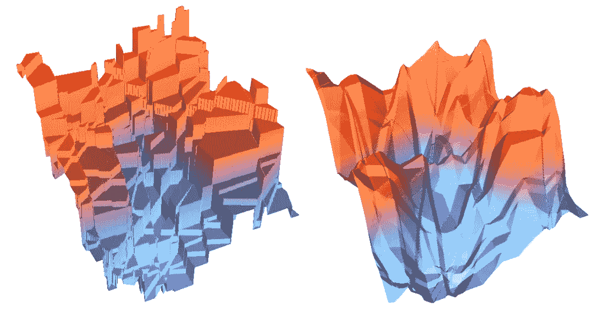

## 我们如何在深度神经网络中无缝整合组合求解器。我们的 ICLR 2020 聚焦论文摘要。

机器学习研究的当前景观表明，基于深度学习的现代方法与良好的老式人工智能方法不一致。深度学习在计算机视觉、强化学习、最优控制、自然语言处理等领域被证明是一种非常强大的特征提取工具。不幸的是，深度学习有一个致命弱点，即它无法处理需要组合概括的问题。一个例子是基于作为图像的地图输入，学习在谷歌地图中预测最快的路线，这是最短路径问题的一个实例。这类问题太多了，比如(最小，最大)割、最小成本完美匹配、旅行推销员、图匹配等等。

但是，如果要孤立地解决这样的组合问题，我们有一个惊人的求解器工具箱可用，从算法的高效 C 实现到更通用的 MIP(混合整数编程)求解器，如 [Gurobi](https://www.gurobi.com/downloads/?campaignid=2027425870&adgroupid=77414946211&creative=406173554813&keyword=gurobi&matchtype=e&gclid=Cj0KCQiA04XxBRD5ARIsAGFygj8EcNGX-mt9kaGVsjWRYqHFD8tL1zI8-hv-sagIW87g0DsboLTiELIaAjpUEALw_wcB) 。求解器面临的问题是输入空间的表示，因为求解器需要明确定义的结构化输入。

尽管组合问题一直是机器学习研究社区中的一个主题，但是对解决这种问题的关注一直是缺乏的。这并不意味着组合归纳的问题没有被认为是通往智能系统道路上的一个关键挑战。理想情况下，人们将能够以端到端的方式将通过强大的函数逼近器(如神经网络)可用的丰富特征提取与高效的组合求解器相结合，而不会有任何妥协。这正是我们在[最近的论文](http://bit.ly/35IowfE) [1]中能够实现的，我们已经获得了最高的评论分数，并将在 2020 年 ICLR 大会上做重点演讲。

对于以下部分，值得记住的是，我们并不试图改进解算器本身，而是使现有解算器能够与函数逼近协同使用。

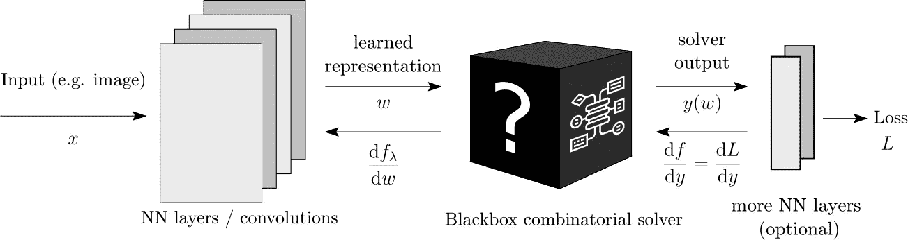

我们将黑盒解算器想象为深度学习的架构模块，我们可以简单地插入其中。

## 黑盒解算器的梯度

我们思考组合解算器的方式是从连续输入(例如图边的权重)到离散输出(例如最短路径、选定的图边)的映射，定义如下

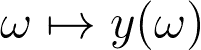

求解器最小化某种成本函数 **c** (ω，y)，例如路径的长度。更具体地，解算器解决以下优化问题:

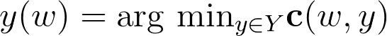

现在，假设ω是神经网络的输出，即我们学习的某种表示。直观来看，这个ω是什么意思？ω用于定义组合问题的实例。例如，ω可以是定义图的边权重的某个向量。在这种情况下，求解程序可以解决最短路径问题或旅行推销员问题，或者我们希望针对指定的边成本解决的任何问题。我们希望通过ω获得正确的问题规范。

自然地，我们想要优化我们的表示，使得它最小化损耗，损耗是求解器 L(y)的输出的函数。我们现在面临的问题是，损失函数是分段常数，这意味着这个函数相对于ω表示的梯度几乎处处都是 0，并且在损失函数的跳跃上是未定义的。更直白地说，梯度对于最小化损失函数是无用的。

到目前为止，已经有依赖于求解器松弛的方法，其中必须对其最优性做出牺牲。相比之下，我们已经开发了一种不影响求解器最优性的方法。我们通过定义原始目标函数的分段仿射插值来实现这一点，其中插值本身由超参数λ控制，如下图所示:

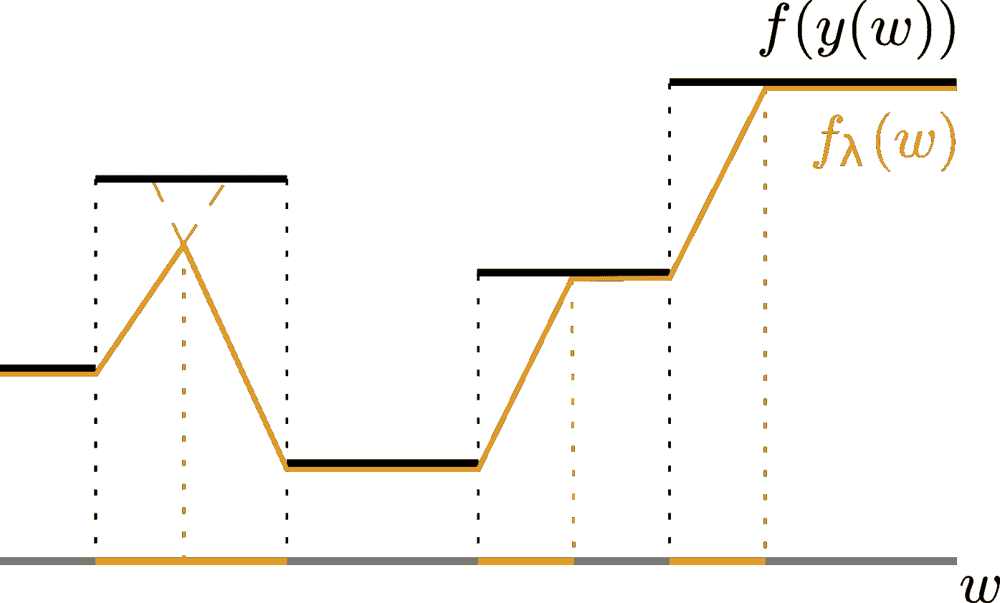

我们可以看到， **f** (黑色)是分段常数。我们的插值(橙色)以合理的方式连接了平台。例如，注意最小值没有改变。

**f** 的定义域当然是多维的。这样，我们可以观察到输入集 **ω** ，其中 **f** 获得与多面体相同的值。自然，在 **f** 的定义域中有很多这样的多面体。超参数 **λ** 有效地做的是通过解算器输入的扰动来移动多面体， **ω** 。定义分段仿射目标的 **g** 插值器将多面体的移动边界连接到原始边界。下图描述了这种情况，其中获得值 **f(y2)** 的多面体的边界被移动以获得值 **f(y1)** 。这也直观地解释了为什么更高的值 **λ** 是优选的。位移必须足够大，以获得插值器 **g** ，它将为我们提供信息梯度。证明可以在[1]中找到。

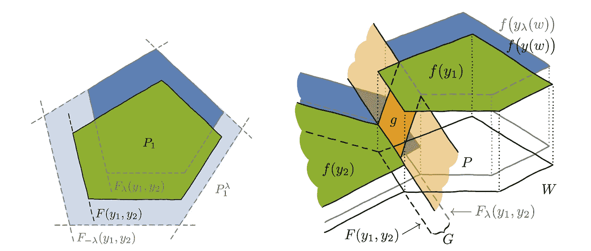

首先，让我们定义扰动优化问题的解决方案，其中扰动由超参数 **λ** 控制:

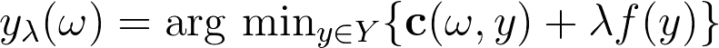

如果我们假设成本函数 **c** (ω，y)是 y 和ω之间的点积，我们可以如下定义插值目标:

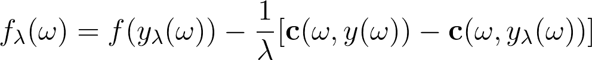

注意，成本函数的线性并不像乍看上去那样严格。所有涉及边选择的问题，其代价是边权重的和，都属于这一类。最短路径问题(SPP)和旅行推销员问题(TSP)就是属于这类问题的例子。

(2)在这个动画中，我们可以看到插值如何随着λ的增加而演变。

## 该算法

通过我们的方法，我们能够通过简单修改反向传递来计算梯度，从而消除经典组合求解器和深度学习之间的裂痕。

向前传递时，我们只需为嵌入式解算器提供ω，并将解向前传播。此外，我们保存正向传递中计算的ω和解 y_ 值。

对于反向传递，我们只需用λ缩放的反向传播梯度扰动ω，并取前一个解和扰动的问题解之间的差。

计算插值梯度的计算开销取决于求解器，额外的开销是在前向过程中调用求解器一次，在后向过程中调用一次。

## 实验

我们开发了包含一定程度的组合复杂性的合成任务来验证该方法。在接下来的任务中，我们已经证明了我们的方法对于组合推广是必不可少的，因为朴素的监督学习方法无法推广到看不见的
数据。同样，目标是学习组合问题的正确规范。

对于**魔兽最短路径**问题，训练集由魔兽争霸 II 地图和地图上对应的最短路径作为目标组成。测试集由看不见的魔兽争霸 2 地图组成。地图本身编码一个**k**T5×k 网格。这些地图是卷积神经网络的输入，卷积神经网络输出地图的顶点成本，这些成本将反馈给求解器。最后，求解器(实际上是 Dijkstra 的最短路径算法)以指示器矩阵的形式在地图上输出最短路径。

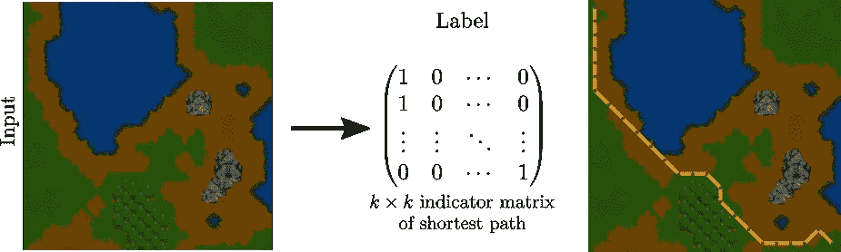

自然地，在训练开始时，网络不知道如何将正确的成本分配给地图的分块，但是使用我们的方法，我们能够学习正确的分块成本，从而学习正确的最短路径。直方图显示了我们的方法如何能够比 ResNet 的传统监督训练更好地概括**。**

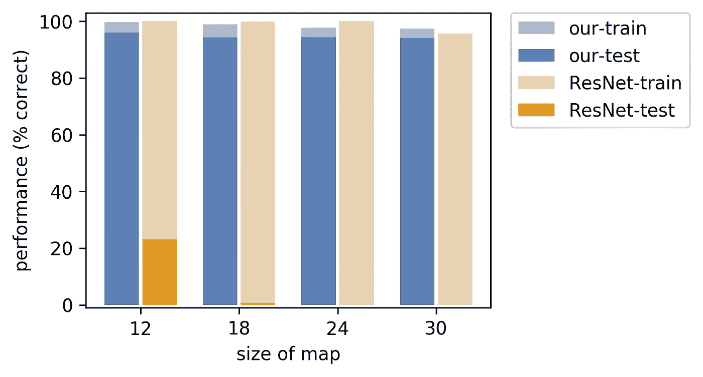

在 **MNIST 最小成本完美匹配**问题中，目标是输出 MNIST 数字网格的最小成本完美匹配。具体地说，在最小成本完美匹配问题中，我们应该选择这样的边，使得所有顶点都恰好包含在选择中一次，并且边成本的总和最小。网格中的每个单元包含一个 MNIST 数字，该数字是图中具有垂直和水平邻居的节点。通过垂直向下或水平向右读取两位数来确定边缘成本。

对于这个问题，卷积神经网络(CNN)接收 MNIST 网格的图像作为输入，并输出转换为边成本的顶点成本网格。然后将边缘公式交给 Blossom V 完美匹配解算器。

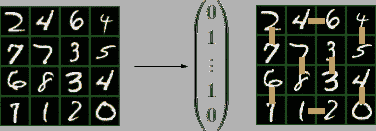

解算器输出在匹配中选择的边的指示向量。右边匹配的代价是 348(横向 46 + 12，纵向 27 + 45 + 40 + 67 + 78 + 33)。

同样，在性能图中，我们注意到在神经网络中嵌入实际完美匹配求解器的明显优势。

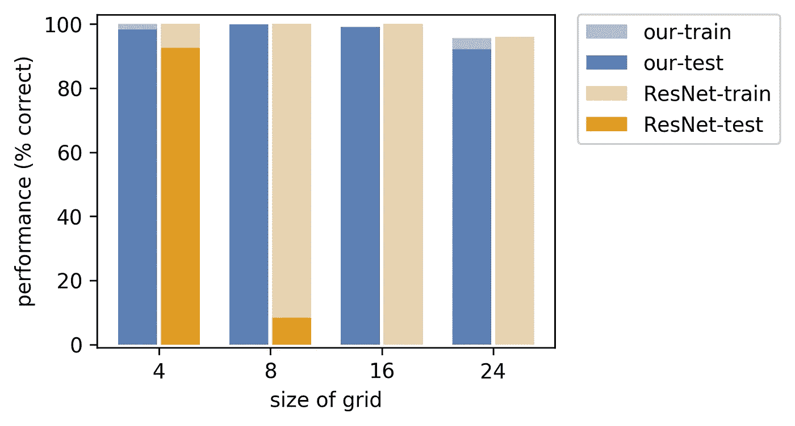

我们还研究了**旅行推销员问题**的公式，其中网络应该输出国家首都的最优旅行推销员旅行。对于这个问题，重要的是在潜在表征中学习正确的资本位置。我们的数据集由各国国旗(即原始表示)和各自首都的最佳旅游组成。一个训练例子由 **k** 个国家组成。在这种情况下，卷积神经网络显示为国家标志的串联，并应输出最佳路线。

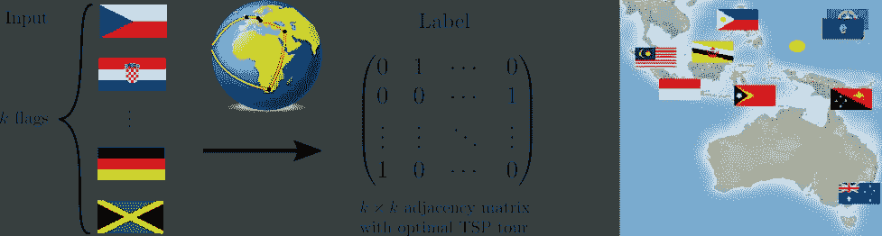

(5)

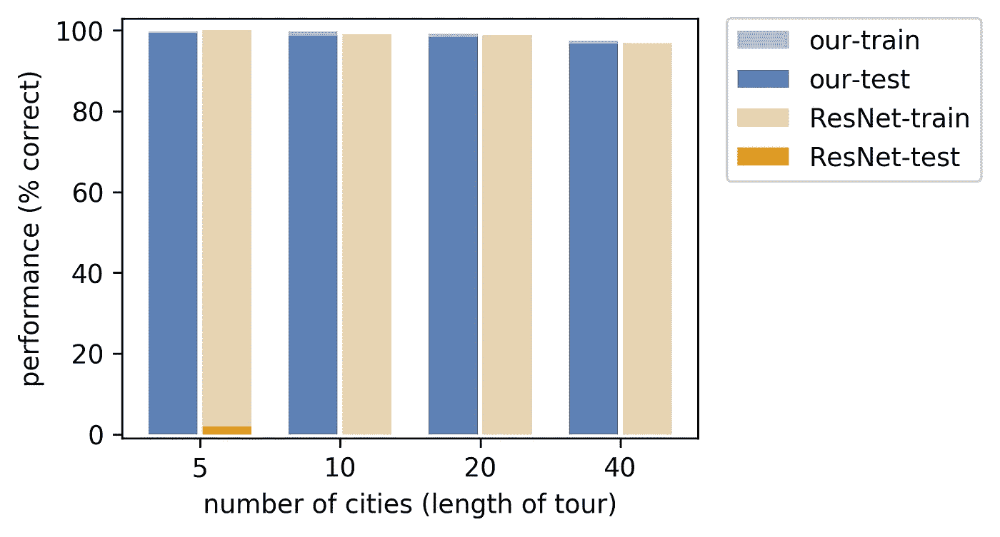

在下面的动画中，我们可以看到在训练期间学习到的各国首都在地球上的位置。在开始时，位置是随机分散的，但是在训练之后，神经网络不仅学习输出正确的 TSP 参观，而且学习输出正确的表示，即各个首都的正确的 3D 坐标。值得注意的是，这是仅使用汉明距离损耗进行监督和在 Gurobi 中对网络输出使用混合整数程序的结果。

## 结论

我们已经表明，事实上，在对解算器的成本函数的某些假设下，我们可以通过黑盒组合解算器传播梯度。这使我们能够实现标准神经网络结构基于传统监督所不能实现的组合概括。

我们正在展示这种方法在处理需要组合推理的现实世界问题中有广泛的应用。我们已经演示了一个这样的应用程序来处理基于等级的度量优化[2]。然而，问题是我们离求解器成本的线性假设还有多远(理论上和实际上)。未来工作的另一个问题是，作为一个例子，我们是否可以了解 MIP 公式中组合问题的潜在约束。这种方法的应用范围很广，我们欢迎任何愿意合作的人来充分发挥这项工作的潜力。

## 相关推文

## 参考

[1] Vlastelica，Paulus 等.[黑盒组合求解器的微分](http://bit.ly/35IowfE)*arXiv 预印本 arXiv:1912.02175* (2019)。([http://bit.ly/35IowfE](http://bit.ly/35IowfE))

[2]Rolínek 等人，“使用黑盒区分优化基于等级的度量。” *arXiv 预印本 arXiv:1912.03500* (2019)。([http://bit.ly/35EXIMN](http://bit.ly/35EXIMN))

**确认**

这是来自马普智能系统研究所[自主学习小组](https://al.is.tuebingen.mpg.de/)和意大利费伦泽大学的联合工作。