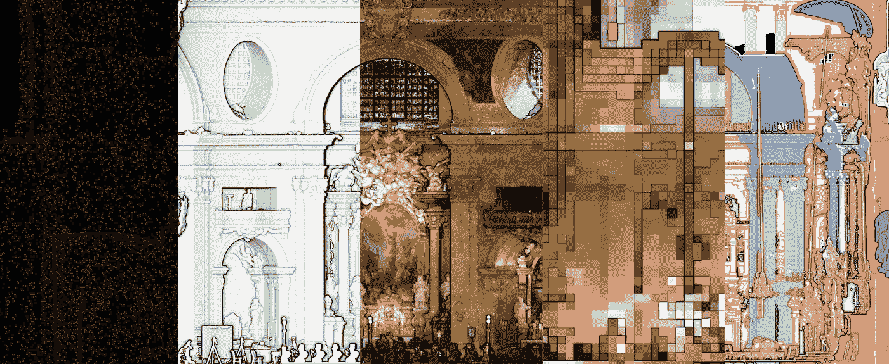
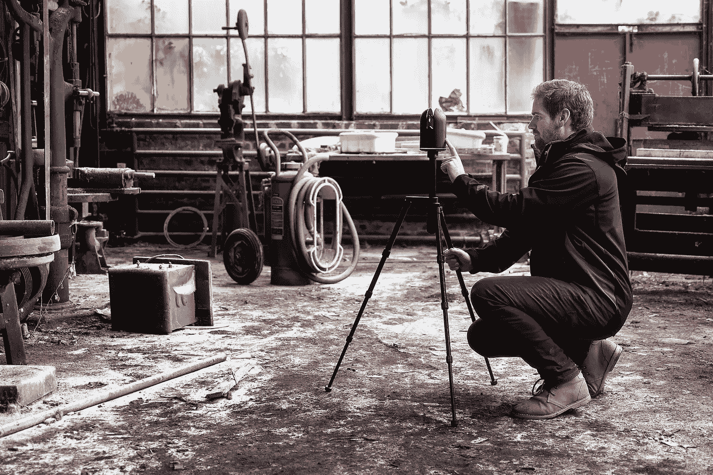
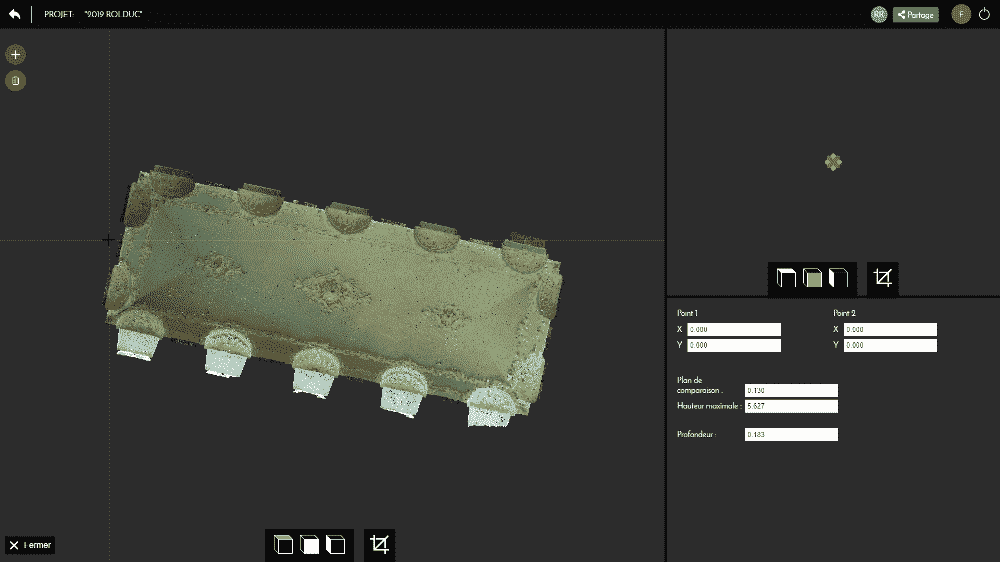
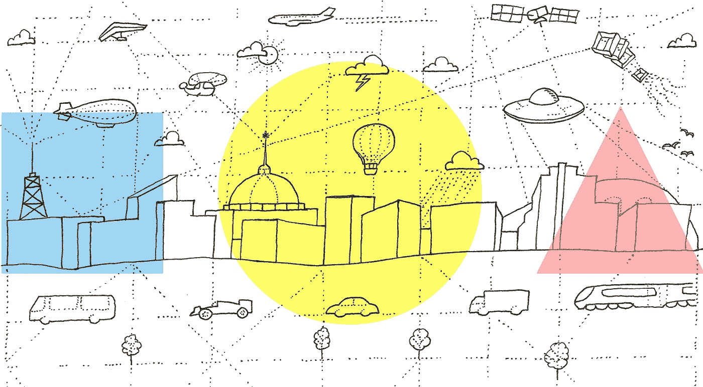
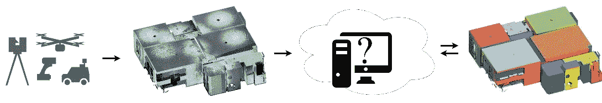
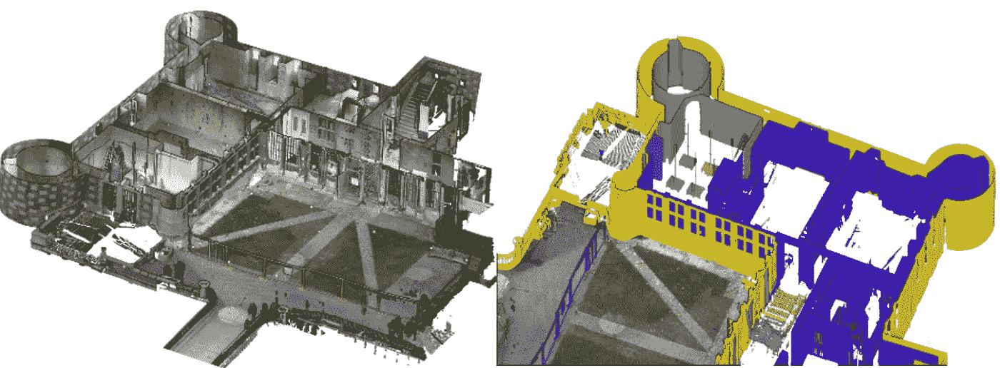
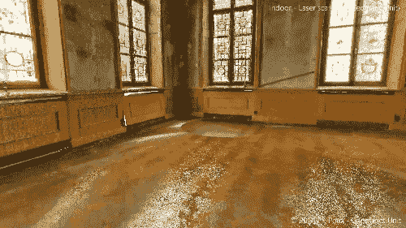
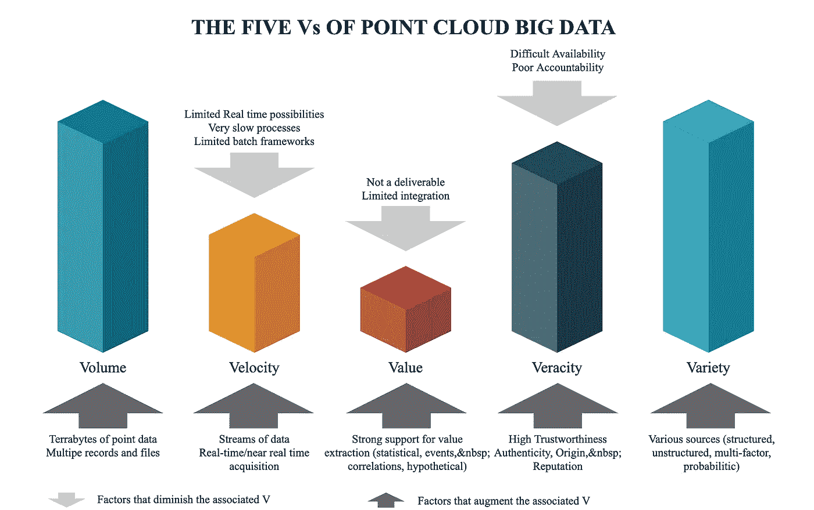
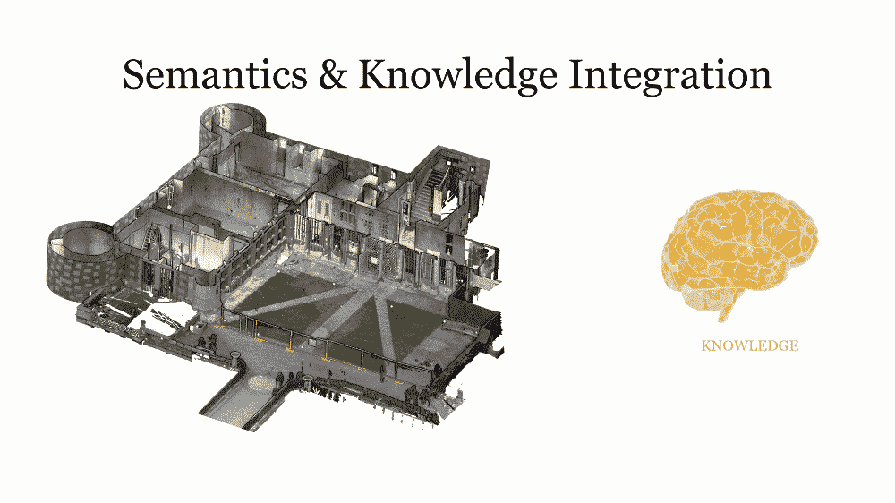
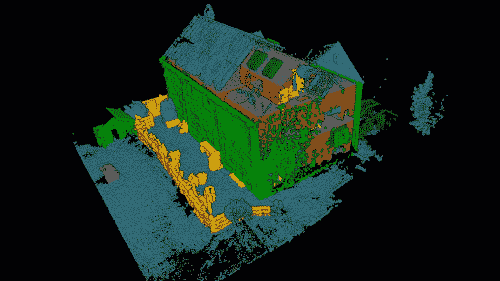

# 三维点云的未来:一个新的视角

> 原文：<https://towardsdatascience.com/the-future-of-3d-point-clouds-a-new-perspective-125b35b558b9?source=collection_archive---------10----------------------->

## 被称为点云的离散空间数据集通常为决策应用奠定基础。但它们能成为下一个大事件吗？

点云的不同渲染。从左到右，原始点云、着色、着色、体素化、语义化

我是一个大点云爱好者。10 年前，我第一次发现了它们的存在，从那以后，我一直在通过现实捕捉的演变来调整我的实践，以总是获得更清晰的数据集。但我仍然记得我第一次用陆地激光扫描仪进行勘测，并很快获得了这些令人惊叹(现在仍然令人惊叹)的 3D 点云。

在 3D 扫描过程中，一个废弃的洗毛设备。照片[罗布罗克](https://romanrobroek.nl/creating-3d-interactive-objects-from-photographs/)

但是…梦想面对现实。如何有效地考虑这些实体？当时，处理过程——理解为手动超负荷的重复数字化——由几个大量手动步骤组成，如过滤、配准、清理、分割、分类、网格化、数字化……它针对某些部分(主要是配准、过滤和网格化)进行了改进，但我当时遇到的主要瓶颈仍未解决:我们为什么要费心改变每个应用程序的数据性质(如点云到矢量)?

在 [Flyvast](https://flyvast.com/) 在线点云软件中创建 dwg 文件的手动数字化过程。

没有更高效的工作流程吗？

 [## 点云处理在线课程- 3D 地理数据学院

### 编队学习先进的点云处理和三维自动化。开发新的 python 地理数据技能和开源…

learngeodata.eu](https://learngeodata.eu/point-cloud-processor-formation/) 

让我带你踏上研究之旅，将想法具体化为解决方案。

# 基因

早在 2015 年，在做了两年 3D 激光扫描工程师后，我决定投身于教学和研究，试图解决这个问题。我跳进学术界，开始调查发展的现状，寻找最终需要一些砂浆的砖块。嗯，在那个时候，我很快意识到，没有工作的尝试解决问题的根源。我的努力需要更多的时间。

# 观察

> *“当我们睁开眼睛看到一个熟悉的场景时，我们会立即对可识别的物体形成印象，这些物体被连贯地组织在一个空间框架中”*。

1980 年，特雷斯曼用简单的术语定义了人类视觉背后的复杂机制。对于没有受损的人来说，它通常是我们的认知决策系统可以用来采取行动的主要信息来源。这是可以扩展的，我们的大脑可以快速适应新的环境，并且只使用通过我们的眼睛捕捉到的最重要的材料。事实上，大脑每秒钟只接收到三个“图像”，这些图像被分类并与先前的知识相结合，以创建我们所体验的现实。

这个图像有意义吗？我相信你会发现这些的意义。

这种机制非常快速和有效，允许我们在看到红灯时刹车，或者只是阅读这篇文章并理解单词的空间组织。更令人印象深刻的是，我们的视觉可以适应“定向注意力”——大脑没有对周围环境形成完全理解的节能模式——或“发现注意力”——当大脑从我们的记忆中收集数据以获得对场景的完全理解时，这种模式运行较慢。

凭借当今的计算能力和高度的非物质化，虚拟复制这样一个过程不仅非常有吸引力，而且似乎是可行的。虽然这种操作真的很难模仿，但研究我们如何与环境互动可以更好地掌握边界和可用的机制。

# 比较

它首先转化为可以捕捉计算机可用的关键输入的传感器的使用。

这幅图像中的每个向量都由传感器(人工或自然的)引导，这些传感器为它们的使用收集关键的洞察力。

然后，我们的目标是一个基于收集的数据和可访问的信息库的程序，以产生一个“语义表示”:一个场景的描述，整合概念及其意义。在这种情况下，空间传感器扮演我们眼睛的角色，以获得数字空间资产，并使用可用的知识进一步细化为语义表示。

传感器扮演着我们眼睛的角色，空间框架变成了语义表达，场景被加上了熟悉的标签

这种可用性通常是第一个复杂因素。我们的在线认知使用我们的记忆，并在很短的时间内获取所需的证据。使用计算机模拟这一阶段极其复杂，尽可能找到通用的解决方案是一项重大挑战。

尝试虚拟化认知决策系统的第二个瓶颈是语义表示的创建，如下图所示。收集领域知识并将其附加到基础空间数据上，与数据类型、源或表示的巨大集成和挖掘复杂性相关联。

三维点云表示与三维语义表示

# 数据

## 三维点云

主要挑战围绕传感器收集的数据的特异性。当深度线索不是必要的时候，单个光栅图像或视频流是很好的，但是模拟我们的 3D 视觉认知需要更丰富的数据基础。现实捕捉设备允许获得主要作为点云的这种详尽的 3D 空间信息:{X，Y，Z} (+属性)空间集合，其数字地表示相对于传感器强度和限制的记录环境。这些仪器和采集方法已经足够成熟，可以实现从实物到国家范围的真实世界的数字复制，如下图所示。

捕捉和组合不同数据集的实时多尺度点云

## 点云大数据

获取这些所谓的点云变得更容易、更快，甚至可以从非常低成本的解决方案中获得。不幸的是，所有这些硬件的发展都没有跟随着软件的发展，软件受到了大数据问题的严重影响，如下图所示。

点云背景下大数据的五个 v。

连接众多传感器/方法创建异构点云数据集(多样性)并参与大规模数据存储库(容量)的构建。反过来，它降低了处理效率(速度)，并产生了将大量点数据转化为值得信赖的(准确性)和可操作的信息(价值)的新需求。

# 交付物

点云采集和处理工作流程通常依赖于应用程序，遵循从数据收集到可交付成果创建的经典流程。虽然收集步骤可能特定于手边的传感器，但点云作为一种可交付的方式激增，成为许多行业事实上的选择。这种面向任务的场景主要将这些视为空间参考——由专家用来创建其他可交付成果——因此是项目与现实最紧密的联系。它带来了准确的真实世界信息，可以根据数字现实做出决策，而不是解释或最新的信息。

今天，“大脑”是一个坐在桌子后面的专家，将处理点云以提取可交付成果。我们想要的是将这种知识直接集成到数据中，给空间实体赋予语义意义

此外，将点云转换为特定于应用的可交付成果的过程在时间/人工干预方面非常昂贵。对于人类专家来说，充分处理大量复杂的信息变得越来越复杂，这些信息通常在一个项目的不同参与者/支持者之间相互矛盾地传播。因此，对于一个可持续发展的系统来说，关键是将大点云数据转化为更高效的流程，从而开启有助于决策和信息提取的新一代服务。

> 我们需要找到大规模自动化和结构化的方法，以避免特定任务的手动处理和不可持续的协作。

# 合作

作为人类，我们在大规模合作中茁壮成长。我们最大的成就是建立在高效的信息、服务等交流之上的。点云通常非常大，这取决于收集了多少数据—通常是千兆字节，如果不是太字节的话—并且通常注定要作为可重用的支持进行归档，以创建新类型的数据和产品。这可能会导致存储需求指数级增长、输出之间不兼容、信息丢失和复杂协作的死胡同。

这些实践还表明，试图概括一个框架的努力是有限的，这个框架反过来可以作为进一步互操作性和概括的共同基础。这种缺乏是适得其反的，可能会导致参与者之间混乱的数据重新分配，并恶化对多个外包服务的依赖，每个外包服务都独立地针对一个应用程序。这强调了研究可互操作场景的强烈需求，在这些场景中，来自不同领域的许多用户可以使用一个点云，每个用户都有不同的需求。

这反过来将在获取级别引入新的约束，以定义用于推理引擎的 3D 表示的所需穷尽性。当然，这为互连流程和确保与不同源、卷和其他数据驱动参数的兼容性带来了更多挑战。

# 自动化

在这个连续体中，从以人为中心的过程到自主的工作流的反思导向了开发自动化和人工智能以加速推理过程的研究。这对于 3D 捕捉工作流中的点云开发至关重要，在 3D 捕捉工作流中需要识别对象。

机器人研究在提供自主 3D 记录系统方面取得了飞跃，我们在没有人为干预的情况下获得了环境的 3D 点云。当然，遵循这一理念发展自主测量意味着要求数据可用于决策。没有上下文的收集的点云不允许采取有效的决策，并且需要专家的知识来提取必要的信息并为决策创建可行的数据支持。对于完全自主的认知决策系统来说，自动化这一过程是非常诱人的，但也带来了许多挑战，主要涉及知识提取、知识集成和来自点云的知识表示。因此，点云结构化必须被特别设计，以允许计算机使用它作为信息提取的基础，使用推理和基于代理的系统。

我的人工智能自动物体在无人监督的情况下识别的结果。每种颜色代表自动识别不同类别

# 身份证明

这就是我想说的:我们需要虚拟数据集中的智能！这，为了避免脑力劳动和手工流程，也是为了互操作性。有许多应用程序会以不同的方式使用点云，但为每个应用程序提取可交付成果似乎不是最高效的(就存储空间而言也不是生态友好的)。但是，如果专家知识被形式化并集成在点云中，您只能猜测基础架构变得有多集中和高效！

# 结果

所以是的，点云是巨大的；是的，我们需要特定的“技巧”来存储和处理它们，但几十年前的视频也是如此！这在你的具体行业中意味着什么？你很快就能使用 3D 捕捉环境的“大脑表示”进行工作，并根据你的想法进行查询。但是当然，3D 传感器的广阔前景使得识别过程成为一个广阔的研究探索领域！激动人心！

## 拿走 5 分

*   3D 点云接近来自传感器的未精炼石油
*   语义注入应该旨在提供一个大的领域连接
*   底层的数据结构和算法就是为此而定制的
*   互操作性、模块化和效率是协作的关键
*   高效的自动对象检测应该建立在这些目标上

# 更进一步

这些想法基于获奖论文“智能点云”[1]，其中包含了关于这些问题的工作解决方案的更多技术细节。但是，当然，就像长期研究工作中经常出现的情况一样，你会带着更多你在开始时就有的问题离开。

我们正在经历一个多么激动人心的十年。我们正处于一个迷人的时代，机器学习的使用为解决 10 年前被认为是科幻小说的挑战提供了巨大的可能性。

 [## 点云处理在线课程- 3D 地理数据学院

### 编队学习先进的点云处理和三维自动化。开发新的 python 地理数据技能和开源…

learngeodata.eu](https://learngeodata.eu/point-cloud-processor-formation/) 

## 论文参考(开放存取)

1.  女性，2019 年。智能点云:构建三维智能点数据。列日，委员会:比伦、雷蒙迪诺、范·奥斯特罗姆、科尔内、哈洛特、格鲁森迈耶。[https://orbi.uliege.be/handle/2268/235520](https://orbi.uliege.be/handle/2268/235520)

# 关于作者

十多年来，Florent Poux 一直处于现实捕捉自动化的前沿。他拥有一个屡获殊荣的科学博士学位，并通过 ISPRS Jack Dangermond 2019 BP award 被评为杰出的研究人员。他作为 3D 地理数据( [*列日大学*](https://www.uliege.be/cms/c_9054334/en/repertoire?uid=u219618) *)的兼职教授、数据科学&机器学习(*[*open classrooms*](https://openclassrooms.com/fr/membres/florentpoux)*)的导师以及 3D 顾问，为高级研究&知识传播搭建桥梁。*

*在他年轻的学术和科学生涯中，他发表了数十次技术演讲，在多个国际会议的科学&项目委员会任职，并作为主要国际 GIS 和自动化期刊的编辑&评审员提供协助。*

*他的活动旨在通过各种形式的交流和开发，传播知识和解决自动化问题。Florent Poux 依靠他的专业知识和一群技术娴熟的合作者，他们共同拥有一个全球合作的愿景，为建设一个更美好的社会而推动科技进步。*