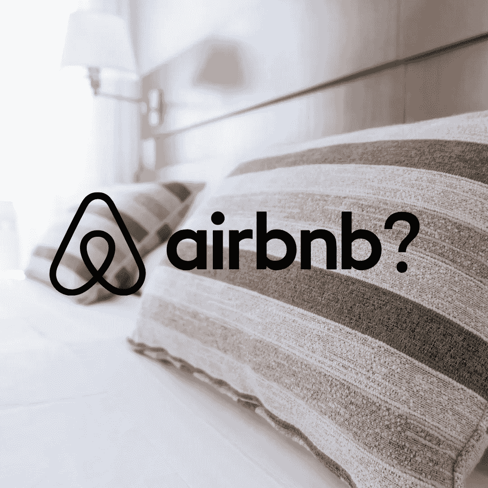
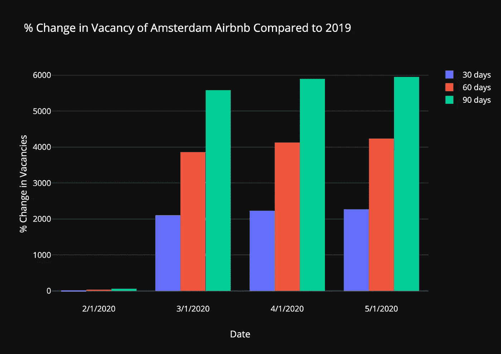
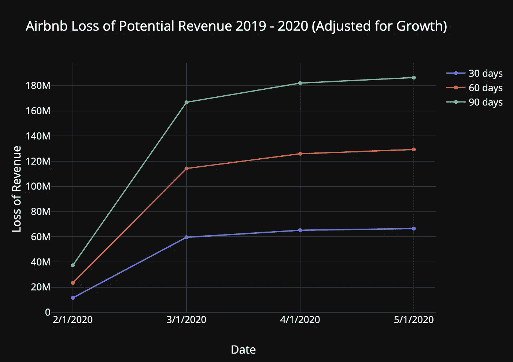
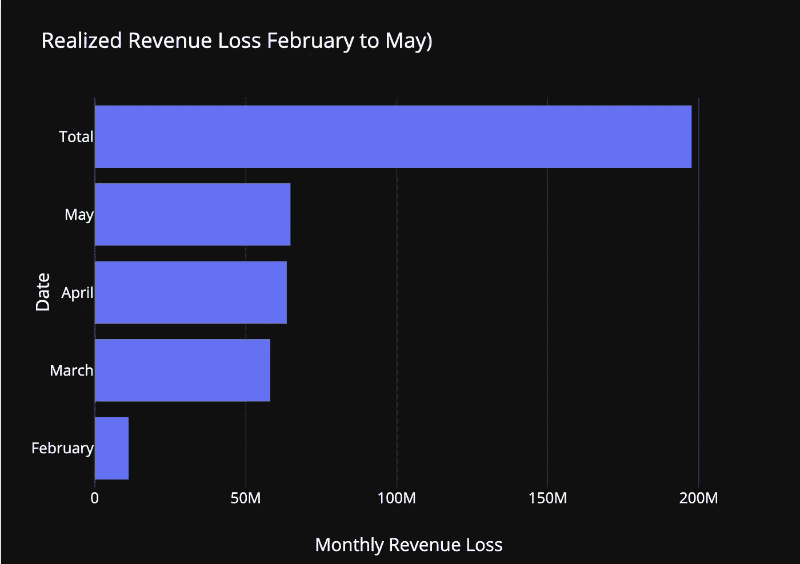
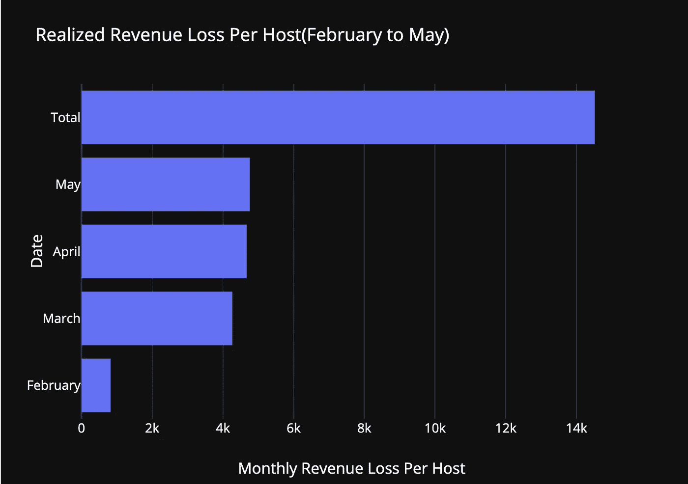
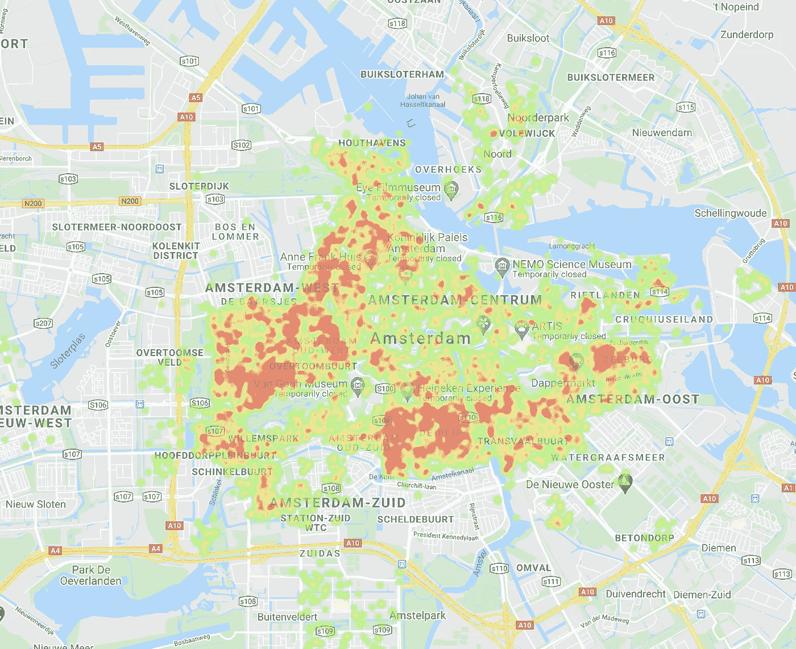

# Airbnb 的财务数据分析

> 原文：<https://towardsdatascience.com/the-future-of-airbnb-what-the-data-can-tell-us-178e2f227753?source=collection_archive---------25----------------------->

## 旅行已经停止，随之而来的还有 Airbnb 的预订。68%的 Airbnb 直到 8 月份都没有预订，平均每个主人已经失去了€14K——我们所知道的 Airbnb 还能生存吗？

阿姆斯特丹与 Airbnb 有着麻烦的历史。这座城市多年来一直缺乏经济适用房，一般来说，也只有 T2 的住房。荷兰的首都很小，被水所限制，并且在艰难的建筑法规中挣扎。这推高了私人市场的租金，平均达到阿姆斯特丹人月收入的三分之二。Airbnb 的到来抢走了当地市场的租赁房源，但也为许多难以履行租金义务的阿姆斯特丹人提供了一线生机。12 年后，Airbnb 不可否认地成为了阿姆斯特丹生活的一部分，数百万游客涌入运河街道，寻找只有 Airbnb 才能提供的真实当地体验。

由于当前的疫情中断了短期旅行，Airbnb 主机体验以及阿姆斯特丹已经完全改变了。我将分析阿姆斯特丹 Airbnb 房源的数据集，估计预订和收入的相对变化，估计 Airbnb 主机出租第二套住房的租金/抵押贷款成本，并回答 Airbnb 能否在阿姆斯特丹生存的问题。

[通过](https://pixabay.com/users/free-photos-242387/) [pixabay](https://pixabay.com/photos/pillows-bed-bedding-bedroom-white-1031079/) 、 [Canva](https://www.canva.com/folder/all-designs) (Pixabay 许可证)免费拍照

# 数据

Airbnb 内部的项目[多年来一直在从该平台收集房源数据，清理和结构化数据集，并将其公之于众。对于这个项目，我正在分析在以下日期收集的数据集:](http://insideairbnb.com/get-the-data.html)

*   2019 年 2 月 4 日对 2020 年 2 月 14 日
*   2019 年 3 月 7 日对 2020 年 3 月 13 日
*   2019 年 4 月 8 日对 2020 年 4 月 16 日
*   2019 年 5 月 6 日对 2020 年 5 月 8 日

由于阿姆斯特丹的旅游根据月份和季节而波动，我将比较 2020 年 2 月和 2019 年 5 月之间每个月的年度变化。

每夜、每周和每月的价格列不是数值型的，所以我们需要清除它们中的字符串并将它们转换成数值型列:

# 预订量下降了多少？

根据 Airbnb 内部的数据，截至 2020 年 5 月 8 日，阿姆斯特丹目前有 19，278 个房源。然而，在同年 2 月，有 19，700 个列表，这意味着在 2 月至 5 月的这一天，有 422 个列表被删除，可能是由于新冠肺炎的限制。然而，如果我们只看这个统计数据，我们将会低估问题**大约 1 万台主机**。

许多主机已经决定在可预见的未来不提供他们的列表，而不是直接删除它们，这是有道理的，因为他们的列表充满了良好的评论，增加了他们主机的可信度，从而增加了预订。我们可以这样查询数据:

我们得到 14，129 个列表在接下来的 30 天内完全不可用，13，037 个在接下来的 90 天内不可用。**这意味着 68%的 Airbnbs 至少在未来三个月的预订率为零。**

Airbnb 数据集内的[包含平台上每个主机的主机 ID。为了尽可能准确地进行比较，我将清理数据集，以便只考虑到截至 2019 年 2 月平台上的主机以及自那时以来一直留在平台上的主机。稍后，我们可以使用这个样本来推断阿姆斯特丹所有 Airbnb 主机的估计值。](http://insideairbnb.com/get-the-data.html)

我们将计算每台主机预订量的百分比变化(或者换句话说，空缺的相对变化)。这意味着我们将比较 2019 年每个主机的空置率和 2020 年的空置率。这是数据的一大特点，因为我们不需要进行任何归纳，而是可以真正考虑到每个主机的体验，**将他们今年应该拥有的预订率与他们实际拥有的预订率进行比较。**

首先，我们需要将 2019 年的零可用天数标准化为一天，因为我们将计算百分比变化，即除以 2019 年的数字。我们还需要将 2020 年的零空房日转变为 100%空房日(如我们之前所讨论的)，因为由于旅行和托管限制，主机故意使他们的 Airbnbs 不可用。这是代码:

下图让我们很好地了解了仅疫情一项就让主办方失去了多少预订:

互动图表+数据:[https://chart-studio.plotly.com/~brunnatorino/9.embed](https://chart-studio.plotly.com/~brunnatorino/9.embed)

蓝色条显示，与 2019 年的数字相比，未来 30 天(从 5 月 8 日到 6 月 8 日)的空置天数平均增加了**超过 2000%** 。**在接下来的 90 天里(5 月 8 日至 8 月 8 日)，空置天数平均增加了近 6000%。**通常情况下，阿姆斯特丹的机场不会长期开放，尤其是在 3 月至 6 月的郁金香季节，数百万游客来到荷兰观赏世界闻名的郁金香，这使得这些数字更加令人不安。

# 主机收入损失了多少？

回答这个问题有两种方法:

1.  计算 2020 年与 2019 年预订量的差异
2.  考虑到 2019 年至 2020 年 Airbnb 预订的增长估计。

Airbnb 在很大程度上依赖于旅行者对主人的信任，这可能是游客决定是住在酒店还是 Airbnb 的决定性因素。因此，如果一个主持人已经在平台上呆了一年多，我们可以有把握地假设，随着他们评论和评级的增长，他们的预订可能会逐年增加。

此外，如果我们不考虑增长，我们可能会低估 Airbnb 主机正在经历的财务困难，因为他们在决定对 Airbnb 进行资本支出(如装修、新家具、雇佣员工)以及今年计划的个人支出时，可能也会假设一定的增长率。

根据这两篇文章，Airbnb 的同比增长似乎平均在 25%至 30%之间: [Skift](https://skift.com/2018/11/14/airbnbs-growth-is-slowing-amid-increasing-competition-from-booking-and-expedia/) 和 [Reuters](https://www.reuters.com/article/us-airbnb-results/airbnb-records-30-growth-rate-in-first-quarter-on-booking-strength-source-idUSKCN1V700L) 。这里，我将把相对空缺调整 25%(意味着今年，主机的预订量应该比去年多 25%)。

如果疫情没有发生，这是针对主机在 2020 年的潜在收入增长而调整的代码:

我们将平均结果乘以我们数据集中在 Airbnb 超过一年的主机数量(13，964)，我们可以用图形显示从收集数据开始算起的未来 30、60 和 90 天内每月的收入损失(在本文开始时指定):

互动图表+数据:[https://chart-studio.plotly.com/~brunnatorino/5.embed](https://chart-studio.plotly.com/~brunnatorino/5.embed)

这张图表显示了新冠肺炎对阿姆斯特丹造成的非常悲惨的影响。尽管我们都知道旅游业正在遭受损失，但要确切发现疫情对它们的影响有多大总是很困难的。

**该图显示了已实现和未实现的损失**。让我们来具体分析一下 Airbnb 主机已经损失了多少，以及在未来 3 个月内他们很可能会损失多少。

# 已实现的损失

为了计算已实现的损失(Airbnb 已经发生的收入损失)，我们可以看看 2 月、3 月、4 月和 5 月未来 30 天的预订量。根据数据集和我们的计算，我们得到了以下结果:

> *从 2 月到 5 月，阿姆斯特丹 Airbnb 的房东已经损失了超过 1.97 亿欧元。这相当于阿姆斯特丹每台主机平均€14，517 欧元。*

互动图表+数据:【https://chart-studio.plotly.com/~brunnatorino/13.embed 

# 未实现损失

计算 5 月份的收入损失与 5 月、6 月和 7 月的预测收入损失之间的差异，我们得到主机在 6 月和 7 月仍然会损失大约**€9400 万**欧元，结果是每台主机平均损失 6，896.14€。

# 外推结果

如果我们将在 Airbnb 上停留超过一年的主机视为阿姆斯特丹 Airbnb 所有主机的样本，我们可以推断出我们得出的估计值，并获得阿姆斯特丹主机因疫情而损失多少收入的更现实的数字。

我们一开始计算出，阿姆斯特丹 Airbnb 上大约有 19278 个活跃房源。如果我们将样本中平均每台主机的收入损失乘以阿姆斯特丹的主机总数，我们得到的数字是:

> *在接下来的两个月中，预计€将出现 2.8 亿欧元的已实现亏损，€将出现 1.33 亿欧元的未实现亏损。*

# 这对阿姆斯特丹的东道主意味着什么？

当我们在数据集上查询一个主机在 Airbnb 上有多少个列表时，我们发现大多数主机(大约 13，394 个主机)只有一个列表，其中只有 1，952 个主机列出了私人房间。这意味着大多数只有一个列表的主机(11，442 主机)列出了整个公寓，这些公寓可能是作为投资购买的，也可能是作为主机主住宅的附加租赁。

# 为什么这很重要？

当东道主投资房地产时，考虑到在 Airbnb 上提供该州的高利润率，他们可能会预算他们的抵押贷款或租金付款高于他们在 Airbnb 突然不再是一个选择的情况下所能负担的。这不仅包括每月费用，还包括装修、高标准电器、家具和装修费用。

如果出租的不是主人的主要住所，这一点尤其令人担忧，因为装修你公寓里的一个房间，并尽可能将其出租作为一个非必要的收入来源，其初始费用和风险要比申请 30 年期抵押贷款或签署一整栋二手房的一年期租约，并以类似酒店的标准装修和装饰它低得多。

# 估算航空公司的租金价格

生活中有两件事是确定的:税收和房租。尽管 Airbnb 的空房比去年增加了 6000%,但在冠状病毒危机期间，荷兰并没有对租房者实行任何形式的租金冻结。事实上，通常在 7 月 1 日进行的年度租金上涨将会持续下去。然而，政府已同意在家庭失去主要收入的情况下冻结驱逐。

然而，在大多数情况下，Airbnb 的利润在荷兰并不被视为主要收入，所涉 Airbnb 房屋甚至不是所有者的主要住所，因此很难避免最终被驱逐。

在我的另一篇文章[*机器学习和真实状态*](/ai-and-real-state-renting-in-amsterdam-part-1-5fce18238dbc) *，*中，我训练了一个随机森林模型，它预测阿姆斯特丹公寓的租金价格，平均准确率为 94%。为什么不在这个项目中也使用它来估计这些主机可能为他们的第二 Airbnb 房屋支付多少钱？我们假设他们是出租这些房子，而不是拥有它们，然而阿姆斯特丹的抵押贷款通常非常接近租赁价格，甚至更低。因此，我们的估计介于现实和悲观之间，考虑到一些房主可能拥有多套房子而无需支付租金或抵押贷款。这是使用模型进行预测的代码:

# 预言

在只查询了在 Airbnb 上提供整栋房屋/公寓的主机的数据集后，该模型计算了超过 1 万个房源的租金预测。使用以下代码计算利润率:

我们得到阿姆斯特丹的平均利润率约为 **182%** ，这意味着房东通过使用 Airbnb 支付的租金几乎是他们的两倍。我们可以从两个方面来解释这一点:房东支付的租金是他们的两倍，或者如果他们拥有一所房子，Airbnb 的收入是房东在当地市场出租公寓的两倍。

然而，如果 Airbnb 不再是这些主机的一个选项(至少在短期内)，他们每个月的按揭付款或租金义务是多少？如果我们合计 7，343 个样本中 Airbnb 的租金估计值，**我们得到在过去 4 个月(2 月至 5 月)中 Airbnb 托管受到严重限制的租金负债约为 7，000 万€**欧元。这相当于每台主机平均约 7，592.73€。

如果我们再对在 Airbnb**提供整套公寓或房子的 15352 个主机进行推断，总负债增加到€1.45 亿欧元**。现在真正的问题是，阿姆斯特丹 Airbnb 房东的银行账户中是否有至少 7592.73€的闲钱，可以在这场危机中充当缓冲。如果我们假设旅游危机将至少持续到 7 月底(由我们未来 90 天的空房数据支持)，**这一负债将增加到每台主机约 11，389****。否则，房东可能会因为拖欠抵押贷款或支付租金而陷入严重的麻烦，并因此失去他们的投资、努力和与 Airbnb 的合作。**

**根据 2017 年 [*Captain Finance*](https://www.captain-finance.com/average-savings-across-globe) 的一篇文章，荷兰家庭平均拥有约 2 万€的储蓄。假设 Airbnb 的房东也有同样的比率，此外，他们还没有花掉那些积蓄来拥有或翻新他们的 Airbnb，那么我们可以得出结论，大多数阿姆斯特丹 Airbnb 的房东可以生存到 7 月底。**

**如果€20，000 是主机的平均限额，**我们估计大多数 Airbnb 主机在 2020 年 11 月中旬之前都有节余**。在此之后，房东不太可能在银行有足够的现金来继续支付他们的 Airbnb 投资公寓和房屋的抵押贷款和租金。**

# **Airbnb 基金**

**Airbnb 还宣布了一项基金来帮助 Airbnb 主机，这些主机在 5 月至 6 月期间遭受了大量取消，向主机平均退款约为他们本应收到的 12.5%。这可能会为主办方提供一条生命线，延长他们在没有预订的情况下生存的时间。**

**5 月和 6 月的平均收入损失为阿姆斯特丹每台主机 10，541€。如果 Airbnb 退还其中的 12.5%，那么每台主机将获得 1317.62€。Airbnb 对€出租全部房产的房东的平均月租金估计为 1898 英镑，相比之下，这给了他们大约 2/3 的额外月收入，这让我们的估计延伸到了 12 月初。**

**然而，有[报道](https://www.cnbc.com/2020/04/22/airbnb-hosts-getting-almost-nothing-from-250-million-relief-fund.html)称 Airbnb 基金并不十分有用，房东收到的退款远远少于这里计算的金额，而且不清楚基金款项是如何计算的。**

# **那么答案是什么呢？Airbnb 会成功吗？**

**根据这篇文章的估计，**在没有任何预订的情况下，Airbnb 的普通房东至少可以生存到 11 月中旬。如果疫情阻碍旅行的时间超过这个时间，Airbnb 很可能会不可挽回地失去大部分房东，因为公寓被取消赎回权，房东失去转租权。****

**由于 Airbnb 的负面前景，房东也很有可能再次转向当地市场短期出租他们的公寓，直到疫情结束——在疫情之前，他们可以在 Airbnb 上比出租给阿姆斯特丹人多赚两倍的钱。然而，考虑到许多人已经失业，更多的人*害怕*失去工作，这种策略是否可行是值得怀疑的，而且不可延期的、没有固定结束日期的临时租赁可能不是他们目前最感兴趣的。**

**在世界努力摆脱这场危机的同时，如果 Airbnb 的主机转向当地市场，并在更长时间内租用他们的公寓，这在短期内可能对 Airbnb 有利，但由于荷兰非常严格的租户法律，这些主机很难在安全的情况下回到平台，这对 Airbnb 来说可能与因为其他原因无法挽回地失去这些主机一样糟糕。**

**另一方面，如果房东决定在疫情结束前一直空置，他们将不得不承受存款的巨大损失，如果人们在年底前觉得去大都市旅行不安全，他们还可能面临失去公寓的风险。**

# **结论**

**如果主人保持忠诚，并且疫情在年底前结束，Airbnb 可以在阿姆斯特丹生存下去。随着疫苗试验和欧洲国家放松封锁的消息，肯定有理由对该平台感到乐观。然而，即使放宽了限制，要准确知道人们何时会愿意再次去大城市旅游或做生意可能会更加困难。无论如何，我们的估计显示，Airbnb 的主人实际上可以坚持几个月，但可能不足以看到旅游业的再次崛起。其他解决方案，如在当地市场租赁公寓，将不得不由房东权衡，这样他们就可以延长他们的生命线，足以看到预订量再次上升。**

**在这个不确定的时期，祝你们所有人好运，我真诚地希望我们都能更好、更强、更明智地度过难关。感谢您的阅读。**