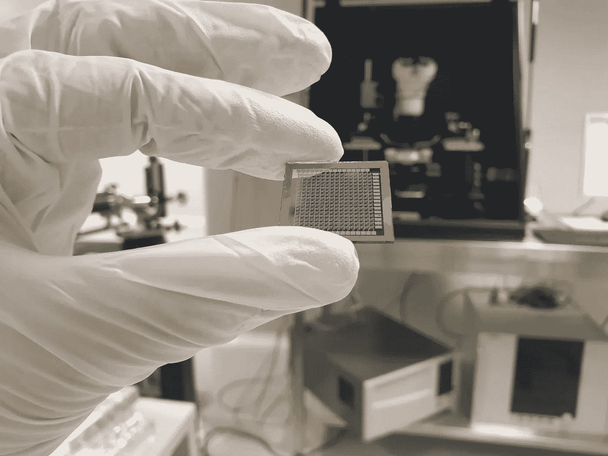

# 人工智能的未来——神经形态计算

> 原文：<https://towardsdatascience.com/the-future-of-artificial-intelligence-neuromorphic-computing-34bcc5cc35a?source=collection_archive---------6----------------------->

## 深度学习行业需要一种新型的硬件——神经形态硬件——才能真正高效。

在 [Unsplash](https://unsplash.com?utm_source=medium&utm_medium=referral) 上由 [Franck V.](https://unsplash.com/@franckinjapan?utm_source=medium&utm_medium=referral) 拍摄的照片

E 人工智能领域的每个人都知道什么是神经网络。大多数从业者都知道训练任何值得注意的神经网络都需要巨大的处理能力和能量消耗。也就是说，为了该领域的进一步发展，需要一种新型的硬件。

一些专家认为量子计算机就是硬件。尽管量子计算有着巨大的前景，但它是一项需要几十年才能发展起来的技术。物理理论还不够成熟，不足以开发出有用且经济的设备。

另一方面，神经形态计算将花费更少的时间和资源来开发，并且在设备开发成本和处理能力的能源成本方面都非常有用和经济高效。

由于大多数读者不知道什么是神经形态计算，我将在本文中描述这项新技术，以及它将使我们在“更接近量子”的未来做什么。这一切都始于神经形态芯片中使用的核心电子组件[忆阻器](https://en.wikipedia.org/wiki/Memristor)。

# 忆阻器——缺失的电路元件

忆阻器已经被证明以类似于大脑突触的方式工作，因为它们具有所谓的可塑性。这种可塑性可以用来创建受大脑启发的人工结构，以处理和记忆数据。

众所周知，有三种基本的无源电子元件:

*   电容器——具有储存电能(在电场中)并在需要时将电能释放到电路中的功能；
*   电阻器——是一种对电子流动产生阻力的无源器件；
*   电感器也称为线圈、扼流圈或电抗器，是一种无源双端电子设备，当电流流过磁场时，它在磁场中存储能量。

多年来，这是仅有的三种基本无源电子元件，直到忆阻器出现。

## 那么它们是什么呢？

忆阻器矩阵

忆阻器是第四类电路，加入了上述组件，主要在纳米尺度上展示其独特的属性。理论上，忆阻器(由**存储器和电阻**串联而成)是一种无源电路元件，它维持两端元件上的电流和电压的时间积分之间的关系。因此，忆阻器的电阻根据设备的忆阻功能而变化，允许通过微小的读取电荷来访问设备的“历史”(或存储器)。

所有这些用简单的语言拼写意味着这是一个无源电子元件，能够“记住”其过去的状态(电阻值)，即使没有能量通过它。忆阻器也可以用作存储器和处理单元，这是一个重要的壮举，我将在稍后描述。

忆阻器是由 Leon Chua 在 1971 年首次发现的，只是在理论上。如果你想了解更多，你可以在[的原始论文](http://www.cpmt.org/scv/meetings/chua.pdf)中找到。

直到 2008 年，惠普实验室的一个研究小组才首次基于氧化钛薄膜制造出忆阻器。根据惠普实验室团队的说法，忆阻器的行为方式如下:

*“忆阻器的电阻不是恒定的，而是取决于之前流过该设备的电流的历史，即它现在的电阻取决于过去有多少电荷以什么方向流过它；这种设备能够记住它的历史，也就是所谓的非易失性。当电源关闭时，忆阻器会记住其最近的电阻，直到再次打开为止。”*

从那以后，各种其他材料被各种公司实验，用于制造忆阻器，我就不一一列举了。

但是让我们跳过这些无聊的东西，直接进入忆阻器有趣的科幻应用吧！

# 神经形态计算——或者说如何创造大脑

神经形态计算并不是什么太新的东西，因为它在 1980 年首次被创造出来，它指的是模拟电路，模拟人脑的神经生物结构。

如果你至少有点了解深度学习的宣传，你就会知道它围绕着基于软件的算法和架构，这些算法和架构抽象地模仿大脑的神经回路。深度学习越来越多地传播到所有类型的行业，训练算法的成本是巨大的。

> 深度学习未能模仿的一点是大脑的能效。神经形态硬件可以解决这个问题。

还有，你可以告别著名的冯诺依曼瓶颈了。如果你不知道那是什么，它指的是数据从一个设备的内存到达处理单元所需的时间。这实际上使处理单元等待(浪费时间)获得它需要处理的数据。

神经形态芯片没有瓶颈，因为所有的计算都发生在内存中。忆阻器是神经形态芯片的基础，可以用作记忆单元和计算单元，类似于大脑的工作方式。它们是第一批无机神经元。

由[乔希·里默尔](https://unsplash.com/@joshriemer?utm_source=medium&utm_medium=referral)在 [Unsplash](https://unsplash.com?utm_source=medium&utm_medium=referral) 上拍摄的照片

## 为什么神经形态硬件更适合神经网络

神经网络主要使用实数(例如 2.0231、0.242341 等)来表示神经网络架构内部的权重和其他值。然而，在目前的计算机体系结构中，这些值需要转换成二进制。这增加了在训练和部署中计算神经网络所需的操作数量。

神经形态硬件不使用二进制，但它可以使用真实值，如电流和电压等电气值的形式。这里，数字 0.242341 被表示为例如 0.242341 伏。这直接发生在电路内部，不存在二进制值。所有的计算都以电路的速度进行。

基于神经形态硬件，极大地提高神经网络的响应速度和训练速度的另一个因素是计算的高度并行性。关于我们的大脑，已知的一件确定的事情是，它是高度并行的，在我们生命的每一秒钟里，数百万次计算同时发生。这就是神经形态芯片所能实现的。

所有这些优势都有一个好处:训练和部署神经网络算法的能耗低得多。

## 边缘计算——由神经形态驱动

你可能知道，自动驾驶汽车主要基于神经网络和 4/5 G 技术。为了让汽车自动驾驶，它必须连接到一个数据中心，该数据中心分析它从汽车接收的数据(通常它会将数据传递给一个或多个卷积神经网络)，然后使用 4/5 G 技术将数据返回给汽车。这会产生延迟，这可能会导致死亡。

**神经形态计算**的优势来自于之前提到的该技术的优点；所有处理都可以在汽车的“大脑”(神经形态芯片)内部本地完成。这将减少延迟，降低能源成本，增加汽车的自主性，同时也改善了汽车的一个敏感部分(因为大多数数据都是在本地处理的)——网络安全。

它还将为另一个不断增长的行业——物联网——带来许多新功能。众所周知，这些设备对能耗非常敏感，因为它们的电池寿命有限。小而高效的神经形态芯片可以用来以低成本为每个设备提供更多的功能。

# 结论

深度学习行业需要一种新型的硬件，神经形态的硬件，才能真正高效。神经形态芯片显示出最适合它的巨大前景，一些公司正在努力开发这项技术和硬件人工智能的未来。希望这一领域的工业研究将会增加，我们将很快拥有专用于神经网络的硬件。这将真正使人工智能开发者能够改变世界。

***加盟中使用我的推荐链接:***
[https://stefanpircalabu.medium.com/membership](https://stefanpircalabu.medium.com/membership)