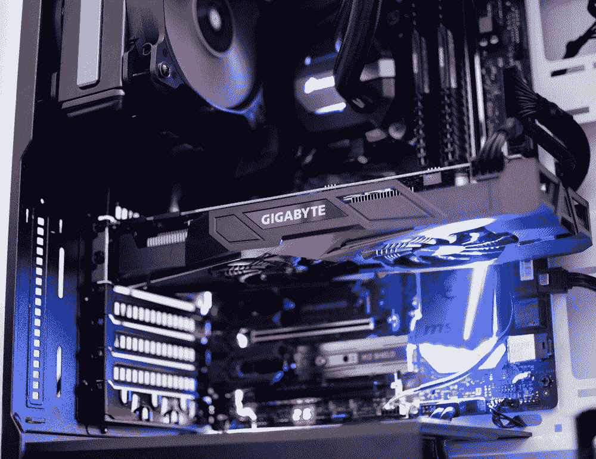
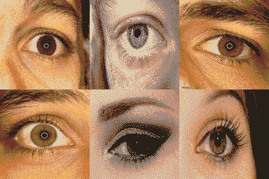
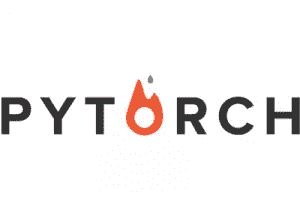
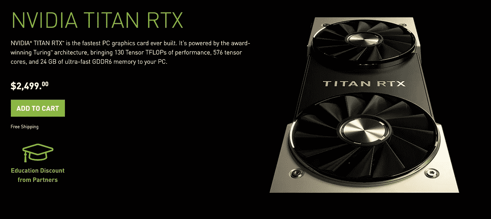
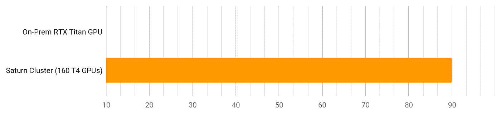
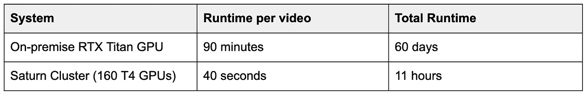
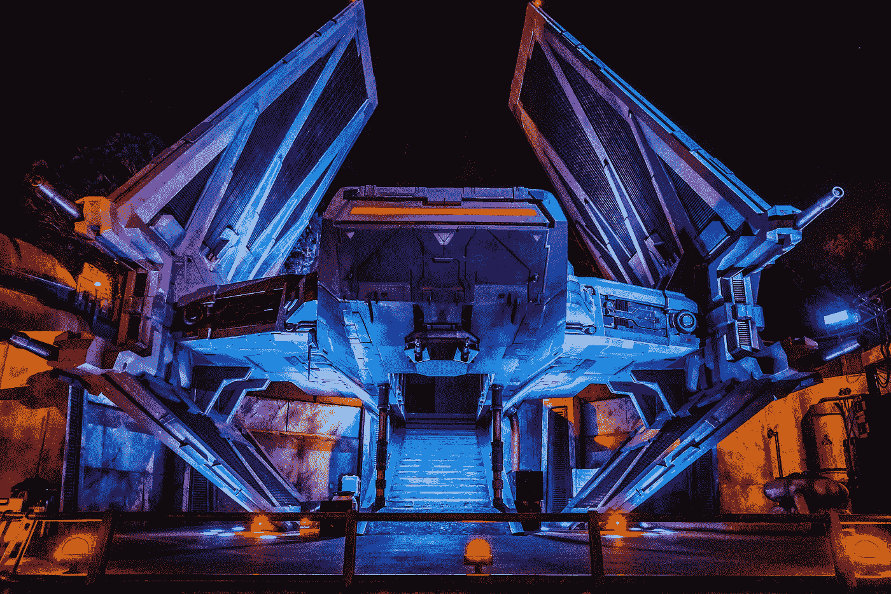

# 人工智能先驱 Senseye 的计算机视觉的未来

> 原文：<https://towardsdatascience.com/the-future-of-computer-vision-with-ai-pioneer-senseye-3e617d030c5b?source=collection_archive---------35----------------------->

## *用 10 行代码将模型训练速度提高 120 倍*

**简介:** [Senseye](https://senseye.co/) 处于神经科学和计算机视觉的前沿。他们的技术将高清、高帧率视频镜头转化为可操作的内部认知和行为过程情报，可供企业、学术界和政府机构使用。

**如何创造一个更安全的世界:**利用对精神疲劳、药物和酒精损伤、认知负荷和先进生物识别技术的见解，组织可以提高工作场所的安全性、员工的健康、提高培训计划的效率、为个人定制产品等等。Senseye 的客户利用这些见解来提升和发展他们的业务，并与他们的合作伙伴、员工和消费者进行深度互动。

图片来源:拉斐尔·波尔 via Unsplash

**计算机视觉数据的真正挑战**

Senseye 利用机器用来训练机器学习模型的高清视频片段的数量，将机器推向了极限。使用定制技术处理大量视频数据所需的计算能力是从用于驱动 Senseye 数据产品的原始帧中提取信息的一个限制因素。最终的产品有效性和成功直接依赖于大规模快速构建和测试新想法。

*Senseye 使用来自眼睛的详细信息来提取神经生理洞察，并使其可用于软件应用。图片来源:Senseye 公司*

**当速度决定一切**

最近，Senseye 与[土星云](http://www.saturncloud.io?utm_source=towards%20data%20science&utm_medium=senseye)合作，在他们的机器学习工作中取得了突破性的性能提升。土星云是一个数据科学和机器学习平台，它提供了市场上最快的计算工具。

> 没听说过土星？你只需要知道这些:[GPU 上的随机森林:比 Apache Spark 快 2000 倍](/random-forest-on-gpus-2000x-faster-than-apache-spark-9561f13b00ae)

为了测试土星云的能力，Senseye 选择了他们计算最密集的处理管道之一。它由 900 个超高清视频组成，每个视频时长 10 分钟，以 120 赫兹的频率录制，总计约 7.5TB 的磁盘容量。

图片来源:Arteum.ro via Unsplash

视频文件被转换为大块的三维阵列，并通过几个定制的 PyTorch 模型，使用更传统的分析计算机视觉技术来计算特征，最终用于下游的机器学习算法。

PyTorch 是一个开源的机器学习库。图片来源:Pytorch.org

> “以我们工作的规模，可能需要 **60 天来提取机器学习的特征**。这样的滞后影响了我们迭代解决方案、改进软件和提高性能的能力。我们被迫仔细选择我们想要在不完整信息的情况下大规模测试**的解决方案，或者在**较小的数据子样本**上运行更多的候选解决方案，这**会对我们算法的鲁棒性和性能**产生负面影响”——ML&AI 主管 Andrew Sommerlot 说**

Senseye 之前使用的这一过程相当于每 GPU(泰坦 RTX)每视频大约 90 分钟的处理时间。使用传统的本地 GPU 机器，总处理时间为 **60 天**。

NVIDIA Titan RTX GPU 的内部使用成本为 2500 美元。图片来源:Nvidia.com

> "**在创建人工智能驱动的产品时，如果该产品在现实应用中部署时需要高性能和信心，那么全面的快速迭代是理想的选择**

**我们来谈谈“高度可扩展的 Python 分析”**

土星云允许团队扩展到无限数量的 GPU。这是什么意思？这意味着 Senseye 的内部计算的限制因素被完全消除，开辟了一条通往闪电般快速的机器学习的道路。

Senseye 利用 Saturn 在云中扩展到 **160 个 T4 GPU**，摆脱了以前使用的本地机器的限制。这个改进只需要**增加 10 行代码**——对于性能改进来说，这是一个微不足道的变化。

现在，每个视频只需要 40 秒的时间来处理，使 Senseye 每天都可以迭代，而不是每两个月一次。

图片来源:Chuttersnap via Unsplash

**“天啊！新的工作流程速度提高了 120 倍……”**

这将 60 天的总运行时间减少到总共只有 11 个小时。这意味着什么？首先，Senseye 可以提高预测的准确性，并最终提高其底线价值:最终用户的工作场所事故减少意味着工作环境更安全，业主的保险索赔也更少。

> *“将运行时间从 60 天缩短到 11 个小时是一个令人难以置信的进步。我们能够在我们的模型上进行更多的迭代***。这对我们产品* *的有效性有着* ***重大的积极影响，这需要多次迭代才能达到我们客户所需的标准。”— Seth Weisberg，首席机器学习科学家(Senseye)****

*让我们把这些数字并排放在一起。*

***图 1:每小时处理的视频总数***

**

*本地 GPU 机器在 1 小时内处理了第一个视频的 70%。相比之下，**土星一小时内处理了 90 个视频**。那就是**比**快 120 倍。*

***表:系统运行时间***

**

*注意时间的数量级…*

**

**图片来源:棒长 via Unsplash**

*像这样的性能改进在未来并不遥远:Saturn 通过其交钥匙数据科学和机器学习平台让这些功能触手可及。*

*要了解更多关于土星云的信息，请访问这里的网站: [saturncloud.io](http://saturncloud.io)*

*随着 Senseye 继续开拓计算机视觉的应用，我们鼓励你关注他们的网站:[senseye.co](http://senseye.co)。*

*如果你喜欢这篇文章，请分享并告诉你的朋友和同事，计算能力将使他们和他们的客户的生活变得更好。*