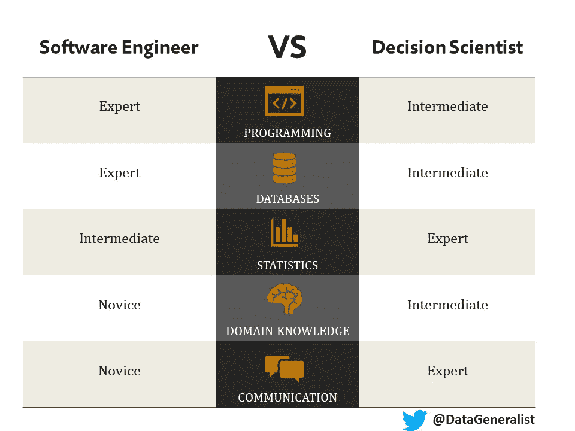

# 数据科学家的未来

> 原文：<https://towardsdatascience.com/the-future-of-data-scientists-7b075c45f7f?source=collection_archive---------29----------------------->

## 数据科学家职位的分歧。

来源: [Unsplash](https://unsplash.com/photos/0EX0Q16ScvY)

2012 年秋天，我记得我母亲告诉我一篇文章，说数据科学家是一个新的、性感的职业。那个时刻一直伴随着我，因为没有人愿意听到他们的父母说出“性感”这个词。当时我并不知道,《哈佛商业评论》[的这篇文章](https://hbr.org/2012/10/data-scientist-the-sexiest-job-of-the-21st-century)被认为是学生大举进入数据科学领域的催化剂。这股“数据热”将对我自己的职业轨迹产生重大影响。

在接下来的八年里，用于描述数据相关主题的术语发生了巨大变化。2012 年，最常见的三个搜索词分别是“统计”、“人工智能/人工智能”和“大数据”。截至 2020 年 7 月，前 3 个最常见的搜索词变成了“机器学习”、“数据科学”和“人工智能/人工智能”。排除最近的 COVID 激增(例如“COVID 统计”)，术语“统计”在此期间的使用量急剧下降。如果你在 2012 年知道对数据的热情将在未来十年爆发，你不可能预测到谷歌对“统计”的搜索会下降。

发表于 [Tableau Public](https://public.tableau.com/profile/datageneralist#!/vizhome/Data-RelatedSearchTopics/Dashboard1?publish=yes)

看到这些趋势后，你可能会认为数据科学对统计学和统计学家是一种威胁。在谷歌上快速搜索数据科学家的职位空缺，在美国确实得到了 8076 个结果，而只有 1526 个统计员的职位空缺。随着对数据相关技能需求的预期增长，我认为更有可能的结果是雇主不再寻找独角兽数据科学家。对于这个领域之外的人来说，独角兽数据科学家是可以做所有事情的人；集程序员、统计学家和机器学习工程师于一身。将需要跨领域的专业化，让统计学家也能找到自己的位置。招聘、工作职责和头衔方面的这种变化将会出现，原因如下:

1.  机器学习正在被添加到计算机科学本科课程中
2.  API 将使机器学习自动化并将其集成到现有的应用程序中变得更加容易
3.  与数据相关的技术在广度上不断扩展，使得数据科学家不可能了解所有的东西
4.  自动化将为更有创造力的思考者腾出时间

我相信这些趋势将导致数据科学家分成两条道路，软件工程师，专注于机器学习，和决策科学家。让我们来看看不同之处。

由于他们的强项不同，他们将负责不同类型的问题。软件工程师将被分配有明确定义的范围和访问大型、高质量数据集的项目。他们将构建与机器学习 API 集成的应用程序。这些 API 将自动化数据摄取、学习、训练和预测的标准过程。示例可能包括合并销售预测的商业智能应用程序，或者设计利用自然语言处理的知识发现系统。与此同时，决策科学家将被分配给范围不确定的项目。他们将负责设计合适的问题来回答。这些问题通常会有不完整的信息，迫使决策科学家更适应不确定性。他们需要在分析数据之外得出安全的结论。这需要对领域有具体的理解。

由于他们工作的性质，我认为与软件工程师相比，决策科学家将有更广泛的背景。软件工程师通常会遵循标准的计算机科学路线，参加编码训练营，或者以前是数据工程师。与此同时，决策科学家可能是前统计学家，或者具有社会或物理科学分析背景的人。拥有跨多个领域的能力，这个人可以被视为多面手。也许是一个“[数据通才](https://thedatageneralist.com/emergence-of-data-generalists/)”。

随着技术日新月异，数据专业人员需要了解长期趋势。在他们的 2020 年新兴工作[报告](https://business.linkedin.com/content/dam/me/business/en-us/talent-solutions/emerging-jobs-report/Emerging_Jobs_Report_U.S._FINAL.pdf)中，LinkedIn 将数据科学家列为第三大工作，年增长率为 37%。对数据技能的过度需求将推动进一步细化数据科学中的具体职位的需求。观察这一领域在未来十年如何发展将会很有趣。

~ [数据通才](http://thedatageneralist.com/)

**注意**:这篇文章的后续于 2021 年 9 月在这里[发表。](/which-data-professional-roles-cannot-be-replaced-by-ai-c7abd6d10f54)