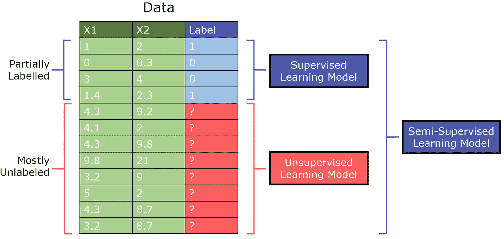
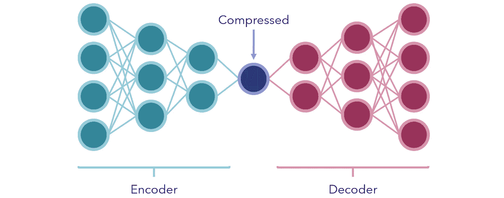
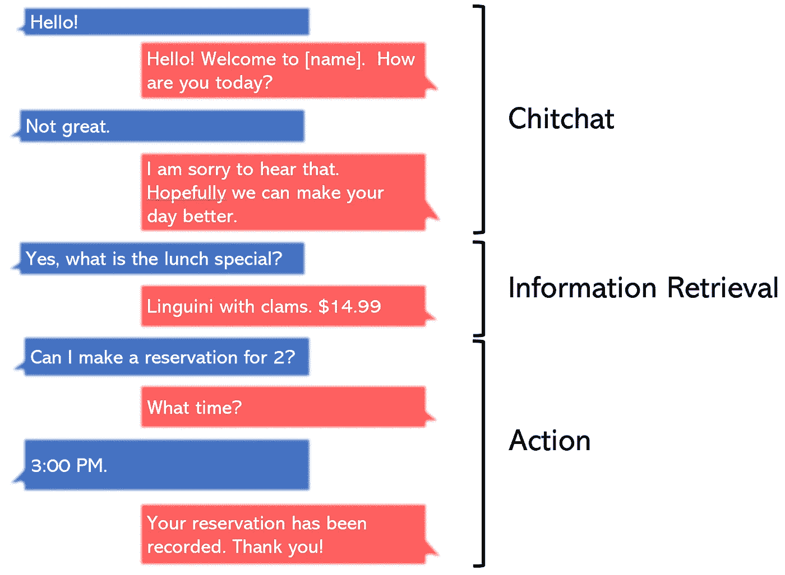
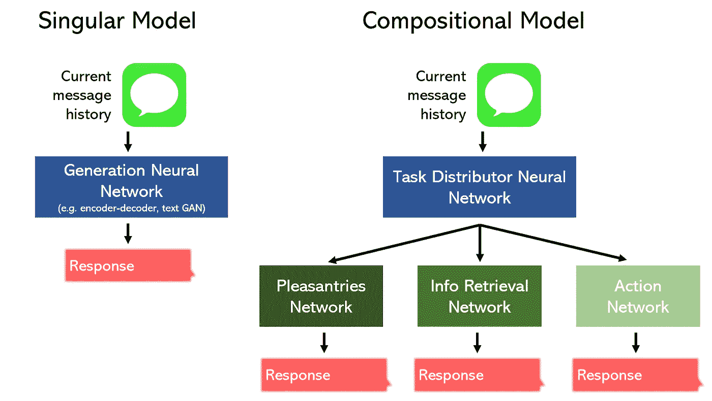
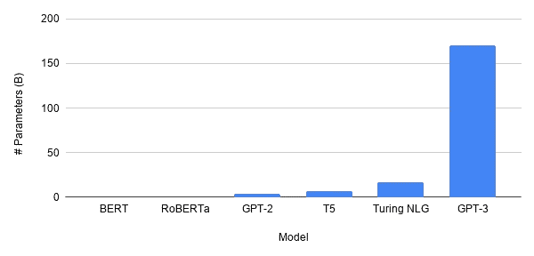
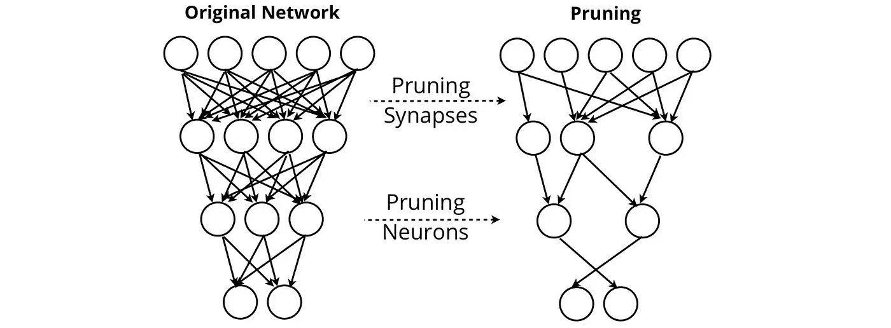

# 深度学习的未来可以分为这三种学习范式

> 原文：<https://towardsdatascience.com/the-future-of-deep-learning-can-be-broken-down-into-these-3-learning-paradigms-e7970dec5502?source=collection_archive---------13----------------------->

来源: [Unsplash](https://unsplash.com/photos/xU5Mqq0Chck)

## 混合、复合和简化学习

深度学习是一个广阔的领域，以一种算法为中心，这种算法的形状由数百万甚至数十亿个变量决定，并在不断变化——神经网络。似乎每隔一天就有大量的新方法和技术被提出来。

然而，总的来说，现代的深度学习可以分为三种基本的学习范式。每个人都有一种学习的方法和信念，为增加深度学习的当前能力和范围提供了巨大的潜力和兴趣。

*   *混合学习*——现代深度学习方法如何跨越监督和非监督学习之间的界限，以适应大量未使用的未标记数据？
*   *复合学习*——如何以创造性的方法将不同的模型或组件连接起来，以产生一个大于其各部分总和的复合模型？
*   *减少学习* —为了性能和部署目的，如何减少模型的大小和信息流，同时保持相同或更强的预测能力？

深度学习的未来在于这三种学习范式，每一种范式都是紧密相连的。

# 混合学习

这种范式试图跨越监督学习和非监督学习之间的界限。由于标记数据的缺乏和高成本，它经常在商业环境中使用。本质上，混合学习是这个问题的答案，

> 我如何使用有监督的方法解决/结合无监督的问题？

首先，半监督学习正在机器学习社区中获得一席之地，因为它能够在只有少量标记数据的监督问题上表现得非常好。例如，一个设计良好的半监督 GAN(生成对抗网络)在看到[只有 25 个训练样本](https://coursys.sfu.ca/2020sp-cmpt-726-x1/pages/SSL_GAN_report/view)后，在 MNIST 数据集上取得了超过 90%的准确率。

半监督学习是为有大量无监督数据但有少量监督数据的数据集设计的。传统上，监督学习模型将在数据的一部分上训练，而非监督模型在另一部分上训练，而半监督模型可以将标记数据与从未标记数据中提取的洞察相结合。

作者创建的图像。

半监督 GAN(缩写为 SGAN)是对标准[生成对抗网络模型](/gans-for-everyone-an-intuitive-explanation-of-the-revolutionary-concept-2f962c858b95)的改编。鉴别器既输出 0/1 来指示是否生成图像，也输出项目的类别(多输出学习)。

这是基于这样的想法，即通过鉴别器学习区分真实和生成的图像，它能够在没有具体标签的情况下学习它们的结构。通过少量标记数据的额外强化，半监督模型可以用最少量的监督数据实现最佳性能。

你可以在这里阅读更多关于 SGANs 和半监督学习[的内容。](/supervised-learning-but-a-lot-better-semi-supervised-learning-a42dff534781)

甘还参与了混合学习的另一个领域——*自我监督*学习，在这种学习中，无监督的问题被明确地框定为有监督的问题。GANs 通过引入一个生成器来人工创建监督数据；创建标签是为了识别真实/生成的图像。从一个无监督的前提，一个监督的任务被创建。

或者，考虑使用[编码器-解码器模型](https://medium.com/analytics-vidhya/11-essential-neural-network-architectures-visualized-explained-7fc7da3486d8?source=your_stories_page---------------------------)进行压缩。在它们最简单的形式中，它们是神经网络，在中间有少量的节点来代表某种瓶颈，压缩形式。两边的两部分分别是编码器和解码器。

作者创建的图像。

网络被训练以产生与向量输入相同的*输出(从非监督数据中人工创建的监督任务)。因为中间有一个故意放置的瓶颈，网络不能被动地传递信息；相反，它必须找到将输入内容保存到一个小单元中的最佳方法，以便解码器能够再次对其进行合理解码。*

经过训练后，编码器和解码器被拆开，可用于压缩或编码数据的接收端，以极小的形式传输信息，几乎没有丢失数据。它们也可以用来减少数据的维数。

作为另一个例子，考虑大量的文本集合(可能是来自数字平台的评论)。通过一些聚类或[流形学习](/manifold-learning-t-sne-lle-isomap-made-easy-42cfd61f5183?source=your_stories_page---------------------------)方法，我们可以为文本集合生成聚类标签，然后将这些作为标签对待(假设聚类做得很好)。

在每个聚类被解释之后(例如，聚类 A 表示对产品的抱怨，聚类 B 表示正面反馈，等等)。)然后，像 [BERT](https://medium.com/analytics-vidhya/bert-for-everyone-f876f3bd3383) 这样的深度 NLP 架构可以用于将新文本分类到这些簇中，所有这些都使用完全未标记的数据和最少的人工参与。

这又是一个将无人监管的任务转化为有人监管的任务的有趣应用。在一个绝大多数数据都是无监督数据的时代，通过混合学习建立创造性的桥梁来跨越有监督和无监督学习之间的界限具有巨大的价值和潜力。

# 复合学习

复合学习寻求利用不是一个模型而是几个模型的知识。这是一种信念，即通过独特的信息组合或注入——静态和动态——深度学习可以持续深入理解和表现，而不是单一的模型。

迁移学习是复合学习的一个明显例子，其前提是模型的权重可以从类似任务的预训练模型中借用，然后在特定任务上进行微调。像[盗梦空间](/the-clever-trick-behind-googles-inception-the-1-1-convolution-58815b20113)或 VGG-16 这样的预训练模型，其架构和权重是为区分几种不同类别的图像而设计的。

如果我要训练一个神经网络来识别动物(猫、狗等。)，我不会从零开始训练一个卷积神经网络，因为要达到好的效果需要太长的时间。相反，我会采用像 Inception 这样的预训练模型，它已经存储了图像识别的基础知识，并在数据集上训练几个额外的时期。

类似地，NLP 神经网络中的单词嵌入，其根据单词与嵌入空间中的其他单词的关系，将单词在物理上更靠近地映射(例如，“apple”和“orange”比“apple”和“truck”具有更小的距离)。像 GloVe 这样的预训练嵌入可以放入神经网络中，从已经是单词到数字的、有意义的实体的有效映射开始。

不太明显的是，竞争也能刺激知识增长。首先，生成性对抗网络借鉴了复合学习范式，从根本上让两个神经网络相互对抗。生成器的目标是欺骗鉴别器，鉴别器的目标是不被欺骗。

模型之间的竞争将被称为“对抗性学习”，不要与另一种类型的对抗性学习混淆，后者指的是恶意输入的[设计和模型中弱决策边界的利用](https://medium.com/swlh/machine-learning-algorithms-are-much-more-fragile-than-you-think-25fdb3939fee)。

对抗性学习可以刺激模型，通常是不同类型的模型，其中一个模型的表现可以用其他模型的表现来表示。在对抗学习领域仍有许多研究要做，生成对抗网络是该子领域唯一突出的创造。

另一方面，竞争学习类似于对抗学习，但是是在逐个节点的规模上执行的:节点竞争对输入数据的子集做出响应的权利。竞争学习是在一个“竞争层”中实现的，在这个竞争层中，一组神经元都是相同的，除了一些随机分布的权重。

将每个神经元的权重向量与输入向量进行比较，并激活具有最高相似性的神经元，即“赢家通吃”神经元(输出= 1)。其他被“停用”(输出= 0)。这种无监督技术是[自组织地图](https://en.wikipedia.org/wiki/Self-organizing_map)和[特征发现](https://onlinelibrary.wiley.com/doi/pdf/10.1207/s15516709cog0901_5)的核心组成部分。

复合学习的另一个有趣的例子是在*神经架构搜索*中。简而言之，强化学习环境中的神经网络(通常是递归的)学会为数据集生成最佳神经网络——算法为你找到最佳架构！你可以在这里阅读更多关于理论[的内容，在这里](/if-youre-hyped-about-gpt-3-writing-code-you-haven-t-heard-of-nas-19c8c30fcc8a?source=your_stories_page---------------------------)阅读 Python 中的实现[。](/automl-creating-top-performing-neural-networks-without-defining-architectures-c7d3b08cddc?source=your_stories_page---------------------------)

集成方法也是复合学习中的主要方法。深度集成方法已经被证明是非常有效的，端到端的模型堆叠，比如编码器和解码器，越来越受欢迎。

许多复合学习都是找出在不同模型之间建立联系的独特方式。它的前提是，

> 一个单一的模型，甚至是一个非常大的模型，比几个小的模型/组件表现得更差，每个小的模型/组件都被委派专门负责任务的一部分。

例如，考虑为一家餐馆构建聊天机器人的任务。

作者创建的图像。

我们可以将它分成三个独立的部分:客套话/闲聊、信息检索和一个动作，并设计一个模型来专门处理每一个部分。或者，我们可以委托一个单一的模型来执行所有这三个任务。

作者创建的图像。

毫不奇怪，组合模型可以在占用更少空间的情况下执行得更好。此外，这些种类的非线性拓扑可以很容易地用像 [Keras 的功能 API](/with-keras-functional-api-your-imagination-is-the-limit-4f4fae58d90b?source=your_stories_page---------------------------) 这样的工具构建。

为了处理日益多样化的数据类型，如视频和三维数据，研究人员必须建立创造性的组合模型

点击阅读更多关于写作学习和未来[的内容。](https://medium.com/analytics-vidhya/compositional-learning-is-the-future-of-machine-learning-22b56ad09edc)

# 简化学习

模型的规模越来越大，特别是在自然语言处理领域——深度学习研究中令人兴奋的中心——越来越多*。最新的 GPT-3 模型有 175 *亿*个参数。把它比作[伯特](https://medium.com/analytics-vidhya/bert-for-everyone-f876f3bd3383)就像把木星比作一只蚊子(嗯，不是字面意思)。深度学习的未来更大吗？*

**

*来源: [TDS](/gpt-3-the-new-mighty-language-model-from-openai-a74ff35346fc) 。图片免费分享。*

*很有争议，不。GPT-3 非常强大，无可否认，但它在过去一再表明，“成功的科学”是对人类产生最大影响的科学。每当学术界偏离现实太远，它通常会变得默默无闻。这是神经网络在 20 世纪后期被遗忘的一个短暂时期的情况，因为可用数据太少，无论这个想法多么巧妙，都是无用的。*

*GPT-3 是另一种语言模型，它可以编写令人信服的文本。它的应用在哪里？是的，例如，它可以生成查询的答案。然而，有更有效的方法来做到这一点(例如，遍历知识图，并使用像 BERT 这样的较小模型来输出答案)。*

*在计算能力逐渐枯竭的情况下，GPT-3 的巨大体积，更不用说一个更大的模型，似乎是不可行或不必要的。*

> *"摩尔定律有点失去动力了。"
> - [微软首席执行官塞特亚·纳德拉](https://www.bbc.com/news/business-42797846)*

*相反，我们正在走向一个嵌入人工智能的世界，智能冰箱可以自动订购食品杂货，无人机可以自行导航整个城市。强大的机器学习方法应该能够下载到个人电脑、手机和小芯片上。*

*这需要轻量级人工智能:在保持性能的同时，让神经网络变得更小。*

*事实证明，深度学习研究中的几乎所有事情都直接或间接地与减少必要的参数数量有关，这与提高泛化能力以及性能密切相关。例如，卷积层的引入大大减少了神经网络处理图像所需的参数数量。递归层结合了时间的概念，同时使用相同的权重，允许神经网络以更少的参数更好地处理序列。*

*嵌入层显式地将实体映射到具有物理意义的数值，从而不会给额外的参数带来负担。在一种解释中， [Dropout](/5-perspectives-to-why-dropout-works-so-well-1c10617b8028?source=your_stories_page---------------------------) 层显式地阻止参数对输入的某些部分进行操作。 [L1/L2 规则化](/exploring-the-simple-satisfying-math-behind-regularization-2c947755d19f?source=your_stories_page---------------------------)确保网络利用其所有参数，确保它们都不会变得过大，并且每个参数都能最大化其信息价值。*

*随着专业层的创建，网络需要越来越少的参数来处理更复杂和更大的数据。其他更新的方法明确地寻求压缩网络。*

*[神经网络修剪](https://arxiv.org/abs/2003.03033)旨在移除对网络输出没有价值的突触和神经元。通过修剪，网络可以在删除几乎所有自身的同时保持其性能。*

**

*来源:[奥莱利](https://www.oreilly.com/content/compressed-representations-in-the-age-of-big-data/)。图片免费分享。*

*其他的方法，比如病人知识蒸馏找到了将大型语言模型压缩成可下载形式的方法，比如，下载到用户的手机上。这是谷歌神经机器翻译(GNMT)系统的必要考虑，该系统支持谷歌翻译，需要创建一个可以离线访问的高性能翻译服务。*

*本质上，简化的学习围绕着以部署为中心的设计。这就是为什么大多数减少学习的研究来自公司的研究部门。以部署为中心的设计的一个方面是不要盲目地遵循数据集的性能指标，而是要关注模型部署时的潜在问题。*

*例如，前面提到的[敌对输入](https://medium.com/swlh/machine-learning-algorithms-are-much-more-fragile-than-you-think-25fdb3939fee)是设计用来欺骗网络的恶意输入。标志上的喷漆或贴纸可以欺骗自动驾驶汽车加速超过限速。负责任的简化学习的一部分不仅是使模型足够轻便以供使用，而且要确保它能够适应数据集中没有表示的极限情况。*

*简化学习可能是深度学习研究中最不受关注的，因为“我们设法用可行的架构规模实现了良好的性能”远不如“我们用由数十亿个参数组成的架构实现了最先进的性能”性感。*

*不可避免的是，当对更高百分比分数的大肆追求逐渐消失时，正如创新的历史所显示的那样，简化学习——实际上只是实践学习——将得到更多应有的关注。*

# *摘要*

*   *混合学习寻求跨越监督和非监督学习的界限。像半监督和自我监督学习这样的方法能够从未标记的数据中提取有价值的见解，随着无监督数据的数量呈指数增长，这是非常有价值的。*
*   *随着任务变得越来越复杂，复合学习将一个任务分解成几个更简单的部分。当这些组件协同工作(或相互对抗)时，结果是一个更强大的模型。*
*   *随着深度学习度过炒作阶段，简化学习还没有受到太多关注，但很快就会出现足够的实用性和以部署为中心的设计。*

*感谢阅读！*