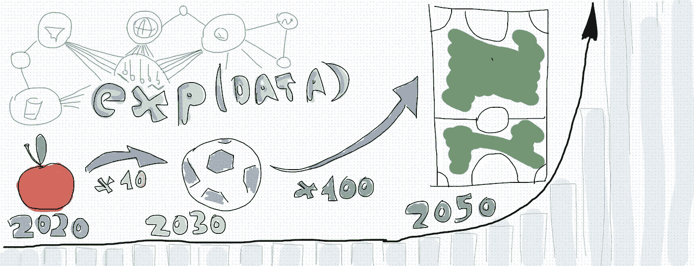
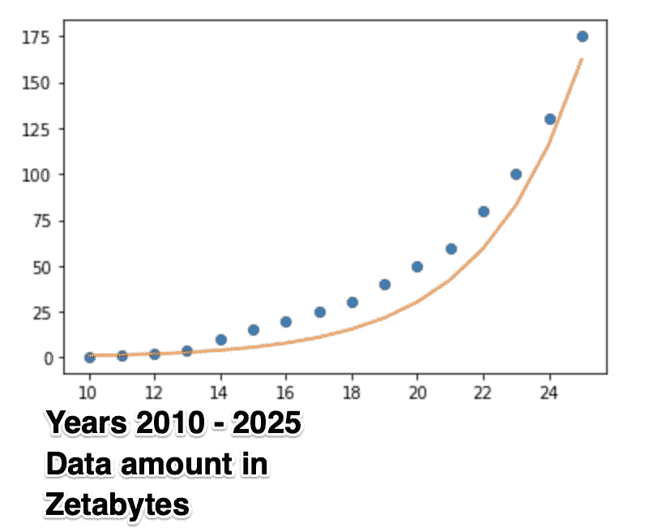
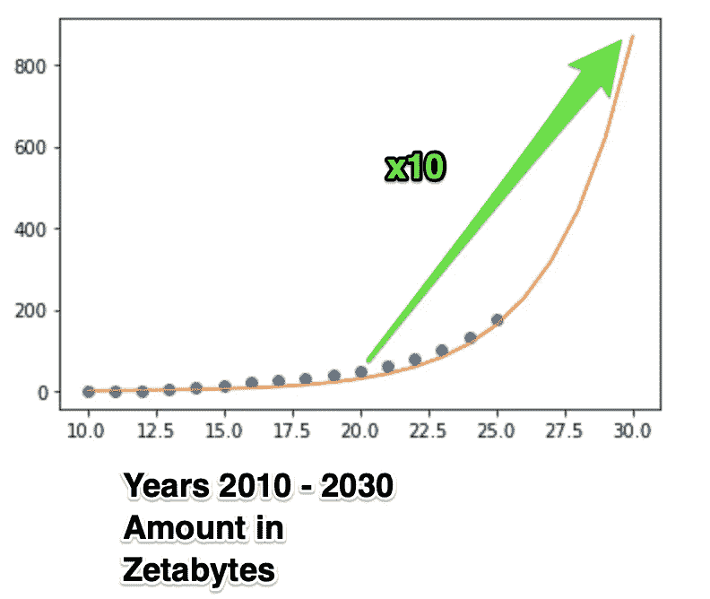
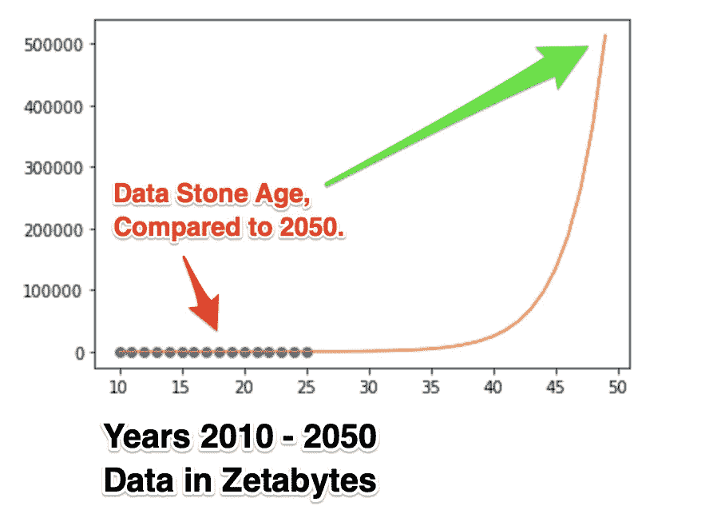
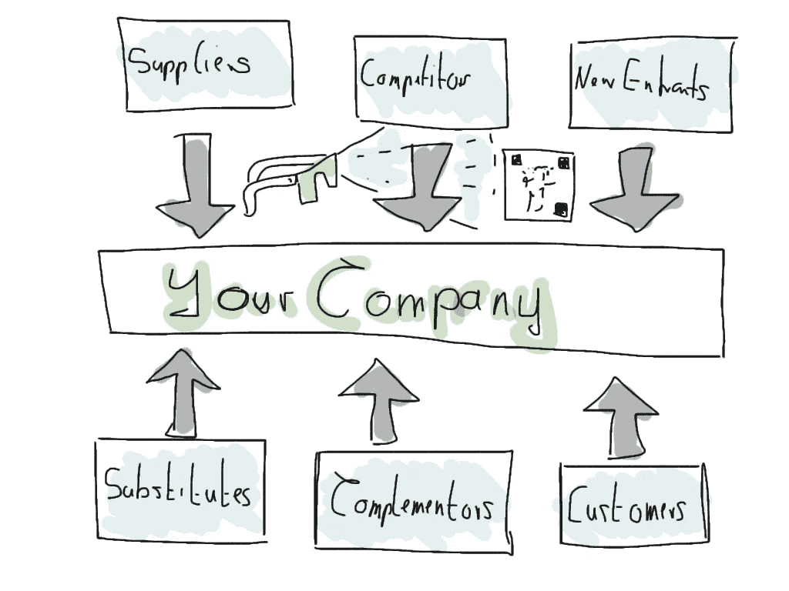

# 好数据的未来—您现在应该知道的！

> 原文：<https://towardsdatascience.com/the-future-of-good-data-what-you-should-know-now-f2a312a0e469?source=collection_archive---------22----------------------->

> “利用指数技术来解决大目标，并使用快速迭代和快速反馈来加快实现这些目标的进度，这是关于以极快的速度创新。但如果创业者不能升级自己的心理来跟上这项技术，那么他们赢得这场赛跑的机会就很小。”

― **彼得·h·迪亚曼迪斯，** [**大胆:如何做大，创造财富，冲击世界**](https://www.goodreads.com/work/quotes/42099420)

在 [Unsplash](https://unsplash.com/?utm_source=unsplash&utm_medium=referral&utm_content=creditCopyText) 上由 [Franki Chamaki](https://unsplash.com/@franki?utm_source=unsplash&utm_medium=referral&utm_content=creditCopyText) 拍摄的照片。

# 介绍

*现在还是数据的第一天。世界各地的公司、政府、非营利组织已经从数据中提取了大量的价值。但是真的，比起即将到来的事情，今天真的只是* ***天 1*** *。* ***数据呈指数级增长*** *，我们从中提取知识的能力也是如此。如果你把我们可用的数据量想象成一个苹果，那么到 2030 年，这个苹果已经变成了一个足球。到 2050 年，它将有整个足球场那么大！*

但是这对你我来说到底意味着什么呢？究竟是什么促成了这种数据增长？这是否意味着我们可以从数据中提取的价值将随着数据量的增加而线性增长？由于我对其中的含义仍然有点困惑，我决定对未来的数据世界进行一次简短的参观。这篇文章提供了我个人认为数据的未来会带来什么，基于不断增长的数据量，我们从中提取价值的能力，以及研究告诉我们的关于它的信息。

我真的相信数据的未来将塑造任何行业。如果我选取任何一个样本行业，看看波特五(或六)种工作力量，并问自己数据将对他们产生什么影响，那么我很清楚，在 10 年或 20 年后，每个行业都会因数据的影响而变得非常不同。所以对你来说，问题不是要不要抓住这个“机会”，而是你要做什么，因为如果不抓住，你就会被它打乱。

# 为什么这一点现在如此重要？

好的，数据正在快速增长。有什么大不了的…技术将会适应，我们的公司将会简单地跟随领导。

只是，一切都太晚了。太晚了。

根据目前的预测，数据不仅在快速增长，而且可能呈指数级增长！除此之外，我们从数据中提取信息的能力、计算能力也在呈指数增长！

这就是指数增长技术的问题所在，当你发现时已经太晚了。

> “今天，我们生活在一个全球化和指数化的世界。问题在于，我们的大脑——以及我们的感知能力——从未被设计成以这种规模或这种速度进行处理。我们的线性思维实际上无法搜索指数级数。”

― **彼得·h·迪亚曼迪斯，** [**大胆:如何做大，创造财富，冲击世界**](https://www.goodreads.com/work/quotes/42099420)

让我更清楚地说明这一点:*在 6 年内，一家公司将面临现在可用数据的四倍。它将能够以比现在快 8 倍的速度/更低的成本获得对现有数据的预测。如果该公司在 6 年内分析今天的数据，它将花费今天一半的时间。大多数新数据将是实时的，它将是事件/行为类型的数据，而不是“状态”数据。大量数据将以图像形式存在，大量数据将存在于边缘设备上，大量计算也将在那里完成。最重要的是，大量免费可用的技术来应对所有这些变化，将会充斥开源市场。*

你觉得你正走向一个能够解决这个世界的方向吗？如果你得到了你的答案，我想它也回答了这个问题“为什么这个现在如此重要？”

*图片由 Sven Balnojan 提供。*

# **数据&计算呈指数级增长**

问题是，目前的数据预测只涵盖了未来的一部分。但是，如果您对数据进行推断，您会注意到数据量大约每 3 年翻一番，并且预计在未来 5 年内也会如此。我确实相信，许多潜在的力量将继续推动这一趋势。我看到的力量主要是:

1.  边缘设备的发展[预计到 2025 年将达到 416 亿台联网设备](https://www.idc.com/getdoc.jsp?containerId=prUS45213219)。
2.  智能手机的普及率将接近 100%，[目前为 44%](https://www.bankmycell.com/blog/how-many-phones-are-in-the-world) 。
3.  互联网采用率将接近 100%，[目前为 59%](https://www.statista.com/statistics/617136/digital-population-worldwide/) ，谷歌&脸书的大型项目旨在为全世界提供互联网。
4.  许多底层技术的指数级增长，如数据存储、产生数据的计算、边缘设备的成本等..所有这些本质上都与摩尔定律有关。

我能找到的最好的预测来自希捷，你可以在这里找到。 [IDC 希捷数据时代白皮书](https://www.seagate.com/files/www-content/our-story/trends/files/idc-seagate-dataage-whitepaper.pdf)。如果你对数据进行指数拟合，这就是数据的样子。

这只是 IDC &希捷的简单预测。图片由 Sven Balnojan 提供。

接下来，让我们看看指数持续到 2030 年。

指数拟合预测。图片由 Sven Balnojan 提供。

最后，真正有趣的问题是，2050 年的事情可能会是什么样子？

我们在数据石器时代！图片由 Sven Balnojan 提供。

请注意，这描述的是数据，而不是存储的数据。但是，真正从数据中提取价值实际上，存储数据并不重要，更重要的是提取信息，做出决策，采取行动，然后丢弃数据。所以我发现这个预测是即将到来的浪潮的一个很好的来源。对我来说，预测的重要启示是:

1.  到 2030 年，我们将拥有大约 572 的数据，大约是现在的 10 倍。
2.  到 2050 年，我们将拥有 50，000–500，000 Zettabytes，这是之前的 1，000–10，000 倍(通过指数延拓进行预测)。
3.  到 2025 年，超过 50%的数据将处于边缘
4.  到 2025 年，超过 50%的数据将是实时的，这一趋势将持续到 2050 年，可能接近 90%
5.  到 2025 年，80–90%的数据将是行为/交易数据，或者我称之为“事件数据”，这一趋势可能会保持在 90–100%。

另一方面，我们有能力从这些海量数据中提取信息。[据我所知，摩尔定律仍然很强大，尽管有些人认为它已经碰到了前进道路上的最后一个路障](https://www.infoq.com/news/2020/04/Moores-law-55/)。尽管如此，给定芯片上的微处理器密度大约每 18 个月翻一番，为我们提供了廉价的边缘设备、智能手机和令人惊叹的计算机。

同一方向的另一个趋势是 GPU 的发展，从 1996 年[到 2020 年，GPU 实际上也遵循指数增长曲线](https://www.techspot.com/article/2008-gpu-efficiency-historical-analysis/))。GPU 不仅仅用于制作图形，因为图形通常意味着我们需要做大量的矩阵乘法和加法，GPU 正是为此而优化的。事实证明，这正是今天的数据分析所需要的，大量的矩阵数学。特别是，所有的深度学习、人工智能和机器学习从根本上讲都是关于加法和乘法矩阵，这就是为什么我们目前从数据中提取信息的能力与 GPU 计算能力的指数增长有很大关系。

但这还不是全部，TPU 的出现，专门为机器学习设计的芯片将继续推动这些趋势越来越快。TPU 本质上与 GPU 做同样的事情，但更节能，因此[压低了价格](https://cloud.google.com/blog/products/gcp/an-in-depth-look-at-googles-first-tensor-processing-unit-tpu)。

最后，还有量子计算机的指数增长，这可以通过“[罗斯定律](https://www.flickr.com/photos/jurvetson/50399541811/)”来衡量，这已经持续了 17 年。罗斯定律表明，量子位的数量，即量子芯片上的比特数，大约每年都会翻一番。虽然量子机器学习在很大程度上仍然是理论性的，但我毫不怀疑[量子数据分析](https://en.wikipedia.org/wiki/Quantum_machine_learning#Machine_learning_with_quantum_computers)将在未来十年成为普通人的工具。

# **事件数据是一座金矿**

在“经典”营销和营销自动化中，存在以下区别

1.  社会人口统计数据，如年龄、居住地、收入等。
2.  行为数据，比如你今年是否购买了某些物品，你是否打开了电子邮件或点击了某个链接。

但是我真的认为区分“状态和事件”数据要好得多。让我们将“状态”定义为

> *“任何系统在任何时间点的状况。”(这是状态的热力学定义)*

事件的合理定义可以是

> *“系统从条件 A →条件 B 的转变”*

因此，如果我是系统，那么我在[Amazon.com](http://amazon.com/)上购买一件物品，对于一个名叫斯文的人来说是这样的:

*   今天上午 12 点；还没买；状态:“非买方”；事件:无。
*   今天下午 1 点；刚刚点击了 Amazon.com 状态上的结账按钮:“非买家”；事件:“斯文购买新物品”
*   今天 1:01 下午；状态:“买方”

有趣的是，**状态数据和事件数据实际上是等价的**。两种看待世界的方式，因为如果我给你这个系列:

1.  “这是今天下午 1 点的活动:斯文购买新物品”，然后你可以告诉我斯文在该活动之前和之后的确切状态。
2.  “这是状态:在上午 12 点斯文不是买家，在 1:01 下午他是买家”，然后你也可以告诉我，斯文在下午 1 点买东西。

那么如果这两种数据是等价的，为什么有关系呢？**因为它们只在理论上是等价的！**在现实中，你要么:

1.  没有任何给定时间点的“状态”数据= >因此无法了解事件(因为您不知道 Sven 在 12 am 不是买家)
2.  没有所有的事件，但只是其中的一小部分= >不能够告诉国家，但只是今天真正发生了什么。

为什么这对我们很重要？**因为许多公司已经围绕国家数据建立了大数据分析能力，然而在 10 年内，99%的数据将是事件数据！**

唯一的好处是？Martens Provost 的一项伟大研究给出了一些提示，使用事件数据实际上是一件非常有利可图的事情。

# **计算&边缘数据**

到 2025 年，超过 50%的数据将收集在边缘。在 416 亿台物联网设备上，仅包括约 60 亿部智能手机。更多的将来自传感器、照相机等等。当然，你的智能手表也会在这个名单上。最重要的是，没有互联网连接的边缘设备将会出现。今天，所有这些东西都可以对数据做两件事:

1.  收集它，并将其发送到某个中央集线器进行存储/评估。因为他们有网络连接。比如你的智能手机，它分析你在本地拍摄的照片，把它们发送到一个中心，然后得到一个“照片集”，或者给它们加注释，等等。
2.  在设备上本地计算这些数据。这总是一个小挑战，因为这些设备的计算能力比我们通常的云计算机小得多。

这意味着什么呢？对我来说，这意味着，这两件事都会对未来的公司产生影响。首先，作为一家公司，您将面临大量边缘收集的数据，这些数据希望在一个中心位置进行评估，这些数据来自供应商、您的客户和其他将向您提供此类数据的第三方。

其次，作为一家公司，您可以控制自己的边缘设备来收集数据。想想包装和运输跟踪芯片、可穿戴芯片、芯片、相机等。将会有很多接触点让你比以前更多地控制边缘设备。

第三，不管有没有互联网连接，边缘设备都需要自己进行计算来评估数据。这需要转变视角，因为目前，大多数数据分析人员或机器学习者大多专注于大型计算设备上的数据的集中评估。但机器学习已经可以在任何边缘设备中实现。最受欢迎的机器学习框架之一 tensor flow 已经在 [javascript](https://www.tensorflow.org/js) 中提供，基本上允许机器学习模型在智能手机或任何其他设备的浏览器中进行训练和评估&。

除了数据分析必须朝着这三个不同的方向发展之外，所涉及的数据类型也将为许多公司带来范式转变。

# **实时数据将以 50%的速度递增**

大量的当前数据分析基于历史数据，以及如上所述的“状态”数据。实时数据通常根本不会进入算法。如果是这样的话，它会出现在一系列数据的末尾，可能会有一些“权重”来使当前数据比历史数据更重要。

与此形成鲜明对比的是未来的数据领域，其中真正且唯一重要的东西是实时数据，因为将会有如此多的实时数据！许多公司求助于历史和状态数据的原因是，在过去，我们几乎没有事件类型的数据。我们所知道的关于某人在某处点餐的唯一信息是他的社会人口统计数据，我们可能不得不在某处购买这些数据。

但在未来，这种动态将会改变。就像图像识别一样。在过去，我们需要 100 多张图像才能让计算机告诉我们图像上的人是谁。今天，在这项任务中，计算机实际上比人类专家更好，[仅仅基于一张图像](https://www.forbes.com/sites/michaelthomsen/2015/02/19/microsofts-deep-learning-project-outperforms-humans-in-image-recognition/#4b699350740b)。

> 未来也是如此，我们将能够从一天的活动数据中准确地告诉一个人，他喜欢什么，他以后可能会买什么，等等。我们不需要他的收入、性别等任何数据。这一切都将发生在事件中，发生在一天的实时互动中。

这将再次给全世界的分析人员带来巨大的范式转变。未来，真正的价值将不再是随着时间的推移收集大量特定数据，而是收集大量数据。

# **图像数据将非常庞大**

一个简单的事实是，大多数公司都不认为图像数据对他们的业务会很重要，因为没有好的“核心产品匹配”。一个电子采购系统可能会认为他们的完整交互是通过一个网站或一些数字系统，图像数据的使用在该领域是有限的。最好让那些收集笔记本电脑摄像头图像、监控录像等的人去做。

我喜欢从两个不同的角度来解释这种情况。

第一，一个公司不存在于真空中，我喜欢通过观察搬运工的五种(或六种)力量来了解行业动态:

波特的六种力量。图片由 Sven Balnojan 提供。

现在的问题是，图像数据有可能被整合到塑造你的行业的六种力量中的任何一种的核心中。如果你是一个电子采购系统，你的力量是:

1.  **竞争/新进入者**:有一些传统的电子采购系统可能会遵循你的想法。那些只占有你的一小部分市场的竞争对手呢？服务于更专业的部分，并认为 VR/AR 是展示作品的一种智能方式？
2.  **顾客/替代者/补充者**:如果你的顾客突然可以在他们的智能手机上使用一个应用程序(由别人提供)来立即识别他们正在寻找的东西，并在其他市场找到报价，那该怎么办？
3.  **供应商**:如果你的供应商突然开始使用图像技术与他们的最终用户建立更深层次的联系，绕过你，因为他们通过人工智能提供卓越的客户服务，那会怎么样？如果供应商可以使用 edge 数据快速检测出最终用户何时需要重新订购复印纸或矛部件等相同的物品，会怎么样？

所有这些东西的核心都是由图像数据驱动的，所有这些都可能会扰乱这个行业，我认为这离获得适合图像数据的核心产品还很远。

其次，大量可用的图像数据不仅会带来数据，还会带来大规模使用这些数据的技术。任何人都可以在图像上进行大量的计算，既便宜又容易，再次改变了动力学。它可能会把 OCR 带到一个没有纸质文件到处乱飞的水平。至少这是你的客户和供应商所期望的。它将把图像上物体的识别带到一个非常接近完美的水平(远远超过人类水平)。还有很多现在想不起来的事情。

我不确定图像数据本身会改变任何行业，但同样的原则适用于实时数据、事件数据以及我们到目前为止讨论的所有东西。我确实相信，这些话题中没有一个应该马上被抛弃，因为它们合在一起会扰乱每一个行业。

剩下要问的就是:你准备好了吗？

# **资源**

这里是我在整篇文章中分享的所有相关资源。

*   IDC 物联网设备预测。
*   [全球智能手机普及率数据](https://www.bankmycell.com/blog/how-many-phones-are-in-the-world)。
*   [Statista](https://www.statista.com/statistics/617136/digital-population-worldwide/)提供的互联网采用数据。
*   主要的信息来源是关于数据世界的 [IDC & SeaGate 白皮书预测](https://www.seagate.com/files/www-content/our-story/trends/files/idc-seagate-dataage-whitepaper.pdf)全球范围内的数据增长。
*   InfoQ 的一篇关于摩尔定律的文章提到了已经触及的潜在底部。
*   [谷歌关于其张量处理单元的文章](https://cloud.google.com/blog/products/gcp/an-in-depth-look-at-googles-first-tensor-processing-unit-tpu) (TPUs)。
*   稍微提一下量子计算机中量子位增长率的[罗斯定律](https://www.flickr.com/photos/jurvetson/50399541811/)，回到 Steve Jurvetson 的评论。
*   维基百科页面描绘了一幅关于[机器学习&量子计算结合](https://en.wikipedia.org/wiki/Quantum_machine_learning#Machine_learning_with_quantum_computers)的美好画面。
*   2011 年的 [Martens & Provost 文章](https://www.semanticscholar.org/paper/Pseudo-Social-Network-Targeting-from-Consumer-Data-Martens-Provost/67d2b931a576b5f6917456224638b75b94b95bdf)讲述了在大规模目标定位工作中使用交易数据和社会人口数据。
*   Google 开发的 [Tensorflow Javascript 库](https://www.tensorflow.org/js)。
*   [2015 年福布斯关于超人类水平图像识别性能的文章](https://www.forbes.com/sites/michaelthomsen/2015/02/19/microsofts-deep-learning-project-outperforms-humans-in-image-recognition/#4b699350740b)。