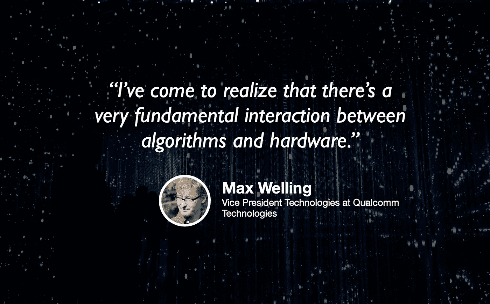

# 机器学习的未来

> 原文：<https://towardsdatascience.com/the-future-of-machine-learning-cd5b8b6e43cd?source=collection_archive---------43----------------------->

## [苹果](https://podcasts.apple.com/ca/podcast/towards-data-science/id1470952338?mt=2) | [谷歌](https://www.google.com/podcasts?feed=aHR0cHM6Ly9hbmNob3IuZm0vcy8zNmI0ODQ0L3BvZGNhc3QvcnNz) | [SPOTIFY](https://open.spotify.com/show/63diy2DtpHzQfeNVxAPZgU) | [其他](https://anchor.fm/towardsdatascience)

## Max Welling 在 [TDS 播客](https://towardsdatascience.com/podcast/home)

*编者按:迈向数据科学播客的“攀登数据科学阶梯”系列由 Jeremie Harris 主持。Jeremie 帮助运营一家名为*[*sharpes minds*](http://sharpestminds.com)*的数据科学导师初创公司。可以听下面的播客:*

在过去十年中，机器学习的进步来自两件事:计算能力的提高和更好的算法。这两个领域在大多数人的思维中已经变得有些孤立:我们倾向于想象有人构建硬件，有人制作算法，这两者之间没有太多的重叠。

但是这张图是错的。硬件限制可以并确实影响算法设计，而算法可以用来优化硬件。计算和建模越来越多地被这两个领域的专家一起优化。

我今天的嘉宾是世界领先的机器学习应用软硬件集成专家之一。Max Welling 是一名前物理学家，目前在世界领先的芯片制造商高通公司担任技术副总裁，此外，他还是加州大学欧文分校、CIFAR 和阿姆斯特丹大学的机器学习研究员。关于机器学习的研究现状以及该领域的未来方向，Max 有许多见解可以分享，以下是我最喜欢的一些对话:

*   计算耗费能量，并且很快耗尽手机电池，因此机器学习工程师和芯片制造商需要想出聪明的方法来降低运行深度学习算法的计算成本。实现这一点的一种方法是压缩神经网络，或识别可以在对性能影响最小的情况下删除的神经元，另一种方法是减少用于表示每个网络参数的位数(有时甚至减少到一位！).这些策略往往会一起使用，而且它们在某些方面有着相当深刻的联系。
*   目前，机器学习模型是针对非常具体的问题进行训练的(比如将图像分类到几百个类别，或者从一种语言翻译到另一种语言)，如果它们被应用于甚至稍微超出它们被训练的领域，它们就会立即失败。例如，一个经过训练的计算机视觉模型在一个以深色皮肤为特征的数据集上识别面部表情，当在一个以浅色皮肤为特征的不同数据集上进行测试时，表现将会不佳。生活经验告诉人类，肤色不应该影响对面部特征的解释，但这种微小的差异足以推翻当今甚至最先进的算法。
*   因此，真正的挑战是可推广性——人类在这方面仍然比机器做得好得多。但是我们怎么训练机器学习算法去泛化呢？马克斯认为，答案与人类的学习方式有关:与机器不同，我们的大脑似乎专注于学习物理原理，比如“当我拿一个东西扔向另一个东西时，那些东西会相互反弹。”这个推理在某种程度上独立于这两件事。相比之下，机器倾向于从另一个方向学习，不是根据普遍的模式或规律进行推理，而是根据适用于非常特殊的问题类别的模式进行推理。
*   出于这个原因，Max 认为机器学习最有前途的未来发展领域将集中在学习逻辑和物理规律上，而不是这些规律或原则的具体应用上。

你可以在这里的 Twitter 上关注 [Max，在这里](https://twitter.com/wellingmax)的 Twitter 上关注我[。](https://twitter.com/jeremiecharris)