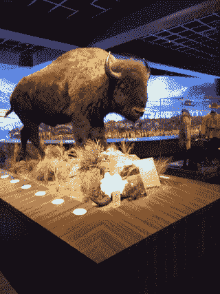
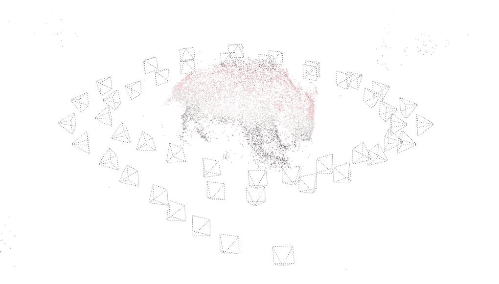
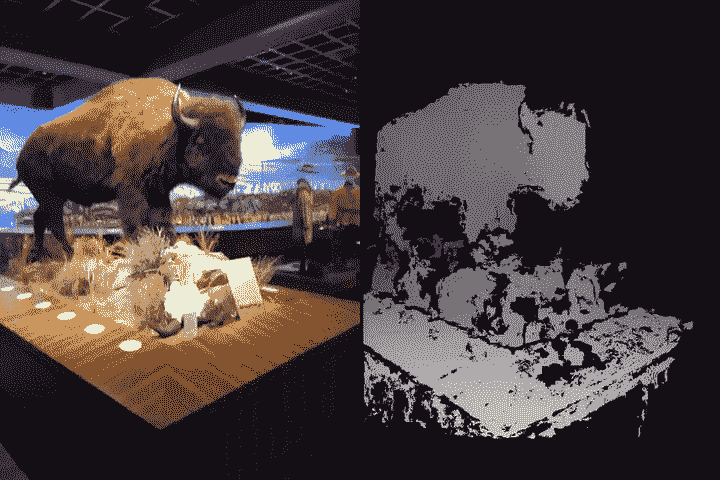
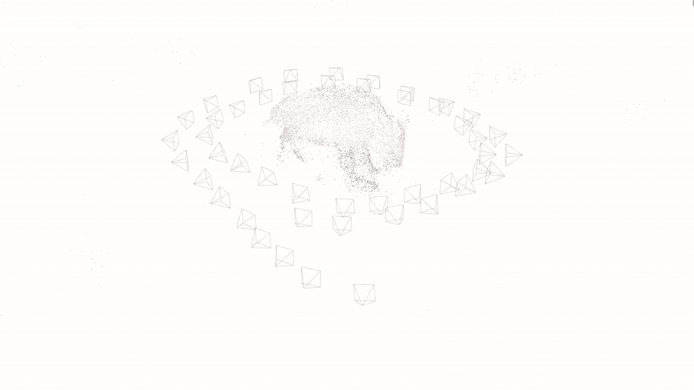
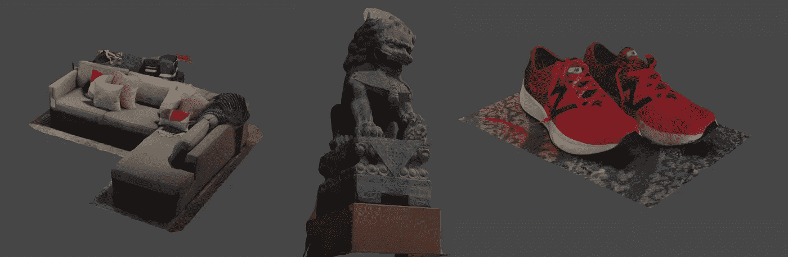
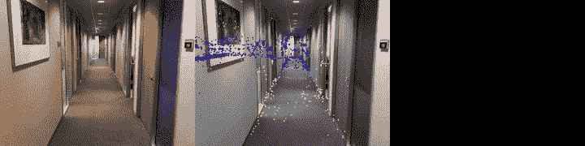
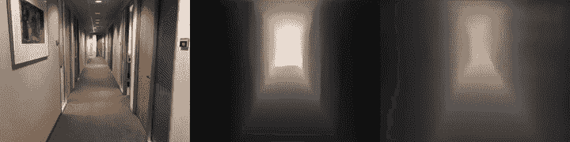
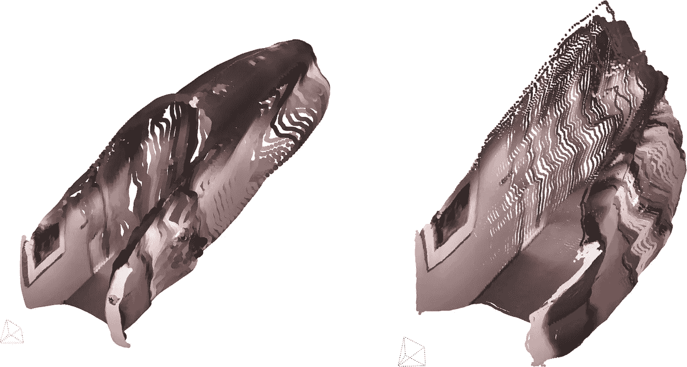
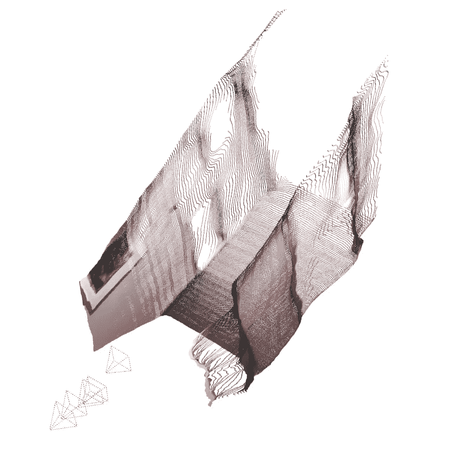
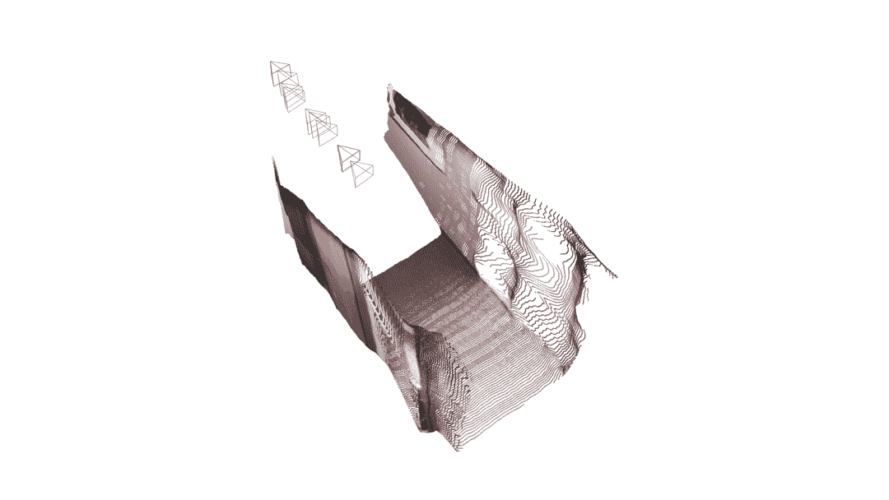

# 地图的未来是可以学习的

> 原文：<https://towardsdatascience.com/the-future-of-mapping-is-learned-e13e93c03e22?source=collection_archive---------30----------------------->

## 探索鲁棒可视化地图构建的新方法

根据视频数据对 3d 世界进行推理是许多系统的一个重要方面；室内/室外导航、自主感知、持续增强现实(AR)等等。在这篇文章中，我们将探索使用传统和现代的方法将视频提取为对机器和人类都有用的信息。

作为一个激励人心的例子，考虑一下在黑鹰历史博物馆捕捉这头雄伟的美洲野牛的 3d 本质的任务:

美国野牛展(黑鹰博物馆，圣拉蒙)

利用现代的运动结构(SfM)管道，捕捉完全三维的纹理模型是可能的。在这种方法中，相机的姿态(其连续的位置和方向)和稀疏的、有区别的场景特征被联合估计。通过解决这个问题(相机在哪里，它在看什么),我们可以捕捉主体的简洁、准确的表现:

从上面的视频中估计的摄像机位置，以及稀疏的有区别的场景点

尽管该场景模型对于定位相机(在初始捕获期间以及任何后续的重新访问期间)是有用的，但是对于想要与场景本身进行交互的任何人来说，它的用途是有限的。为此，我们需要一个密集的网格。

为了构建更引人注目的东西，我们需要捕捉更精细的细节。多视图立体(MVS)是一个广泛的算法家族的总称(见[此处](http://vision.lems.brown.edu/sites/default/files/Seitz-etal-CVPR2006.pdf)的概述)，一旦摄像机轨迹已知，该算法恢复一个明显更密集的场景表示(增加了计算负担)。下面的视频显示了使用估计的相机位置从上面的场景恢复的深度图(每像素范围，以米为单位):

场景的密集深度估计；原始图像(左)，稀疏采样的深度图(右)

大多数 MVS 方法利用光度一致性测量；给定一幅图像中的一小块图像，这与另一幅图像中的候选匹配有什么关系？通过关联补丁和三角测量结果，我们可以恢复一个更密集的近似。然而，因为基础面片是场景几何图形、照明和纹理的函数，所以经常有大面积区域缺乏精确的深度估计(这将在后面变得明显)。鉴于这种密集的点云，我们可以从各种[表面重建方法中选择](https://hal.inria.fr/hal-01348404v1/document)来构建最终的模型，下面的动画展示了一个例子:

相机位置和稀疏场景特征与估计的密集纹理模型的叠加

这种纹理网格表示非常容易处理，对于以对象为中心的贴图任务，这种方法表现很好。下面是一些其他的例子:

普通物体的纹理网格；组合沙发(左)、雕像(中)、跑鞋(右)

但是这种方法如何推广呢？考虑一个不同的用例，即典型办公环境中的大规模室内制图。下面的视频显示了以下对比:a)原始视频采集，b)投影到图像中的恢复的稀疏场景结构，以及 c)相应的恢复的深度图:

从大量丢失的深度帧中可以明显看出，无纹理区域现在是有问题的。虽然相机位置和方向的估计是准确的，但生成一个非常密集的场景是一项具有挑战性的任务。(这里，系统参数在以对象为中心和通用映射模式中保持不变；我们可以花时间调整它们以产生更好的上下文深度估计，但这不是本文的重点)。

给定规则的棱镜场景结构，更有效的方法是**学习**从外观到深度的映射。这样，我们可以针对无纹理区域建立鲁棒性。深度卷积神经网络的进步与“地面真实”室内数据集(例如[ [1](http://rgbd.cs.princeton.edu/) 、[ [2](https://cs.nyu.edu/~silberman/datasets/nyu_depth_v2.html) 、[ [3](http://pr.cs.cornell.edu/sceneunderstanding/data/data.php) )的爆炸结合在一起，使得高性能深度估计架构的开发成为可能。对于这个问题，有多种不同的方法来恢复场景结构:

1.  学习直接从单目图像到深度的映射，不考虑空间一致性(例如[ [1](https://arxiv.org/pdf/1812.11941v2.pdf) ]，[ [2](https://arxiv.org/pdf/1606.00373v2.pdf) ]，[ [3](https://arxiv.org/abs/1806.02446) ])
2.  通过使用多个图像及其估计的姿态(来自 SfM 步骤)来结合空间一致性，以学习更好的立体深度估计器(例如[ [1](https://arxiv.org/abs/1807.08563v1) ]、[ [2](https://arxiv.org/abs/1902.02166v2) 、[ [3](https://arxiv.org/abs/1905.00538v1) ])
3.  直接回归输出目标点云，而不是深度帧(例如[ [1](https://arxiv.org/abs/1908.04422) ])

下图显示了从[单目](https://github.com/ialhashim/DenseDepth)密集深度实现和习得 [MVS](https://github.com/HKUST-Aerial-Robotics/MVDepthNet) 估计器获得的深度图的比较:

单目深度估计(中)和多视图立体深度(右)与输入影像(左)的比较

(注意，以上视频仅供定性评价；不同的训练集和 SfM 输出的质量极大地影响所得的深度图)。

来自单目估计器的输出通常更一致，尽管给定模型的单次拍摄性质，聚合帧缺乏学习 MVS 方法的全局度量准确性。然而，依赖于运动来推断深度的方法在经历退化运动(仅旋转或小平移)时会受到影响。我们可以并排比较这些系统的指标输出:

使用上面显示的数据集对 DenseDepth(左)与 MVDepthNet(右)进行定性比较。

虽然令人信服，我们仍然需要将这些单独的估计融合成一个令人信服的整体，这提出了单独的挑战。如何将这种方法更进一步，在同一模型中联合估计相机运动**和**密集输出？通过这种方式，我们不需要在离散的步骤中估计相机运动和密集场景输出。

几种方法已经考虑估计密集摄像机深度和运动(例如[[1](https://arxiv.org/abs/1808.01900v2)][[2](https://arxiv.org/abs/1612.02401v2)][[3](https://arxiv.org/abs/1912.09697v1)])；这里我们考虑架构 [DeepV2D](https://arxiv.org/abs/1812.04605) 架构。DeepV2D 使用“块”坐标下降来估计场景和相机几何；固定的相机姿态用于构建密集的场景表示，该场景表示随后用于改进相机估计。相机姿势示例(红色)和生成的场景如下所示:

DeepV2D 相机和场景几何

根据[相似的室内数据](http://www.scan-net.org/)训练的模型的适用性从上面显示的输出中显而易见。虽然应用于不同领域(例如室外区域)时性能会下降，但在合理的时间范围内(推断时间与数据集采集时间成比例)从测试相关环境中推断相机运动和密集场景几何的能力令人印象深刻。

随着[不断提高](https://heartbeat.fritz.ai/ios-12-core-ml-benchmarks-b7a79811aac1)在设备上的性能，未来的方向是明确的；学习如何推理深度和运动来构建地图是一种构建大比例的鲁棒、精确地图的强大方法。

