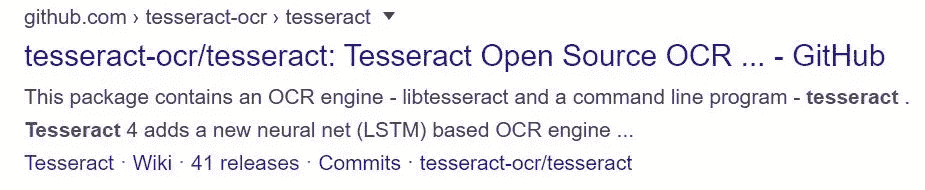
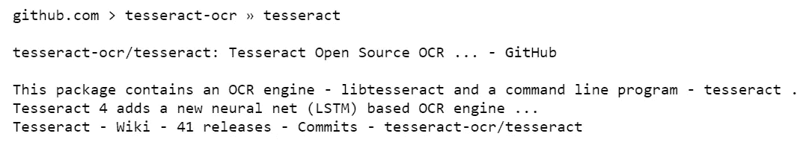
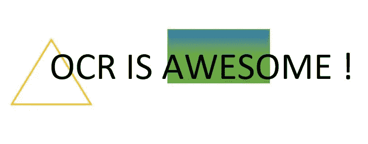
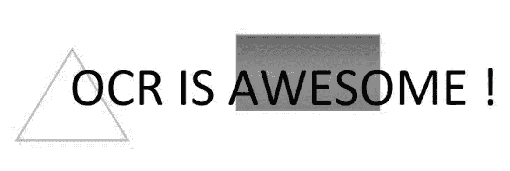
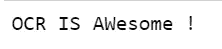
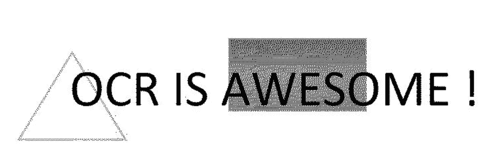
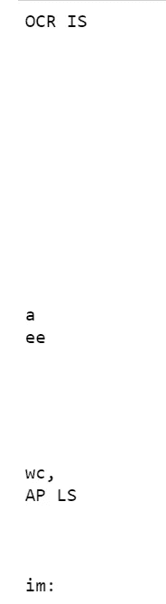
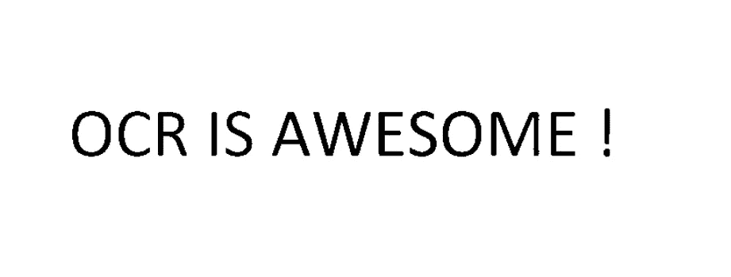
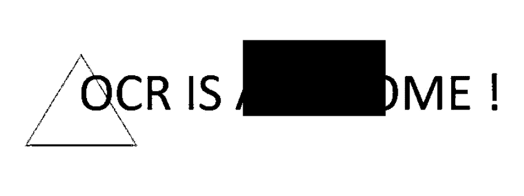

# 文本识别的未来是人工智能

> 原文：<https://towardsdatascience.com/the-future-of-text-recognition-is-artificial-intelligence-ead2a1c65471?source=collection_archive---------44----------------------->

## Google 的 Tesseract-OCR 引擎简介


库尔特·卡吉尔的照片

21 世纪是数字化连接的时代。我们不再发送手写信件，也很少使用印刷文本，原因很简单，我们变得过于依赖电脑来处理数据，让生活变得更轻松。这些原因使我们需要找到一种方法来数字化纸质文件，使其能够被电子编辑、操作、搜索、管理、存储，特别是由机器来解释。

光学字符识别使得将打印、手写或印刷文本图像中捕获的文本转换成数字化和可用的机器编码文本成为可能。

光学字符识别是人工智能和计算机视觉的研究领域，包括从图像中提取文本。

今天，由于使用了人工智能工具，OCR 正在经历一场前所未有的革命。OCR 不仅成为传统的图像到文本的转换过程，而且成为人为错误的检查器。

OCR 工具可以将图像中捕获的文本转换成计算机可用的文本。

我们将在本文中讨论的工具是宇宙魔方。


宇宙魔方的标志

## 宇宙魔方:改变我们认知光学字符识别方式的研究项目

Tesseract 是一个用 C 和 C++编写的开源 OCR 引擎，最初是在 1984 年到 1994 年间由 HP 开发的。Tesseract 最初是布里斯托尔惠普实验室的一个博士研究项目，是惠普扫描仪的一个可能的软件/硬件附件。当时的商业 OCR 引擎很弱，无法达到令人满意的准确度。1995 年，就字符准确性而言，Tesseract 是 OCR 引擎的前三名。该引擎随后被送往 UNLV 进行 1995 年的 OCR 准确性年度测试，在测试中，它证明了自己与当时的商用引擎相比的价值。2005 年末，惠普发布了开源的宇宙魔方。现在在 http://code.google.com/p/tesseract-ocr 的[可以买到。](https://github.com/tesseract-ocr/)

2006 年，Google 开始赞助和维护这个工具，并发布了具有不同架构和 100 多种语言支持的 Tesseract 更新版本。

宇宙魔方的 4.0 版本使用了基于 LSTMs 的神经网络系统，然后惊人地提高了它的准确性。它接受了 123 种语言的训练，这使得宇宙魔方成为一个伟大的工具，也是人工智能如何从事文本识别研究的一个很好的例子。

## 现在让我们进行一些练习，学习如何使用 Python 中的 Tesseract 系统来执行光学字符识别！

为了通过 Python 编程语言访问 Tesseract，我们使用 Python-tesseract 包。Python-tesseract 是 Google 的 Tesseract-OCR 引擎的包装器，并提供了 tesseract 系统二进制文件的接口。

让我们从导入 Python-tesseract 包开始。

```
import pytesseract
```

我们导入 **Python 图像库** ( **PIL** )来处理我们想要应用 OCR 的图像。

图像模块是必需的，以便我们可以加载我们的 PIL 格式的图像。Pytesseract 需要这种格式。

```
import PIL
from PIL import Image
```

我们使用 PIL 加载我们的图像。Image.open 函数

```
image=Image.open(‘tesseract.JPG’)
```

让我们展示我们的形象

```
display(image)
```



谷歌搜索宇宙魔方的截图

现在我们可以使用 pytesseract.image _ to _ string 函数对我们的图像应用 OCR。该函数将图像上运行的 Tesseract OCR 的结果返回到 string。

```
text=pytesseract.image_to_string(image)
```

让我们打印文本变量以查看 OCR 的结果

```
print(text)
```



使用 Tesseract 从图像中提取文本的结果

我们可以看到我们获得了完美的结果。pytesseract.image_to_string 函数准确提取图像中捕获的文本。

我们应用 OCR 的图像很清晰，但不幸的是，现实生活中的情况远非完美，图像通常有噪声，这使得前景文本与背景的清晰分离成为一个真正的挑战。

让我们试着在嘈杂的图像上运行宇宙魔方。

我们将提取此图像中捕获的文本作为示例:



我们以同样的方式处理。我们加载我们的图像作为一个 PIL。Image 对象并将其传递给 pytesseract.image_to_string 函数以从中提取文本。

您可以看到该函数返回了一个空字符串，因为它没有成功地从图像中提取文本。

然后我们需要预处理我们的图像！

在这里，我将建议 3 种方法，你可以用来改善有噪声的图像的镶嵌性能。这些技巧并不简单，它们高度依赖于图像中的内容。

## 第一种方法:将图像转换为灰度

在灰度图像中，每个像素的值是仅代表光量的单个样本。灰度图像可以是测量每个像素的光强度的结果。

灰度图像中的像素可以是 0 到 255 之间的任何值。然后图像由 256 个灰度组成。

要将 PIL 图像转换为灰度图像，我们使用:

```
gray= image.convert(‘L’)
```

PIL。Image.convert 方法返回图像的转换副本。

让我们保存这个副本:

```
gray.save(‘gray.jpg’)
```

现在让我们加载并显示它，看看灰度图像是什么样的:

```
grayscale_image=Image.open(‘gray.jpg’)
display(grayscale_image)
```



灰度图像看起来像黑白图像，但它们是不同的。一位双色调黑白图像是只有两种颜色的图像:黑色和白色。灰度图像之间有许多灰色阴影。

现在让我们在图像的灰度版本上运行 Tesseract。

```
text=pytesseract.image_to_string(grayscale_image)
print(text)
```

我们得到的结果是:



我们可以看到，对图像进行灰度化可以提高镶嵌的性能。

## 第二种方法:图像二值化

在这种方法中，我们将通过二值化从图像中提取文本。

图像二值化是拍摄图像并将其转换为黑白图像的过程，然后将图像的灰度版本中包含的信息从 256 种灰度减少到 2 种:黑白，即 ***二值*** 图像。

我们可以使用以下方法将图像二值化:

```
binary= image2.convert(‘1’)
```

这将制作图像的二进制副本，并将其存储在二进制 PIL 中。图像对象。

我们保存副本，加载并显示它:

```
binary.save('binary.jpg')
binary_image=Image.open(‘binary.jpg’)
display(binary_image)
```



输出图像

现在，让我们运行它的宇宙魔方:



哼，结果看起来不像我们预期的那样。为什么以及如何改进我们的二值化？

二值化过程通过选择一个 ***阈值*** 来进行。在图像的灰度版本中，小于所选*阈值*的像素被设置为 0(黑色)，大于*阈值*的像素被设置为 255(白色)。

我们获得的结果可能是由于阈值的错误值，因为我们使用了默认的二值化函数。让我们构建我们自己的函数，一个传递图像和阈值的函数，它使用选择的阈值返回二值化的结果。

```
def binarize(image,threshold):
    binary_image=image.convert(“L”)
    for x in range(binary_image.width):
      for y in range(binary_image.height):
        if obinary_image.getpixel((x,y))< threshold: 
          binary_image.putpixel( (x,y), 0 )
        else:
          binary_image.putpixel( (x,y), 255 )
    return output_image
```

该功能:

1.将图像转换为灰度

2.遍历图像的像素，

3.将像素值与阈值进行比较:如果像素值小于阈值，则将其值更改为 0(黑色)，否则更改为 255(白色)。

现在，让我们用不同的阈值运行我们的函数，看看它如何影响 Tesseract 的性能:

**Threshold= 0:** 我们获得了白色图像，因为灰度图像中的所有像素都包含在 0 到 255 之间。宇宙魔方然后无法检测任何文本。

**Threshold= 64:** 我们获得了一个只有文字可见的清晰图像。我们的函数从图像中移除了噪声背景，这使得 Tesseract 更容易从图像中提取文本。



**Threshold= 192:** 我们的函数覆盖了文本的一部分，对图像运行的 OCR 返回了一个空字符串。



**Threshold= 256:** 我们获得了黑色图像，因为灰度图像中的所有像素都包含在 0 到 255 之间。宇宙魔方然后无法检测任何文本。

## 第三种方法:调整图像大小

有时，一个糟糕的宇宙魔方的性能可能是由于图像的大小。检测大图像或小图像中的文本有时会很困难。PIL 有一个特殊的功能，可以通过多种选项和滤镜来帮助您调整图像的大小:

```
PIL.Image.resize
```

这个函数返回这个图像的一个调整过大小的副本。

它需要两个参数:

*   **size** :以像素为单位的请求大小，作为一个二元组:(宽度，高度)。
*   **重采样:**一个可选的重采样过滤器。这可以是`**PIL.Image.NEAREST**`(使用最近邻)、`**PIL.Image.BILINEAR**`(线性插值)、`**PIL.Image.BICUBIC**`(三次样条插值)或`**PIL.Image.LANCZOS**`(高质量下采样过滤器)之一。如果省略，或者如果图像具有模式“1”或“P”，则设置`**PIL.Image.NEAREST**`。

# 总结

在本文中，您了解了 Google 的 Tesseract-OCR 引擎，它是如何开始的，以及它如何使文本识别比以往更加准确。您还学习了如何使用 Python-tesseract 包通过 Python 访问 Tesseract。您还了解了如何对图像应用 OCR，以及如何提高 Tesseract 在有噪声的图像上的性能。既然你已经掌握了所有的基本技能，为什么不构建一个扫描仪移动应用程序，它将图像作为输入，对其运行 OCR，并将结果写入文本文件。这将是你学习宇宙魔方的最大一步！

*查看我为教程* [*做的 Github 库这里*](https://github.com/mellouksafae/Tesseract-OCR_tutorial) *！*