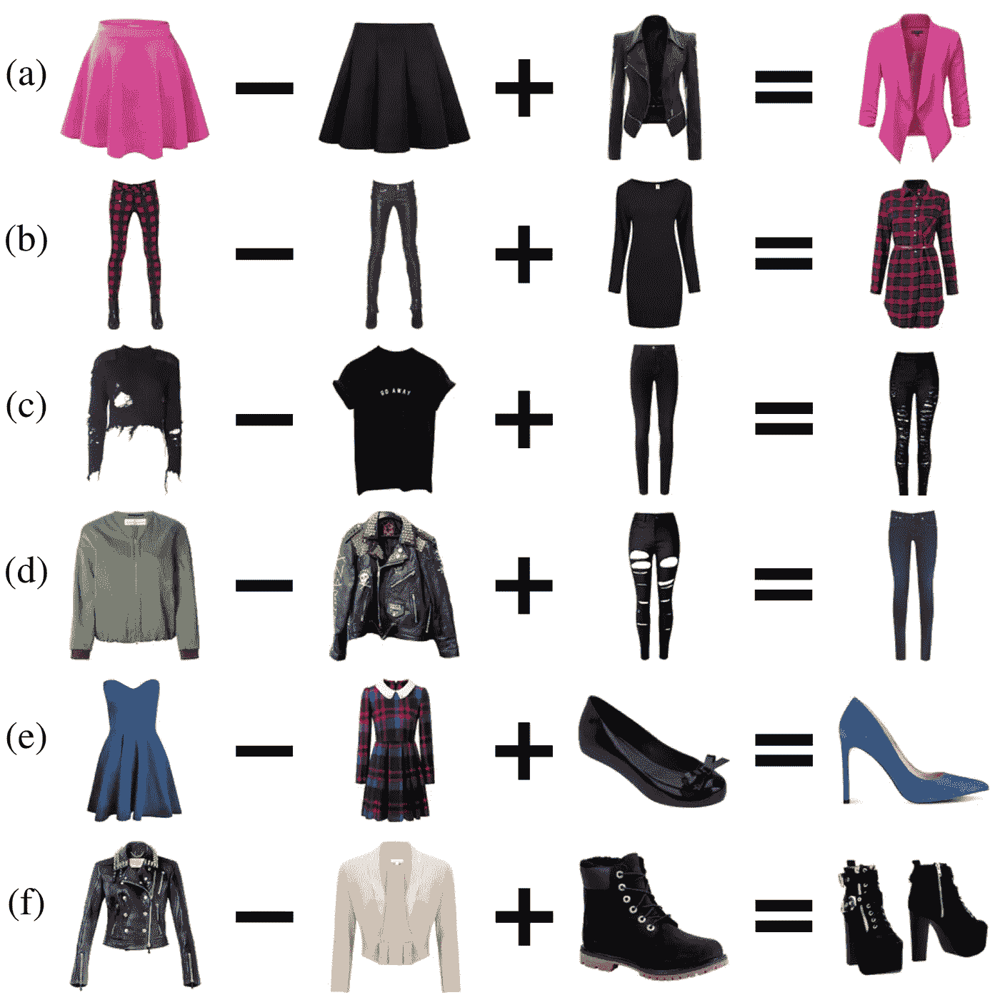
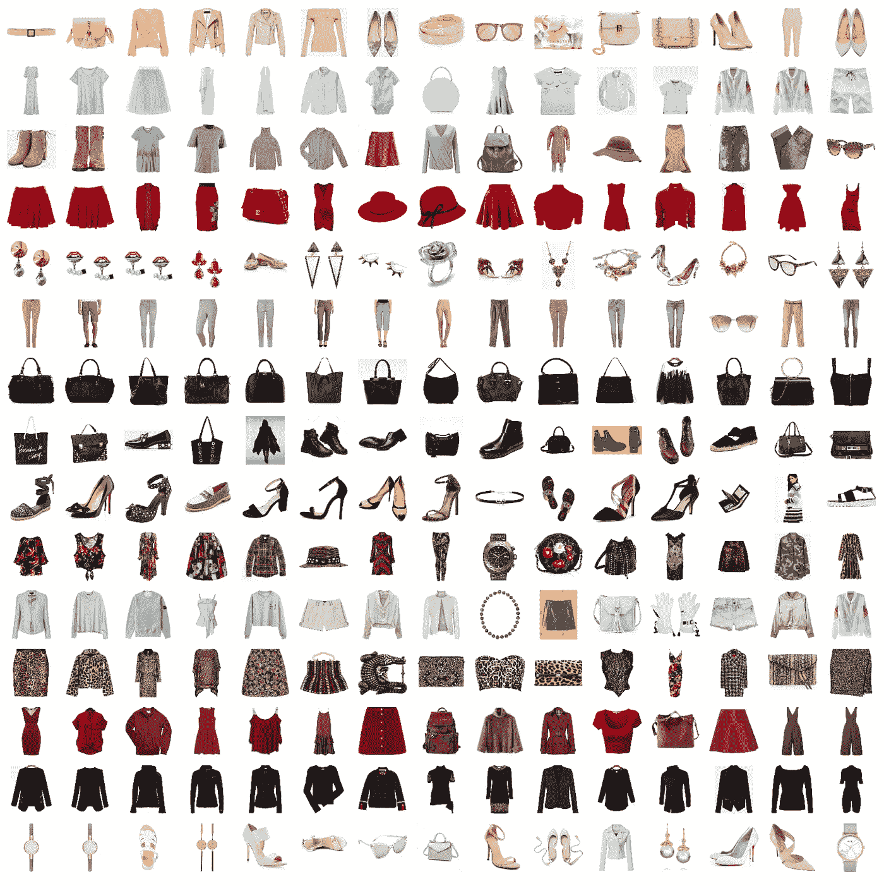
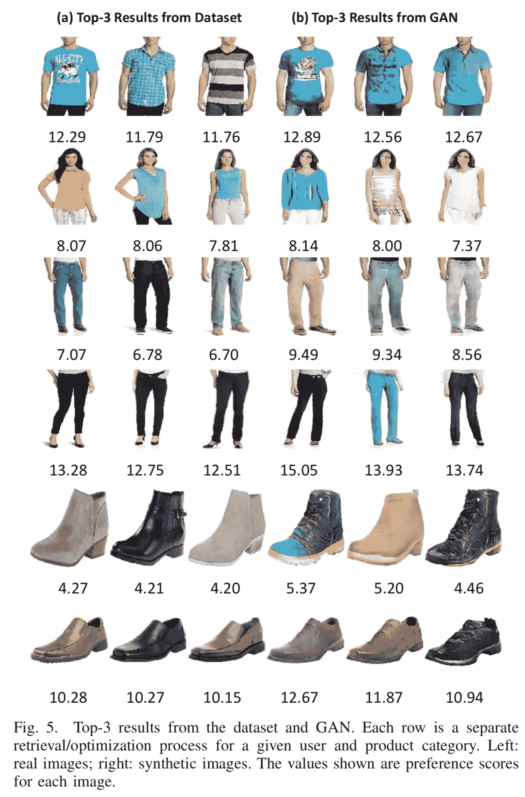
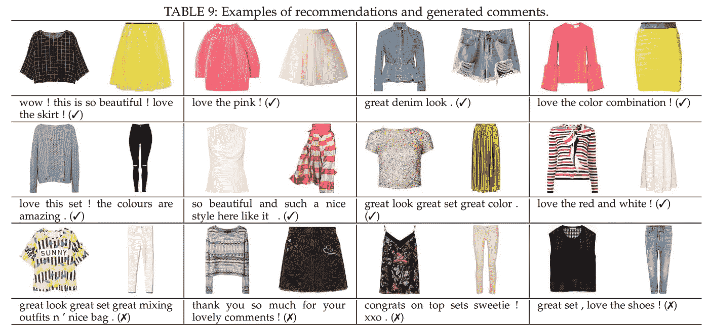

# 视觉推荐系统的未来:四种实用的最新技术

> 原文：<https://towardsdatascience.com/the-future-of-visual-recommender-systems-four-practical-state-of-the-art-techniques-bae9f3e4c27f?source=collection_archive---------33----------------------->

## 现代 RecSys

## visual RecSys 的未来令人振奋。让我们探索一些最前沿的技术和想法，我们可以纳入我们的推荐。

# style 2 vec(2017)——结合多个卷积神经网络

Lee，h .，Seol，j .，，Lee，S. (2017 年)。Style2Vec:从风格集中学习时尚物品的表征。从[https://arxiv.org/abs/1708.04014](https://arxiv.org/abs/1708.04014)开放访问

> 作者“提出了时尚物品的向量表示模型 Style2Vec。基于单词嵌入中使用的分布语义的直觉，Style2Vec 使用匹配服装中的其他项目作为上下文来学习时尚项目的表示。训练两个不同的卷积神经网络，以最大化项目共现的概率”(Lee et al .，2017)。

论文很短，但想法很吸引人。使用两个 CNN 模型，其中一个为目标图像生成嵌入**，而另一个为**相似上下文项目**生成嵌入，这是从 [Word2Vec](/introduction-to-word-embedding-and-word2vec-652d0c2060fa) 派生的技术对图像的新颖应用。如果我们看看上面的图片，例如(a)我们有**粉色裙子** — **黑色裙子+** **黑色夹克** = **粉色夹克**。值得注意的是，我们添加/减去了通常不表示为产品属性的**特征**，例如示例(c)中的漏洞。因此，Style2Vec 允许我们以不同的方式组合/选择样式。**

由[大卫·内珀里泰克](https://github.com/DavidNepozitek)实施。在 [Github](https://github.com/DavidNepozitek/Style2Vec) 上开源。

David Nepož itek 实施了 Style2Vec 论文中提出的想法，并在 Github 上开源了代码。从他的报告中得到的[结果令人印象深刻](https://github.com/DavidNepozitek/Style2Vec/blob/master/docs/Report.md)，正如你从上图中看到的，他成功地将颜色、图案和形状相似的物品分组。我们可以利用这样的结果，根据用户的喜好生成整套服装和系列。

# 带 GAN 的生成式图像模型(2017)

康维成，方志成，王志忠，麦考利(2017)。视觉感知的时尚推荐和生成图像模型设计。从[https://arxiv.org/abs/1711.02231](https://arxiv.org/abs/1711.02231)|[代码](https://github.com/kang205/DVBPR)打开访问

> 作者使用了**生成对抗网络(GAN)** ，“一种无监督的学习框架，其中两个组件‘竞争’以生成看起来真实的输出...一个组件(生成器)被训练来生成图像，而另一个组件(鉴别器)被训练来区分真实图像和生成的图像。因此，生成的图像经过训练，在某种意义上看起来“逼真”，与数据集中的图像无法区分”(Kang et al .，2017)。

GAN 允许我们为我们的用户生成**理想的产品**，即使它不存在于产品目录中。上面的图像是输出。左边是真实的图像，右边是生成的图像，我们可以看到右边的图像通常有更高的偏好得分。有两种生成理想产品的用例。

首先，**甘帮助我们建立了对用户喜好的认知**并用图像具体地表现了这种认知。我们可以利用类似 CNN +最近邻居的技术来选择视觉上最接近理想状态的物品。

此外，**甘协助产品采购和设计**。如果我们知道带有紫色条纹的绿色衬衫是理想产品中的一种增长趋势，我们可以在客户向我们提出之前引入/创造这样的产品来满足市场需求。即使绿色带紫色条纹的衬衫并不完全是客户现在想要的，但甘让我们能够对市场需求和变化采取主动，而不是被动。

# 带评论生成的可解释服装推荐(2019)

林，杨，任，陈，任，马，李，等(2019)。具有联合服装匹配和评论生成的可解释服装推荐。从[https://arxiv.org/abs/1806.08977v3](https://arxiv.org/abs/1806.08977v3)|[代码](https://bitbucket.org/Jay_Ren/fashion_recommendation_tkde2018_code_dataset/src/master/)打开访问

> 作者“提出了一种新的神经网络框架，神经装备推荐(NOR)，它同时提供装备推荐和生成抽象评论。NOR 由两部分组成:服装搭配和评论生成。对于服装匹配，我们提出了一种具有相互注意机制的卷积神经网络来提取视觉特征……对于抽象评论生成，我们提出了一种具有跨通道注意机制的门控递归神经网络，来将视觉特征转换为简洁的句子”。

基于 CNN 的 RecSys 功能强大，但是很难解释输出。已经有单独的尝试，由乌特库·奥兹布拉克[可视化 CNN 渐变，](https://github.com/utkuozbulak/pytorch-cnn-visualizations) [生成多纳休、j .等人](https://github.com/ekinakyurek/Long-Term-Recurrent-Convolutional-NN)的图像评论。然而，将这两种技术结合起来并将其应用到 RecSys 的环境中并不容易。如果我们看看上面的合成图，我们会发现这是理解这些建议的第一步，其中**“很棒的牛仔装”、“喜欢红白相间”**是解释为什么推荐这些服装的好例子。但在最后一排的反面案例中，我们可以看到**评论生成本身并不完美**；有时它描述的东西在图像中找不到，或者完全脱离了上下文。请注意，作者**使用社区驱动的社交商务网站**Polyvore 的数据构建了评论生成模型。

**尽管如此，可解释的人工智能(XAI)是理解、评估和在生产中部署深度学习解决方案的关键部分。**为了获得更多关于 XAI 的信息，[菲菲](https://github.com/feifeife)收集了[令人印象深刻的 XAI 资料](https://github.com/feifeife/All-about-XAI)。

# 私人个性化 RecSys (2020)

越来越多的 RecSys 被部署在隐私敏感领域，如[医疗](https://www.mdpi.com/2079-3197/7/2/25/htm)、[教育](https://www.sciencedirect.com/science/article/pii/S1877050910003194)和[金融](https://www.sciencedirect.com/science/article/pii/S0167923615001153)。我们想要个性化医疗保健/教育/金融计划的好处，但同时，对放弃我们的数据，然后将它们丢失给黑客的恐惧是真实的。这似乎有些矛盾— **我们如何在维护用户隐私的同时构建个性化的 RecSys？**

早在 2009 年，微软研究院的 McSherry & Mironov 在他们的论文[中用一个简单的想法探索了这个问题。本质上，**我们可以按照**](https://www.microsoft.com/en-us/research/wp-content/uploads/2009/06/NetflixPrivacy.pdf)[**ε-差分隐私**](https://www.microsoft.com/en-us/research/wp-content/uploads/2009/06/NetflixPrivacy.pdf) (这背后的实际数学是非平凡的)给条目评分和条目-条目协方差矩阵添加噪声。换句话说:

*   我们屏蔽掉任何特定用户的**识别特征**(用户 A 在每个月的第一个星期一购买粉色衬衫)。
*   获取**大趋势**(用户的 X 部分喜欢购买粉色衬衫)
*   隐私损失在数学上被证明受因子ε的限制。
*   虽然在设计 RecSys 时，差分隐私是一种用于衡量内部风险的**有用指标，但向用户解释起来并不直观，也不能保证数据是安全的。**

Ribero 等人(2020 年)的一篇新论文扩展了这个想法，使用不同的私有原型联合推荐[。联合学习是分布式机器学习的一种现代方法。](https://arxiv.org/pdf/2003.00602.pdf)

*   我们不是在中央服务器上训练大规模的模型，而是将小的(兆字节大小的)模型发送到用户的设备上。
*   在设备空闲期间，模型通过其数据在用户设备上进行**训练。**
*   我们**只把** **的训练结果发回**到一个集中的服务器。

你可以看到谷歌漫画对这一过程的图解。通过结合差分隐私和联合学习，Ribero 等人提出了一种新的方法来解决私有、个性化 RecSys 的问题。

> “大多数联合学习方法需要实体和中央服务器之间的**多轮**通信，这给**不同的隐私要求**带来了问题。具体来说，我们可以将从实体到服务器的每一轮通信视为发送到各个实体的查询，这有**可能会泄漏信息……**(因此)我们将通信限制为**来回两轮**(Ribero 等人，2020)。

当然，这是一个具有挑战性的问题。为了将轮次减少到只有两轮，该团队需要想出一种新颖的方法来压缩数据，然后以可访问的形式保存。他们将这些数据结构命名为“原型”:

> 这些原型被设计成:a)包含与 Xh 相似的信息，从而允许构建精确的项目表示；b)相对于 Xh 是低维度的，因此最小化通信负载；以及 c)相对于单个用户保持不同的隐私。

这份文件是一个具有挑战性的阅读一个迅速发展和重要的主题。如果你有兴趣了解更多关于联邦学习和差异策略的知识， [lee-man](https://github.com/lee-man) 正在他们的 Github 帖子上收集**一系列阅读材料、工具和代码。**

# 进一步阅读

Visual RecSys 是一个令人兴奋的领域，希望您喜欢我们今天讨论的各种技术。有关 RecSys 的更多前沿内容，您可以探索

*   ACM RecSys 上的收藏和他们的 YouTube 频道是 RecSys 世界里最大的事件。
*   Spotify 的工程博客令人印象深刻。查看他们最近关于个性化的帖子。
*   网飞的科技博客当然是另一个很好的读物，它涵盖了许多现实世界的部署和可伸缩性挑战。
*   Zalando 是一家拥有强大研究团队的电子商务公司。他们的出版物值得一读。
*   Recombee 提供推荐即服务，[有一个很好的媒体博客](https://medium.com/recombee-blog)，报道他们公司使用的技术。