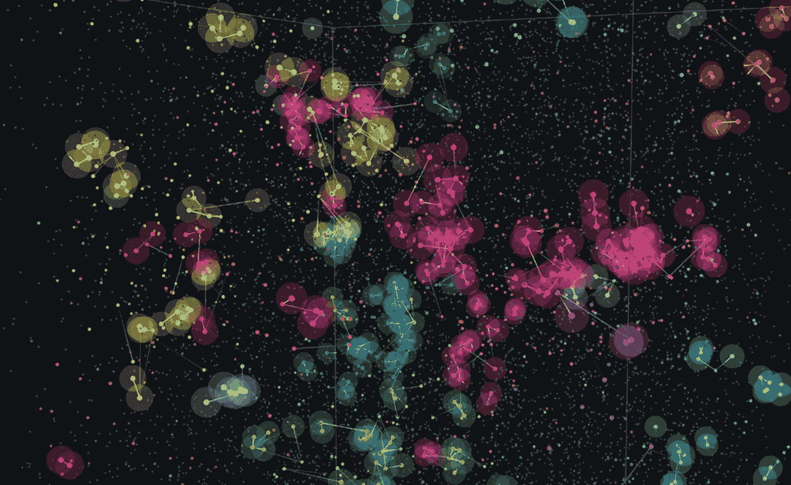

# 银河岛假说

> 原文：<https://towardsdatascience.com/the-galactic-island-hypothesis-874f28a443d5?source=collection_archive---------28----------------------->

## 新的研究为费米悖论提供了一个定量的解决方案

模拟的定居轨迹，展示了文明如何在银河系中传播

与银河系的年龄相比，我们 20 万岁的人类物种只存在了一眨眼的时间。银河系至少有 100 亿年的历史，可能包含超过 2000 亿颗恒星。2013 年，开普勒太空望远镜(Kepler space telescope)的数据显示，大约五分之一的类太阳恒星包含一颗可居住的行星，既不太热也不太冷，不适合生命存在。如果 10%的恒星是类太阳的，这意味着在我们的银河系中可能有大约*40 亿颗类地行星。如果生命起源于地球，那么它肯定也起源于那 40 亿个世界中的一些:*

> “你就没想过大家都去哪儿了吗？”

这是恩利克·费密在 1950 年与科学家们共进午餐时提出的著名问题。*费米悖论*意识到我们的星系应该充满生命，然而迄今为止我们遇到的唯一文明是我们自己。

## 费米悖论的解决方案

自从它首次提出以来，人们已经提出了许多解决这一悖论的方法。

这是一个技术上的争论:也许，这个争论是这样的，文明只是不知道如何进行星际旅行。以比邻星为例，它是我们最近的恒星邻居，目前距离我们 4.24 光年。即使以旅行者 1 号的速度，我们迄今为止最快的太空飞船，我们仍然需要大约 80，000 年才能到达那里。如果由于物理或经济的原因，文明不能发展出比这更快的技术，星际旅行可能根本不可行。

其他人认为外星文明存在，但只是对星际探索不感兴趣，或者他们已经发现了我们，但决定离开我们，这样不会破坏我们的生态系统。然后是“大过滤器”的想法:在一个文明从单细胞生物进化到多星球物种的过程中，也许有一个进化步骤极其难以实现，因此起到了过滤器的作用。例如，过滤器可能会自毁。所有的文明都有可能在达到星际旅行的技术水平之前最终自毁。郁闷。

请注意，这两个都不是量化的陈述，这使得很难得出任何结论。如果我们想对费米悖论做一个量化的陈述，也许计算机模拟是一个更好的方法。

## 银河岛假说

智能文明将如何在银河系中传播？为了回答这个问题，首先我们需要考虑恒星运动。我们银河系中的恒星由于引力而不断运动。这种运动非常复杂，看起来几乎是随机的。这是欧空局对此效果的模拟:

星系中恒星运动的模拟(欧空局)

由于恒星的运动，我们的恒星邻居不断变化。如前所述，我们最近的恒星邻居是比邻星，距离我们超过 4 光年。然而，一万年后它将离我们只有 3.5 光年。再过 3 万年，我们将有一个新的最近的邻居:罗斯 248，一颗红矮星，距离我们只有 3 光年。在不同的时期，不同的文明可能会建立不同的星系。

这就是研究者 Jonathan Carroll-Nellenback 及其合作者基于代理的模拟的用武之地。他们从有人居住的行星的初始“种子”分布开始，然后模拟了随后 1000 万年间“定居前沿”的轨迹:如果包含可居住行星的邻近恒星系统在现有文明的 10 光年范围内，那么该文明将向新的恒星系统发送探测器，并对其进行殖民。上面显示的封面图像是模拟结果的可视化，其中点代表可居住的恒星系统，线代表定居轨迹。

研究人员从模拟中学到了什么？嗯，这取决于参数。在一个极端，通过减少可居住行星的数量，将文明的寿命缩短到 10 万年以下，很容易产生一个“空”星系。在另一个极端，有可能调整参数，使整个星系充满了定居点。即使使用他们认为最慢的星际探测器，移动速度大约是旅行者 1 号的两倍，这样的“完全”殖民也将在不到 10 亿年的时间内实现。

但更有趣的问题是，这个星系究竟会被“填满”到什么程度。这让我们想到了“银河岛”的假设:银河系中会不会有一些孤独的岛屿，只是因为太过孤立而无法遇到任何访客？

是的，绝对的。例如，如果文明持续了 100 万年，并且如果 3%的恒星系统包含可居住的行星，那么数据显示，至少在过去的 100 万年中，像地球这样的单一行星有大约 10%的概率没有看到任何其他文明的证据。所以，最终，费米悖论可能并不是一个悖论。星系内完全有可能存在孤立的世界，而其他的则被频繁造访。或者，正如研究人员 Caleb Scharf 所说，

> “换句话说，我们很有可能会发现自己处于等式的孤独一边。”

这个故事的灵感来自《科学美国人》的一篇文章，作者是 Caleb Scharf。如果你喜欢阅读，你可能也会喜欢这些:

 [## 如何少犯错误

### 用有限数据预测未来的贝叶斯指南

towardsdatascience.com](/how-to-be-less-wrong-5d6632a08f)  [## 智能行为的起源

### 为什么真正的人工智能需要的不仅仅是模式识别

towardsdatascience.com](/the-origin-of-intelligent-behavior-3d3f2f659dc2)