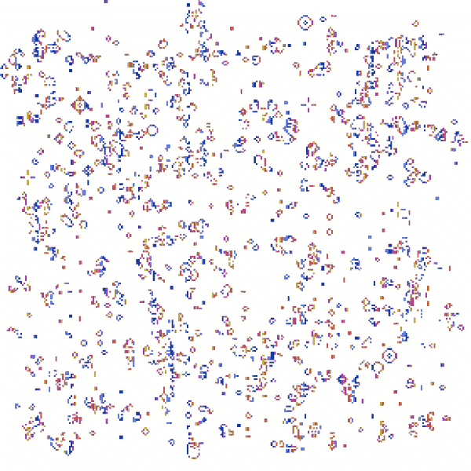

# 生命的游戏，约翰·康威的遗产

> 原文：<https://towardsdatascience.com/the-game-of-life-the-legacy-of-john-conway-a86237180a4e?source=collection_archive---------29----------------------->

## 人生的游戏是什么？人生的游戏有什么意义？已故约翰·康威的遗产。

最近我得知约翰·康威因为新冠肺炎去世了。这是一个非常不幸的情况，让我感到难过的是，我没有机会与一个对数学和从最基本的规则进化而来的复杂性思想做出如此大贡献的人交谈。约翰·康威主要是一名数学家(普林斯顿大学的数学教授)，但计算机科学家和人工智能爱好者将永远记住他的生命游戏，即细胞自动机。

为什么《生命的游戏》作为一部**细胞自动机**如此相关？从一个更哲学的角度来看，生命的游戏向我们展示了**复杂性是如何从简单中产生的。我们人类经常会对自己的存在提出疑问。有人可能会说，像我们这样复杂的有机体是某种神圣计划的产物。事实上，一个主宰宇宙的神圣实体的基本论点之一是，一个支持生命并因此支持我们的存在的行星被创造出来是完全不可能的(特别是当考虑智能时)。**

因此，我们的存在不能用宇宙中简单的随机过程来解释。如果我们可以证明非常复杂甚至智能的系统可以从基本过程中产生，这就给关于神的计划的整个想法打上了一个问号，不是吗？的确，生活的游戏引发了我们对这些事情的思考。

[1]

事不宜迟，让我们跳进生活的游戏的定义。这很简单。在细胞自动机中，**每个细胞最多有 8 个相邻细胞**(对角线、垂直和水平)。自动机(像任何其他的一样)**从填充的“活”细胞**的初始状态开始。因此，自动机的状态由网格上的“活”和“死”单元组成。在每次迭代中，我们选择哪些单元保持“存活”，或者换句话说，填充，以及哪些单元基于某些规则“死亡”。此外，在下一次迭代中，可以产生(“出生”)其他单元。管理此行为的简单规则**如下:**

1.  每一个有 2 或 3 个相邻单元的“活”单元存活到下一次迭代。
2.  每个有 4 个邻居的“死”细胞变成“活”细胞，或者换句话说复活(在某种意义上)。
3.  其余的都死了。

这些规则与现实生活有着有趣的相似之处。以规则 1 为例。一个细胞能够存活的唯一方式是它有同伴细胞(2 或 3)。少是不够的，这或许与人类的想法非常相似。科学研究表明，社交被认为是幸福生活和长寿的原因。但是，过多的社交可能会杀了你(就像细胞自动机一样)。你可以把它看作是对资源的过度使用。这就是为什么有 3 个以上相邻的“活”细胞太多的原因。不幸的是，我还没有想到一个好的寓言。规则，死细胞复活给定 4 个邻居。

生命的游戏是图灵完全的。意思是任何可以用算法计算的东西(用图灵机计算)都可以用它来计算。你能想象到的任何可能的程序都可以用它来编写。

现在有趣的部分来了，这些简单的规则导致了一些古怪的行为，比如下面的棍子旋转(一个非常简单的例子):

如果我们让模拟变得更复杂一点，在初始状态下增加一些活细胞，那么我们会得到更多的回报:

令人难以置信的是，这三个简单的规则决定了这些有趣形状的形成。通过改变初始化网格的随机种子，可以获得大量不同的行为。

当然，进一步扩展，相互作用变得更加复杂。这让你想知道他们能走多远，有多“复杂”。这些细胞自动机在某种程度上是智能的吗，还是有一些神奇的初始化会让它们按照我们对时间的定义变得“智能”？智力的定义到底是什么？人类级智能的来源是什么，仅仅是智能初始化和应用简单的规则吗？假设细胞自动机是图灵完备的，那么可能性是无限的。

我们需要再次感谢约翰·康威杰出的一生工作和遗产。他可能影响了不同领域的几代科学家(不仅仅是计算机科学和数学)。就在过去的一年里，我有过无数次关于人生游戏的讨论。不是因为我在这个领域进行深入研究，而是因为它在科学界无处不在。它一次又一次地找到了我，将来还会继续找到我。

最后，这里有一些我编写的实现的例子，请欣赏。

**参考文献**

[1]照片取自 Pixabay

[2] Python 实现:【https://github.com/jimimvp/game-of-life】T4