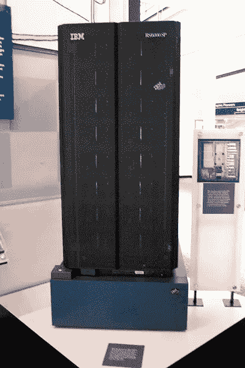
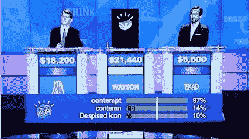

# 艾赢的比赛

> 原文：<https://towardsdatascience.com/the-games-that-ai-won-ff8fd4a71efc?source=collection_archive---------20----------------------->

## 以及它们所代表的进步

AI 做的一些任务，其实并不令人印象深刻。想象一下你的相机对照片中的人脸进行识别和自动对焦。这项技术从 2001 年就已经存在了，它并没有让人们感到兴奋。为什么不呢？因为你也可以这么做，所以你可以很容易地把目光集中在某人的脸上。事实上，它太简单了，你甚至不知道你是怎么做到的。如果人工智能也能做到，那么谁会在乎它是如何工作的呢？虽然我们可能无法明确理解这个人工智能是如何工作的，但它的底层机制不会做任何我们不能做的事情。至少，这是我认为大多数人的想法。

游戏正好相反。与其说游戏是我们与生俱来的能力(比如聚焦你的视觉)，不如说你理解如何以及为什么在游戏中做出决定。因此，当人工智能决定如何玩游戏时，它们会更有趣，因为你可能处于与人工智能相同的情况下，做出完全相同的决定。人工智能被普遍认为是取代人类工作的东西。当人工智能玩游戏时，它感觉最接近我们在世界中的位置，因为游戏是我们必须有意识地思考的事情。人工智能玩的游戏因此引起了新闻的兴趣，这里是它赢得的最重要的胜利。

# 1996-1997 年卡斯帕罗夫诉深蓝

1996 年 2 月 10 日，IBM 的“深蓝”与加里·卡斯帕罗夫(Gary Kasparov)对决，成为第一个在正常情况下(即有时钟的情况下)击败当前国际象棋世界冠军的计算机程序。不幸的是，在剩下的五场比赛中，深蓝输了三局，平了两局。

第二场比赛定于明年举行，深蓝的团队对他们的软件进行了升级。5 月 3 日，深蓝以亏损开盘。在第二场比赛中，深蓝很难计算该做什么，为了防止自己浪费太多时间，它采取了随机移动。这一举动很糟糕，但这让卡斯帕罗夫感到困惑，他认为深蓝能比他更好地预见游戏的未来。为了不让自己在数百万人面前输掉比赛，他放弃了第二局(这在国际象棋中很常见)。事实上，如果卡斯帕罗夫打完第二场比赛，他本可以赢得第二场比赛，这对他来说是一个小小的尴尬，这导致他在接下来的比赛中更加肆无忌惮，最终深蓝赢了 2 局，卡斯帕罗夫赢了 1 局，平了 3 局。

正如 ESPN 记者 Jeremy Schaap 所说，“全世界的人都在关注这件事，有些人对国际象棋不感兴趣，有些人只对人机大战感兴趣。”卡斯帕罗夫在第二场比赛结束时声称 IBM 作弊，这引发了人们对这场比赛的兴趣，他的依据是深蓝在第一场和第二场比赛中的比赛质量差异。自 6 世纪发明以来，国际象棋一直是智力的晴雨表。认为人类会被计算机打败会令人沮丧，因为计算机在许多方面不如人类。当然，IBM 没有作弊，深蓝的质量变化归因于它的随机行动。

IBM 的公共关系团队为这一事件推波助澜，该公司的股票大幅上涨。胜券在握之际，IBM 拒绝了复赛，随后解散了深蓝，并把它的最后安息地定在了山景城的计算机历史博物馆。

[深蓝在计算机历史博物馆](https://upload.wikimedia.org/wikipedia/commons/b/be/Deep_Blue.jpg)

卡斯帕罗夫不再相信“深蓝”在作弊，并且认识到不仅“深蓝”打败了他，甚至“深蓝”本身也能被运行在较小计算机上的新程序打败。这个游戏是人工智能对人类智能的叙述中的一大步，它将游戏确立为一种比较的方法。

# 2011 年 IBM 沃森赢得了危险！

在一起吃午餐时，两位 IBM 高管开始在*的《危险边缘》节目中评论肯·詹宁斯的成功！*谁仍然保持着连续最多比赛获胜的记录。也许是因为渴望在深蓝获胜后获得成功，他们创造了沃森，一个旨在击败肯·詹宁斯的问答系统。

沃森以 IBM 创始人托马斯·J·沃森的名字命名，创建于 2005 年，但直到 2011 年才开始其著名的亮相。沃森和肯·詹宁斯一起对抗布拉德·鲁特，他们被认为是两个最好的【T4 危险边缘】！当时的玩家。肯是一个上过一些人工智能课的程序员，他接受了挑战，部分原因是他认为人工智能系统不可能打败他。

肯·詹宁斯、沃森和布拉德·鲁特

沃森赢得了与布拉德和肯的两场比赛，分别赢得了 77，147 美元和 24，000 美元和 21，600 美元。沃森接着击败了两名国会议员，小拉什·d·霍尔德(前*危险边缘！(参赛者)和比尔卡西迪，又一次两党的失败。*

与深蓝不同，沃森被 IBM 分拆成许多商业产品，包括沃森文本到语音、沃森语音到文本、沃森自然语言分类器、沃森自然语言理解、沃森助手和沃森健康等。

# 2013 年 DeepMind 击败雅达利

虽然沃森是为特定目的而设计的，但 DeepMind Technologies 希望创建一个不需要在狭窄领域进行训练的人工智能系统，让我们更接近通用人工智能的定义。他们开始追求的目标是用一个没有为任何特定游戏重新设计的模型击败许多雅达利游戏。

DeepMind 学习突围的最佳策略

仅使用屏幕上的输入内容，并被告知最大化分数，DeepMind 能够击败每一场游戏，并获得甚至比最优秀的人类玩家更好的分数。在 2013 年的论文中，[用深度强化学习玩雅达利](https://deepmind.com/research/publications/playing-atari-deep-reinforcement-learning)导致谷歌在 2014 年收购了他们。

# 2016 AlphaGo v. Lee Sedol

深蓝的优势在于它有能力一次处理大量的移动，并有一个聪明的方法来评估哪一个是最好的。对于亚洲围棋来说，这是不可能的。游戏的规则很简单，但是游戏在任何时候都有大约 2 * 10 个⁷⁰和 T3 个状态。作为参考，这个数字大于宇宙中的原子数量。因此，围棋博弈中的策略很难定义，因为对于每个状态，都有许多决策需要评估，每个决策都会导致更多的状态需要评估。由于没有蛮力方法起作用，DeepMind 的 AlphaGo 学会了给未来几个时期赋予价值，然后学会了基于该价值做出决策。

在击败欧洲围棋冠军范辉后，AlphaGo 的任务是与有史以来排名最高的棋手之一 Lee Sedol 对弈。击败李促使他退休，说*即使我成为第一，也有一个实体不能被打败*

# *2017 AlphaZero 大师赛国际象棋、围棋和松木*

*AlphaZero 是 AlphaGo 的一般化版本，旨在赢得国际象棋、围棋和 Shogi(日本版国际象棋)。AlphaZero 不仅打败了 AlphaGo，而且是通过与自己进行模拟游戏来完成的，没有专家游戏的例子可以看。在这些模拟开始时，它什么都不知道。经过 9 个小时的训练，它掌握了国际象棋，2 小时后掌握了日本象棋，34 小时后掌握了围棋。*

*虽然这对于谷歌吸引人才非常重要，但人工智能教授乔安娜·布赖森(Joanna Bryson)指出，谷歌因这些成就而获得的荣誉可以在与寻求监管人工智能的政府的谈判中获得巨大优势。*

# *2019 AlphaStar*

*AlphaZero 随后被转变为 AlphaStar，意在击败即时战略游戏《星际争霸》。2019 年，AlphaStar 在人类玩家中排名前 0.2%。这是人工智能首次超过电子竞技。AlphaStar 在星际争霸中并不完美，但它仍被视为人工智能的一个巨大里程碑，因为它在复杂的规则下，利用部分信息实时工作。尽管围棋面临的决策数量相对复杂，但与围棋相比，围棋的规则却非常简单。AlphaStar 所处的这种更复杂的环境是一个很好的指标，表明人工智能已经准备好用于更广泛的商业用途，如自动驾驶汽车、机器人和供应链。*