# 高斯模型

> 原文：<https://towardsdatascience.com/the-gaussian-model-4a94a2b3ff1b?source=collection_archive---------17----------------------->

## 信封背面关于新冠肺炎感染的草图。

作者照片

首先声明:我不是流行病学家。这些都不是专业的预测；这些是 ***粗略计算*** 。我是一个物理学家，你知道我们有多喜欢我们的“ [*数量级*](https://www.maa.org/press/periodicals/loci/joma/problem-solving-estimation-and-orders-of-magnitude) ”、“ [*球形牛近似法*](https://en.wikipedia.org/wiki/Spherical_cow) ”和“ [*封底计算*](https://en.wikipedia.org/wiki/Back-of-the-envelope_calculation) ”。

《纽约时报》上周刊登了一篇关于 [**哪些国家正在“拉平曲线”**](https://www.nytimes.com/interactive/2020/03/19/world/coronavirus-flatten-the-curve-countries.html) 的文章，所以让我们探索一下这些“曲线”的一个简单模型。

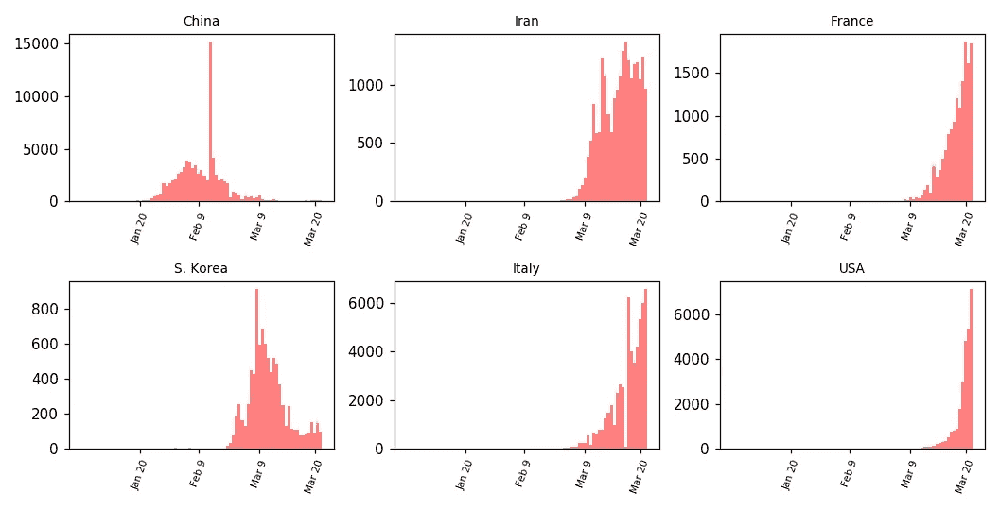

选定国家的每日新冠肺炎感染率

# 感染率数据的一个*封底*模型

我们将使用最简单的模型:正态或高斯曲线。

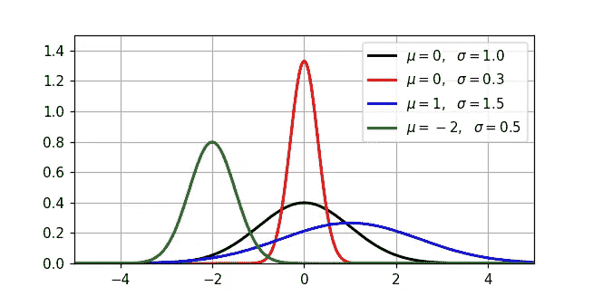

正态或高斯曲线

感染开始时呈指数增长，然后无论东道国采取何种应对措施，一段时间后，新感染人数会回到接近零的水平。至少这是信封背面的理论。当然有更好的模型，但我们将使用高斯模型作为第一枪。

高斯模型仅由三个参数定义: **N** 、 **μ** 和 **σ** ，看起来如下:

*   **N** 是感染率的高峰期，疫情的中点。
*   **μ** 是感染率达到峰值的日期，并且
*   **∑**控制宽度，即国家经历疫情的时间段。

高斯模型参数

在该模型中，在感染高峰前的 2 **σ** 天，在第μ-2σ天(第 20 天)，大约总人数的 2%已经被感染。到高峰前 1 天(第 35 天)，大约 16%的最终感染人群已经呈阳性。在第 **μ** 天，总病例的 50%被感染。

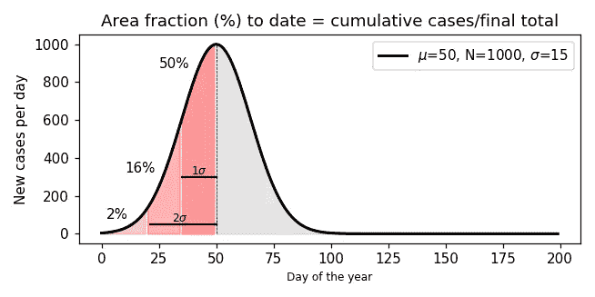

在某一天，曲线下的面积分数=累计病例数除以疫情结束时的总病例数。

# 使用模型

让我们首先在那些似乎已经度过感染高峰并正在复苏的国家尝试这个模型:中国和韩国。

我们可以从欧洲疾病预防和控制中心得到我们需要的格式的数据，欧洲疾病预防和控制中心相当于 T2 的美国疾病预防和控制中心。 [Kaggle](https://www.kaggle.com/imdevskp/corona-virus-report) 也有不错的数据。

从 2020 年 1 月 1 日开始，绘制来自中国的每日感染率，显示了在第 43 天(2 月 12 日)[左右病例的大幅增加，当时医疗团队开始使用更简单和更快速的诊断方法](https://www.nytimes.com/2020/02/12/health/coronavirus-cases-china.html)而不是早期的 DNA 匹配测试。即便如此，高斯模型提供了一个体面的拟合。

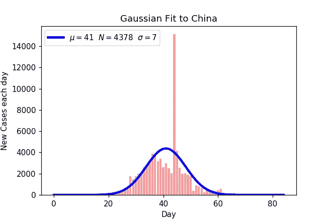

对韩国来说，fit 可能看起来更好。但它没有很好地捕捉右侧停滞的衰减。甚至有可能这种超出代表了一个单独的区域高斯事件。

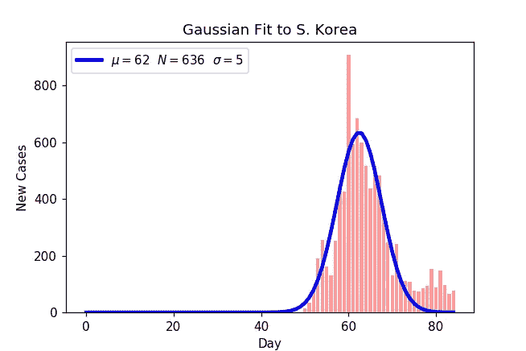

为了使模型符合这些数据，我使用了 python [scipy.optimize](https://docs.scipy.org/doc/scipy/reference/optimize.html) 模块中的 [*curve_fit()*](https://docs.scipy.org/doc/scipy/reference/generated/scipy.optimize.curve_fit.html#scipy.optimize.curve_fit) 函数，我的 Jupyter 笔记本在这里是。

对这些模型的一个简单检查是，模型曲线下的总面积是否接近该国的实际感染总数。*信封背面*计算的标准程序是频繁的健全性检查。

给定 **N** 和 **σ** ，模型曲线下的*总面积为:*

**

*以下是对比数据(截至 2020 年 3 月 24 日)*

***中国***

*   *实际案例总数: **81748***
*   *型号总面积: **79315***

*令人惊讶的是，只有 3 折左右。*

***韩国***

*   *实际案例总数: **9037***
*   *型号总面积: **8145***

*∾10%的折扣，主要是因为该模型遗漏了最近在韩国案例下降中出现的停滞。但是，对于一个粗略的估计来说，10%还不算太糟糕。*

# *预测建模*

*这里是*信封背面*模型失败的地方，或者说失去了它的 10%的优点。*

*以下是高斯模型对一些国家截至 2020 年 3 月 24 日数据的拟合。*

*通过将*当前累计感染人数*与模型中的*预期总病例数进行比较，我们可以了解到*国家目前的状况。这个比率是到目前为止模型下的面积除以模型的总面积。***

**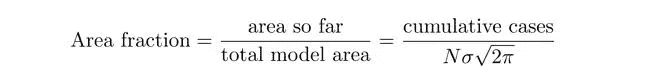**

**该百分比如下图所示(*面积分数*可能大于 100%，因为实际病例总数可能不同于模型预测的总数*，例如*韩国)。请记住，**面积分数* *是来自模型的* ***估计值*** ，因此会受到下面将提出的模型的统计怀疑。***

**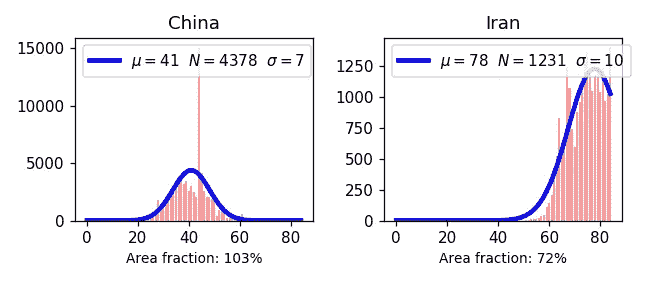****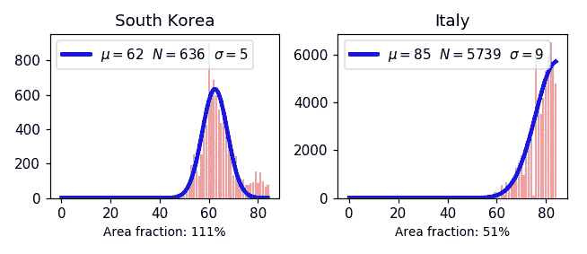****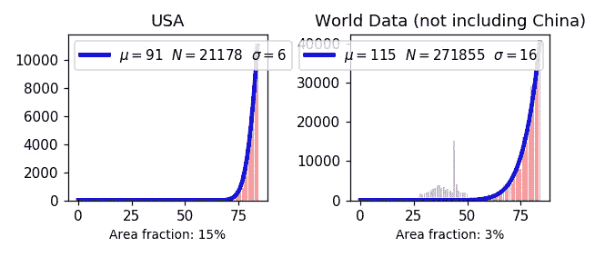**

**高斯模型适合不同国家新的每日感染率和世界数据(不包括中国)。每张图的下方是“**面积分数**”，这是一个对该国“陷入其中”程度的估计。**

# **这个简单模型的问题**

**这种模式太简单的方式太多了！**

**真正的流行病学模型融合了像[马尔可夫链蒙特卡罗](/a-zero-math-introduction-to-markov-chain-monte-carlo-methods-dcba889e0c50)(MCMC)[耦合微分方程](/the-mathematics-of-epidemiology-fa0ba15e44a2)、[实时交通数据](https://www.liebertpub.com/doi/full/10.1089/hs.2019.0018)和[社会图分析](https://www.ncbi.nlm.nih.gov/pmc/articles/PMC3062985/)这样的东西。通过在你的手机上体验像[瘟疫公司](https://www.ndemiccreations.com/en/22-plague-inc)这样的游戏，你可以看到，这种流行病可以以多种方式呈现自己的生命，并偏离简单的模式。*真的—* 高斯模型唯一支持的是[中心极限定理](/the-central-limit-theorem-and-its-implications-4a7adac9d6de)，而且它很简单*。***

**该模型相当好地捕捉了事件发生后国家的总体特征*，这些国家似乎现在已经控制住了感染，如中国和韩国(如上所述，一些非高斯现象似乎正在韩国发生)。但是模型的拟合参数 **μ** 、 **N** 和 **σ** 在很大程度上*取决于你在曲线上的位置，*即*你的面积分数。****

当你爬上数据的一边时，有许多局部的波峰和波谷。但是，如果你的国家已经接近感染曲线的一半，你可以使用高斯模型对未来做一个很好的猜测。从最高点的角度来看，当*面积分数=* 50%时，未来看起来，嗯，有点像反过来的过去。感染应该开始减少，并最终减少到零。

问题是，你不确定你什么时候在那里。

如果你只有 10%的感染指数上升，那么使用高斯模型得到的参数的误差棒对最新数据太敏感了。下面是一些不同的可能模型，我们从疫情沿途 10%、20%和 30%的数据统计波动中得到(*面积分数*)。你可以看到，当我们只有中心峰左侧很远的数据时，模型波动很大，面积分数很小。

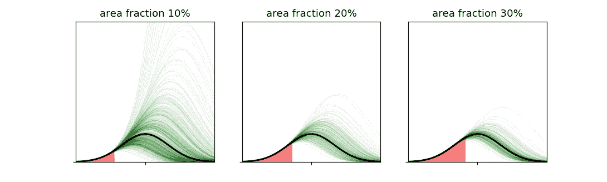

拟合不同面积分数时的模型参数方差

事实上，高斯模型的 **σ** 参数的方差，如在不同点“进入事件”(由该点曲线下的*面积分数*表示)所估计的，随着我们更早地向左移动而放大。

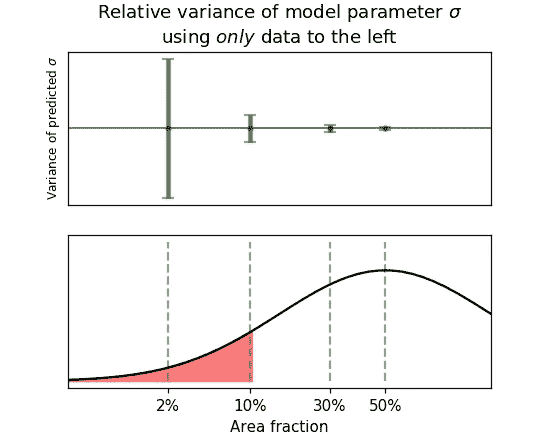

因此，我们不能真正使用这个简单的近似值作为*预测模型*，至少在我们深入了解它之前，可能有 30%的总感染已经已知。再说一次，直到后来我们才真正知道那是什么时候。

例如，根据美国数据，当前*面积分数*估计为 15%。这意味着我们使用迄今为止(2020 年 3 月 24 日)的数据得到的可能模型存在很大差异。下面是一些例子，包括“最佳”拟合: **N** =21178，**μ**= 91(3 月 31 日！)，并且 **σ** =6，由 *curve_fit()* 函数返回。尽管许多领导人都呼吁让“T22”恢复工作，但这似乎过于乐观了。但是此时(第 85 天)与美国数据相似的其他模型参数就不那么令人鼓舞了，看起来像这样。

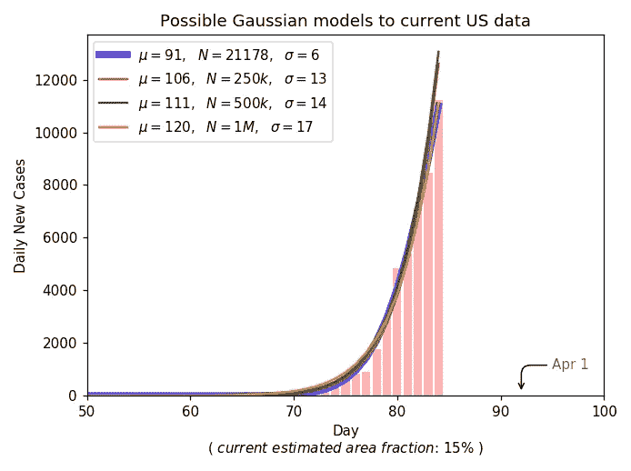

一些可能的感染率高斯模型，符合当前美国数据(2020 年 3 月 24 日)。在这个面积分数(15%)下，可能模型的差异非常大。

从这些模型的长期角度来看，我们目前所知甚少。请注意，即使是“*面积分数”* **估计值**(美国为 15%)也有非常大的建模误差，如下所示。虽然我们似乎已经完成了乐观(蓝色)模型的 15%,但是我们还不到其他“合理”模型(红色、绿色和橙色)的 1%。现在下结论还为时过早。

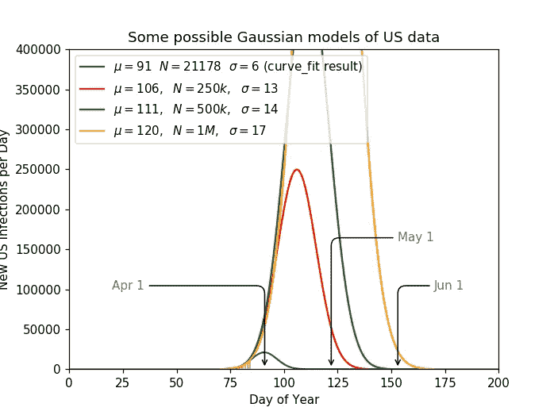

使用当前(2020 年 3 月 24 日)美国数据的可能模型的长期视图。

尽管如此，这个*的封底*模型还是很有指导意义的。很简单，每周都会有更多的数据进来，让我们沿着曲线走得更远，这样高斯模型就有了更多的预测能力。有趣的是，伊朗和意大利似乎已经接近或接近顶峰。

该模型还指出，在疫情的这一阶段，简单的预测是多么糟糕，而且似乎表明，在我们达到舒适的 90%面积分数之前，我们可能还有一段路要走。请注意，韩国有 111% *的面积比例*，他们的感染*仍然*没有减少，所以不要误认为这是真正的流行病学建模。

这只是某个容易获得数据、突然有很多时间呆在家里、一堆信封堆积如山的人的想法。