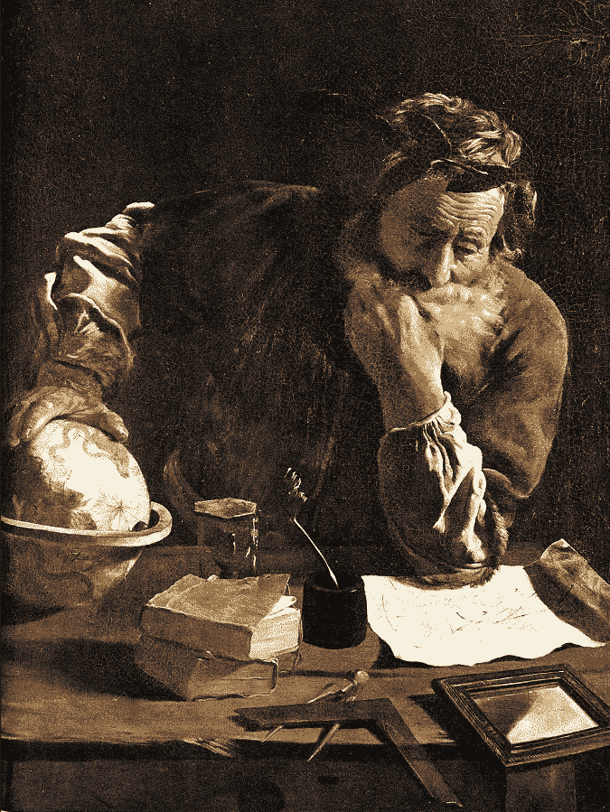
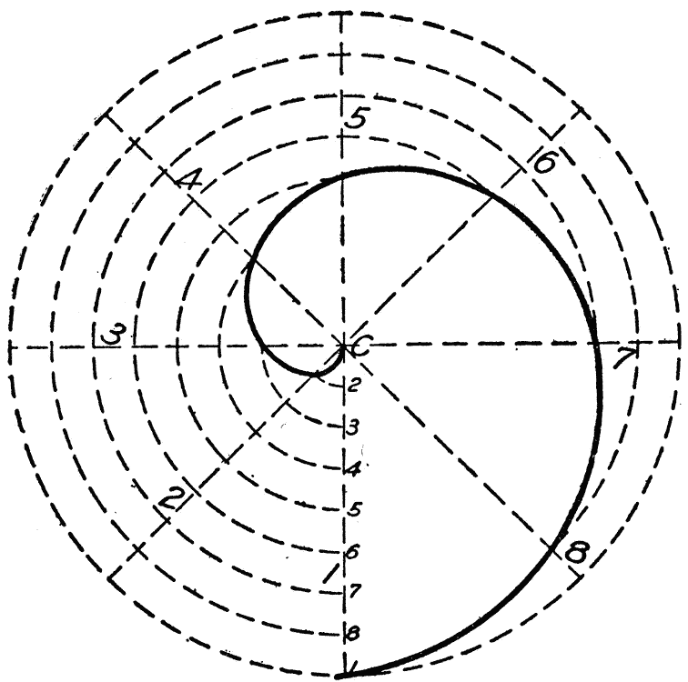
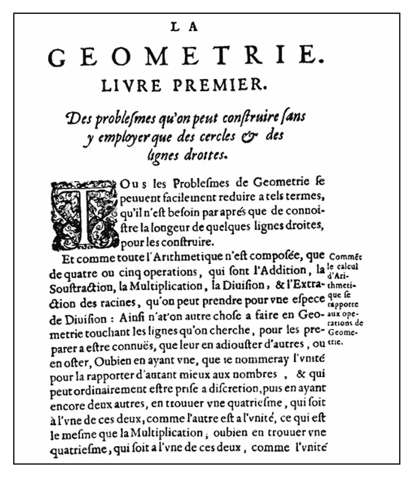
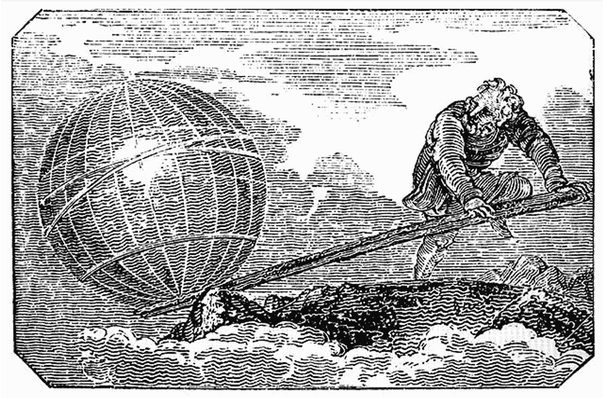
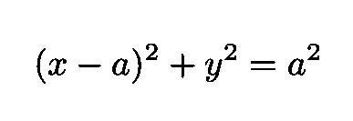
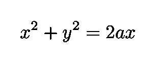
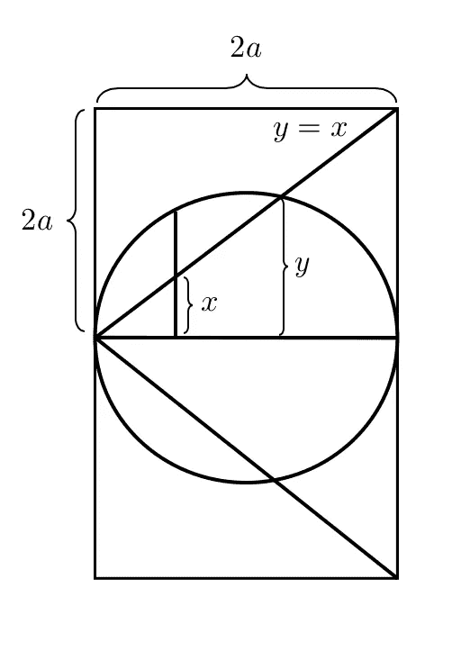
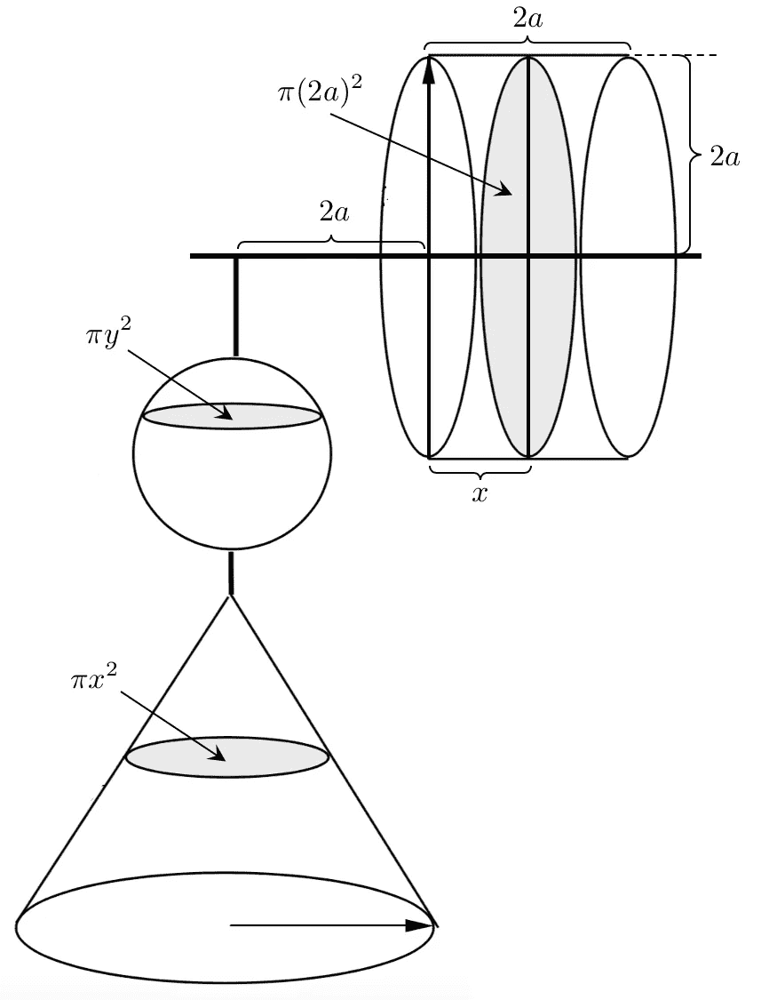
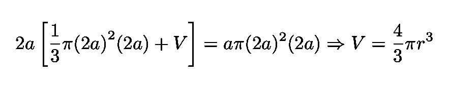

# 阿基米德的天才

> 原文：<https://towardsdatascience.com/the-genius-of-archimedes-421cfb51f7d8?source=collection_archive---------36----------------------->

## 他是如何利用基础物理学推导出球体的体积的

苏格兰出生的数学家[埃里克·坦贝尔](https://en.wikipedia.org/wiki/Eric_Temple_Bell) 在《[数学界人士](https://en.wikipedia.org/wiki/Men_of_Mathematics) ***】、*** 中写道，他的数学史著作 **:**

> 所有历史上三位“最伟大”数学家的任何名单都会包括阿基米德的名字。另外两个通常和他联系在一起的是牛顿和高斯。一些人考虑到这些巨人所处时代数学和物理科学的相对富裕或贫困，并根据他们所处的时代背景来评估他们的成就，会把阿基米德放在第一位。”
> 
> — E. T .贝尔

*图 1:意大利巴洛克画家[多梅尼科·费蒂](https://en.wikipedia.org/wiki/Domenico_Fetti)的阿基米德*图([来源](https://en.wikipedia.org/wiki/Archimedes))。

# 阿基米德是谁？

阿基米德(公元前 287-212)是希腊数学家、物理学家、工程师、发明家和天文学家。他被广泛认为是历史上最有影响力的数学家之一。在他的众多成就中，以下几项尤为重要:他预见了现代分析和 T21 微积分的技术，推导出π的近似值，描述了阿基米德螺线，创立了流体静力学和静力学(包括杠杆原理)，是第一批应用数学研究物理现象的思想家之一。

图 2:阿基米德螺旋([来源](https://etc.usf.edu/clipart/76200/76211/76211_archim-spirl.htm))。

# 德谟克里特斯

希腊苏格拉底之前的哲学家德谟克里特斯因他的宇宙原子理论而闻名，他也是一位杰出的数学家。他写了几本书([超过 75 本，至少](https://books.google.com.br/books?id=m1Q8AAAACAAJ&dq=simmons+calculus+with+analytic+geometry&hl=en&sa=X&ved=0ahUKEwivtaH7loDpAhXFH7kGHUdQBpgQ6AEIKDAA))，包括关于数字、几何、切线、映射的*、关于无理数*的和*但不幸的是，这些著作无一幸存。[他第一个注意到](https://en.wikipedia.org/wiki/Democritus#Mathematics)底面和高度相同的圆锥体和金字塔的体积分别是圆柱体或棱柱体的三分之一( [Wiki](https://en.wikipedia.org/wiki/Democritus#Mathematics) )。*

图 3:*德谟克里特斯*荷兰画家[亨德里克·特尔·布鲁根](https://en.wikipedia.org/wiki/Hendrick_ter_Brugghen)。

# 希腊人和解析几何

用我们现在的符号表示的解析几何是在 17 世纪由法国哲学家、数学家和科学家勒内·笛卡尔(1596-1650)发明的。这是作为他著名的《*[La géométrie](https://en.wikipedia.org/wiki/La_G%C3%A9om%C3%A9trie)》的附录提出的在这部开创性的著作中，笛卡尔首次提出了将几何对象转化为代数方程，从而将代数和几何结合为一门学科的概念。*

**

*图 4:勒内·笛卡尔(1596–1650)的开创性作品“[La géométrie](https://en.wikipedia.org/wiki/La_G%C3%A9om%C3%A9trie)”([来源](https://en.wikipedia.org/wiki/La_G%C3%A9om%C3%A9trie))。*

*然而，希腊人已经有了解析几何中一些基本概念的概念(尽管仍然是原始的)。一个例子是，在一个平面上，轨迹可以用移动点到两条垂直线的距离来分析(如果这些距离的平方和是固定的，它们就是一个圆)(见[西蒙斯](https://books.google.com.br/books?id=m1Q8AAAACAAJ&dq=simmons+calculus+with+analytic+geometry&hl=en&sa=X&ved=0ahUKEwivtaH7loDpAhXFH7kGHUdQBpgQ6AEIKDAA))。*

# ***阿基米德和球体的体积***

*阿基米德是最早将数学技术应用于物理学的人之一。众所周知，他创立了流体静力学和静力学，并因解释了[杠杆](https://en.wikipedia.org/wiki/Lever)而闻名。事实上，他最著名的名言是:*

> *“给我一个支点，我可以撬动整个地球”*
> 
> *—阿基米德*

**

*图 5:出自“*力学杂志”*的一幅版画，取材于阿基米德的名言([来源](https://en.wikipedia.org/wiki/Lever))。*

*使用现代符号，考虑图 6 所示的下列圆。*

**

*等式 1:用现代符号书写的圆。*

*为了我们目前的目的，我们将把这个等式表示如下*

**

*等式 2:等式。1 以不同的形式表达。*

*现在考虑以下程序的[及其相应的解释，全部基于图 6:](https://books.google.com.br/books?id=m1Q8AAAACAAJ&dq=simmons+calculus+with+analytic+geometry&hl=en&sa=X&ved=0ahUKEwivtaH7loDpAhXFH7kGHUdQBpgQ6AEIKDAA)*

*   *首先，围绕圆的直径旋转它。这将给我们一个球体。*
*   *π *x* 等于在*x*∈【0，2a】的直线 *y* = *x* 下面的三角形绕 de *x* 轴旋转一周所产生的圆锥体的横截面面积*
*   *π(2 *a* )等于绕边为 2a 的正方形的轴 *x* 旋转一周所产生的圆柱体横截面的面积*
*   *πy 等于球体横截面的面积*

**

*图 6:在 *y* = *x* 直线的下方为*x*∈【0，2a】([源](https://people.clas.ufl.edu/kees/))做一个三角形的旋转锥，得到面积为π *x* 的横截面。*

*现在我们用等式乘以等式。2 乘以 2π得到:*

**

*等式 3:等式。2 乘以 2π。*

*右手边是我们刚刚描述的围绕 de *x* 轴的旋转圆柱的区域(上面列表中的倒数第二个项目)。*

*现在阿基米德的天才开始发挥作用了。他重新排列了几何图形，如图 7 所示。在这种构形中，球体和圆锥体由一根细绳悬挂着(可以假定是无重量的)，水平轴被当作一根杠杆，以原点为其固定铰链(支点)。根据所谓的杠杆定律，“输出力与输入力之比由支点到这些力的施加点的距离之比给出”([维基](https://en.wikipedia.org/wiki/On_the_Equilibrium_of_Planes))。*

**

*图 7:两个旋转的图形(圆锥体和圆柱体)和球体，重新排列([来源](https://people.clas.ufl.edu/kees/))。*

*现在，利用德谟克里特斯的结果，即圆锥体的体积是圆柱体的三分之一，杠杆定律意味着[和](https://books.google.com.br/books?id=m1Q8AAAACAAJ&dq=simmons+calculus+with+analytic+geometry&hl=en&sa=X&ved=0ahUKEwivtaH7loDpAhXFH7kGHUdQBpgQ6AEIKDAA):*

**

*方程式 4:阿基米德利用杠杆定律得出的球体体积。*

*这是我们追求的结果。这一计算的独创性令人震惊。正如美国数学家乔治·f·西蒙斯所观察到的:*

> *[在这个推导中]讨论的想法是由一个人创造的，他被描述为“古代世界最伟大的天才”，这是有充分理由的。"的确，没有什么地方能比这更能展示智力与最高境界的想象相结合了。"*
> 
> *乔治·f·西蒙斯*

*感谢您的阅读，再见！一如既往，我们随时欢迎建设性的批评和反馈！*

*我的 [Github](https://github.com/marcotav) 和个人网站 [www.marcotavora.me](https://marcotavora.me/) 有一些关于数学和其他主题的有趣资料，如物理、数据科学和金融。看看他们！*