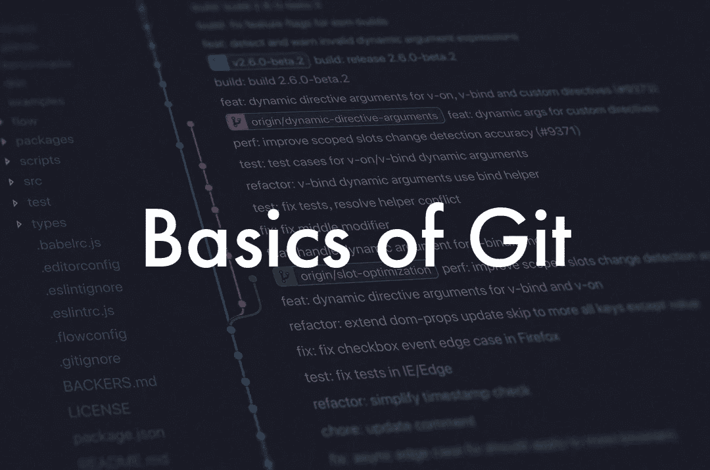

# Git 备忘单

> 原文：<https://towardsdatascience.com/the-git-cheat-sheet-5858865457ef?source=collection_archive---------34----------------------->

背景图像由 [Yancy Min](https://unsplash.com/@yancymin) 在 [Unsplash](https://unsplash.com) 上拍摄。由作者编辑。

[Git](https://git-scm.com/) 是最流行的版本控制系统之一，你可以把它看作是在特定的状态和时间拍摄代码快照的一种方式(Git 术语中的*提交*),以防你以后把事情搞砸了，想回到代码的稳定版本。如果你把它和 GitHub 结合起来，这也是一种很好的合作方式。

Git 是免费和开源的。你可以从[官网](https://git-scm.com/downloads)下载。一旦安装完毕，你应该能够在你的终端上运行 Git 命令。

在开始使用 Git 之前，您应该知道一些事情:

*   当你想跟踪项目中的文件时，你把它们放在一个**仓库**中。存储库基本上是一个目录，在其中启用了版本控制，并且总是对您放入的内容保持警惕。它会知道这些文件的任何变化，并帮助你跟踪它们。
*   每个提交都有一个标识符，以防你以后需要引用它，这个 ID 叫做 **SHA** ，它是一个字符串。
*   工作目录包含你在项目目录中看到的所有文件。
*   **staging index** 是 Git 目录中的一个文件，它存储了下一次提交中将要包含的信息。

# 创建或克隆存储库

在当前目录下创建或克隆一个存储库。

*   从头开始创建存储库:`git init`
*   克隆现有存储库:`git clone <https://github.com/>...`
*   克隆存储库并使用不同的名称:`git clone <https://github.com/>... new_name`

# 显示信息

*   确定回购状态:`git status`
*   显示回购的提交:`git log`
*   紧凑显示回购的提交:`git log --oneline`
*   查看修改的文件:`git log --stat`
*   查看文件更改:`git log -p`
*   查看文件更改，忽略空白更改:`git log -p -w`
*   查看最近提交:`git show`
*   查看特定提交:`git show <SHA of commit>`

# 增加

“暂存”是指将文件从工作目录移动到暂存索引。

*   暂存文件:`git add <file1> <file2> … <fileN>`
*   卸载文件:`git rm --cached <file>...`
*   登台所有文件:`git add .`

# 犯罪

从暂存索引中取出文件，并将其保存在存储库中。

*   提交暂存文件:`git commit`

*该命令将打开代码编辑器。在代码编辑器中，您必须提供一条提交消息，保存文件并关闭编辑器。*

*   不打开代码编辑器提交文件:`git commit -m "Commit message"`

# Git 差异

*   查看已经完成但尚未提交的更改:`git diff`

# 磨尖

标记被用作特定提交的标记。这些对于给代码分配一个版本非常有用。

*   将标签添加到最近提交:`git tag -a <tag(v1.0)>`
*   向特定提交添加标记:`git tag -a <tag(v1.0)> <SHA of commit>`

`*-a*` *用于创建一个带注释的标签，其中包括额外的信息，如创建日期和创建者。添加此标志通常被认为是一种好的做法。*

*   显示存储库中的所有标签:`git tag`
*   删除标签:`git tag -d <tag-name>`

# 分支

当在存储库中提交时，它会被添加到您当前所在的分支。默认情况下，存储库有一个名为 *master 的分支。特别是在你的代码上试验新特性的时候，创建一个单独的分支，作为一个与你上次提交安全隔离的环境，通常是很有用的。您可以在分支之间切换，提交将只添加到您当前所在的分支。*

*   列出所有分支:`git branch`
*   创建新分支:`git branch <branch-name>`
*   删除分支:`git branch -d <branch-name>`

您不能删除当前所在的分支。

如果一个分支包含不在任何其他分支上的任何提交，则不能删除该分支。

*   强制删除:`git branch -D <branch-name>`
*   分支切换:`git checkout <branch-name>`
*   在特定提交上添加分支:`git branch <branch-name> <SHA of commit>`
*   在与主分支相同的位置开始分支:`git branch <branch-name> master`
*   一次查看所有银行:`git log --oneline --decorate --graph --all`

# 合并

当执行合并时，另一个分支的更改会被带到当前签出的分支中。

*   执行合并:`git merge <branch to merge in>`

# 批改作业

*   修改上次提交的消息:`git commit --amend`

## 还原提交

这将创建一个新的提交，恢复或撤消以前的提交。

*   撤消提交中所做的更改:`git revert <SHA of commit>`

## 重置提交

这将清除提交。

*   重置提交:`git reset <reference to commit>`

根据您添加的标志，您将获得不同的结果:

*   `--hard`清除提交的标志
*   `--soft`将提交的更改移动到暂存索引的标志
*   `--mixed`取消已提交变更的标志

如果你想了解更多关于 Git 的知识，Udacity 提供了[这门很棒的课程](https://www.udacity.com/course/version-control-with-git--ud123)，它涵盖了所有基础知识和更多深入的概念(免费！).我自己上过这门课，它启发我总结了我学到的一些主要概念，并在我的项目中使用。

希望你从这篇文章中得到一些价值😊下一集再见！