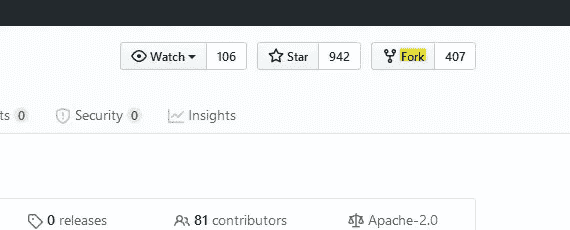

# GitHub 备忘单

> 原文：<https://towardsdatascience.com/the-github-cheat-sheet-c7be3e92c083?source=collection_archive---------81----------------------->

[GitHub](http://github.com) 是使用 [Git](https://git-scm.com/) 托管软件开发版本控制的**最受欢迎的服务之一。如果你对版本控制和 Git 还不熟悉，你可以看看我之前的文章，[Git 备忘单](/the-git-cheat-sheet-5858865457ef)，在那里我解释了基础知识。**

照片由[卢克·切瑟](https://unsplash.com/@lukechesser?utm_source=unsplash&utm_medium=referral&utm_content=creditCopyText)在 [Unsplash](https://unsplash.com/s/photos/github?utm_source=unsplash&utm_medium=referral&utm_content=creditCopyText) 上拍摄

# 为什么要使用 GitHub 呢？

作为一名开发人员，您可能会觉得使用版本控制在自己的本地存储库上工作很舒服。然而，协作是至关重要的，因为大多数时候，你不会独自在一个项目中工作。你将和你公司的一个团队一起工作，或者可能和你在世界各地都不认识的人一起工作。无论您想从事较小的项目，还是大型开源项目，协作都是开发人员必须具备的重要技能。

GitHub 使版本控制项目的协作变得容易。因此，在这篇文章中，我们将学习如何使用 GitHub 进行协作的基础知识。

# 添加远程存储库

当您希望本地存储库与 GitHub 中的远程存储库进行通信时，请使用此命令。基本上，通过这个命令，您可以告诉您的计算机在您的本地 repo 和指定的远程 repo 之间创建一个连接，这将被称为`origin`(这是一个简称)。

`$ git remote add origin https://github.com/username/repository.git`

当您将远程存储库克隆到本地设备时，此连接会自动完成。

# 发送提交

我的远程回购的简称是`origin`，我想要推送的提交在`master`分支上。所以我将使用下面的命令将我的提交发送到 GitHub 上的远程存储库:`$ git push origin master`

# 从远程存储库中提取更改

为了将本地存储库与远程存储库同步，我们需要使用 git pull。与`git push`类似，您提供远程存储库的简称，然后提供您希望提交的分支的名称。

`$ git pull origin master`

# 取得

如果你不想自动合并本地分支和远程跟踪分支，那么你就不要使用`git pull`，而是使用`git fetch`。如果远程存储库上有您没有的提交，但是本地存储库上也有远程存储库也没有的提交，您可能想要这样做。在这种情况下，您希望获取远程更改，以便在本地分支中获得它们，然后手动执行合并。然后，您可以将新合并提交推回到远程。

# 等等，那么拉和取的区别是什么？

您可以认为`git pull`命令做两件事:

1.  获取远程更改(这将提交添加到本地存储库中，并移动跟踪分支以指向它们)。
2.  将本地分支与跟踪分支合并。

`git fetch`命令只是第一步。它只是检索提交并移动跟踪分支。它*不*将本地分支与跟踪分支合并。

# 叉

当您派生一个存储库时，您正在创建该存储库的一个相同副本，并将其存储在您的配置文件中。修改分叉回购不会影响原回购。

# 短日志

当在一个项目中与其他开发人员合作时，知道谁做了什么是很有用的。`git shortlog`将显示提交的作者分组。

您可以添加标志`-s`来查看提交的数量，添加标志`-n`来对它们进行数字排序:`$ git shortlog -s -n`

# 重定…的基准

在协作项目中进行变更时，我们需要尽可能清晰。这将有助于其他开发者理解我们所做的事情。

假设您连续提交了三次都是小的打字错误，这里最好的办法是将这三次提交合并成一次。

对于这个例子，您可以使用:`$ git rebase -i HEAD~3`

`git rebase`将提交转移到新的基础。在本例中，`HEAD~3`表示头前三位(头是你当前的位置)。

看起来你已经准备好在 GitHub 上合作了！🎉我知道学习曲线有时会很陡，但绝对值得坚持下去。希望这是对你有帮助的介绍😊