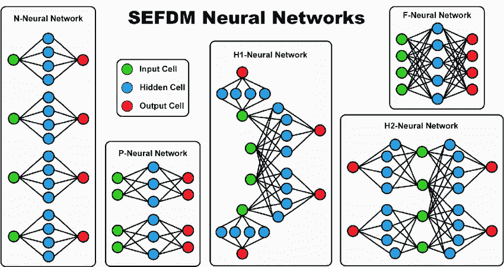
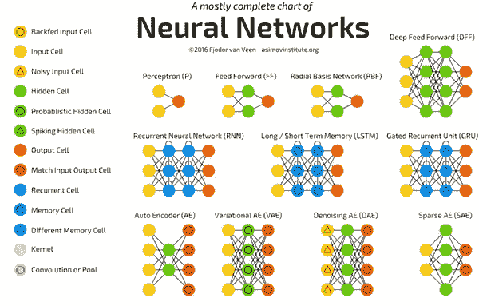
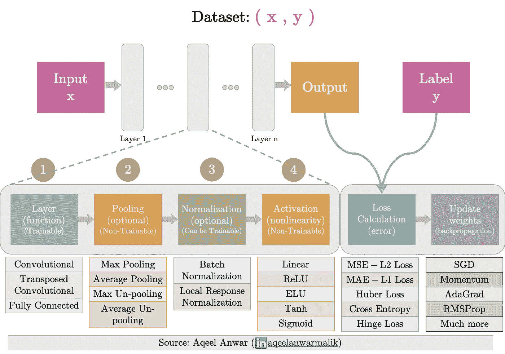
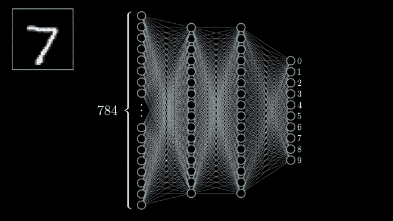
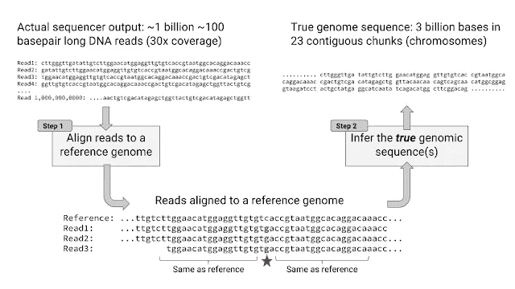
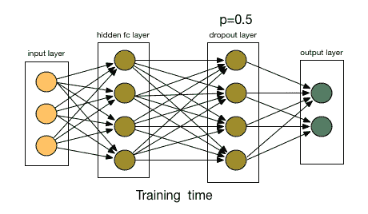
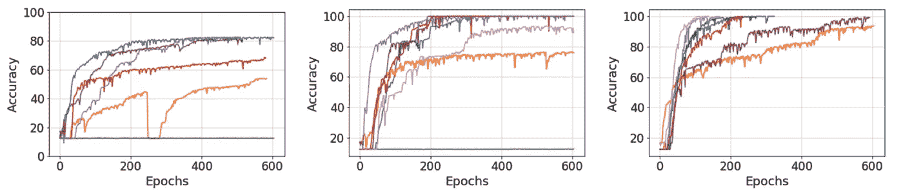
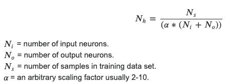

# 金发区:你能设计出恰到好处的神经网络吗？

> 原文：<https://towardsdatascience.com/the-goldilocks-zone-can-you-design-neural-networks-just-right-41d1172982b8?source=collection_archive---------50----------------------->

## 了解如何在实践中设计基于特定应用的神经网络。

深度学习很难，退一步说。用于创建神经网络体系结构的多种结构和方法几乎专用于非常选择性的问题。在大多数情况下，样板模型是行不通的，那么你如何着手设计最好的神经网络呢？

credit->[Xu](https://www.researchgate.net/profile/Tongyang_Xu):对信号(在通信中)的一种借鉴，其中神经网络以与 SEFDM 信号相似的方式构建，在 SEFDM 信号中，带宽被分割并分出多个其他流用于通信。

> ***现实是没有正确的答案*** ，但是从稀疏性、记忆、剪枝等领域的研究来看，有一些通用的规则可以遵循，以有效地测试和产生一个可行的模型。

# 从不同的角度看神经网络架构(NNA)

本质上，神经网络只是信息流经的结构。通过各层及其各自的神经元，以指定的多种方式对这些信息进行某些操作。一种思考方式是通过不同的层传递信息。

想到一条河；**数据的河流。这条河不是以固定的速度流动，而是转弯、变窄、分开、回来、循环……你明白了吧。河流流经不同的关口，变窄溪流，斜坡，甚至汇集成湖泊！**

我已经告诉你的分别是，从纯数学的角度来看神经网络架构的本质，以及它如何控制信息以对新数据进行准确预测。从迁移学习到瓶颈方法，甚至 LTSM 网络，在设计神经网络和你要寻找的输出时，记住这些概念是很重要的。

这就是为什么找到这个适居区比你想象的要难:你在与无数的变量打交道，你的数据**必须**适合所需的神经网络架构。

## 本质上:

嗯，设计神经网络可能有一些重要的规则需要理解。然而，在此基础上，内化任何神经网络的目标是学习任意的输入输出函数。

Credit -> ZipTech:网络中带有标记神经元的几个神经网络；利用不同的卷积和记忆单元以及在多个神经网络中发现的基本神经元

每个权重和连接都有一个用途，将特定的恒定权重应用于之前的输入，以便在数据中找到特定的模式。

许多这些想法都是功能性的，每个独立的神经元都服务于神经网络的一个深层目的，无论是深度学习的架构，还是结合机器学习子集的不同方法。

现在，这些层和神经元不寻找眼睛颜色或肤色之类的东西:这些特征通过浮点运算来量化，这些浮点运算共同构建了给定输出的某个概率。

例如，CNN 不是什么特别的东西。它仍然是一个神经网络，但由不同的线性核组成，以发现数据中的特征，而不是使用传统的输入输出结构。CNN 由记忆细胞、池细胞、核细胞、过滤细胞和其他更一般问题所必需的隐藏数学运算组成。此外，重要的是要认识到信息正在经历一个瓶颈，所有这些不同的神经元都在消除噪音和提取数据中的共同模式方面发挥作用！

最基本的卷积神经网络的功能分解，以及每一层如何构造以确保分类准确发生

为什么这很重要？了解某些神经元如何工作可以让你创建定制的架构，并更准确地将问题与模型相匹配。某些模式和层数会影响信息流，以便更好地解决问题。

1.  CNN 使用池层来识别图像的特征，并简化所需参数的数量。它对数据集进行线性扫描，只获取最重要的信息。
2.  **rnn 将输出反馈到同一层，以获得记忆感，从而分析非常具体的趋势。**通过循环输出作为输入，你允许某些记忆神经元过早地在数据中寻找特定的模式。
3.  **块-稀疏 GPU 集成使用带有 0 的稀疏层来降低神经网络层所需的 GPU 功耗**，并识别输入数据之间最相关的连接。
4.  **内核算法是神经网络中的一个附加层**使用非线性问题的线性运算提取特征。

这里发生了一些有趣的事情:所有这些结构都在对给定的输入数据进行线性或非线性运算，以将其映射回一般的输出。我们唯一不关注的是我们如何做到这一点，以及最好的方法是什么。我们是在寻找更好的不变性，回忆，还是效率？

归功于 3blue1brown:基于手写数字分类算法的输入 7 的激活神经元的可视化，请注意，虽然这是一个图像问题，但没有使用 CNN，而是数据能够有效地格式化为传统的人工神经网络(或基本神经网络)

> 结论:**我们可以从一些抽象的需求或特性中，将层及其指定的线性操作组织成数据流的数学参考。**

# 我现在如何使用这个？

许多高级机器学习问题需要从数据中做出直观的决策，但你不能只是盲目地挑选 10 层和 10 个神经元，然后就此结束。你必须是有意的，研究源于这个想法，并产生了一些最流行的抽象问题集模型。随着时间的推移，它会变得更加复杂，但在设计神经网络的架构时，您可以记住一些提示。

1.  **了解问题和你的需求，确定相关因素和功能。**

你想解决什么？是高维问题吗？我需要某些注意机制吗？看看你的问题是什么，确定你需要解决什么。*通常，您可以将您的数据映射到不同的模型，并应用类似的方法来添加您自己的特定设计变更。*

例如，当试图为患有罕见遗传疾病的患者寻找某些非同义遗传序列时，高通量测序是一种分析你的基因组大块的流行方法。

鸣谢:谷歌大脑

该团队后来设计了一种新的测序方法，称为 DeepVariant，而不是使用 LSTMs(一种识别致病序列的传统方法)将问题转变为 CNN 问题，以更好地可视化和绘制出某些序列的流行及其与体内其他基因的相互作用。

**2。避免网络碎片和不必要的神经元，防止过度拟合。**

在实践中，许多深度学习研究人员利用仪表板(y 轴上的误差和 x 轴上的训练规模)来跟踪你的偏差和方差，但通常在神经网络中，更难看到应该如何减少方差和增加偏差来获得它，再次，**恰到好处**。

一般来说，最好的方法是减少模型的维数，以防止高阶函数以几乎 100%的精度映射训练集。辍学率是一个有用的解决方案，您可以识别并重新评估您的层中神经元的需求。**好的辍学率范围从 0.1 到 0.5** (训练一个神经元的概率)。

Credit -> Analytics Vidhya:辍学率，表示给定层中神经元被训练的概率

*在神经网络中，您可以改变权重的数量，以避免碎片或使用更大的运算(*常数超过特定的权重值*)。*

**3。使用已经开发的不同机制**

这看似矛盾，但让我解释一下。瓶颈、全局平均值和修剪算法等机制是某些工具，可以添加到您的基本样板神经网络架构中，以根据您的需求增强其可行性。

Credit -> FloyHub:注意力机制视觉直觉的一个例子。

你本质上是在一个简单的模型上增加了另一层复杂性，以便简单地达到一个复杂的结果，无论是更好的 GPU 优化还是在你的模型预测中达到更高的偏差。

这些机制特别有助于确定您可以做些什么来更好地改进您的模型，以及您需要关注什么。 **PCA(主成分分析)**是另一种机制，可以帮助你降低维度，以确定哪些神经元和输入对最终输出有影响。

其他机制包括通过简单的神经网络格式化数据，并将概率作为输入输入其他深度学习算法。*最终，你的目标是降低复杂性，并为你给定的问题找到最有效的方法。*

**4。更多的层和更少的神经元并保持操作简单**

为什么这是真的？好吧，让我们回到信息流的概念。深度学习起作用的原因是因为它的各个层利用非常特定的神经元和功能来提取特征。您拥有的层越多，您就可以更好地对您的体系结构进行建模，以匹配数据中的特定信息。

你不想要一个有 3 层和 1000 个神经元的网络来识别一只狗的所有特征。这些层和应用在它们上面的操作没有什么意义，对模型中的其他东西没有任何贡献。

您拥有的图层越多，您的图层就越能更好地提取某些要素并将结果传递到下一个图层。这是通过非常特殊的神经元功能逐步积累知识。最好把它想成是一起工作的整体的一部分，而不是一个人的军队。

然而，同样重要的是要认识到，在没有明确目的的情况下添加更多层会导致初级层的学习速度发生增量变化，因此您的网络可能会遇到[消失梯度问题](http://neuralnetworksanddeeplearning.com/chap5.html#the_vanishing_gradient_problem)。然而，这也可以通过证明归因于在模型学习时随着时间推移具有显著变化的层中缺少神经元。

功劳-> [胡](https://www.semanticscholar.org/author/Yuhuang-Hu/2175899):消失渐变问题表现出不同的准确性

尽管如此，具有高维数和小输出的神经网络中的某些问题需要足够的神经元来包含尽可能多的信息。另一方面，有些问题使用 RNNs，在这种情况下，输入很少，输出很多，因此需要更多的层来提取更多的信息。

好吧，现在怎么办？作为一名开发人员，你不仅要理解你试图解决的问题，还要将它与两个概念联系起来，即**信息丢失**和**信息复杂性。**

在信息丢失中，瓶颈效应发生在整个网络中，在网络中，您使用更多的内核和卷积池层来概括数据中的模式。这是 CNN 用来对各种类型、大小和形状的图片进行分类的工具。问题是，回到消失梯度，你的主要层学习速度较慢，因为需要更多的神经元来获得足够的信息。在 CNN 的情况下，这不是一个问题，但当你遇到深度感知或语义分割等问题时，这并不理想。

随着信息的复杂化，你要从一个小的特性集中识别出许多不同的关系。研究发现，网络中的前几个隐藏层会产生其他层所依赖的推断信息。rnn 将它们的输出作为输入进行反馈，以找到集合关系，而不会在整个网络中引起连锁反应。复杂性也会导致渐变消失的问题，因为前几层只使用一组参数库，所以学习速度较慢，精度会降低。

那你是做什么的？**实验在这种情况下进行。理解你的问题。**但总的来说，*使用适量的层和足够的神经元来平衡您的数据复杂性将有助于您获得可行的结果。*

信用-> RM 出版物:简单问题的经验法则；用直觉解决更复杂的问题

# 总之，有哪些要点？

首先，没有确切的“金发女孩地带”,可悲的是，可能永远也不会有一个恰好合适的模型。然而，当制定或构建您自己的神经网络架构时，您需要了解您做出的每个决定的基本原理。

> 在深度学习中，与其花时间收集更多的数据，进行更多的研究，或制定更好的数据，不如专注于模型本身。

专注于如何设计和改进你的神经网络，而不是第一次就把它做对，因为事实是，你永远不会把它做对。

迭代、毅力和对基本原理的深刻理解将帮助你建立你的知识，并根据问题定制你的架构，我希望这个总结有助于引导你朝着正确的方向去实现它。

T2 感谢你花时间阅读这篇文章，我希望你从中有所收获。如果你想获得更多的技术或者干脆联系我，你可以在[***LinkedIn***](https://www.linkedin.com/in/dev-patel-25456219a/)*[***邮箱***](http://hello.devpatel@gmail.com) ***，或者***[***GitHub***](http://github.com/devpatelio)***上找到我。****