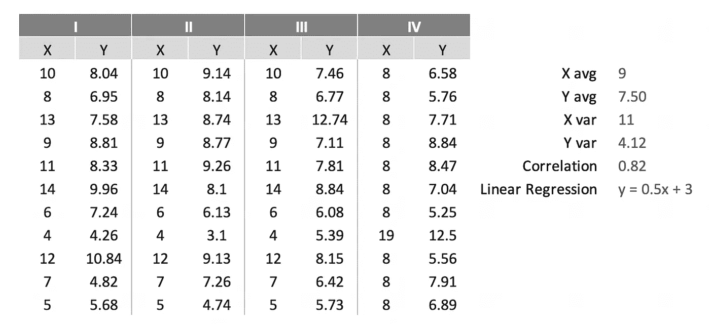
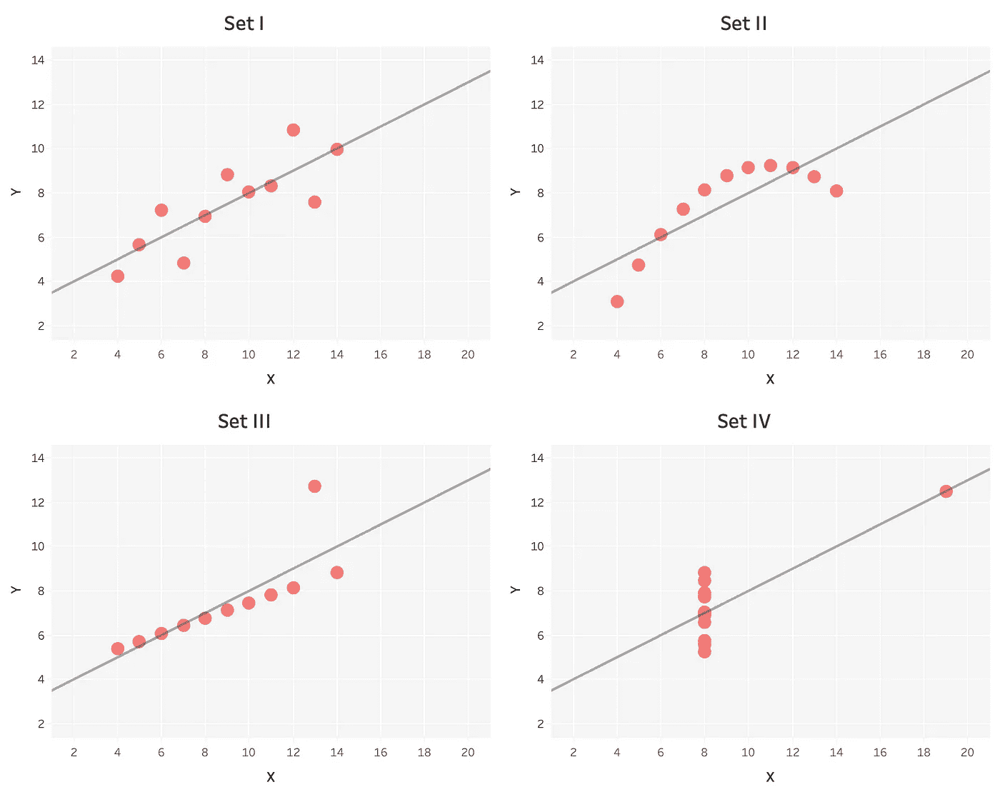
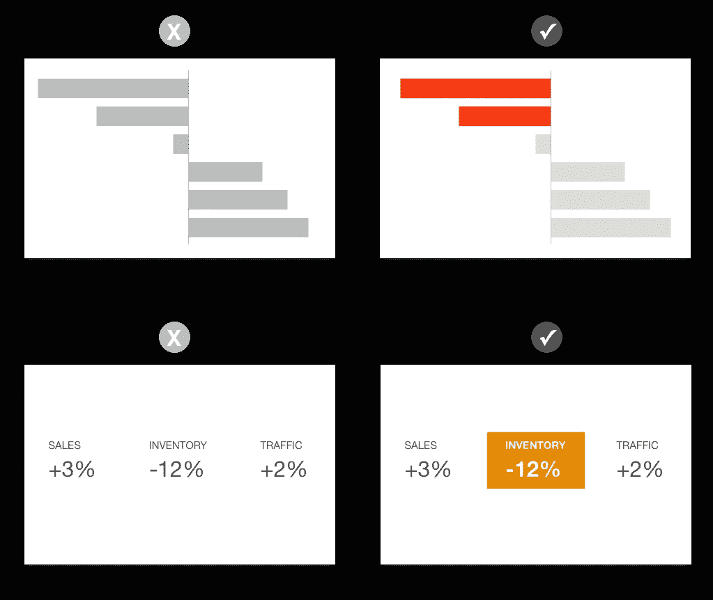
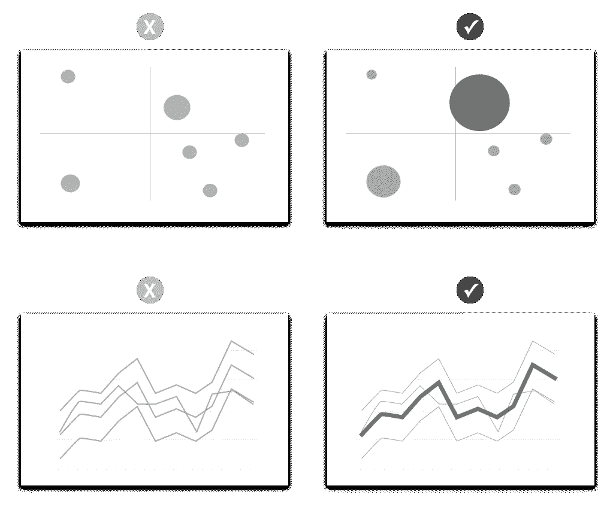

# 分析的黄金地带

> 原文：<https://towardsdatascience.com/the-goldilocks-zone-of-analytics-40c5345d8dd8?source=collection_archive---------44----------------------->

iStock.com/[伊利亚布洛托夫](https://www.istockphoto.com/portfolio/Ilyabolotov?mediatype=illustration)

## 现实太真实了。数据太抽象了。可视化恰到好处。

我们地球人过得很好。如果地球的轨道稍微靠近太阳一点，就会太热；再走远一点就太冷了。地球所处的位置恰到好处，一个被称为“适居带”的区域。

如果分析是太阳系，那么数据可视化就是它的金发区。一方面是现实，它太详细和复杂，无法完全理解。另一边是原始数据，也因为太抽象而难以理解。为了让分析有用，它必须位于中间——不要太真实，也不要太抽象。视觉化是让它恰到好处的关键。

# **分析学的三脚凳**

人们知道他们能触摸、看到、听到、闻到和尝到什么。他们无法用抽象的概念做到这一点。人们在与他们生活的物质世界相关的想法中找到意义。

这是分析的一个问题，因为抽象是它的一个基本方面。要对某事进行分析并做出有把握的结论，通常需要大量的信息。然后，这些信息必须被抽象成原始数据。

一旦设置了数据，下一步就是对其进行分组、汇总和应用统计方法，目标是找到有意义的模式，这些模式可以转化为通用原则和预测。这也是分析的一个基本方面。每一个分析过程都是从数据和分析开始的，但不能止于此。还是太抽象了。为了使分析有用，它必须回到五种感官。

如果分析是一个三条腿的凳子，第一条腿使信息易于管理(原始数据)，第二条腿使信息变得有意义(数据科学)，那么就需要第三条腿使信息变得有关联。这就是视觉化的作用。要使分析站得住脚，所有三个方面必须协调一致。很多时候，可视化被认为是一个附加物，但是有几个原因为什么它应该被看作是每个分析项目的一个基本部分。

# **眼见为实**

描述某事，它可能被理解。展示一些东西，不仅会被理解，而且会立刻被理解。这方面的经典例子是 Anscombe 的四重奏，它采用了 4 个具有完全相同的汇总统计数据的数据集…

安斯康贝的四重奏:数据和统计摘要

…并将它们绘制成图，展示视觉观察时图案的显著差异。

作者图片

当然，有更复杂的方法来描述模式，但是没有一个模型，无论多么优雅，能够比上面的图片更快更有效地解释这些模式。分析正确是不够的；它还必须帮助他人理解什么是正确的。一个深思熟虑的分析与正确的可视化相结合，可以很好地做到这一点。

# **可视化是一种隐喻**

比喻用容易理解的东西来描述其他难以理解的东西。我最喜欢的一个例子是当爱因斯坦描述相对论时:“把你的手放在热炉子上一分钟，感觉像一个小时。和一个漂亮女孩坐一个小时，感觉就像一分钟。”在短短的几句话中，他用任何人都能理解的生动形象描述了一个抽象的概念 e=mc2。这就是可视化对分析的作用。

图表将数据组织成一种格式，这种格式代表现实世界中易于识别的事物。换句话说，它们是隐喻。就像一个[【KC1】](#_msocom_1)的嫌疑人阵容，酒吧比较相对高度。像一个便当盒，树状图显示了每个部分如何对整体作出贡献。像一块土地一样，散点图显示 2D 的相对位置。诸如此类。

在上面的每个例子中，无论数据素养如何，所有人都能立即理解图表的含义，因为它用的是他们已经理解的术语。这就是可视化的要点:不要过度简化，而是将不透明、抽象的概念转化为更容易理解的形式。

# **第六感**

分析的肮脏小秘密是，如果人们不喜欢你的数字，他们会找到新的。

仅仅依靠五种感觉是不够的，因为还有一种更强大的第六感。它的正式名称是确认偏差，但更普遍的说法是“直觉”。这是一种根深蒂固的信念，即不管有没有证据，某事都是真实的。有时候，是基于经验的健康本能；其他时候，它是一种顽固的拒绝，拒绝放弃一个错误的信念。不管怎样，这是人们如何做决定的重要部分，包括本文的读者和作者。

在你的分析方法中忽略这一事实将是一个错误。仅仅以符合逻辑的方式陈述事实是不够的。你还必须向直觉提出一个论点，而直觉只对一件事做出反应:情绪。

现在，这个词对大多数分析师来说是一个亵渎的词，因为我们最不想做的事情就是情绪操纵。然而，情感在可视化中的作用不是操纵，而是展示真实的事情*和*它们为什么重要。分析的目标是发现洞察力*和*从而让人们采取不同的行动。为了让他们采取行动，他们必须*觉得这样做很重要。视觉化可以让他们感觉到。*

关于如何将这些想法付诸实践，有很多话要说，但为了节省时间，让我们简要地谈一谈这样做的三种方法。

# **1。为了让大家知道，我们展示了**

如果你是一名数据分析师，并且你还没有在你的可视化技能上做一点点投资，那么你有一个扩大你的受众和影响力的好机会。在你的个人发展计划中把形象化放在首位。你不必成为一名艺术家——只要遵循一些基本原则，任何人都可以胜任。挑一两本书开始读。如果你需要推荐信，爱德华·塔夫特或斯蒂芬·诺的任何一本书都是不错的起点。

# **2。不要本末倒置**

为所回答的问题使用正确的视觉隐喻。一个常见的错误是在理解要解决的问题之前就开始构建图表。某些类型的问题最好用某些类型的视觉隐喻来回答。所以，从问题开始，密切注意正在使用的单词，并将其与适当的隐喻相匹配。

例如，如果问题是“多少…？”或者“最大的是什么…？”，然后用一个大小和排名的比喻，比如条形图。像嫌疑犯队列一样并排比较多个物体的长度或高度对人们来说很容易做到，特别是当等级排序时。

如果问题是“什么是趋势？”，然后用一个时间的比喻，比如折线图。人们倾向于认为时间在水平面上从左向右移动。当看到 x 轴上有日期的连续折线图时，他们会直观而迅速地理解他们正在看一条时间线。

如果问题是“在哪里…？”或者“之间的路径是什么？”，然后用一个位置的比喻。在这里，2D 地图是显而易见的选择。但是，一个常见的错误是，仅仅因为题目涉及地理，就认为问题本身就是地理问题。问题，“哪个地区的销量最多？”这看起来像是一个地理问题，但实际上是一个规模和排名问题。虽然地图擅长显示事物与其他事物之间的关系，但它们却不擅长显示相对大小和等级。在这种情况下，最好使用条形图或其他与尺寸相关的图表。

当然，还有许多其他类型的问题和视觉隐喻可以探索，但这几个例子应该可以让你知道如何选择人们可以直观理解的图表。

# **3。加一点剧情**

可视化的一个关键优势是，它可以显示什么是重要的，这在处理“直觉”时至关重要。如果它很重要，它应该跳出页面，这样做的方法是创造视觉对比。

一种方法是用**色**。真正明亮的东西会引起注意，尤其是当周围的颜色变得柔和时。不同的颜色也能唤起不同的情感。红色、橙色和黄色等暖色倾向于表示更强烈的情绪，如兴奋、活力和恐惧。像蓝色和绿色这样的冷色调往往意味着积极和冷静。因此，在你的视觉效果中使用颜色向用户表明在哪里看和如何感受。

作者图片

另一种增加戏剧性的方法是用**的尺寸**。比周围物体大得多的物体最先被注意到。当视觉中的某个东西很大时，观众不仅首先看到它，而且他们还会直观地理解它的重要性。同样，目标是对比度，所以做稍微大一点的东西是不够的。如果它很重要，它需要大得多。

作者图片

如果你是一名数据分析师，你可能会花很多时间观察数字，识别模式，并得出结论。你习惯于密集的表格和统计模型，但是你的观众可能不习惯。你需要一种方法让你的作品更容易理解。可视化会有所帮助。

如果你是一名可视化实践者，你已经购买了可视化的能力，将分析带入生活，但你可能会与创建比满桌子数字更有洞察力的可视化的持续挑战作斗争。努力把你的视觉效果和你的观众直观得到的东西更好地联系起来。

分析很重要，但如果人们不理解或不关心它，它就没有多大用处。要构建出色的分析，就要让它清晰、有意义，并通过可视化让它恰到好处。

*Dan 是 Aspirent Consulting 视觉分析的实践主管。他在金融、商业分析和可视化方面拥有超过 15 年的经验，曾在家得宝、可口可乐和 Mattel 等财富 500 强公司工作。*