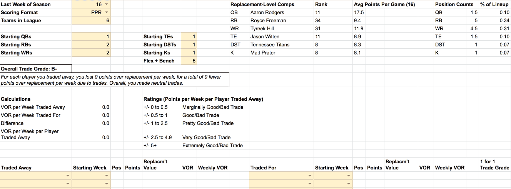
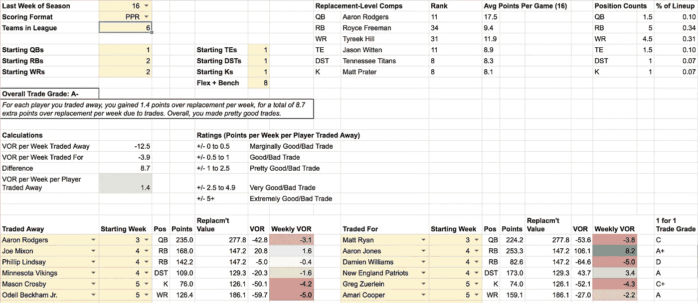

# 我在 2019 年进行的好的、坏的和丑陋的幻想足球交易

> 原文：<https://towardsdatascience.com/the-good-bad-and-ugly-fantasy-football-trades-i-made-in-2019-253fa0124629?source=collection_archive---------27----------------------->

## 另外，你应该做那个交易吗？用我的工具找出答案。

我们能握握手吗？在第三周用阿伦罗杰斯换拉塞尔威尔逊将会是一笔非常好的交易。尽管罗杰斯在整个赛季都有一些重要的比赛，但威尔逊在本赛季剩下的比赛中总得分为 273 分，而罗杰斯为 235 分，每周净增加 2.7 分。

随着 2019 年梦幻足球赛季的到来，是时候回顾一下我们本赛季所做的好的、坏的和丑陋的交易了。

为了帮助这个练习，我建立了一个工具，根据参与交易的每个球员在赛季剩余时间里的表现，对每笔交易进行数学评分。

[复制一份我的交易评估表](https://docs.google.com/spreadsheets/d/16-zDO0sAHqOX-71pCU2zVnbPgWBKruwzqj7Cz0JysU8/copy),输入你在整个赛季中的所有交易，从数学上看，这些交易的结果，包括你的“交易等级”A+到 f。

使用[交易评估员](https://docs.google.com/spreadsheets/d/16-zDO0sAHqOX-71pCU2zVnbPgWBKruwzqj7Cz0JysU8/copy)在第 3 周用 Aaron Rodgers 换 Russell Wilson 的交易中获得 A 级。

# 如何使用交易评估工具

1.  [复制一份交易评估员电子表格](https://docs.google.com/spreadsheets/d/16-zDO0sAHqOX-71pCU2zVnbPgWBKruwzqj7Cz0JysU8/copy)。(需要谷歌账号；没有谷歌账户？[在此处查看电子表格](https://docs.google.com/spreadsheets/d/16-zDO0sAHqOX-71pCU2zVnbPgWBKruwzqj7Cz0JysU8/edit?usp=sharing)并下载文件>以在 Excel 或您选择的电子表格程序中查看。注意:格式化可能会有点不稳定。)
2.  在单元格 B1 中，选择赛季的最后一周，16 或 17，取决于您的联盟何时举行锦标赛。这将确保该工具不会在你的冠军周之后计算任何积分。
3.  在单元格 B2，选择您的联赛的得分格式:PPR，半 PPR，或标准。
4.  在单元格 B3 中，选择您的联盟中的球队数量。
5.  在单元格 B5-B7 和 F5-F7 中，输入每个位置的首发球员人数。
6.  在单元格 F8 中，输入 flex+板凳球员的人数。在最后三个步骤中输入的数据用于确定替补级别的球员价值，以更好地评估不同位置之间的交易。
7.  从第 20 行开始，在 A 列中输入您交易的球员，在 b 列中输入交易后的一周。该工具将自动计算该球员在交易后的一周与赛季结束之间累积的梦幻点数，以及该周该位置的平均替补级别球员的相同点数，并为被交易的球员生成每周[替换值(VOR)](https://blog.sleeper.app/2019-value-over-replacement-vor-analysis-by-w-pratt/) 。这一步对于准确评估不同头寸的交易很重要，例如，交易一个你可以更容易找到替代玩家的 QB，交易一个好的替代玩家可能更稀缺的 RB。
8.  在 I 列中，输入您在交易中收到的球员，并在 j 列中输入交易后的一周。该工具将计算与上一步相同的统计数据，并为每次一对一交易提供一个等级。
9.  继续前面的两个步骤，直到你整个赛季的所有交易都被输入。
10.  在单元格 A9 和 A10 中查看您的总体交易等级和汇总。

# 案例研究:评估我的 2019 年交易

在我的 2019 年主场联赛中，我对 6 名球员进行了 3 次交易:

1.  从第四周开始，**T3，我用**亚伦罗杰斯**换来了**马特·莱恩**。**
2.  从第四周开始，我用**乔·米克森**换了**亚伦·琼斯**，用**菲利普·林赛**换了**达米恩·威廉姆斯**，用**维京人 D/ST** 换了**爱国者 D/ST** 。
3.  从第五周开始，我用梅森·克罗斯比和 T21 换来了格雷格·祖莱因，用小奥德尔·贝克汉姆换来了阿马里·库珀。

## 交易#1:亚伦·罗杰斯换马特·莱恩

*贸易等级:C*

亚伦罗杰斯挣扎着走出大门，平均每场比赛得到 13.5 分。一些人质疑他是否秘密受伤，或者仅仅是他的比赛生涯结束了。与此同时，马特·莱恩的表现要好得多，场均 22.1 分。鉴于罗杰斯的季前赛排名和名字的价值，我提出用他来交换瑞安，我的对手接受了。

交易看起来很好，直到第 7 周，当瑞安受伤离开比赛，只有 3.6 分。雪上加霜的是，罗杰斯在第七周打出了今年最大的表现，以 43.8 分排名第一。

瑞安在第 8 周缺阵，从未真正恢复状态，在赛季的最后 6 周只有一次得分超过 20 分。罗杰斯有时在比赛中挣扎，但在第七周之后仍然打出了两场 25 分以上的比赛。

## 交易#2a:乔·米克森换阿伦·琼斯

*贸易等级:A+*

这将是我本赛季最好的交易。我甚至不想交易琼斯，但在赛季糟糕的开局后，我想摆脱米森。当我的对手提出琼斯时，我认为这是一笔好交易；琼斯在赛季的前几周表现得更好。

这种不平衡将持续到赛季的大部分时间，琼斯给出了五个(！！)25+ PPR 积分游戏，平均每周 21.1 分，而 Mixon 在第 14 周仅有 25+积分游戏，平均每周 14 分。

这笔交易将在整个赛季中给我带来每周 7.1 分的巨大优势。

## 交易#2b:菲利普林赛换达米恩威廉姆斯

*贸易级:D*

在同一个交易组，我也经历了本赛季最糟糕的交易。虽然林赛在 2019 年没有占据主导地位(只有一场 20+分的比赛，在第 5 周)，但坏运气将在第 11 周因肋骨受伤而袭击威廉姆斯，他将仅以 2.3 分的成绩离开比赛，直到第 16 周才回来，此时我已经把他从我的阵容中删除了。

这个交易会让我每周损失 5 个点。

## 交易#2c:维京人 D/ST 换爱国者 D/ST

*贸易等级:A*

爱国者队的防守最终将成为历史上伟大的防守，尽管他们的前三周令人难以置信，但我想我的对手怀疑回归到均值，并愿意为维京人队在季前赛中排名很高的防守让路。

对我来说幸运的是，爱国者队将继续他们的统治地位，在第 4 周和第 8 周之间的未来 5 场比赛中的 4 场比赛中获得 20+分。他们在赛季的后半段确实回归到了平均水平，从第 9 周开始到赛季的剩余时间，他们与维京人的交易都很糟糕，但在赛季前半段的那些可怕的几周却是一笔很好的交易。

## 交易#3a:梅森·克罗斯比换格雷格·祖莱因

*贸易等级:C+*

作为我今年最后一次交易的一部分，在第五周，我交易了排名第一的踢球者。这笔交易没有做太多，因为格雷格腿最终得到 74 分，而克罗斯比在赛季剩余时间里得到 76 分，这基本上使这笔交易变得无用，尽管鉴于我在赛季剩余时间里的踢球方式，这没有多大关系。

## 交易#3b:小奥德尔·贝克汉姆换阿马里·库珀

*贸易等级:A*

我几乎没有提出这个交易，但我很高兴我提出了，我的对手接受了。OBJ 在赛季初的表现远远低于预期，但由于其名字的价值，我想我可以进行交易。库珀似乎是一个合理的风险回报选择，幸运的是，对我来说，这是一个正确的决定。尽管在赛季的后半段出现了一些严重的不一致，库珀在本赛季的剩余时间里继续为 PPR 贡献 159.1 分，为 OBJ 的 126.4 分，每周净得+3 分。

## 总体贸易评估

*贸易等级:A-*

总的来说，我做了一些很好的交易，因为我的交易，每周理论上赚了 8.5 个点。当然，我没有每周都和我交易的每一个球员比赛，但是这确实证实了我今年表现不错的感觉。

我的[总交易等级](https://docs.google.com/spreadsheets/d/16-zDO0sAHqOX-71pCU2zVnbPgWBKruwzqj7Cz0JysU8/edit#gid=542847535) : A-

# 交易评估员限制

虽然交易评估器是一个很好的工具来判断你是否应该进行交易，但请记住以下几点:

*   交易评估员在赛季期间每周分析一名球员在交易后的表现，但你不太可能每周开始这名球员，甚至不太可能将这名球员留在你的名册上。也就是说，可以合理地假设，当你进行交易时，你是在赌你得到的球员比你在赛季剩余时间里交易走的球员平均水平更高。
*   交易评估员不考虑交易如何改善你的团队和/或你对手的团队。例如，如果你在某个位置很深，这可能比交易评估员建议的用那个位置的一个玩家换一个你弱的位置的玩家更有利。
*   交易评估员根据 [FantasyPros 的 PPR、半 PPR 和标准评分格式的幻想领袖指标](https://www.fantasypros.com/nfl/reports/leaders/)计算业绩。因此，该工具不包括您的联盟可能使用的非标准得分和/或奖励积分，但它仍然应该是对赛季过程中交易价值的相当准确的评估。
*   交易评估者计算每周获得/失去的点数，不考虑玩的游戏或周数，所以统计是准确的，但可能与考虑玩的游戏或周数的其他来源不同。
*   交易评估员对 K 列中的每笔交易进行一对一的比较，不考虑非偶数的交易(例如，用一名球员交换两名球员)，但总体分数和评估仍然是准确的。请注意，非偶数交易通常用于释放席位或购买彩票，因此最终的计算可能不代表这些策略的无形收益。
*   交易评估工具是一个面向后的工具，用来回顾性地评估交易。对于季节内交易分析，可以考虑使用 FantasyPro 的[免费](https://www.fantasypros.com/nfl/trade/)或[高级](https://www.fantasypros.com/nfl/myplaybook/trade-analyzer.php)交易工具，或者考虑阅读 Reddit [上提到的方法，点击这里](https://www.reddit.com/r/fantasyfootball/comments/a35go9/vorp_and_vobp_and_how_it_can_help_you_value/)或[点击这里](https://www.reddit.com/r/fantasyfootball/comments/54wq4l/week_4_valuebased_trade_charts/)。我可能会探索创建自己的季节性交易分析工具；关注我以获得新帖子的通知！

# 在你走之前

2019 梦幻足球赛季，你有哪些好的、坏的、难看的交易？下面评论让我知道！

如果你喜欢这篇文章，你可能也会喜欢我的其他关于体育和数据的文章——给我一个关注，当我发布更多的文章时会通知我！：

*   [我如何战胜了一个 538 预测算法](https://medium.com/s/story/how-i-outsmarted-fivethirtyeights-nfl-forecasting-algorithm-592a301fa318)
*   [我如何利用 200 名专家和 Reddit 的评论排名算法赢得我的 Office NFL Pick'em Pool](https://medium.com/@dglid/how-i-used-200-experts-and-reddits-comment-ranking-algorithm-to-win-my-office-nfl-pick-em-pool-cbca64abe31d)
*   [我如何正确预测比利亚诺瓦赢得 2018 年 NCAA 男篮锦标赛](https://medium.com/@dglid/how-i-correctly-picked-villanova-to-win-the-2018-ncaa-mens-basketball-tournament-3764e9442ee2)