# 传统的梯度推进

> 原文：<https://towardsdatascience.com/the-good-old-gradient-boosting-f4614b0e62b0?source=collection_archive---------35----------------------->

## [梯度助推器](http://towardsdatascience.com/tagged/the-gradient-boosters)

## 梯度推进的数学入门

2001 年，杰罗姆·h·弗里德曼写了一篇开创性的论文——贪婪函数逼近:梯度推进机。他一点也不知道这将演变成一类方法，威胁到表格世界中沃伯特的[没有免费的午餐定理](https://chemicalstatistician.wordpress.com/2014/01/24/machine-learning-lesson-of-the-day-the-no-free-lunch-theorem/)。Gradient Boosting 及其同类产品(XGBoost 和 LightGBM)在分类和表格数据领域的回归问题上表现出色，已经征服了世界。

不尽然！(来源:[我自己古怪的大脑](https://memecreator.org/meme/xgboost-all-the-things5))

让我们从理解弗里德曼提出的经典梯度推进方法开始。尽管这是一个数学难题，但也没那么难。只要有可能，我都试图对正在发生的事情提供直觉。

# 问题设置

假设有一个数据集 *D* 有 *n* 个样本。每个样本在向量 *x* 和实值目标 *y* 中具有 *m* 组特征。形式上，它被写成

现在，梯度推进算法是一种采用加法形式的集成方法。直觉告诉我们，我们试图估算的复杂函数可以由更小更简单的函数相加而成。

假设我们试图逼近的函数是

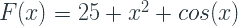

我们可以把这个函数分解为:

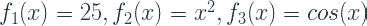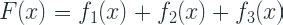

这是我们在选择加性集成模型时采用的假设，并且我们在讨论梯度增强时通常谈到的树集成可以写成如下:

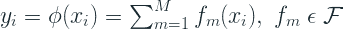

其中 M 是基础学习器的数量，F 是回归树的空间。

# 损失函数

其中 *l* 为可微凸损失函数 *f(x)。*

因为我们在寻找 f(x)的加法函数形式，我们可以用以下等式代替 yᵢ

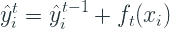

所以，损失函数将变成:

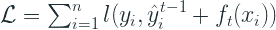

# 算法

1.  通过最小化损失函数，用常数值初始化模型

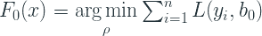

*   b₀是在第 0 次迭代时最小化损失函数的模型的预测
*   对于平方误差损失，它是所有训练样本的平均值
*   对于最小绝对偏差损失，它是所有训练样本的中间值

2.对于 m=1 至 M:

2.1 计算

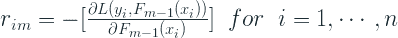

*   *rᵢₘ* 只不过是损失函数(在真实值和来自最后一次迭代的输出之间)的导数 w.r.t. *F(x)* 来自最后一次迭代
*   对于平方误差损失，这就是残差*(观察值—预测值)*
*   它也被称为伪残差，因为它的行为类似于残差，并且它是平方误差损失函数的残差
*   我们为所有的 *n* 个样本计算 *rᵢₘ*

2.2 使用基尼系数或熵(通常的方法)将回归树拟合到 *rᵢₘ* 值

*   对于 j = 1……Jₘ，树的每片叶子由 Rⱼₘ表示，其中 jₘ是在迭代 m 中创建的树的叶子数量

2.3 对于 j = 1 … Jₘ，计算

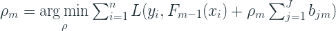

*   bⱼₘ是基函数或最小平方系数。这可以方便地计算出任何叶中所有样本的平均误差损失和最小绝对偏差损失的中值
*   ρₘ是叶重的比例因子。
*   由于回归树的不相交性质，可以忽略 *b* 上的内部求和。一个特殊的样本只会出现在其中一片叶子上。因此，等式简化为:

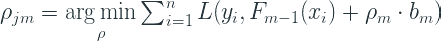

*   因此，对于每片叶子，Rⱼₘ，我们计算最佳值ρ，当加入到最后一次迭代的预测中时，最小化驻留在叶子中的样本的损失
*   对于已知的损失函数，如平方误差损失和最小绝对偏差损失，比例因子为 1。正因为如此，标准 GBM 实施忽略了比例因子。
*   对于一些损耗，如 Huber 损耗，使用线搜索找到最小损耗来估算ρ。

2.4 更新

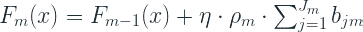

*   现在，我们将最新的优化树添加到上一次迭代的结果中。
*   η是收缩率或学习率
*   等式中的求和仅在特定样本出现在多个节点的极小概率情况下有用。否则只是优化后的回归树得分 *b* 。

# 正规化

在标准实现(Sci-kit Learn)中，没有实现目标函数中的正则化项。在那里实施的唯一正规化如下:

*   **收缩正则化** —在加法公式中，每个新的弱学习器被“收缩”一个因子η。在某些实现中，这种收缩也被称为学习速率，因为它类似于神经网络中的学习速率。
*   **行子采样** —集合中的每个候选树使用样本子集。这具有规则化的效果。
*   **列子采样** —集合中的每个候选树使用一个特征子集。这也有一个正则化的效果，通常更有效。这也有助于并行化。

# 梯度推进和梯度下降

# 相似之处

我们知道梯度推进是一个加法模型，可以表示如下:

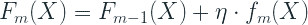

其中 *F* 是集成模型， *f* 是弱学习器， *η* 是学习率， *X* 是输入向量。

用 y^代替 f，我们得到熟悉的等式，

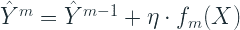

现在，由于 *fₘ(X)* 是通过最小化损失函数在每次迭代中获得的，损失函数是一阶和二阶梯度(导数)的函数，我们可以直观地将其视为指向最陡下降的方向向量。让我们称这个方向向量为 rₘ₋₁.下标是 m-1，因为向量已经在迭代的阶段 m-1 被训练。或者，直觉上的剩余

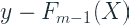

。所以等式现在变成了:

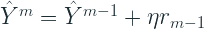

翻转标志，我们得到:

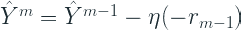

现在让我们看看标准的梯度下降方程:

我们可以清楚地看到相似之处。这个结果使我们能够使用任何可微损失函数。

# 差别

当我们使用梯度下降来训练神经网络时，它试图找到最佳参数(权重和偏差)，*，这使得损失函数最小化。这是利用损耗相对于参数的梯度来完成的。*

*但是在梯度提升中，梯度仅调整创建集成的方式，而不调整底层基本学习器的参数。*

*而在神经网络中，梯度直接给出了损失函数的方向向量，在 Boosting 中，我们只能从弱学习器中得到该方向向量的近似。因此，GBM 的损耗只可能单调减少。随着迭代的进行，损耗完全有可能跳跃一点。*

# *履行*

*Sci-kit Learn 中的[GradientBoostingClassifier](https://scikit-learn.org/stable/modules/generated/sklearn.ensemble.GradientBoostingClassifier.html#sklearn.ensemble.GradientBoostingClassifier)和[GradientBoostingRegressor](https://scikit-learn.org/stable/modules/generated/sklearn.ensemble.GradientBoostingRegressor.html#sklearn.ensemble.GradientBoostingRegressor)是 python 生态系统中最早的实现之一。这是一个直截了当的实现，忠实于原始文档。我很清楚我们之前的讨论。它已经实现了多种损失函数，其中*贪婪函数近似:Friedman 的梯度推进机*【1】已经导出了算法。*

## *回归损失*

*   *ls’→最小二乘法*
*   *lad’→最小绝对偏差*
*   *“胡伯”→胡伯损失*
*   *分位数→分位数损失*

## *分类损失*

*   *“偏差”→逻辑回归损失*
*   *“指数”→指数损失*

# *参考*

1.  *贪婪函数近似:一种梯度推进机器。安。统计学家。29 (2001 年)，第 5 号，1189-1232。*

**原载于 2020 年 2 月 2 日 http://deep-and-shallow.com***。***