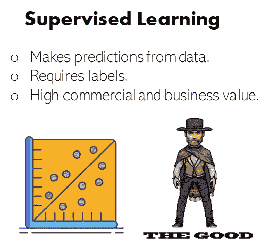
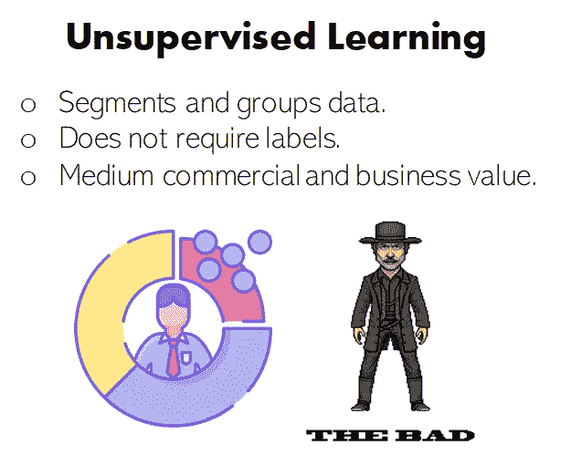
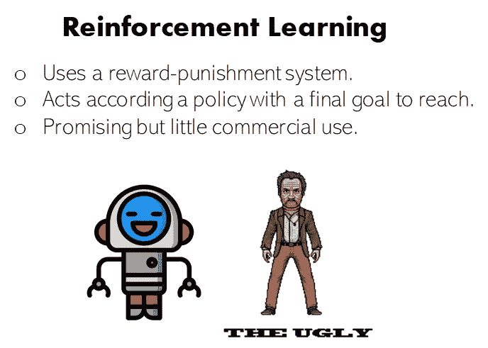

# 好的、坏的和丑陋的:监督的、非监督的和强化学习

> 原文：<https://towardsdatascience.com/the-good-the-bad-and-the-ugly-supervised-unsupervised-and-reinforcement-learning-2ccf814c6bab?source=collection_archive---------48----------------------->

## 机器学习三巨头的应用、实践和商业见解

图片来自 [Unsplash](https://unsplash.com/photos/lZ39lvUTe8s)

亲爱的读者你好！在你将要阅读的文章中，我将以一种非常简单的方式讲述机器学习中的三种主要学习类型:监督学习、非监督学习和强化学习。

由于有数以百万计的帖子讨论这三者之间的差异、它们可以在哪里使用以及所有典型的主题，我将尝试更进一步，以一种新颖的方式探索它们，从行业和商业的角度给出我的观点，并加入一点幽默，同时也巧妙地解释它们各自的内容。

我们走吧！

# 好处:监督学习

监督学习。自制图像。来自 [FlatIcon](https://www.flaticon.com/free-icon/robot_739933?term=robot&page=1&position=17) 和 [DLpng](https://dlpng.com/png/362408) 的图标。

**大家都喜欢的家伙**。多亏了他，你的语音助手可以给你打电话，让优步在晚上来接你。他可以对你网站的访问者进行排名，这样你就可以很容易地看出谁更有可能购买你出售的漂亮太阳镜，并针对他们开展营销活动。他让你可以通过按 tab 键和自动补全句子来轻松回复邮件。他预测房价，以便真正的国有企业可以调整报价，获取最大利润。

**监督学习是根据数据进行预测**。从他能完成的令人敬畏的任务来看，他可能看起来非常聪明，然而，如果他能做到这一切，那是因为他学会了使用数据，这些数据有一条宝贵的，有时很难得到的信息:**标签**。

**不，不是你衣服上的标签**。这些标签更有价值。它们是告诉监督学习算法它们稍后将试图预测的确切变量的信息片段。

例如，如果我们希望监督学习来预测房价，我们需要使用这些房屋的特征(平方米、房间、楼层、浴室等)以及最重要的变量(我们希望稍后预测的变量:房价)来训练它。

我们伟大的监督学习被用来进行预测，比如:

*   使用我们上面提到的房屋特征来预测房价。
*   使用诸如时间戳、供应商、花费的钱和以前的交易等特征来预测交易是否是欺诈性的。
*   使用我们感兴趣的时间段的先前销售、趋势和特征来预测未来销售。
*   使用您之前键入的单词预测您将要键入的下一个单词。
*   还有很多很多…

然而，只有在训练阶段向监督学习提供与它稍后将尝试预测的信息相同的信息时，这些预测才会发生，在前面的四个示例中，这些信息是:房价、识别的欺诈性和非欺诈性交易、在前面的时间段中测量的销售注册表，以及在自动完成示例中的大文本单词集。

这种信息有时是昂贵的、不可用的或不可能获得的，这是监督学习的主要缺点。

目前，**机器学习模型提供的大部分经济价值都来自于这个学习家族**。Garnet states 高级主任分析师 Saniye Alabeyi:

> “到 2022 年，监督学习仍将是企业 IT 领导者使用最多的 ML 类型”

之所以如此，是因为它在许多相关的商业场景中提供了价值，从欺诈检测到销售预测或库存优化。

然而，监督学习可能并不总是最适合某些问题。这就是它的坏弟弟出现的地方:**无监督学习。**

# 坏处:无人监督的学习

无监督学习。自制图像。来自[平板图标](https://www.flaticon.com/free-icon/robot_739933?term=robot&page=1&position=17)和 [DLpng](https://dlpng.com/png/362408) 的图标。

还记得监督学习的主要问题吗？昂贵而有价值的标签？嗯，**无监督学习在某种程度上解决了这个问题。**

他的主要技能是**他可以对数据进行分段、分组和聚类**而完全不需要这些烦人的标签。他知道如何根据顾客的购买行为对他们进行分组，根据他们的特征区分不同的房子，或者在一组数据中发现异常。他还能够降低我们数据的维度。

主要的好处是，它可以通过找到不同组共有的模式来对数据进行分组和分段，而不需要这些数据有特定的标签。

在我们的住房例子中，我们将在无监督的情况下学习我们的整个数据集(没有房价)，它会告诉我们类似这样的事情:*“嘿，这里有 5 组主要的房子”:*

*   有花园和小水池的房子，可容纳 5 人以上，通常位于良好的社区。
*   小公寓，有一对夫妇的空间，一个美式厨房和一个小阳台。
*   宽阔的底层空间，非常小的房间看起来像商店。
*   超过 500 平方米的公寓，有许多房间，4 个以上的浴室，一个餐厅和一个烟囱。
*   没有电梯的楼房里一对夫妇的最后一层公寓:不要给爷爷奶奶买这个！

这看起来很酷也很简单，但并不像看起来那么简单。

无监督算法的输出或响应实际上不是一系列类似于前面的文本，而是具有其特征和 5 个不同组的数据。这取决于我们去观察不同的群体，并为他们提取出房屋的共同特征，这些特征使得我们能够创作出之前的文本。

我们必须自己分析结果，并从中提取有价值的见解。目前，与监督学习相比，无监督学习在工业和商业应用中的影响范围更小，但它仍然能够提供不错的商业价值，并且越来越受欢迎。

最后，我们有承诺，丑陋的表弟，已经取得了一些惊人的成就，但仍然被许多人视为害群之马:**强化学习。**

# 丑陋:强化学习

强化学习。自制图像。来自[平板图标](https://www.flaticon.com/free-icon/robot_739933?term=robot&page=1&position=17)和 [DLpng](https://dlpng.com/png/362408) 的图标。

**强化学习是一种不同的家伙。他在几乎没有以前数据的情况下工作，但仍然成功地创造了一些惊人的记录，比如在国际象棋和电子游戏中击败人类专家，或者教机器人如何在不同的环境中移动。**

他通过使用惩罚-奖励系统、最终目标和政策学会了做这一切。知道了自己想要达到的目标，他就按照自己所学的政策去行动，并得到积极或消极的奖励。然后，根据该奖励更新策略。

以国际象棋为例。国际象棋强化学习模型从一个非常基本的策略开始，目标是让对手的国王进行对弈，并在对弈中保护自己的国王。这个大的最终目标，可以分成更小的更短期的目标，比如不要抓住他的棋子，尽可能多地抓住对手的棋子，或者控制棋盘的中心。

随着算法玩的次数越来越多，并因某些行为而受到惩罚和奖励，它将强化那些导致它获得奖励的行为(因此得名*强化学习*)。

**在游戏领域，这类算法已经出类拔萃。让我们试着找出原因。**

据说，要成为某个主题的专家，你必须投入大约 1000 个小时。擅长电子游戏、国际象棋或其他类似任务的人，除了有天生的能力外，还会为了达到精通而投入大量的时间。一局接一局的下棋，日复一日，必然会让你变得更好。

然而，你一天可以下的棋数是有限的。每天只有 24 小时，你只能以一定的速度玩:首先，你必须在玩的时候思考，然后你必须吃饭，睡觉，照顾好自己。

一个使用强化学习的软件，不用睡觉，不用吃饭，玩得多，**比一个人**快得多。通过这样做，并让强化学习系统与自己比赛，他们可以达到出色的表现，这使他们能够在许多游戏中击败最好的人类玩家。

虽然强化学习看起来很酷，但它**仍然有有限的实际应用**:因为我们之前讨论过，强化学习最好用在可以完全模拟的领域，比如游戏，这使得它在商业领域的影响力非常有限。然而，这是一个研究快速增长的学习家族，对于机器人或自动驾驶汽车等任务来说，这是非常有前途的。

# 结论

在这篇文章中，我们已经看到了机器学习家族的三个主要成员中的每一个都可以做得最好。这个家族中还有其他成员，比如半监督学习，或自我监督学习，但我们将在未来谈论这些。

监督学习、非监督学习和强化学习可以而且应该用来完成不同种类的任务。没有解决所有问题的灵丹妙药，不同性质的问题需要使用不同的工具来解决。

尽管它们在商业和工业用途上存在差异，但所有这三个分支都与构建高效和高价值的人工智能应用非常相关，并且它们越来越多地同时用于解决极其复杂的任务和应对新的挑战。

*就是它！一如既往，我希望你* ***喜欢这个职位。*关于机器学习的更多资源，** [**看看这个牛逼的博客**](https://howtolearnmachinelearning.com/books/machine-learning-books/) **！**