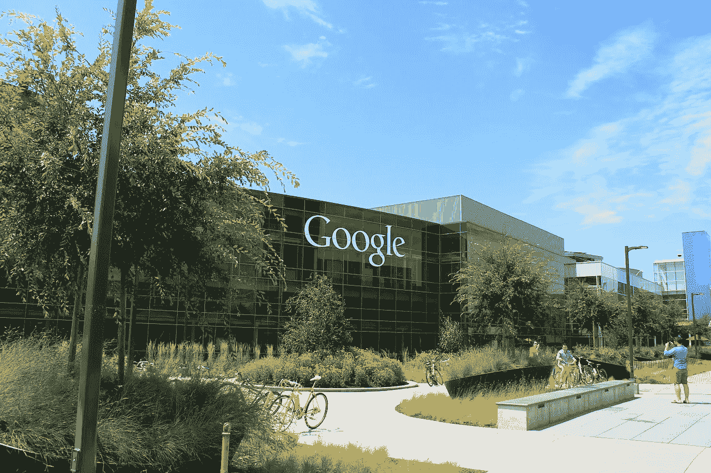

# 谷歌商业分析师访谈

> 原文：<https://towardsdatascience.com/the-google-business-analyst-interview-b52e5108e0be?source=collection_archive---------14----------------------->

图片来自 [Unsplash](https://unsplash.com/photos/fpZZEV0uQwA)

## 介绍

谷歌，美国科技巨头，拥有从操作系统(Android，Chrome OS)到移动和桌面应用(Google Chrome，Google Adwords 等)的互联网相关产品和服务。)以及从硬件(Google Nexus line)到类似 Google Cloud、Youtube TV 等服务。

该公司成立于 1998 年，总部位于加州山景城。谷歌的企业使命是“组织世界上的信息，并使其普遍可用和有用”，而这只有通过数据才有可能实现。

数据对谷歌很重要，这也是他们在全球拥有和运营 20 多个数据中心的原因。谷歌每天处理超过 35.5 亿个搜索查询，每天观看 50 亿个 Youtube 视频，是“世界上数据最丰富的公司”之一，也是数据分析师、数据科学家和业务分析师发展职业生涯的最佳场所。

# 谷歌的商业分析师角色

图片来自 [Pixabay](https://pixabay.com/vectors/interface-internet-program-browser-3614766/)

谷歌**的商业分析师分析数据，得出不同的见解，推动产品的商业决策**，回答诸如“我们如何让产品更好？”以及“用户喜欢产品的什么？”。

谷歌拥有强大的数据文化，业务分析师利用这些数据来指导和推动业务决策。根据分析师被分配到的团队，角色可能略有不同，但在谷歌的总体角色范围从**确定解决方案**和新的**业务见解**，到广泛的**数据分析**和**预测建模**，再到需求管理和向相关利益相关方传达见解。

*对亚马逊等类似公司的业务分析师职位感兴趣？* [*在面试查询上查看“亚马逊商业分析师面试”！*](https://www.interviewquery.com/blog-amazon-business-analyst-interview/)

## 所需技能

谷歌商业分析师的角色需要专业领域和丰富的行业经验。因此，谷歌只雇用在定量分析、咨询或任何相关数据驱动的业务职位方面至少有 4 年(高级职位 7 年以上)行业经验的最合格的申请人。

其他基本资格包括:

*   数学、统计学、计算机科学、物理学、工程学、运筹学、经济学、工程学学士(MBA、硕士或博士优先)或同等的实践经验。
*   熟悉关系数据库，包括 SQL、MySQL、MapReduce 查询、数据库定义、模式设计和商业智能工具。
*   对脚本语言(如 PHP、Python、R、Perl、Java 等)有基本的了解。)以及 R、SAS、Matlab、Numpy/Pandas 等统计软件。
*   具有从各种结构化和非结构化数据源中提取、采样和可视化大型数据集，以及编写和维护提取、转换、加载(ETL)的经验。
*   具有与工程和业务团队跨职能合作的经验。

## 谷歌的商业分析师团队

“谷歌现在是，将来也永远是一家工程公司”，因此，**数据驱动着谷歌**的业务决策。数据科学是谷歌文化的核心，应用于公司的各个方面。

为了强调数据科学对谷歌的重要性，他们创建了一个“人员分析部门”，以协助公司的人力资源决策过程，包括根据对绩效评估数据的分析，决定经理或团队成员是否对团队的绩效产生影响。数据和合理的商业决策之间的差距是由商业分析师弥合的，他们深入挖掘谷歌的数据以提供合理的见解。

根据所分配的团队，谷歌业务分析师的角色可能包括:

*   **谷歌云:**这个团队帮助谷歌的客户，比如学校、政府机构、公司等。，通过使用谷歌的全球数据中心和软件资产来转变和发展他们的业务，使他们更具生产力、移动性和协作性。该团队中的业务分析师与高级销售领导合作，提供可操作的见解，提高决策能力，并通过数据驱动的方法加深对谷歌快速增长的业务的理解。
*   **YouTube Trust & Safety:** 这个团队致力于让 YouTube 成为一个安全的地方，让世界各地的用户、观众和内容创作者能够创作和表达自己。担任此角色的业务分析师利用高级数据分析和预测模型来确定提高运营效率的关键影响因素，并与各种利益团队进行跨职能协作，以实施可扩展的解决方案，从而进一步优化运营指标。
*   **YouTube Insights，Impact &工具:**该团队支持 YouTube 业务和运营团队以及其他内部合作伙伴，为严格的数据洞察提供数据基础设施、工具和分析支持，构建改变 YouTube 业务团队工作方式的解决方案和服务。分析师还与业务利益相关者合作，以了解他们的业务领域并构建业务需求，与数据基础设施连接以构建满足这些需求所需的管道、数据集和工作流。
*   **业务系统集成:**这个团队识别谷歌内部合作伙伴内部耗时的内部流程，然后构建可靠的解决方案，这些解决方案具有足够的可扩展性，能够与公司的规模和范围相适应。他们还从头开始设计和开发创新的推荐系统，以促进业务增长，将科学应用于销售，并提高销售团队的生产力。
*   **gTech 的用户和产品(gUP):**gUP 团队构建了创新的解决方案，将谷歌的用户体验和参与度提升到一个全新的水平，支持不同产品、国家、文化、收入和身份的用户。guP 通过数据建模、指标开发、数据原型和使用统计技术对谷歌用户的复杂数据进行洞察，帮助用户充分利用谷歌。
*   **销售和销售运营:**该团队利用高级数据分析，持续管理关键数据指标的审核，以指导决策制定，并提高可扩展性和效率。分析师与销售、营销、财务、法律和运营团队进行跨职能协作，积极交付标准流程，促进和支持销售模型并简化服务。
*   **Google Pay:** 该团队通过与银行/支付生态系统的各个方面(包括网络、发行商、网关和金融技术)合作和互动，为 Google 用户开发和实施安全便捷的支付系统。其他职责包括通过启动项目来收集和分析端到端流程，以开发全面的、以数据为基础的战略问题评估，从而推动谷歌所有货币化产品的增长。

# 面试过程

来自 [Pixabay](https://pixabay.com/photos/google-plex-california-logo-office-959059/) 的 Googleplex office 图片

谷歌商业分析师面试就像其他谷歌面试流程一样。首先是对招聘人员的在线电话面试，然后是对经理的技术筛选面试。技术面试后，招聘人员将安排现场面试，包括三到四轮一对一的面试，中间有午餐休息时间。

*要更熟悉谷歌的面试流程，请在面试查询中阅读“谷歌数据科学家面试”！*

## 初始屏幕

这是招聘人员或人力资源的第一步面试，主要是试探性的。在这个长达 45 分钟的面试中，招聘人员会问一些关于你相关的**过去经历和项目**的问题，尤其是那些涉及 SQL 的问题。招聘人员还将提供对公司、工作角色和公司工作文化的见解。

> 注意:在这次面试中，你应该用一个故事或经历来回答每个问题，用真实的例子和数据来证明你适合这个角色。

**样题:**

*   描述一个你做过的数据项目。
*   说说你自己吧。
*   描述一个你引以为豪的涉及统计学实践的项目。

## 技术屏幕

谷歌的商业分析师技术屏幕遵循与大多数谷歌技术面试几乎相同的协议。标准的基于案例的 SQL 问题被问到，候选人被要求在一个共享的谷歌文档上写 SQL 查询。

问题是标准化的，所以解决来自[面试查询](https://www.interviewquery.com)的 SQL 问题可以更好地为这次面试做准备。

*要了解类似角色所提 SQL 问题类型的更多信息，* [*请查看关于面试查询的“产品分析师面试问答”文章！*](https://www.interviewquery.com/blog-product-analyst-interview-questions-and-answers/)

## 现场面试

业务分析师现场访谈包括与经理、产品专家和业务分析师的三轮访谈，持续时间在 30 到 45 分钟之间。

谷歌面试候选人的评估基于四个一般属性:“**一般认知能力、领导力、角色相关知识和谷歌度**”。每一个面试问题都围绕着这四个基本属性，候选人应该相应地设计他们的答案。

谷歌商业分析师现场面试的时间表如下:

1.**技术面试**

> *这是对一位经理的采访，问题是基于案例的标准 SQL 问题。*

2.**产品感访谈**

3.**领导力/行为面试**

4.**谷歌面试**

# 注意事项和提示

谷歌的业务分析师面试评估候选人利用数据分析来识别关键业务见解、提供解决方案以及帮助做出合理的战略性商业决策的能力。面试问题主要涵盖概念层面的数据科学知识、预测建模、指标和战略定义，以及与利益相关方交流见解的能力。重温你的描述性分析、统计和概率、时间序列、回归和预测模型的知识。

# 谷歌商业分析师面试问题:

*   在改进现有产品方面，你会给管理层什么建议？依据是什么？
*   你如何衡量一个用户的价值？
*   如果你是一家花店的老板，你会如何在网上锁定你的顾客？(谁？什么时候？在哪里？怎么会？)
*   您熟悉哪种类型的 SQL 连接？
*   你的 ETL 和 OLAP 经验是什么？
*   你用过哪些 DB 和可视化工具？
*   列出几个 SQL 分析函数。
*   给我一个你领导过的项目的例子。结果如何？你遇到了哪些困难？
*   如果你正在建立一个新的电子商务企业，你会关注什么？
*   你将如何建立一个专利系统？
*   说出一个你使用的谷歌产品，你会对它做什么改变？你会如何改进它？
*   用三句话向孩子描述 AdWords。

# 感谢阅读

*   如果你想为面试做准备，请查看 [**面试查询**](https://www.interviewquery.com/) **！**
*   查看我的 [**Youtube 频道**](https://www.youtube.com/channel/UCcQx1UnmorvmSEZef4X7-6g) 获取更多面试指南，以及解决问题的技巧&。
*   在面试查询博客上找到更多面试准备资源，如 [**谷歌数据分析师面试**](https://www.interviewquery.com/blog-google-data-analyst-interview/) 和 [**亚马逊商业分析师面试**](https://www.interviewquery.com/blog-amazon-business-analyst-interview/) 。

*原载于 2020 年 8 月 1 日*[*https://www.interviewquery.com*](https://www.interviewquery.com/blog-google-business-analyst-interview/)*。*