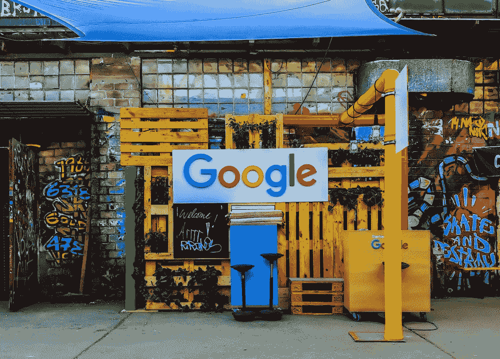

# 谷歌数据科学家访谈

> 原文：<https://towardsdatascience.com/the-google-data-scientist-interview-731d01d27859?source=collection_archive---------51----------------------->

图片来自 [Unsplash](https://unsplash.com/photos/K4txLik7pnY)

谷歌是一家美国科技巨头，专注于互联网相关服务和产品，包括在线广告、搜索引擎、云计算、软件和硬件。该公司成立于 1998 年，总部设在加州山景城[1]。

自 2002 年成立以来，谷歌发展迅速，开发了广泛的产品，收购了许多公司，**通过其在搜索领域的主导地位进入了主流文化。现在，谷歌已经扩展到大量的产品和服务，如办公套件应用程序、电子邮件客户端、云计算、视频聊天、android 等等。**

鉴于谷歌提供的产品和服务过多，用户数量惊人，有人可能会问*谷歌到底处理了多少数据？*根据 2019 年的统计数据，谷歌平均每秒处理超过 40，000 次搜索查询，相当于全球每天超过 35 亿次搜索，每年 1.2 万亿次搜索[2]。对于谷歌来说，这提供了帮助其客户增长和扩展的无限机会，而对于数据科学家来说，这提供了一个用于分析和解释的信息宝库，以帮助谷歌及其客户识别机会，并塑造谷歌的业务和技术战略。

*如果你对面试中的问题感兴趣，可以查看一下* [*谷歌数据科学面试问题*](https://www.interviewquery.com/blog-google-data-science-interview-questions-and-solutions/) *！*

# 数据科学在谷歌的角色

谷歌的数据科学家在团队、产品和功能的广泛层面上工作，从增强广告效果到网络基础设施优化。

谷歌数据科学的角色**主要是一个专注于指标和实验的分析角色**。这与机器学习和[产品分析师角色](https://www.interviewquery.com/blog-the-product-analyst-interview/)截然不同，后者也存在于谷歌，分别更侧重于工程和产品方面。在转向数据科学以吸引更多人才之前，谷歌的数据科学职位曾被称为**定量分析师**。

其他相关资格包括:

*   统计学、计算机科学、生物信息学、计算生物学、工程学、物理学、应用数学、经济学、运筹学或相关定量学科的硕士或博士学位，或同等的实践经验。
*   在统计软件方面有丰富的经验(如 MATLAB、Panda、Colab、S-Plus、SAS 等)。)、Python、R、C++和/或 Java 等编程语言，以及数据库语言(如 SQL)和管理系统方面的高级经验。
*   拥有大数据和云平台部署大规模数据科学解决方案的经验。
*   数据科学方面的经验，侧重于业务分析、设计和构建统计模型、可视化、机器学习、数字属性、预测、优化和预测分析
*   高级统计概念的知识和在大型数据集上机器学习的应用经验。
*   展示问题框架、问题解决、项目管理和人员管理技能。

## 所需技能

谷歌通常只雇佣在分析或相关领域有至少两到三年行业经验的有经验的人。谷歌确实为数据科学领域的实习和大学毕业生提供了计划，特别是为新的博士毕业生提供了更高级的职位。

## 谷歌的数据科学团队

从营销部门到谷歌研究的研究团队，数据科学家利用高级分析、机器学习理论以及统计概念和方法来确定产品开发和改善客户体验的机会。

Google land 的数据科学家最常见的团队是:

*   **工程和设计:**应用高级分析并反复构建分析管道，以提供大规模洞察，同时与各种团队进行跨职能协作，以提供业务影响建议。
*   **gTech 专业服务:**利用技术实施、优化和关键解决方案，帮助客户实现其广告业务目标。
*   **谷歌地图核心指标:**开发核心指标和实验实践，定义如何衡量和测试谷歌地图的参与度、采用度和保留度。
*   **地理:**在大型地理数据集上应用高级分析工具，构建分析管道并建立原型，研究和开发分析、预测和优化方法，并在各个级别提出业务建议。
*   **运营和支持:**与工程师合作，分析、解释数据，开发衡量结果的指标，并将新工具集成到客户支持和运营中。
*   **广告:**通过利用统计研究和机器学习概念，建立和扩展谷歌的广告能力。
*   **搜索广告:**设计和分析复杂的实验，了解变化对系统的影响，并提供改进建议。与分析师和软件工程师(SWE)就核心算法进行合作，以改善客户体验。
*   **业务战略:**通过与跨职能团队合作，了解他们的业务需求，提供有意义的战略建议。

# 谷歌面试流程

谷歌的面试流程始于招聘人员在你提交申请后，首先通过电子邮件向你发送一份预筛选问卷。然后你会接到招聘人员的电话，讨论你的兴趣和经历。面试结束后，招聘人员将安排一次与数据科学家或招聘经理的电话面试，时间通常为 45 至 60 分钟。完成这一部分后，将安排一次现场面试，包括五轮单独的面试。

## 初始屏幕

最初的屏幕通常是与招聘人员进行 30 分钟的电话面试，他们描述了工作职位、职责，然后是谷歌不同团队的例子，然后询问你是否愿意追求数据科学职位。在这次面试中，你可以和招聘人员交谈，招聘人员会更多地了解你的技能。

招聘人员主要是想弄清楚你的职业目标，看看这些目标如何与谷歌的文化和价值观以及他们能把你安排到的不同团队保持一致。

*   描述一个过去基于数据科学的项目。
*   你遇到了什么问题？如果数据不同，您会使用什么方法？
*   统计问题(计算统计)或因果推理问题
*   共享代码编辑器上的编码问题

## 技术屏幕

谷歌的数据科学家技术筛选是通过与数据科学家的视频会议(Google Hangouts)完成的。这次采访围绕着实验设计、统计学和一个概率编码问题。它还涉及更多的技术讨论，集中在过去的研究和工作经验，深入到你所面临的问题和你解决这些问题的技术方法。试着在[面试提问](http://interviewquery.com/)上练习中等水平的问题。

## 谷歌现场采访

现场面试是谷歌数据科学家面试流程的最后一个阶段。它包括与数据科学家的 5 轮一对一访谈，涵盖计算统计学、概率、产品解释、指标和实验、建模和行为问题。每次面试持续大约 45 分钟，中间有一次午餐休息。

点击此处，阅读更多关于谷歌[数据科学问题的示例。](https://www.interviewquery.com/blog-google-data-science-interview-questions-and-solutions/)

# 感谢阅读！

*   在 [**报名面试查询**](https://www.interviewquery.com/) 练习谷歌的数据科学面试题。
*   **订阅 Youtube 上的** [**我的频道**](https://www.youtube.com/channel/UCcQx1UnmorvmSEZef4X7-6g/) 获取数据科学[模拟面试](https://www.youtube.com/watch?v=e2LJ-6NagpE)，指南，以及技巧和窍门。
*   在面试提问博客上找到更多来自脸书和亚马逊[的](https://www.interviewquery.com/blog-amazon-machine-learning-interview-questions-solutions/)[数据科学面试问题。](https://www.interviewquery.com/blog-facebook-data-science-interview-questions-and-solutions/)

## 参考

[1]谷歌维基百科页面[2]谷歌搜索统计

*原载于 2020 年 4 月 21 日 https://www.interviewquery.com***。**