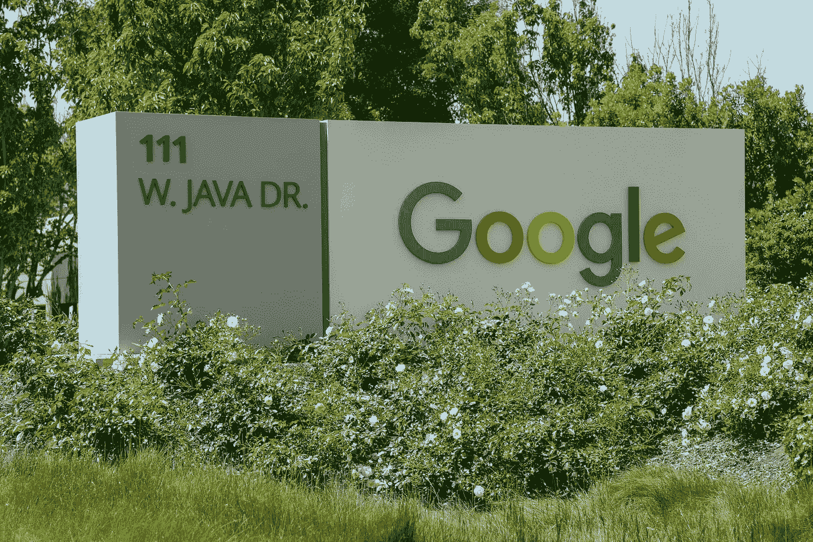

# 谷歌产品分析师访谈

> 原文：<https://towardsdatascience.com/the-google-product-analyst-interview-bfce2c94d1f6?source=collection_archive---------13----------------------->

图片来自 [Pixabay](https://pixabay.com/illustrations/google-search-engine-browser-search-76517/)

## 介绍

2008 年，谷歌推出了云解决方案“谷歌云平台”(GCP)，这是一套云计算服务，提供出色的基础设施即服务(IaaS)解决方案，帮助企业扩大规模。

如今，GCP 几乎应用于每个行业，包括制造、零售、金融、医疗保健和生命科学、游戏、教育、电信和政府。谷歌云平台还提供“ML 模型开发、搜索、自然语言、语音、翻译、视觉和视频智能”的大数据(大查询大规模数据仓库、数据流、云数据实验室、云数据实验室、数据工作室等)和 AI/机器学习解决方案。

多年来，谷歌花费了大量资金开发分析和基于云的架构工具，以帮助企业发展。数据和数据分析是公司核心愿景不可或缺的一部分，因此，谷歌为新加入的数据科学家、数据分析师、数据工程师和业务分析师提供了前所未有的工作规模。

# 谷歌的产品分析师角色

图片来自 [Pixabay](https://pixabay.com/illustrations/planning-finance-business-4077086/)

一般来说，产品分析师是利用**市场研究、数据分析和商业智能技能**成功**将新产品推向市场**的人。这个角色在谷歌是专门的。谷歌的产品分析师利用**数据分析**寻找不同的见解**推动业务影响**。他们为“谷歌的内部客户和整个组织的合作伙伴提供定量分析、市场专业知识和战略视角”。

谷歌的产品分析师通常会监督产品的整个过程，包括设计阶段、发布前和发布后。围绕产品旅程(从设计到市场)有很多问题，产品分析师帮助回答真正的问题，比如“我们试图让什么发生？”、“怎么才能定量证明？”，以及“我们对此有信心吗？”。

产品分析师还与内部团队进行跨职能合作，在产品方向、实验和分析方面指导他们，并与开发人员合作，帮助他们在项目中取得成功。

## 所需技能

像谷歌的每个职位一样，产品分析师的角色需要企业级的分析技能和至少三年的定量分析行业经验。

**其他相关技能包括:**

*   统计学、计算机科学、数学、工程、数据科学或其他定量领域的学士/硕士学位。
*   丰富的统计软件包经验，包括 R，SAS，Stata，MATLAB 等。
*   在编写 SQL 查询、提取大数据和设计 ETL 流程方面有丰富的经验。
*   具有开发模型、方法/途径(包括时间序列预测、计量经济学、因果推断和分类方法)的经验，以及将分析结果转化为业务建议的能力。
*   三年与工程师和产品经理合作的经验，尤其是在提供以产品为中心的见解方面。

## 谷歌的产品分析师团队

图片来自 [Unsplash](https://unsplash.com/photos/5OyvN4Yx46E)

虽然产品分析师的角色有时与业务分析师的角色重叠，但产品分析师严重依赖于**定量分析**，而不是专注于产品设计的业务影响。他们在团队中工作，并与其他人进行跨职能合作，以实现业务目标。

作为一家大公司，有许多团队围绕许多不同的产品和功能进行产品开发和设计，谷歌提供了一个非常全球化的独特规模，即使你最微小的努力也会产生重大影响。根据所分配的团队，具体角色可能会有所不同。以下是谷歌的一些产品分析师团队及其具体角色:

*   **数据科学团队:**这个团队的产品分析师为业务建议进行分析，开发和自动化报告，并迭代地构建和原型化仪表板，以提供大规模的洞察力。他们还向多层次的利益相关者提交调查结果，并与利益相关者进行跨职能合作，以制定和完成全周期分析。
*   **开发人员控制台:**角色包括与开发人员控制台中的工程和产品管理团队合作，通过端到端分析了解他们的业务需求，包括收集和分析数据以及正在进行的可交付成果，并向多个领导层提供有效的演示和建议。该职位还包括开发和自动化报告，原型仪表板，以提供可操作的大规模见解。
*   **Youtube 数据科学团队:**角色包括通过严格的实验和分析来指导团队的产品方向，并与工程团队密切合作，以实现成功的产品开发之旅。

> [点击此处查看我们的产品分析师面试问题指南](https://www.interviewquery.com/blog-product-analyst-interview-questions-and-answers)

# 面试过程

图片来自 [Unsplash](https://unsplash.com/photos/lKjX3S4pdog)

产品分析师面试流程遵循谷歌的标准招聘流程。面试过程始于招聘人员通过电子邮件联系你，评估你的兴趣。下一步是完成一个关于你过去的项目和与角色相关的技能的十个问题的调查。在此之后，将通过电话或 Google Hangouts 安排与产品分析师的初次面谈。最后一个阶段是现场采访，包括同一个团队的产品分析师的四轮采访。

## 初始屏幕

谷歌产品分析师的初始屏幕是探索性的。这是一次与产品分析师(PA)的 45 分钟电话或 Google Hangouts 访谈；问题的范围可以从过去的项目经验型问题到简单的技术型问题。

> ***样题:*** 你会如何向一个非技术人员解释一个 95%的置信区间？

## 现场面试

这是谷歌产品分析师面试步骤的最后一个阶段。这个面试由**与产品分析师(团队内部或团队外部)的四轮连续**面试以及中间的午餐休息组成。

标准的谷歌产品分析师现场访谈问题可以包括**建模、指标定义、SQL 和标准统计**问题。问题的范围也可以从假设到基于案例和现实生活的场景。在这些面试中还有**行为、产品意识和文化契合**问题。你可能会遇到这样的问题:“你会怎么做？”，以及“告诉我一次你..”

> 注意:在面试中详细讲述你的解决方案是很重要的，使用你过去参与的项目来解释你的答案和选择也是很有帮助的。

# 注意事项和提示

谷歌是一家基于产品的科技公司，谷歌的产品分析师预计会利用数据和高级分析方法来推动产品增长。谷歌产品分析师面试旨在评估候选人履行工作职责的能力，以推动谷歌产品的成功。

谷歌在所有面试过程中使用专门针对职位定制的标准化问题。 [*解决谷歌产品分析师关于面试查询的 SQL 和 Python 问题*](https://www.interviewquery.com) 对你面试成功大有帮助。

请记住，谷歌产品分析师面试还将测试统计和数据分析概念的组合，以及产品感知和商业分析概念。复习基本的统计和概率、预测模型、指标定义和 SQL(包括等级、连接等)知识。

同样值得注意的是，不管你申请的是什么职位和部门，谷歌对所有面试流程都有四个主要标准。第一个是“**一般认知能力**，第二个是“**角色相关知识**，第三个是“**领导技能**，最后一个是你的“**粘性**”。

谷歌采用严格的面试后招聘流程，包括团队匹配和整合报价。这是由一个高素质的、不带偏见的谷歌团队“招聘委员会”来完成的，他们是这些角色/工作的专家，以前从未见过任何申请人。在招聘委员会做出裁决后，他们会向高级管理层提交一份建议书，供最终审核，然后才会发出聘用通知。

# 谷歌产品分析师面试问题

*   给定一个假设的情况，你将如何创建一个模型来预测这个指标？
*   你会如何处理阶级不平衡等。？你将如何在商业环境中使用这个模型？
*   如何使用 rank()来获得具有最高值的 id？
*   对一列排序还是对该列的多个部分同时排序更快？
*   你会如何测试一个新产品？
*   你会如何向一位老奶奶解释 AdSense？

> 查看 SQL、产品指标、a/b 测试等方面的更多[产品分析师面试问题！](https://www.interviewquery.com/blog-product-analyst-interview-questions-and-answers)

# 感谢阅读

*   如果你有兴趣提高你的数据科学技能，请查看 [**面试查询**](https://www.interviewquery.com/) **！**
*   查看我的 [**Youtube 频道**](https://www.youtube.com/channel/UCcQx1UnmorvmSEZef4X7-6g) 获取更多面试指南，以及解决问题的技巧&。

*原载于 2020 年 8 月 21 日 https://www.interviewquery.com**的* [*。*](https://www.interviewquery.com/blog-google-product-analyst-interview/)