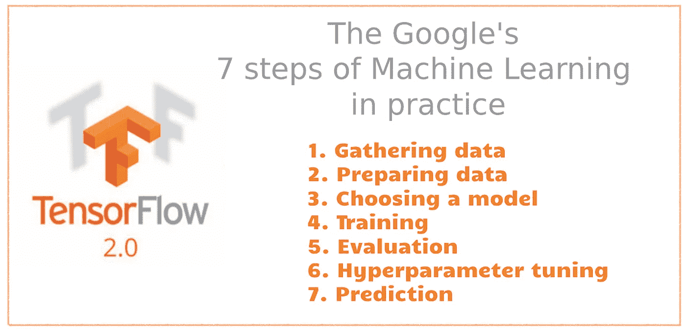
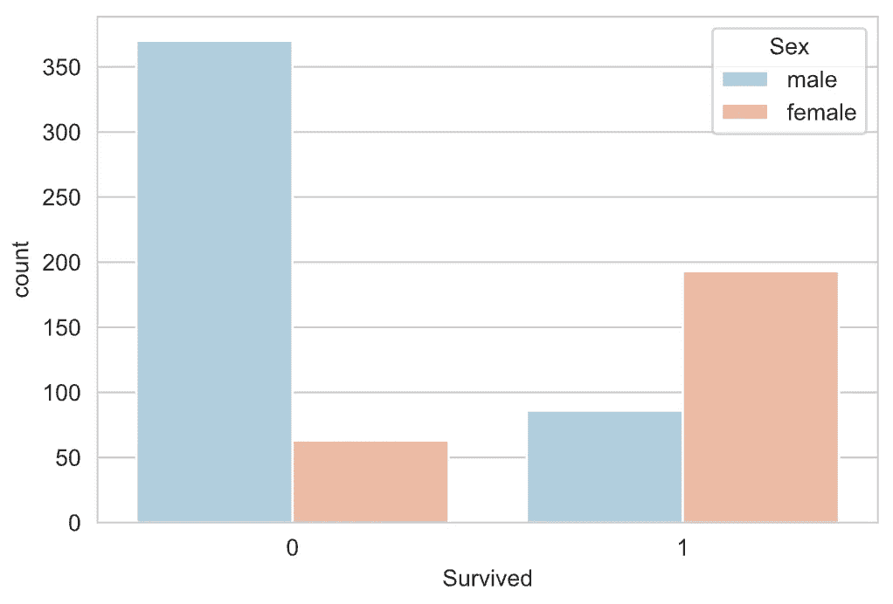

# 谷歌机器学习实践的 7 个步骤:结构化数据的 TensorFlow 示例

> 原文：<https://towardsdatascience.com/the-googles-7-steps-of-machine-learning-in-practice-a-tensorflow-example-for-structured-data-96ccbb707d77?source=collection_archive---------9----------------------->

## 一步一步的教程，把 7 个步骤付诸实践，并从头开始建立一个机器学习模型。



谷歌机器学习实践的 7 个步骤

网上有很多很棒的机器学习教程。然而，它们中的大多数集中在机器学习的特定部分，例如，探索数据、建立模型、训练和评估。他们中很少有人介绍建立机器学习模型的完整步骤。

最受欢迎的概述机器学习过程步骤的文章之一是国玉峰的[机器学习的 7 个步骤](/the-7-steps-of-machine-learning-2877d7e5548e)，由谷歌云平台推出。

https://www.youtube.com/watch?v=nKW8Ndu7Mjw

郭列出了如下 7 个步骤:

1.  收集数据
2.  准备数据(和探索数据)
3.  选择模型
4.  培养
5.  估价
6.  超参数调谐
7.  预测(和保存模型)

在本文中，我们将把上述步骤付诸实践，并从头构建一个机器学习模型。

# 定义问题和环境设置

在我们进入细节之前，我们需要为任何机器学习项目做的第一件事是为我们的机器学习模型定义问题。

在本教程中，我们将处理来自 Kaggle 的[泰坦尼克号数据集。这是一个非常著名的数据集，通常是学生学习机器的第一步。](https://www.kaggle.com/c/titanic/overview)

假设我们被要求创建一个系统来预测泰坦尼克号上的幸存者。

## 环境设置

为了运行本教程，您需要安装

> TensorFlow 2，TensorBoard 2，numpy，pandas，matplotlib，seaborn

它们都可以通过 PyPI 直接安装，我强烈建议创建一个新的虚拟环境。最好避免使用 ***base(root)*** ，因为这可能会破坏您的系统。

您可以查看以下文章，了解如何创建 Python 虚拟环境:

[](/create-virtual-environment-using-virtualenv-and-add-it-to-jupyter-notebook-6e1bf4e03415) [## 使用“virtualenv”创建虚拟环境，并将其添加到 Jupyter 笔记本中

### 你是机器学习工程师，正在使用 Python 和 Jupyter Notebook 吗？在这篇文章中，你会看到为什么…

towardsdatascience.com](/create-virtual-environment-using-virtualenv-and-add-it-to-jupyter-notebook-6e1bf4e03415) [](https://medium.com/analytics-vidhya/create-virtual-environment-using-conda-and-add-it-to-jupyter-notebook-d319a81dfd1) [## 使用“conda”创建虚拟环境，并将其添加到 Jupyter 笔记本中

### 你正在使用 anaconda 和使用 Jupyter Notebook 和 Python 吗？在这篇文章中，你将看到如何创建虚拟的…

medium.com](https://medium.com/analytics-vidhya/create-virtual-environment-using-conda-and-add-it-to-jupyter-notebook-d319a81dfd1) 

## 源代码

所有的说明都在这篇文章里，我已经把笔记本开源了，源代码请查看下面的 Github 项目

> Google 的 7 步机器学习实践，在 Github 中是免费的。更多教程可从 [Github Repo](https://github.com/BindiChen/machine-learning) 获得。

# 1.收集数据

一旦我们定义了我们的问题，就到了机器学习的第一步:**收集数据**。这一步最重要，因为您收集的数据的质量和数量将直接决定您的预测模型有多好。

在本教程中，数据将来自 Kaggle。让我们导入一些库并加载数据来开始吧

```
import pandas as pd
import numpy as np
import matplotlib.pyplot as plt
import seaborn as sns
%matplotlib inline
```

让我们将 **train.csv** 和 **test.csv** 文件加载到 pandas DataFrame 中。

```
df_train_raw = pd.**read_csv**('data/titanic/train.csv')
df_test_raw = pd.**read_csv**('data/titanic/test.csv')df_train_raw.head()
```


泰坦尼克号数据预览


来自 [Kaggle](https://www.kaggle.com/c/titanic/data?select=train.csv) 的数据字典

# 2.准备数据

先说一些**探索性的数据分析** (EDA)。我们将从检查缺失值开始。

## 2.1 缺失值

我们可以使用 seaborn 创建一个简单的热图来查看哪里缺少值

```
sns.heatmap(**df_train_raw.isnull()**, 
            yticklabels=False, 
            cbar=False, 
            cmap='viridis')
```


缺失值的 seaborn 热图输出

****小屋****有缺失值。 ***年龄*** 缺失的比例很可能小到足以用某种形式的插补进行合理替换。查看 ***舱*** 列，看起来那些数据缺少太多的值，无法做一些有用的事情。我们以后很可能会去掉 ***舱*** ，或者改成另一个类似“已知舱:1 或 0”的特性。上船失踪的比例很小，这个教程还是留着吧。**

## **2.2 可视化更多的数据**

**让我们继续将更多的数据可视化**

```
**sns.countplot(**x='Survived'**, data=df_train_raw, palette='RdBu_r')**
```

****

**幸存的情节**

```
**sns.countplot(**x='Survived',** 
              **hue='Sex',** 
              data=df_train_raw,
              palette='RdBu_r')**
```

****

```
**sns.countplot(**x='Survived',**
              **hue='Pclass',** 
              data=df_train_raw,
              palette='rainbow')**
```

****

```
**sns.distplot(**df_train_raw['Age'].dropna(),**
             **kde=True,**
             color='darkred',
             bins=30)**
```

****

```
**sns.countplot(x='SibSp',data=df_train_raw)**
```

****

```
**df_train_raw['Fare'].hist(color='green', 
                          bins=40, 
                          figsize=(8,4))**
```

****

## **2.3 数据清理**

**我们想用某种形式的插补来代替缺失的年龄。一种方法是填写所有乘客的平均年龄。然而，我们可以更聪明地处理这个问题，按乘客级别检查平均年龄。例如:**

```
**sns.boxplot(**x='Pclass',**
            **y='Age',**
            data=df_train_raw,
            palette='winter')**
```

****

**我们可以看到，在较高的阶层中，较富裕的乘客往往年龄较大，这是有道理的。我们将根据年龄的 Pclass 使用这些平均年龄值进行估算。**

```
**def impute_age(cols):
    Age = cols[0]
    Pclass = cols[1]

    if pd.isnull(Age):
        **if Pclass == 1:**
            return 37
        **elif Pclass == 2:**
            return 29
        **else:**
            return 24
    else:
        return Age**
```

**现在让我们应用这个函数并检查它是否工作**

```
**# Make a copy for test only
train_copy = df_train_raw.copy() 
train_copy['Age'] = train_copy[['Age','Pclass']]
   **.apply(impute_age, axis=1)**# check that heat map again
sns.heatmap(**train_copy.isnull(),** 
            yticklabels=False, 
            cbar=False, 
            cmap='viridis')**
```

****

**太好了！`impute_age()`作品。让我们继续转换分类特征并删除 ***小屋*** 列。**

## **2.4 转换分类特征**

**我们需要将分类特征转换成[一次性编码](/what-is-one-hot-encoding-and-how-to-use-pandas-get-dummies-function-922eb9bd4970)。否则，我们的机器学习算法将无法直接将这些特征作为输入。**

**让我们用`info()`检查列数据类型**

```
**df_train_raw.info()<class 'pandas.core.frame.DataFrame'>
RangeIndex: 712 entries, 0 to 711
Data columns (total 12 columns):
 #   Column       Non-Null Count  Dtype  
---  ------       --------------  -----  
 0   PassengerId  712 non-null    int64  
 1   Survived     712 non-null    int64  
 2   Pclass       712 non-null    int64  
 3   Name         712 non-null    **object** 
 4   Sex          712 non-null    **object** 
 5   Age          566 non-null    float64
 6   SibSp        712 non-null    int64  
 7   Parch        712 non-null    int64  
 8   Ticket       712 non-null    **object** 
 9   Fare         712 non-null    float64
 10  Cabin        168 non-null    **object** 
 11  Embarked     710 non-null    **object** 
dtypes: float64(2), int64(5), **object(5)**
memory usage: 66.9+ KB**
```

**有 5 列的数据类型为 object。其中 ***姓名*** 、 ***车票*** 、 ***客舱*** 不需要。另外，我们注意到 ***Pclass*** 根据我们上面看到的数据字典是一个分类数据。让我们制作一个函数`preprocessing()`来保留这些有用的数字特征，并将 ***Pclass*** ， ***Sex，*** 和*apolled*转换成一键编码。**

****

**让我们应用该函数，并为构建我们的机器学习模型创建训练和测试数据集。**

```
**x_train = **preprocessing(df_train_raw)**
y_train = **df_train_raw['Survived'].values**x_test = **preprocessing(df_test_raw)**
y_test = **df_test_raw['Survived'].values**print("x_train.shape =", x_train.shape )
print("x_test.shape =", x_test.shape )**
```

**通过上面的运行，您应该得到如下所示的训练和测试数据集的形状:**

```
**x_train.shape = (712, 13)
x_test.shape = (179, 13)**
```

**让我们看看`x_train.head()`的数据**

****

**我们的数据经过`preprocessing()`**

**太好了！我们的数据已经可以建模了**

# **3.选择型号**

**在 TensorFlow 2.0 中有三种方法实现神经网络架构:**

*   ****顺序模型**:是使用 Keras 最简单的方法。**
*   ****功能 API** :针对更复杂的模型。**
*   ****模型子类**:完全可定制，使您能够实现自己定制的模型前向传递。**

**为简单起见，我们用最简单的方法:带`Sequential()`的时序模型。让我们继续建立一个具有 3 个密集层的神经网络。每层中的所有参数都已硬编码，如下所示:**

```
**import tensorflow as tf 
from tensorflow.keras import models, layerstf.keras.backend.clear_session()model = **models.Sequential()**
model.add(**layers.Dense(10, activation='relu', input_shape=(13,)**))
model.add(**layers.Dense(20, activation='relu' )**)
model.add(**layers.Dense(1, activation='sigmoid')**)model.summary()**
```

**下面是`model.summary()`的输出**

****

**`model.summary()`的输出**

# **4.培养**

**首先，让我们使用`model.compile()`来配置我们的模型**

*   **使用优化器**随机梯度下降**(缩写为`sgd`)**
*   **使用二元交叉熵损失函数(`binary_crossentropy`)用于我们的二元分类**
*   **为简单起见，使用`'accuracy'`作为我们在训练和测试期间评估模型的评估指标**

**对于训练，有三种方法可以训练 Keras 模型:**

*   **将`model.fit()`用于固定历元数的模型**
*   **使用`model.train_on_batch()`只进行一次单批次训练。**
*   **创建自定义训练循环。**

**在本教程中，让我们用最简单的方法`model.fit()`继续。**

```
**# Convert DataFrame into np array
x_train = np.asarray(x_train)
y_train = np.asarray(y_train)# Get around with KMP duplicate issue
import os
os.environ['KMP_DUPLICATE_LIB_OK']='True'# Use binary cross entropy loss function for binary classification
model.compile(**optimizer='sgd'**,
            **loss='binary_crossentropy'**,
            **metrics=['accuracy']**)history = **model.fit**(x_train,y_train,
                    batch_size= 64,
                    epochs= 30,
                    validation_split=0.2
                   )**
```

**如果一切顺利，我们应该得到如下输出。**

```
**Train on 569 samples, validate on 143 samples
Epoch 1/30
569/569 [==============================] - 1s 2ms/sample - loss: 0.5568 - accuracy: 0.7206 - val_loss: 0.6139 - val_accuracy: 0.6713
Epoch 2/30
569/569 [==============================] - 0s 91us/sample - loss: 0.5639 - accuracy: 0.7047 - val_loss: 0.6212 - val_accuracy: 0.6643
Epoch 3/30
569/569 [==============================] - 0s 112us/sample - loss: 0.5705 - accuracy: 0.6907 - val_loss: 0.6379 - val_accuracy: 0.6573
Epoch 4/30
569/569 [==============================] - 0s 109us/sample - loss: 0.5538 - accuracy: 0.7065 - val_loss: 0.6212 - val_accuracy: 0.6713
......
......
Epoch 30/30
569/569 [==============================] - 0s 102us/sample - loss: 0.5597 - accuracy: 0.7065 - val_loss: 0.6056 - val_accuracy: 0.7203**
```

# **5.模型评估**

**一旦训练完成，就该看看模型是否适合模型评估了。模型评估通常包括**

1.  **绘制**损失**和**准确性**指标的进度**
2.  **用从未用于训练的数据来测试我们的模型。这就是我们之前搁置的测试数据集`df_test`发挥作用的地方。**

**让我们创建一个函数`plot_metric()`来绘制指标。**

```
**%matplotlib inline
%config InlineBackend.figure_format = 'svg'def plot_metric(history, metric):
    train_metrics = history.history[metric]
    val_metrics = history.history['val_'+metric]
    epochs = range(1, len(train_metrics) + 1)
    plt.plot(epochs, train_metrics, 'bo--')
    plt.plot(epochs, val_metrics, 'ro-')
    plt.title('Training and validation '+ metric)
    plt.xlabel("Epochs")
    plt.ylabel(metric)
    plt.legend(["train_"+metric, 'val_'+metric])
    plt.show()**
```

**通过运行`plot_metric(history, 'loss')`来绘制损失进度。**

****

**损失图**

**通过运行`plot_metric(history, 'accuracy')`绘制精度进度。**

****

**根据测试数据集测试我们的模型**

```
**# Convert DataFrame into np array
x_test = np.asarray(x_test)
y_test = np.asarray(y_test)**model.evaluate(x = x_test,y = y_test)****
```

**我们应该得到一个具有损耗和精度的输出，如下所示:**

```
**179/1 [====] - 0s 43us/sample - **loss: 0.5910** - **accuracy: 0.6760**[0.5850795357586951, 0.67597765]**
```

# **6.超参数调谐**

**酷，我们已经对我们的第一个机器学习模型进行了评估。现在是时候看看我们是否能以任何方式进一步改善这种情况了。我们可以通过转动超参数来做到这一点。在我们进行第一次培训时，我们隐含地假设了一些参数，现在是时候回去测试这些假设并尝试其他值了。**

**对于本教程，我们只关注模型中以下三个超参数的实验:**

1.  **第一密集层中的单元数**
2.  **第二密集层中的单元数**
3.  **【计算机】优化程序**

## **6.1 实验设置**

**首先，从加载 TensorBoard 笔记本扩展开始**

```
**# Load the TensorBoard notebook extension
**%load_ext tensorboard****
```

**然后，添加一条语句来清除上一次运行的所有日志。如果你不清理它们，它会把你的仪表板搞乱。**

```
**# Clear any logs from previous runs
**!rm -rf ./logs/****
```

**导入 TensorBoard HParams 插件:**

```
****from tensorboard.plugins.hparams import api as hp****
```

**列出要尝试的值，并将实验配置记录到 TensorBoard。**

*   **`5`、`10`、`20`为第一层单元数**
*   **`10`、`20`、`40`为第二层单元数**
*   **优化器的`adam`和`sgd`**

****

**超参数调谐的实验设置**

## **6.2 调整 TensorFlow 运行以记录超参数和指标**

**我们的模型很简单:3 个密集层。代码看起来很熟悉，尽管超参数不再是硬编码的。相反，超参数在`hyparams`字典中提供，并在整个训练功能中使用:**

****

**调整 tensorflow 运行以记录超参数和指标**

**对于每次运行，记录一份`hparams`摘要，包括超参数和最终精度**

```
**def run(run_dir, hparams):
  with tf.summary.create_file_writer(run_dir).as_default():
    hp.hparams(hparams)  # record the values used in this trial
    accuracy = **train_test_model(hparams)**
    tf.summary.scalar(METRIC_ACCURACY, accuracy, step=1)**
```

## **6.3 开始运行并记录它们**

**我们现在可以尝试多个实验，用一套不同的超短波来训练每个实验。为了简单起见，让我们使用一个 ***网格搜索*** 来尝试离散参数的所有组合，并且只尝试实值参数的上下界。**

```
**session_num = 0for num_units_one in HP_NUM_UNITS_ONE.domain.values:
  for num_units_two in HP_NUM_UNITS_TWO.domain.values:
    for optimizer in HP_OPTIMIZER.domain.values:
      **hparams = {
          HP_NUM_UNITS_ONE: num_units_one,
          HP_NUM_UNITS_TWO: num_units_two,
          HP_OPTIMIZER: optimizer,
      }**
      run_name = "run-%d" % session_num
      print('>> Starting trial: %s' % run_name)
      print({h.name: hparams[h] for h in hparams})
      **run('logs/hparam_tuning/' + run_name, hparams)**
      session_num += 1**
```

**如果一切顺利，我们应该得到如下输出:**

****

## **6.4 在 TensorBoard 的 HParams 插件中可视化结果**

**一旦运行完成，打开你的终端和`cd`进入项目目录。然后，现在可以通过在终端中运行以下命令来打开 HParams 仪表板**

```
**admin@Mac:~/Code/WorkSpace/machine-learning/tf2
⇒  **tensorboard --logdir logs/hparam_tuning**Serving TensorBoard on localhost; to expose to the network, use a proxy or pass --bind_allTensorBoard 2.0.0 at [http://localhost:6006/](http://localhost:6006/) (Press CTRL+C to quit)**
```

**在浏览器中打开仪表板，直接进入 **HPARAMS** - > **平行坐标视图****

****

**通过查看**平行坐标视图**，点击并拖动精度轴，可以选择精度最高的运行。**

****

**表现最好的那个**

**当这些运行通过不同的超参数时，我们可以得出结论**

*   **`**5**` 单位在第一层、**
*   **`**10**` 单位在第二层，**
*   **和同`**'adam'**` 优化器**

**在这些实验中表现最好。**

# **7.预测(和保存模型)**

**现在，我们已经得到了精确度最好的机器学习模型。最后一步是使用这个模型进行预测或推断。这是所有这些工作的重点，也是机器学习的价值得以实现的地方。我们终于可以用我们的模型来预测乘客是否幸存。**

**使用模型进行预测**

```
****model.predict**(x_test[0:10])array([[0.56895125],
       [0.37735564],
       [0.5005745 ],
       [0.60003537],
       [0.5371451 ],
       [0.36402294],
       [0.49169463],
       [0.49049523],
       [0.4984674 ],
       [0.1470165 ]], dtype=float32)**
```

**使用模型为输入样本生成分类预测。**

```
****model.predict_classes**(x_test[0:10])array([[1],
       [0],
       [1],
       [1],
       [1],
       [0],
       [0],
       [0],
       [0],
       [0]], dtype=int32)**
```

**最后，我们可以将整个模型保存到一个 HDF5 文件中:**

```
**model.**save**('data/keras_model.h5')**
```

**并加载通过`save()`保存的模型**

```
**model = **models.load_model**('data/keras_model.h5')# Predict class
model.predict_classes(x_test[0:10])**
```

# **就这样，接下来呢？**

**本文是一个快速教程，主要是向大家展示如何将 Google 的机器学习 7 步付诸实践。我试图避免许多机器学习概念，并尽可能使本教程简单。**

**请在我的 Github 上查看 [**笔记本获取源代码。**](https://github.com/BindiChen/machine-learning/blob/master/tensorflow2/001-googles-7-steps-of-machine-learning-in-practice/001-googles-7-steps-of-machine-learning-in-practice.ipynb)**

**在实际应用中，需要考虑的因素要多得多。例如，选择评估度量、特征缩放、选择有意义的特征、分割数据集、处理过拟合和欠拟合等。此外，本教程仅针对结构化数据，现实世界中的数据并不总是结构化数据，所有像图像、音频或文本这样的东西都是非结构化数据。**

**下一次，我们将构建一个 Keras 机器学习模型，它有三种不同的方式:顺序、函数和模型子类化。**

**如果你对机器学习的实用方面感兴趣，请继续关注。**