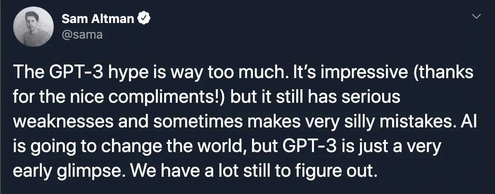

# GPT-3 不会让你失业(Github 的自动驾驶也不会)

> 原文：<https://towardsdatascience.com/the-gpt-3-wont-get-you-laid-off-8a5cb5f1dcb8?source=collection_archive---------64----------------------->

## 除非你是全职的自回归语言模型

马特·诺布尔在 [Unsplash](https://unsplash.com/s/photos/unemployed?utm_source=unsplash&utm_medium=referral&utm_content=creditCopyText) 上的照片

你有点(或者很)喜欢科技。你从 Twitter、Reddit、Medium、Slack 中的#random 等网站获取新闻。

在过去的两个月里，你的订阅越来越多与 GPT 3 相关的帖子。你开始感到好奇，并继续研究，看看新的 [**OpenAI 自回归语言模型 API**](https://openai.com/blog/openai-api/) 到底是怎么回事。

也许你有足够的好奇心去了解事情的本质，比如阅读[报纸](https://arxiv.org/pdf/2005.14165.pdf)并尝试[尽早接触美联社](https://forms.office.com/Pages/ResponsePage.aspx?id=VsqMpNrmTkioFJyEllK8sx3ELsv0PEhHphhNz30FttVUNkYwTlNPMVI1V0lXNjExMlExUlc4SE5YSS4u) I，以弄脏你的手。

同时，您会发现一些项目正在使用 GPT-3 来理解用简单英语编写的请求，并生成一些有意义的输出。

浅灰色文本为用户输入，黑色文本由 GPT-3 生成—来源: [GPT-3 论文](https://arxiv.org/pdf/2005.14165.pdf)。

如果你问我，我会说，这无疑是非常令人印象深刻和非常酷的。

GPT-3 生成布局、 [Python 代码](https://www.youtube.com/watch?v=fZSFNUT6iY8&feature=youtu.be)或[创意内容](https://www.gwern.net/GPT-3)的能力让大多数人感到震惊。也应该如此。看到一个机器学习模型能够理解请求并以正确的方式采取行动是非常了不起的。

考虑到这一点，让我们进入主题。

# GPT-3 不会让你失业。

嗯，至少在不久的将来是这样。我不敢给出时间表，因为我坚信以下几点:

> “很难做出预测，尤其是对未来的预测”——丹麦谚语

当然，我指的不是那些朝九晚五工作的人，而是自回归语言模型 API。我为你感到难过。

Sam Altman，OpenAI 的首席执行官

当创新打破人们执行的任务时，关于技术对社会影响的讨论总是变得激烈起来。当*这样的*创新是*看似*扰乱了众所周知的生产类似魔术的东西的劳动力的产出，就像一般的软件工程师一样，事情肯定比以前更加激烈。

作为技术人员，我们有一些复杂的感觉，这影响了我们的判断。

我担心 GPT-3 是一个真正突破性的成就，同时，它不会伤害我们的概念没有被经常提起。

*   是的，它可以生成代码。 ***正因为如此，我不会建议你转行或者解雇你的工程团队。***
*   是的，也许生成的代码不像你用 5 年、10 年或 20 年以上的经验编写的代码那样花哨，欺骗编译器或框架达到最大性能。

# **“深度学习是一种超能力”——吴恩达。**

**我们需要**先学会如何利用**来*发挥*我们的技术，然后再做其他事情。**

**使用 GPT-3 和其他 ML 模型来帮助我们建立、保持和运行更好的技术的工具是独一无二的。他们可以帮助我们，作为专业人员，达到一个新的水平的生产力，质量和整体专业知识。**

**在我们小小的科技泡沫中，我们可以想到 GPT-3 带来的新的可能性。**

**我们可以从头开始重新想象和构建我们日常使用的工具——用于编码、设计、管理工作等。—成为更好的专业人士。**

**例如，我们可以用它来构建更好的 ide。聪明的想法。一些公司已经开始了这方面的工作，并开发出了很棒的产品。然而，我觉得还有很多需要改进的地方，甚至是重新想象 IDE 应该是什么样子。**

**我们应该在这些工具上努力，让我们的手艺更好，而不是完全取代我们。**

**由于我们编写的代码，各个领域的大部分专业人员不得不在这些年里彻底改造自己。突然间，我们自己不能做我们提倡了几十年的事情了？**

**该是我们学会如何使用我们新的超级力量的时候了。**

***如果你喜欢这个故事，可以考虑关注我的* [*推特*](https://twitter.com/ogaihtcandido) *。***