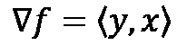

# 梯度向量

> 原文：<https://towardsdatascience.com/the-gradient-vector-66ad563ab55a?source=collection_archive---------32----------------------->

## 它是什么，我们如何计算它？

[来自 Unsplash 的照片](https://unsplash.com/photos/GzDrm7SYQ0g)

# 向量演算

在向量微积分中，一个主要的课题是引入向量和三维空间，作为通常在笛卡尔坐标系中研究的二维空间的延伸。矢量有两个主要属性:*方向*和*大小*。在二维空间中，我们可以把从原点延伸的向量想象成一个箭头(显示方向和大小)。

来自 [matplotlib](https://matplotlib.org/2.0.2/examples/pylab_examples/arrow_simple_demo.html) 的 2d 矢量图

直观地说，这可以扩展到三维空间，我们可以看到一个箭头漂浮在空间中(再次展示方向和大小)。

来自 [JCCC](http://jccc-mpg.wikidot.com/the-vector-class) 的 3d 矢量图

不太直观的是，向量的概念可以扩展到任何维数，而理解和分析只能通过代数来完成。需要注意的是，在任何情况下，矢量都没有特定的位置。这意味着如果两个向量具有相同的方向和大小，它们就是相同的向量。现在我们对向量有了基本的了解，让我们来谈谈梯度向量。

# 梯度向量

不考虑维数，梯度向量是包含函数所有一阶偏导数的向量。

让我们计算以下函数的*梯度*

我们正在计算梯度向量的函数

该梯度被表示为∇…

函数 f 的梯度向量

部分微分后…

代入偏导数后函数 f 的梯度向量

这是函数 *f(x，y)* 的梯度向量。这些都很好，但有什么意义呢？梯度向量能做什么，它到底意味着什么？

## 梯度上升:最大化

任何功能的*梯度指向最大增加的方向。这真是不可思议。假设您有一个为公司利润建模的函数。显然，你的目标是利润最大化。一种方法是计算梯度向量并选取一些随机输入-现在，您可以通过计算梯度并将这些值添加到之前的输入中来迭代更新您的输入，直到达到最大值。*

## 梯度下降:最小化

我们知道梯度向量指向最大增长的方向。相反，负梯度矢量指向下降最大的方向。梯度下降的主要目的是最小化误差或成本，这在机器学习中最为普遍。假设您有一个为公司建模成本的函数。显然，你的目标是最小化成本。与利润最大化类似，您可以计算一些随机输入的梯度向量，并通过从以前的输入中减去梯度向量中的值来迭代更新输入，直到达到最小值。

## 梯度上升/下降的问题

使用这种优化方法最值得注意的问题是相对极值的存在。相对极值指的是函数上的点，这些点相对于下图所示的函数周围的点是最大值或最小值。

照片来自[保罗的在线笔记](https://tutorial.math.lamar.edu/classes/calcI/minmaxvalues.aspx)

传统的微积分优化方法遇到了同样的问题，并通过比较所有相对极值处的函数输出来确定真正的全局最大值/最小值，从而解决了这个问题。就梯度上升/下降而言，可以对更新输入的迭代过程进行各种不同的修改，以避免(或通过)有助于优化工作的相对极值。梯度上升/下降的主要类型有…

*   随机梯度上升/下降
*   批量梯度上升/下降
*   小批量梯度上升/下降