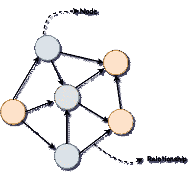
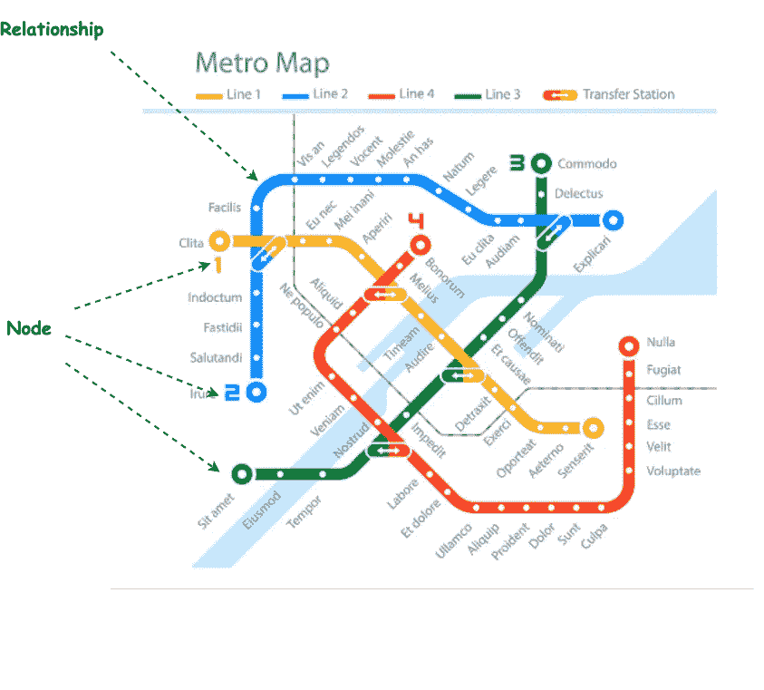
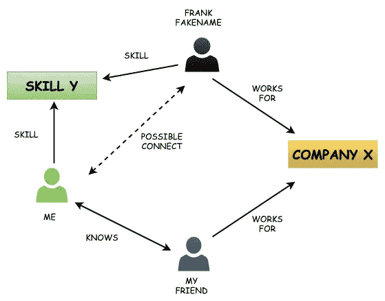
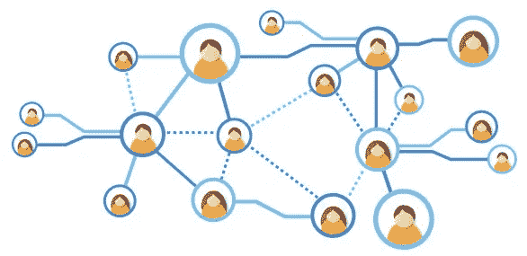
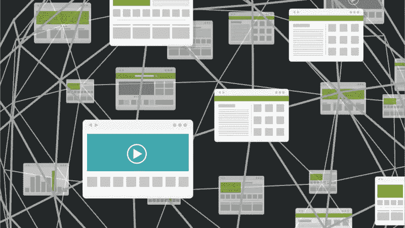
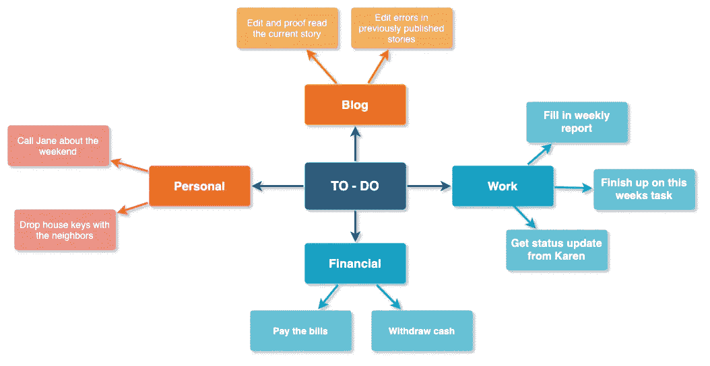
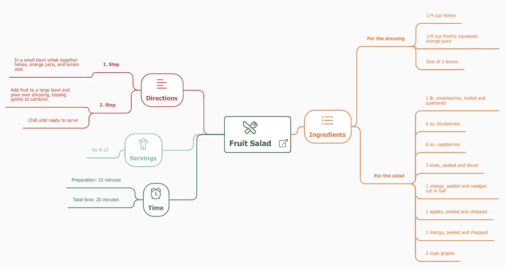
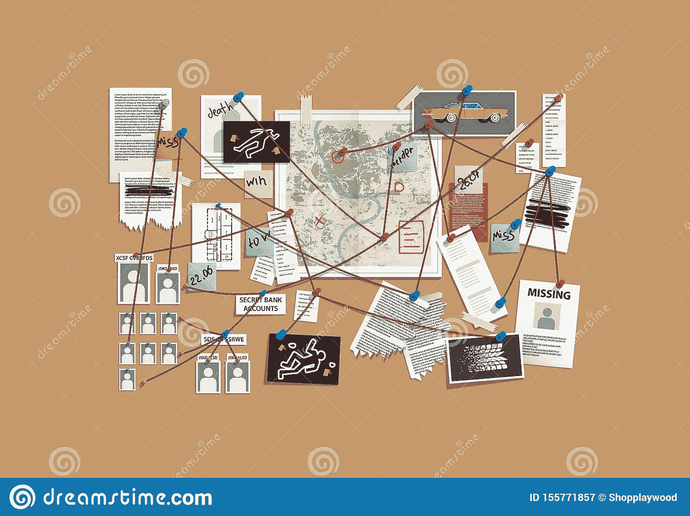

# 图形顿悟

> 原文：<https://towardsdatascience.com/the-graph-epiphany-4050e96ddcf6?source=collection_archive---------53----------------------->

## Graphbits:一堆 5 分钟的文章:都是关于图形的

也许我正在慢慢陷入疯狂。或者也许我已经是偏执狂了。但是我好像没办法。这就是为什么我要把它写下来。不过要小心。你也许会跟我一起赶时髦。

几天前开始的。我开始阅读图表，现在，它是我随处可见的。不，不是那些严肃的图表和柱状图。这不是我说的图表。让我告诉你我在说什么

有一个看起来悲伤的定义:

你得到了两个点(或者他们称之为“节点”)。给它们起具体的名字。将这两个节点连接起来，这条线就叫做关系(如果你愿意，也可以给它起个名字)。使用多个节点和关系进行扩展。你得到了一个图表！简单。朴素。简单。

我看到的图片是一个图形结构

看起来像蜘蛛网。只有一个。我读得越多，我就越被吸引，也越纠结。下面是我一天的情况。让我告诉你昨天的事。

我醒来后觉得很有冒险精神，决定坐火车去上班。我冲到车站，迅速看了一眼摊开在墙上的火车地图，寻找我必须走的路线。当我盯着地图时，我只能看到一张图表。对我来说，每个地点都变成了一个节点，连接任何两个地点的铁路线看起来就像一条被指定了距离的边。

来源:[https://previews . 123 RF . com/images/ax simen/ax simen 1812/ax simen 181200019/115456759-虚构-地铁-地图-城市-地铁-色彩-设计. jpg](https://previews.123rf.com/images/axsimen/axsimen1812/axsimen181200019/115456759-fictional-subway-map-urban-metro-color-design.jpg)

摆脱了那些想法，我上了火车。因为我有将近一个小时的时间可以消磨，所以我采用了最常见的分散注意力的方法。查看社交媒体。

LinkedIn 告诉我，Frank Fakename 可能是连接请求的下一个潜在候选人。显然，这个人和我的朋友在同一家公司工作(他已经是我的朋友了),也和我的角色相似……该死！那是一张图表！

这让我开始思考。因此，这可能不仅仅是 LinkedIn 的问题，而是所有社交媒体的问题。因为嘿！社交媒体是关于人的。人们喜欢网络。网络看起来完全像图表。

来源:[https://blog . soton . AC . uk/skillted/files/2015/04/social-network-grid . jpg](https://blog.soton.ac.uk/skillted/files/2015/04/social-network-grid.jpg)

这就是我在整个火车旅途中一直想知道的。

当我去上班的时候，我仍然全神贯注于这些想法。我机械地重启我的笔记本电脑，打开了一个网页浏览器会话。按照我每天阅读最新新闻的习惯，我点击了链接，把我带到了新闻网站。我的思绪游离并停留在网站地址的“www”部分。万维网。网络…网络…..哦，不…图表。

我突然意识到，我的“社交媒体是一个图表”只是一个更大计划中微不足道的一部分。整个网络就是一张图表！每个网页慢慢演变成一个节点，页面上的链接就是关系。我脑海中形成的画面大概是这样的

来源:[https://search engine land . com/figz/WP-content/selo ads/2015/04/links-graph-web-pages-22-1920-800 x450 . jpg](https://searchengineland.com/figz/wp-content/seloads/2015/04/links-graph-web-pages-22-1920-800x450.jpg)

够了。！让我们开始工作吧，我想。我决定更有条理一点，开始在各种“思维导图”中列出“要做”的行动项目。中途，我后退了一下，看了看我的作品。

继续..为什么它又看起来像一张图表？事情正在失去控制。

午餐时，当我看着前面的女士准备我的沙拉时，这个想法一直萦绕在我的脑海里。她把我选的所有配料放在一起，然后加入我想要的调料。所以也许这不仅仅是我的待办事项清单。但是我实际上可以将任何类型的工作流程显示为一个图表，每个步骤表示为一个节点，连接到下一个步骤。这被证明是我大脑的养料。

来源:https://pbs.twimg.com/media/DkeAmEhUcAAYs5V.jpg:large

到下午三点左右，我的眼睛开始下垂，唯一的解决办法是喝杯咖啡和读一篇好的博客。作为一名机器学习爱好者，我决定阅读有关神经网络的书籍。我想，也许一个新的话题会对我有好处。男孩，我错了。我打开的第一篇文章在最上面有一张图片。

来源:[https://cdn-images-1 . medium . com/max/800/1 * fbxs 211 LJ 7 zweqzramedq . png](https://cdn-images-1.medium.com/max/800/1*FBXS211lj7zWEQZRAmDedQ.png)

现在你知道我要说什么了。我真心希望你也看到了。(线索:看起来像图形)。那么这是否意味着深度学习和人工智能领域正在使用只是复杂的图形结构的算法(神经网络)？嗯，不再需要咖啡了。

最后，我决定到此为止。让我们回家和“网飞”在一起。有一部新的惊悚/犯罪电影，看起来不错。一切都很好，直到这个特别的场景出现。侦探试图把导致犯罪的事件和相关人员联系起来。他把所有的东西都放在一个图钉板上。还有…

来源:[https://thumbs . dreams time . com/z/detective-wall-pins-evidence-crime-investigation-pinned-photos-newspapers-notes-cops-plan-solve-vector-155771857 . jpg](https://thumbs.dreamstime.com/z/detective-wall-pins-evidence-crime-investigation-pinned-photos-newspapers-notes-cops-plan-solve-vector-155771857.jpg)

我现在真的没必要再告诉你了。照片就在那里盯着你。我要告诉你的是，我在那里停止了电影，关上了我的笔记本电脑，简单地接受了图形是我们生活中不可避免的一部分的事实，因为我滑入了一个满足的睡眠…..

# 结尾注释:

等等我！这只是一个虚构的故事，我希望通过它来阐述这样一个事实，即图形数据结构非常适合建模许多形式的真实世界数据。无论是代表业务工作流程还是决策，它们都是完美的选择。图形构成了社交和互动网络、运输网络、分子生物学等等的基础。它们用于提供产品推荐、估计旅行时间、发现新药等。

在[之后的](https://medium.com/@vedaaa29296/the-graph-models-656a0005aa21)系列博客中，我从基础开始深入探讨这个话题。我真的希望你能很快有一个“图形顿悟”,如果你已经有了；欢迎加入俱乐部！

如果你想继续阅读，请到我的下一个博客[这里](https://medium.com/@vedaaa29296/the-graph-models-656a0005aa21)