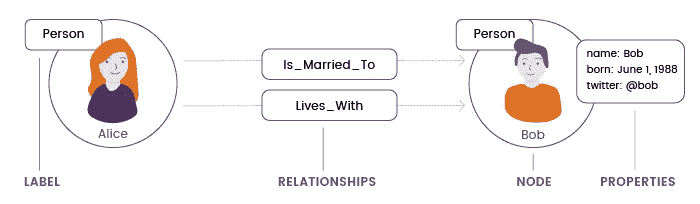
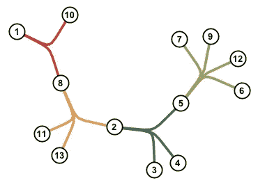

# 图形模型

> 原文：<https://towardsdatascience.com/the-graph-models-656a0005aa21?source=collection_archive---------47----------------------->

## Graphbits:一堆关于图形的 5 分钟文章

之前的博客都是关于图形的应用。是时候深入探索了！先说图数据结构本身。我发誓在这个问题上尽量不使用术语。

## 什么是图表？

所以让我再重申一次。图形数据结构有两个方面:

*   节点
*   这种关系

把节点想象成任何真实世界的实体。从最简单的意义上来说，你能看到的东西或物理上存在的东西。它可以是一个人，一个地方，一个汉堡，一部电影…我想你明白了。

关系只是节点之间的某种交互。更抽象一点。就像两个人之间的友谊。或者两个城市之间的高速公路。简单吧？

接下来，让我们看看图表的数据模型。任何图形数据库都有两种主要类型的数据模型:

## 属性图模型

从前，有两个节点。每个都有一个名字和一些特征。他们通过一种关系联系在一起。亲爱的朋友们，这是一个属性图模型。

简而言之，节点和关系都有一个通用标签。此外，节点和关系可以具有标识它们的某些属性。

来源:[https://ruby garage . S3 . Amazon AWS . com/uploads/article _ image/file/1605/graph _ data _ model _ 1x . png](https://rubygarage.s3.amazonaws.com/uploads/article_image/file/1605/graph_data_model_1x.png)

请注意，属性图模型中的每个关系一次只能连接两个节点。

[**Neo4j**](https://neo4j.com) 是遵循属性图模型的图形数据库中的一个流行选择

## 超图模型

超图模型把它带到了下一个层次。与关系只能连接两个节点的属性图模型不同，Hypergraph 模型允许多个节点通过同一关系连接。看起来你可以在这里有一个第三轮节点！

来源:[https://i.stack.imgur.com/RImaq.png](https://i.stack.imgur.com/RImaq.png)

[**Grakn.ai**](https://grakn.ai) 是一个有效实现超图模型的图形数据库的例子。(接下来会有更多相关内容)

有趣的是，这两个模型是同构的。这仅仅意味着您可以将 Hypergraph 转换为属性图，反之亦然。(通常，可以通过添加更多节点将 hypergraph 转换为属性图，反之适用于属性图到 hypergraph 的转换)。

仅此而已！

在接下来的文章中，我们将借助简单的例子来更深入地研究这些模型的实现。敬请期待！

链接到以前关于图形应用的博客:

 [## 图形顿悟

### Graphbits:一堆 5 分钟的文章:都是关于图形的

towardsdatascience.com](/the-graph-epiphany-4050e96ddcf6) 

链接到下一组图表博客:

 [## 用格拉克描述的一天

### Grakn 模式

towardsdatascience.com](/a-day-described-in-grakn-part-i-46bb7e3cd82a)