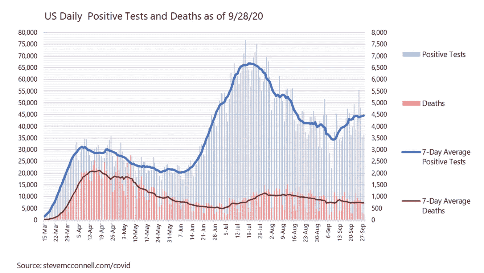
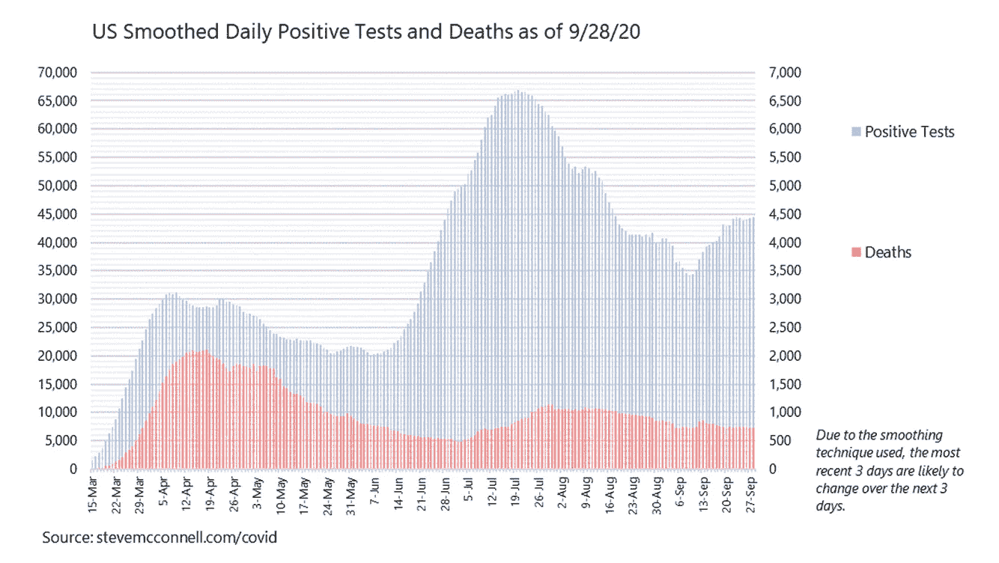
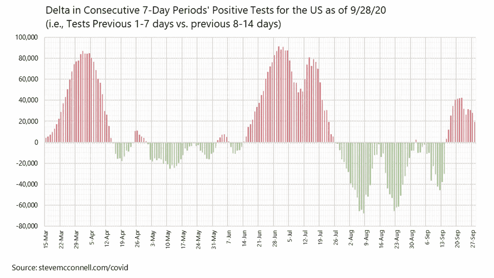
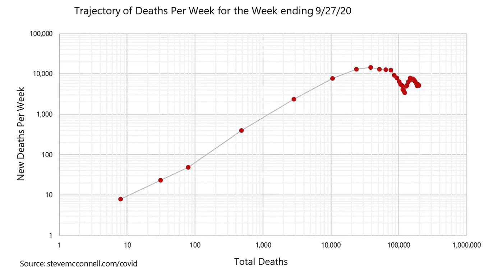
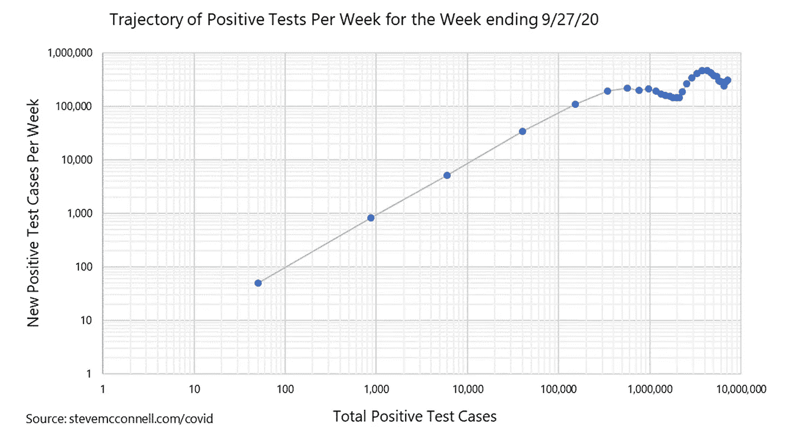
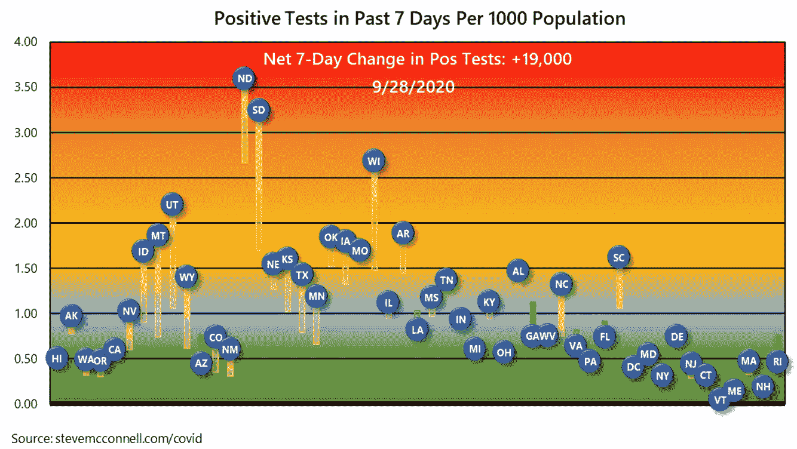
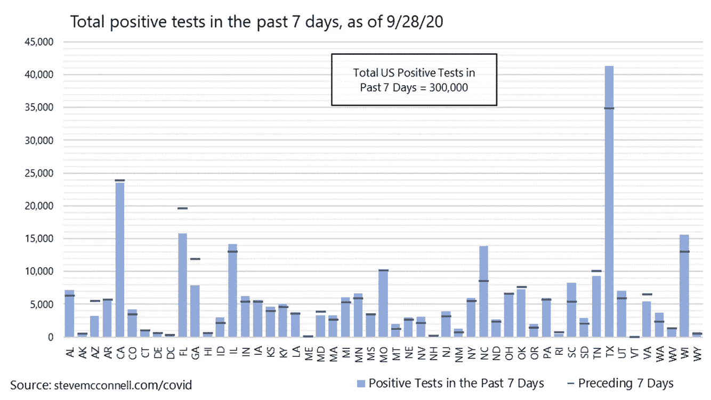
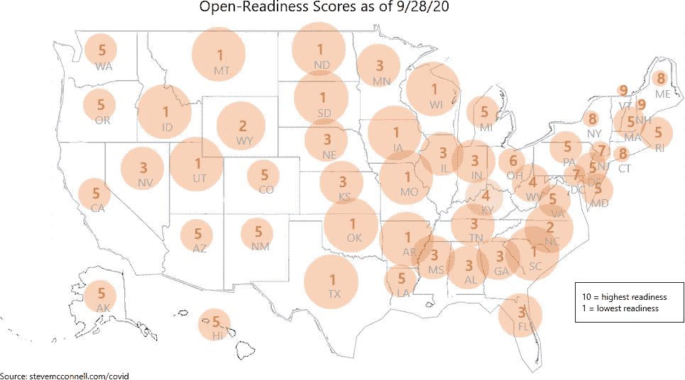
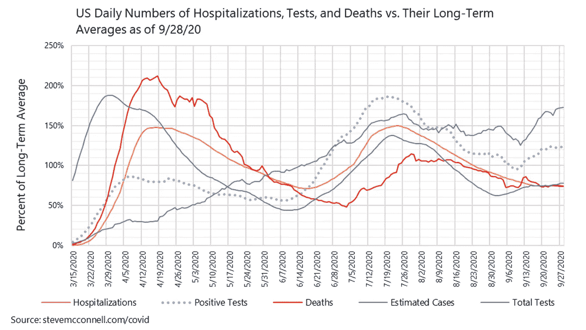

# 理解新冠肺炎·疫情需要的图表

> 原文：<https://towardsdatascience.com/the-graphs-you-need-to-understand-the-covid-19-pandemic-3353a5cc8adf?source=collection_archive---------24----------------------->

## 如果你知道要寻找什么，正确的图表会非常有启发性

作为疾病预防控制中心新冠肺炎“集合”预测模型的贡献者之一，我在我的[新冠肺炎免费数据中心](https://stevemcconnell.com/covid)每周更新几次一组州和国家图表。我附上了我个人认为有助于理解疫情现状和趋势的图表。

# 国家图表

最基本的图表显示了每日阳性检测和死亡的原始数据，如下所示。蓝线代表阳性测试，红线代表死亡。轴被缩放，使得阳性测试标度是死亡标度的 10 倍。

在这个图表中，我主要寻找的是数据中的意外噪声。我们通常会看到一种每周报告模式，即周日和周一少报，周二和周三多报。你可以在这个图表的“山丘和山谷”中看到。有时也有例外，比如节假日周末严重漏报。如果你看看劳动节附近的蓝线，你可以看到一个明显的下降，然后是一个峰值。

我查看的下一个图表是平滑测试和死亡数据图表。这将在 7 天的平滑期内平滑数据，从而消除少报和多报。通常我认为原始数据比平滑数据过滤更少，更有意义。但在这种情况下，通过减少报告不规则性的影响，平滑的数据实际上呈现了疫情过程的更真实的画面。

更容易看到平滑数据的趋势。在下面 9 月 28 日的例子中，很容易看到蓝线(阳性测试)在大约两周的增加后趋于平稳。

这张图表也很容易看出阳性检测和死亡之间的关系不再像以前那样了。如果你看图表的左三分之一，你可以看到红色曲线跟随蓝色曲线，略微滞后。但是大约在五月中旬之后，蓝色曲线迅速上升。红色曲线仍然跟随它，但是比率完全不同。这是因为在五月中旬之后进行了更多的检测，并且发现了更高比例的感染。因此，死亡与阳性检测的比率下降了。

我查看的全国趋势的最后一个图表是 7 天 delta 图。该图显示了与平滑测试图相同的信息，但其形式更易于查看阳性测试上升或下降的比率。红色表示阳性测试呈上升趋势。绿色表示阳性测试呈下降趋势。高红色意味着阳性测试正在快速上升*。低红色意味着阳性测试呈缓慢上升趋势。对于数学爱好者来说，你可以认为这个图显示的是二阶导数。*

*在下面的例子中，你可以在最右边看到，阳性测试的趋势没有一周前那么快。但它们仍呈上升趋势，而非下降。*

*右边的一系列绿色曲线展示了试图控制疫情的历史。我们几乎控制住了它(大绿条)，然后我们回落(短绿条，或短红条)。然后我们几乎再次遏制它，然后我们再次回落。你可以看到我们经历了三次这样的循环。*

**

*每周看看下面的测试和死亡的对数图是很有趣的。这些图表的不同寻常之处在于，它们没有在 x 轴(水平轴)上绘制时间。x 轴是死亡或阳性检测的累计数，y 轴是递增的周数。*

*这些图表也以不同的方式讲述了疫情的故事。你可以看到疫情指数达到峰值，开始下跌，然后再次达到稍低的峰值，然后再次开始下跌。至少这是下面死亡图表上的故事。*

**

*阳性测试图表上的故事看起来像是阳性测试开始有轻微的第三次上升。如果这是真的，我们预计死亡人数将在阳性测试上升约两周后出现第三次上升。*

**

# *状态图*

*有了基本的全国情况，我转向州一级的图表。第一张图显示了阳性测试中的人均趋势。标记的位置显示了前 7 天每 1000 人中阳性测试的数量。实线显示之前 7 天的趋势，空心线显示接下来 7 天的趋势。*

*关于这个图表有趣的是，这些州是从西到东，从左到右排序的。这使得观察病毒活动的地理聚集变得容易。*

**

*现在，你可以看到这个国家的东部相当平静。南方不太像东部那么安静，但还是比较安静的，除了 SC 和 NC。遥远的西部在东部和南部之间。*

*就病毒活动而言，这个国家的中部是最活跃的。中西部各州都很高，其中大多数在过去几周都在上升。事实上，整幅图中唯一向下移动的状态是 GA(用绿线显示)。*

*上图显示了人均基础上的病毒活动。下图显示了各州病毒活动的绝对值。水平线显示了一周前每个州的情况。如果一个州的横条在这条线上，趋势是向上的。如果棒线低于线，趋势是向下的。(图中各州是按字母顺序排列的，而不是从西向东。)*

**

*从人均来看，ND 可能是最活跃的，但 TX 的人数是它的 35 倍，所以从绝对数字来看，它很容易成为最活跃的，从这个图中很容易看出这一点。同样，从人均水平来看，加州相当安静，但拥有 4000 万人口，从绝对水平来看，它仍然是第二大城市。*

*线和棒线之间的关系使得很容易看到每个状态的趋势。FL 和 GA 呈下降趋势。CA 基本稳定。NC 趋势强劲上升。TX 仍呈明显上升趋势。大多数其他州保持稳定或略有上升趋势。*

*我还会查看我在自己的[网站](https://stevemcconnell.com/covid)上提供的州仪表盘中的开放就绪分数汇总。开放准备分数是阳性测试的绝对数量、最近的测试趋势、每个州的疫情历史以及其他因素的组合。有时，开放就绪分数提供了其他图表没有提供的提示。它还提供了地理聚类的不同视图。*

*在这种情况下，该图非常清楚地显示，大部分病毒活动或多或少以落基山脉以西和密西西比河以东为界。*

**

*五月中旬，疫情集中在东北部。整个夏天，它都集中在最南端的州。现在疫情大部分已经转移到中西部。*

*大多数国家媒体对疫情的报道都集中在政治上，但我对数据的解读表明，疫情有一个有趣而重要的地理方面，但没有得到应有的关注。*

# *真正严肃的高级图形阅读*

*最复杂的图表，但也可能是最能说明问题的，是长期比率图。这是一种奇怪的格式，将几个因素与它们的长期平均值进行对比。这意味着每条线都以 1.0 为中心，你可以研究这些线是如何相对于彼此上升和下降的。*

*如果你研究图表的左边，你可以看到蓝色的估计病例数直线上升和下降，红色的死亡人数直线在蓝色直线之后延迟上升和下降。这种模式在图的右侧重复出现，但级别较低。死亡滞后案例，这是你所期望的。*

**

*您可以看到阳性测试(蓝色虚线)和病例(蓝色实线)之间的关系。这些线相互跟踪(应该如此)，但是您可以看到测试与案例的比率在疫情的过程中是如何翻转的，图形右侧的阳性测试捕获的案例百分比比左侧高。*

*您还可以看到，到 7 月底，总测试行从左到右稳步增加。灰线的上升部分解释了为什么蓝色实线和蓝色虚线位置相反。*

*你也可以看到灰线在夏末的几个星期里保持平稳。与此同时，积极测试线在几周内呈下降趋势，之后总测试线呈下降趋势。对我来说，这表明测试并没有捕获很多实际案例，所以最终它减少了。如果总测试线下降，而阳性测试线落后于它，那么我会认为阳性测试数字被人为地缩小了。但图表显示的并非如此。*

*橙色的住院线很有趣，因为在图的左边，它落后于死亡人数。这没有任何意义，我认为这是一个数据质量问题。在疫情早期，各州报告的住院数据并不一致，但随着时间的推移，情况有所改善。*

*在图表的右侧，您可以看到橙色线紧紧跟随蓝色实线，这很有意义。红线跟踪但滞后于橙线，这也有道理。*

*这一切把我们带到了今天。我们现在的情况是，总测试数量急剧增加。阳性测试也在迅速增加，但没有总测试增加得快。这表明总的病毒活性持平甚至下降。住院线也在下降的事实也说明了同样的问题。*

# *摘要*

*我喜欢视觉效果，我一直喜欢研究图表，试图从中提取尽可能多的信息。如果你在回答“它是上升还是下降”后停下来，你经常会错过图表试图传达的最重要的信息。这组图表总体上传达了一个关于美国疫情的过去、现在和潜在未来的相当全面的故事。*

# *更多详情请访问新冠肺炎信息网站*

*我领导的团队将*的 CovidComplete* 预测结果输入到疾病预防控制中心的[集合模型](https://www.cdc.gov/coronavirus/2019-ncov/covid-data/forecasting-us.html)。对于这些图表的更新，更多的图表，美国和州级的预测，以及预测评估，请查看我的新冠肺炎信息[网站](https://stevemcconnell.com/covid)。*

# *我的背景*

*在过去的 20 年里，我专注于理解软件开发的数据分析，包括质量、生产率和评估。我从处理噪音数据、坏数据、不确定性和预测中学到的技术都适用于新冠肺炎。*