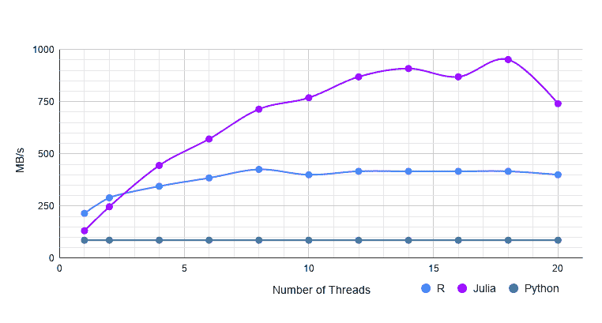
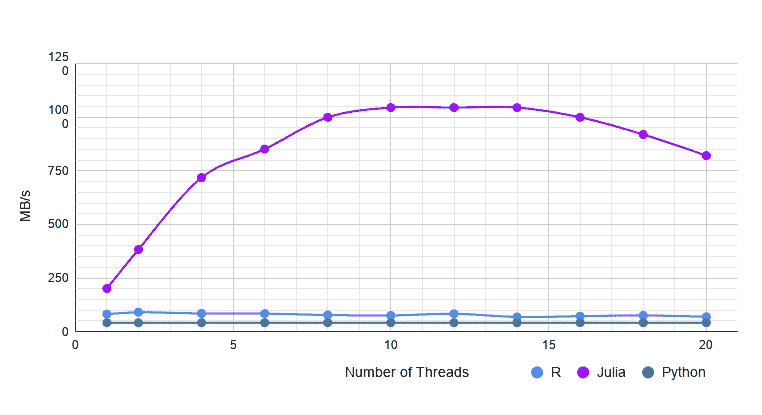
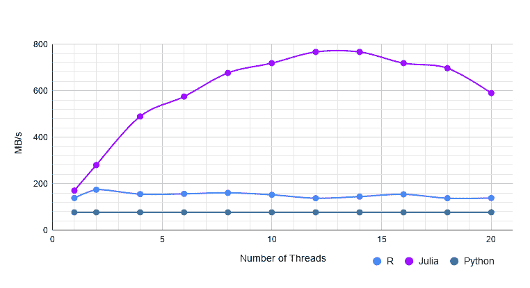
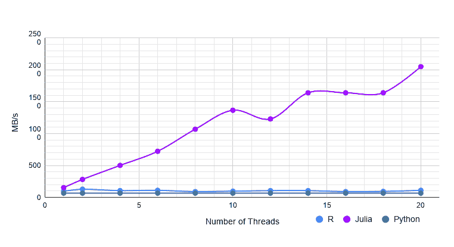
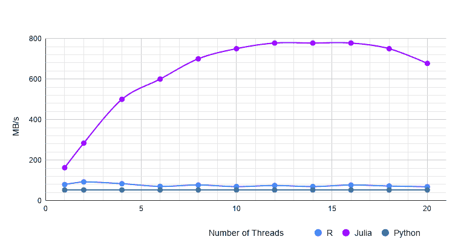
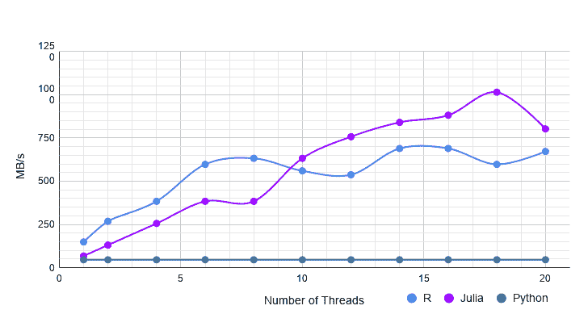
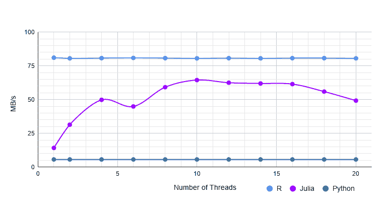
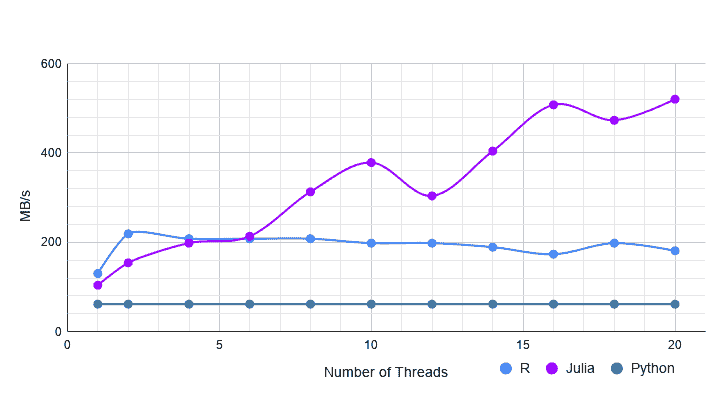
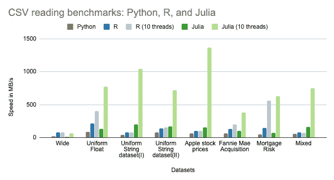

# 伟大的 CSV 对决:Julia vs Python vs R

> 原文：<https://towardsdatascience.com/the-great-csv-showdown-julia-vs-python-vs-r-aa77376fb96?source=collection_archive---------5----------------------->

任何数据分析工作流程中的第一项任务就是简单地读取数据，这绝对必须快速有效地完成，这样才能开始更有趣的工作。在许多行业和领域中，CSV 文件格式是存储和共享表格数据的首选。快速而健壮地加载 CSV 是至关重要的，它必须能够很好地适应各种文件大小、数据类型和形状。这篇文章比较了三个不同 csv 解析器读取 8 个不同真实数据集的性能:R 的 fread、Pandas 的 read_csv 和 Julia 的 CSV.jl。这些解析器分别被选为每个 [R](https://www.r-project.org) 、 [Python](https://www.python.org) 和 [Julia](https://julialang.org) 的“同类最佳”CSV 解析器。多线程是当今计算机达到最高性能的关键，但只有一种语言(Julia)能够持续有效地使用多核。

这三个工具都支持加载各种可能丢失值的数据类型，但只有 [fread](https://www.rdocumentation.org/packages/data.table/versions/1.12.8/topics/fread) (R)和 [CSV.jl](https://github.com/JuliaData/CSV.jl) (Julia)支持多线程— [Pandas](https://pandas.pydata.org/) 只支持单线程 CSV 加载。Julia 的 CSV.jl 的另一个独特之处在于，它是唯一一个完全用其高级语言实现的工具，而不是用 C 实现并从 R / Python 包装而来的。(Pandas 确实有一个稍微强一点的 Python 原生解析器，它明显慢一些，并且几乎所有 read_csv 的使用都默认为 C 引擎。)因此，这里的 CSV.jl 基准不仅代表了在 Julia 中加载数据的速度，而且还表明了在分析中使用的后续 Julia 代码可能的性能。

以下基准测试表明，即使在限制单核的情况下，Julia 的 CSV.jl 也比 Pandas 快 1.5 到 5 倍；启用多线程后，速度可以提高 20 倍以上。r 的 fread 更有竞争力，因为它支持多线程，但在许多数据集上它仍落后 Julia 10 倍或更多。用于基准测试的工具有:Julia 的 [BenchmarkTools.jl](https://github.com/JuliaCI/BenchmarkTools.jl) ，R 的[微基准测试](https://www.rdocumentation.org/packages/microbenchmark/versions/1.4-7/topics/microbenchmark)，Python 的 [timeit](https://docs.python.org/2/library/timeit.html) 。

# 同质数据

让我们从一些同质数据集开始，即所有列中具有相同类型数据的数据集。本节中的数据集，除了股票价格数据集之外，都是从基准站点的[中获得的。性能指标是线程数量从 1 增加到 20 时加载数据集所用的时间。由于 Pandas 不支持多线程，单线程速度是针对所有内核计数的。](https://www.queryverse.org/benchmarks/)

**同质数据集上的性能**:

**统一浮点数据集**:第一个数据集包含排列在 100 万行 20 列的浮点值。Pandas 加载这个文件需要 232 毫秒。单线程 data.table 比 CSV.jl 快 1.6 倍，有了多线程，CSV.jl 处于最佳状态，比 data.table 快一倍多，CSV.jl 比没有多线程的熊猫快 1.5 倍，有了大约快 11 倍。

**统一字符串数据集(I)** :该数据集包含所有列中的字符串值，有一百万行 20 列。Pandas 加载文件需要 546 毫秒。对于 R，添加线程似乎不会带来任何性能提升。单线程 CSV.jl 比 data.table 快 2.5 倍，10 线程时比 data.table 快 14 倍左右。

**统一字符串数据集(二)**:该数据集的维度与上一个数据集的维度相同。但是，每一列也有缺失值。熊猫需要 300 毫秒。没有线程，CSV.jl 比 R 快 1.2 倍，有了，大概快 5 倍。

**苹果股票价格**:

该数据集包含 5000 万行和 5 列，大小为 2.5GB。这些行是 AAPL 股票的开盘价、最高价、最低价和收盘价。包含价格的四列是浮点值，还有一个日期列。

单线程的 CSV.jl 比 R 的 fread from data.table 快 1.5 倍左右，多线程的 CSV.jl 快 22 倍左右！熊猫的 read_csv 需要 34s 才能读完，这个比 R 和 Julia 都慢。

# 异构数据集上的性能

**混合数据集:**这个数据集有 10k 行，200 列。这些列包含字符串、浮点、日期时间和缺失值。Pandas 加载这个数据集大约需要 400 毫秒。没有线程的情况下，CSV.jl 比 R 快 2 倍，有 10 个线程的情况下快 10 倍左右。

**抵押贷款风险数据集**

现在，让我们来看一个更广泛的数据集。来自 Kaggle 的这个[抵押贷款风险数据集](https://www.kaggle.com/xiaodaizj/mortgageriskfeaturetools)是一个混合型数据集，有 356k 行和 2190 列。这些列是异构的，并且具有 String、Int、Float、Missing 类型的值。熊猫在这个数据集中需要 119 秒来读取。单线程的 fread 比 CSV.jl 快大约两倍，然而，如果有更多的线程，Julia 要么和 r 一样快，要么比 r 稍快。

**宽数据集**:这是一个相当宽的数据集，有 1000 行和 20，000 列。数据集包含字符串和整型值。熊猫读取数据集需要 7.3 秒。在这种情况下，单线程 data.table 比 CSV.jl 快大约 5 倍。由于线程较多，CSV.jl 与 data.table 相比具有竞争力。在 data.table 中，增加线程数量似乎不会带来任何性能提升

**房利美收购数据集**:该数据集可从[房利美网站](https://www.fanniemae.com/portal/funding-the-market/data/loan-performance-data.html)下载。数据集有 400 万行和 25 列，值的类型为 Int、String、Float、Missing。

单线程 data.table 比 CSV.jl 快 1.25 倍，但是，CSV.jl 的性能随着线程的增加而不断提高。CSV.jl 通过多线程获得了大约 4 倍的速度。

**汇总图表:**

在所有八个数据集上，Julia 的 CSV.jl 总是比 Pandas 快，即使人为限制为单核。借助多线程技术，Julia 几乎在每一个案例中都独占鳌头，而且常常以 10 倍或更大的优势胜出。r 的 fread 只在少数情况下能够跟上。

**系统信息:**执行基准测试的系统规格如下

> $ lsb_release -a
> 没有 lsb 模块可用。
> 发行商 ID: Ubuntu
> 描述:Ubuntu 18.04.4 LTS
> 发布时间:18.04
> 代号:仿生
> 
> $ uname -a
> Linux 南极 5 . 6 . 0-custom+*# 1 SMP Mon Apr 6 00:47:33 EDT 2020 x86 _ 64 x86 _ 64 GNU/Linux*
> 
> $ lscpu
> 架构:x86_64
> CPU op-mode(s): 32 位， 64 位
> 字节顺序:小端
> CPU:40
> 在线 CPU 列表:每核心 0–39
> 线程:每插槽 2
> 核心:10
> 插槽:2
> NUMA 节点:2
> 厂商 ID: GenuineIntel
> CPU 家族:6
> 型号:85
> 型号名称:英特尔(R)至强(R) 银 4114 CPU @ 2.20GHz
> 步进:4
> CPU MHz: 800.225
> CPU 最大 MHz: 3000.0000
> CPU 最小 MHz:800.0000
> BogoMIPS:4400.00
> 虚拟化:VT-x
> L1d 缓存:32K
> L1i 缓存:32K
> L2 缓存:1024K
> L3
> 
> free -h
> 总已用空闲共享缓冲区/可用缓存
> Mem:62G 3.3G 6.3G 352k 52G 58G
> Swap:59G 3.2G 56G

JuliaCon 今年上线，免费注册。JuliaCon 是一年中最大的 Julia 会议，汇集了来自世界各地的演讲者、开发者和爱好者，为期 3 天，充满了主题演讲、讲座和研讨会！在此注册！