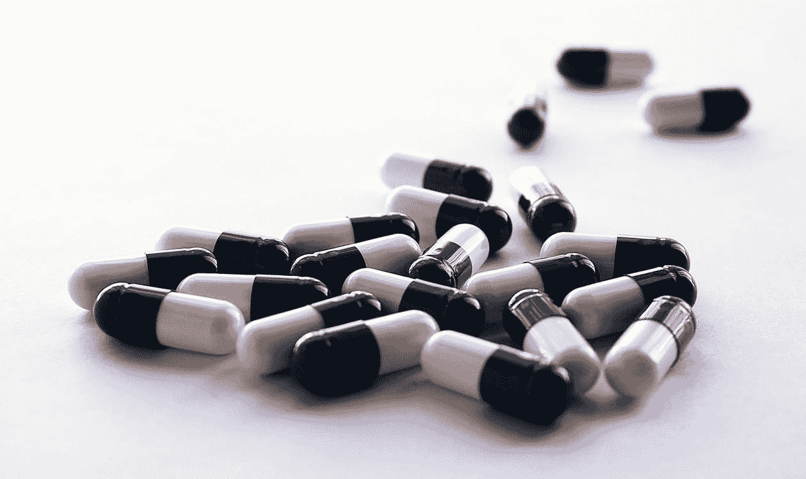
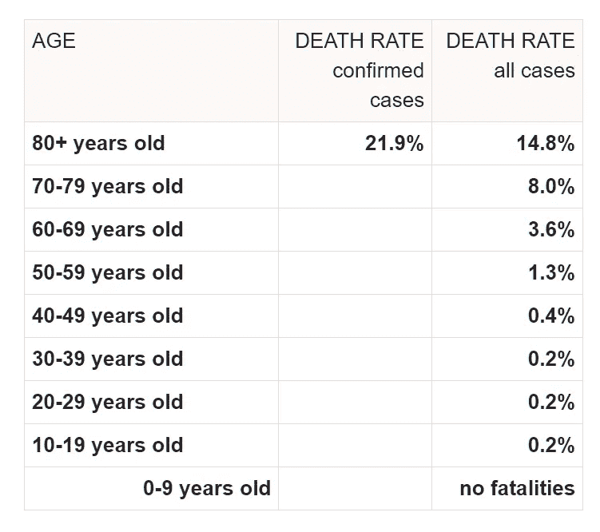

# 羟氯喹大辩论

> 原文：<https://towardsdatascience.com/the-great-hydroxychloroquine-debate-29f2a2a47587?source=collection_archive---------14----------------------->

## 羟氯喹和阿奇霉素有 91.7%的成功率——好得难以置信？对最新数据的评论。

羟氯喹是新冠肺炎讨论中的最新流行词。[正如我之前所写的](https://medium.com/@kenny.f.lin/what-will-it-take-to-end-the-covid-19-pandemic-3665540203d1)，找到一种有效的治疗方法可以极大地改变我们全球应对疫情的轨迹。在 4 月 5 日周日的每日简报会上，川普总统问全国，*[*你们会失去什么？*](https://www.nytimes.com/2020/04/05/us/politics/trump-hydroxychloroquine-coronavirus.html)*并一直通过尝试权立法推动患者获得该药物。**

**羟氯喹已在实验室中被证明通过阻止病毒进入细胞而有效对抗冠状病毒，包括 SARS 和新冠肺炎。然而，在试管中起作用的东西并不总是在人类身上起作用。在 SARS 病例中，羟氯喹[未能降低小鼠体内的病毒载量](https://www.thelancet.com/journals/lanrhe/article/PIIS2665-9913(20)30089-8/fulltext)。此外，经常服用羟氯喹治疗狼疮或关节炎的患者已经感染了新冠肺炎病毒——这表明它不是预防性的。然而，羟氯喹可能是一种有前途的治疗方法，是许多值得研究的疗法之一。**

**我个人希望羟氯喹，可能与阿奇霉素或锌结合，将在目前正在进行的临床试验中被证明有效。我们都想有所作为。然而，需要注意的是，羟氯喹，尤其是与阿奇霉素合用时，可能会导致视觉和心脏并发症，包括心律失常。所有的医生都在医学院宣誓——“不伤害”——并且在缺乏严格研究的情况下，对开出已知副作用的药物犹豫不决。事实上，法国[和瑞典](https://www.newsweek.com/hydroxychloroquine-coronavirus-france-heart-cardiac-1496810)[的医院最近已经停止了羟氯喹的临床试验，理由是缺乏益处会增加心脏风险。](https://www.newsweek.com/swedish-hospitals-chloroquine-covid-19-side-effects-1496368)**

**关于最新羟氯喹数据的每日更新，我推荐药理学家德瑞克·洛夫博士的博客。总之，现有的数据是不确定的。大多数文章仍处于“预印阶段”——初步提交给期刊，可能尚未完成正式发表所需的同行审查过程。迪迪尔·拉乌尔博士最近发表的一份预发布的[摘要](https://www.mediterranee-infection.com/wp-content/uploads/2020/04/Abstract_Raoult_EarlyTrtCovid19_09042020_vD1v.pdf)和[数据表](https://www.mediterranee-infection.com/wp-content/uploads/2020/04/Table_final_website_IHU_09_04_2020.pdf)引起了我的注意，并被[纽约时报](https://www.nytimes.com/reuters/2020/04/09/world/europe/09reuters-health-coronavirus-macron-doctor.html)和[福克斯新闻频道](https://www.foxnews.com/world/macron-faces-calls-to-allow-wider-use-hydroxychloroquine-in-coronavirus-fight-report)转载。**

**简而言之，拉乌尔博士已经成为一个有争议的人物，他倡导使用羟氯喹和阿奇霉素(HCQ AZ)来治疗新冠肺炎。他最初于 3 月 20 日发表了一组 42 名患者的阳性结果，其中 26 名患者服用了 HCQ AZ。这篇论文立即因其方法而受到批评，包括拉乌尔博士选择谁接受 HCQ-阿兹而不是安慰剂，以及排除任何在该方案中表现不佳的患者的分析。对数据的[重新分析](https://www.medrxiv.org/content/10.1101/2020.03.31.20048777v1)显示，考虑到方法的不一致性，没有任何益处。该杂志——国际抗菌化疗学会——的一份官方声明如下:“ISAC 认为这篇文章不符合该学会的预期标准，特别是缺乏对入选标准和患者分类的更好解释，以确保患者安全。”[拉乌尔博士的第二篇论文](https://www.mediterranee-infection.com/wp-content/uploads/2020/03/COVID-IHU-2-1.pdf)是未经同行评审的预印本，根本不包括对照组。**

**然而，最初的研究引发了特朗普总统对羟氯喹的兴趣——他在 3 月 21 日发了关于羟氯喹的推特，并在他的每日简报中多次提到它。**

# ****书房****

**4 月 10 日，拉乌尔医生在他的[推特](https://twitter.com/raoult_didier/status/1248541782289375232)上发布了一份预发布的[摘要](https://www.mediterranee-infection.com/wp-content/uploads/2020/04/Abstract_Raoult_EarlyTrtCovid19_09042020_vD1v.pdf)和[数据表](https://www.mediterranee-infection.com/wp-content/uploads/2020/04/Table_final_website_IHU_09_04_2020.pdf)，总结了他在 1000 多名患者中的发现。下面，我将报告相关的发现(粗体)，然后是需要回答的方法问题和遗漏。**

1.  ****在 3，165 名通过 PCR 诊断为新冠肺炎的患者中，有 1，061 名符合本研究的入选标准。**入选标准是什么？为什么其他 2000 名患者被排除在外？值得注意的是，在这项研究中也没有对照组。黄金标准临床试验是随机双盲的——意味着患者和研究者都不知道谁在哪个组——以便可以评估匹配组中治疗的真实效果。在任何没有对照的研究中，我们不能确定观察到的结果是否仅仅是被选入研究的患者组的结果。**
2.  ****平均年龄 43.6 岁，标准差 15.6** 。拉乌尔博士后来在他的结论中写道，HCQ AZ 对老年患者是一种安全有效的治疗方法。除了——标准差的数学计算告诉我，超过 84%的患者年龄在 59.2 岁以下。在世界范围内，[目前的数据](https://www.worldometers.info/coronavirus/coronavirus-age-sex-demographics/)表明，60 岁以下患者的预期死亡率从年轻患者的 0.2%到 50-59 岁患者的 1.3%不等。换句话说，他的研究小组主要是年轻的患者，无论治疗与否，他们都有望获得良好的结果。很难找到法国住院新冠肺炎患者平均年龄的比较统计数据。在美国，[住院病人的平均年龄估计在 50 多岁](https://www.usatoday.com/in-depth/graphics/2020/03/10/us-coronavirus-map-tracking-united-states-outbreak/4945223002/)。这再次表明，他的研究小组被选来比平均水平更年轻、更健康。**
3.  **973 名患者(91.7%)在 10 天内获得了良好的临床结果和病毒学治愈。良好的临床结果定义为第 10 天清除病毒脱落，避免住院> 10 天、ICU 转移或死亡。此外，注意到 4.4%的患者具有超过第 10 天的延长的病毒携带(在 PCR 上可检测到)，但是病毒培养阴性；在第 15 天，除了一个以外，所有都被 PCR 清除。**
4.  ****46 例患者(4.3%)预后不良**。这被定义为住院> 10 天(31 名患者)、ICU 转移(10 名患者)或死亡(5 名患者)。值得注意的是，死亡的 5 名患者年龄在 74-95 岁之间。在 31 名住院治疗> 10 天的患者中，有 16 名在本文发表时仍在住院治疗。总死亡率为 0.5%，另有 16 名(1.6%)患者住院。**
5.  ****年龄越大，初始严重程度越差，HCQ 血清浓度越低，预后越差。还发现服用β-受体阻滞剂和血管紧张素ⅱ受体阻滞剂的患者预后更差。**这些发现已在其他地方报道，并与全球临床经验一致。**
6.  ****接受> 3 天 HCQ-阿兹治疗的患者死亡率低于在同一家医院(IHU)和马赛公立医院接受其他方案治疗的患者。**该声明未经其他治疗方案和马赛公立医院的结果数据验证。**
7.  ****在数据表中，作者补充说明只有 928 名患者的数据**。最初报告的 1，061 名患者的 *n* 具有误导性，因为 56 名患者因无症状而被排除，77 名患者的数据缺失。**

****

**[https://www . worldometers . info/coronavirus/coronavirus-age-sex-demographics/](https://www.worldometers.info/coronavirus/coronavirus-age-sex-demographics/)**

# **结论**

**拉乌尔博士的最新出版物乍一看似乎非常有希望——10 天内治愈率为 91.7%，死亡率为 0.5%！然而，我担心的是缺乏一个控制组和病人选择过程缺乏透明度。有意或无意地选择更年轻、更健康的患者队列可能会导致极好的结果，而不管羟氯喹是否有效。我们需要完整的手稿来评估这个摘要是真的有希望还是误导。**

**黄金标准仍然是一项双盲、随机对照试验。我真诚地希望在不久的将来我们能从这样的试验中获得数据。**

*****编者按:*** [*走向数据科学*](http://towardsdatascience.com/) *是一份以数据科学和机器学习研究为主的中型刊物。我们不是健康专家或流行病学家，本文的观点不应被解释为专业建议。想了解更多关于疫情冠状病毒的信息，可以点击* [*这里*](https://www.who.int/emergencies/diseases/novel-coronavirus-2019/situation-reports) *。***